## Data Mechanics and Data Science

- Data science involves
    - Understanding how to ask and answer domain specific questions using data
    - Techniques for modelling, learning, and predicting
    - Algorithmic and programming tools for data mining and machine learning
    - Skills needed to manage and analyze massive structured and unstructured datasets

::: {.fragment}
- This course teaches the foundations of data management
    - Databases
    - Database Management Systems (DBMSs)
:::

## Databases and DBMSs

- A *database* is a collection of related data.
    - refers to the data itself, *not* the program
- Managed by some type of *database management system* (DBMS)

## The Conventional Approach

- Use a DBMS that employs the *relational model*
    - use the SQL query language
- Examples: IBM DB2, Oracle, Microsoft SQL Server, MySQL
- Typically follow a client-server model
    - the database server manages the data
    - applications act as clients

::: {.fragment}
- Extremely powerful
    - SQL allows for more or less arbitrary queries
    - support *transactions* and the associated guarantees
:::

## Limitations of the Conventional Approach

- Can be overkill for applications that don't need all the features
- Can be hard / expensive to setup / maintain / tune
- May not provide the necessary functionality
- Footprint may be too large
    - example: difficult to put a conventional RDBMS on a small embedded system
- May be unnecessarily slow for some tasks
    - overhead of IPC, query processing, etc.
- Does not scale well to large clusters

## What Other Options Are There?

:::: {.columns}
::: {.column width="60%"}
- View a DBMS as being composed of two layers.
- At the bottom is the *storage layer* or *storage engine*.
    - stores and manages the data

::: {.fragment}
- Above that is the *logical layer.*
    - provides an abstract representation of the data
    - based on some data model
    - includes some query language, tool, or API for accessing and modifying the data
:::

::: {.fragment}
- To get other approaches, choose different options for the layers.
:::
:::

::: {.column width="40%"}
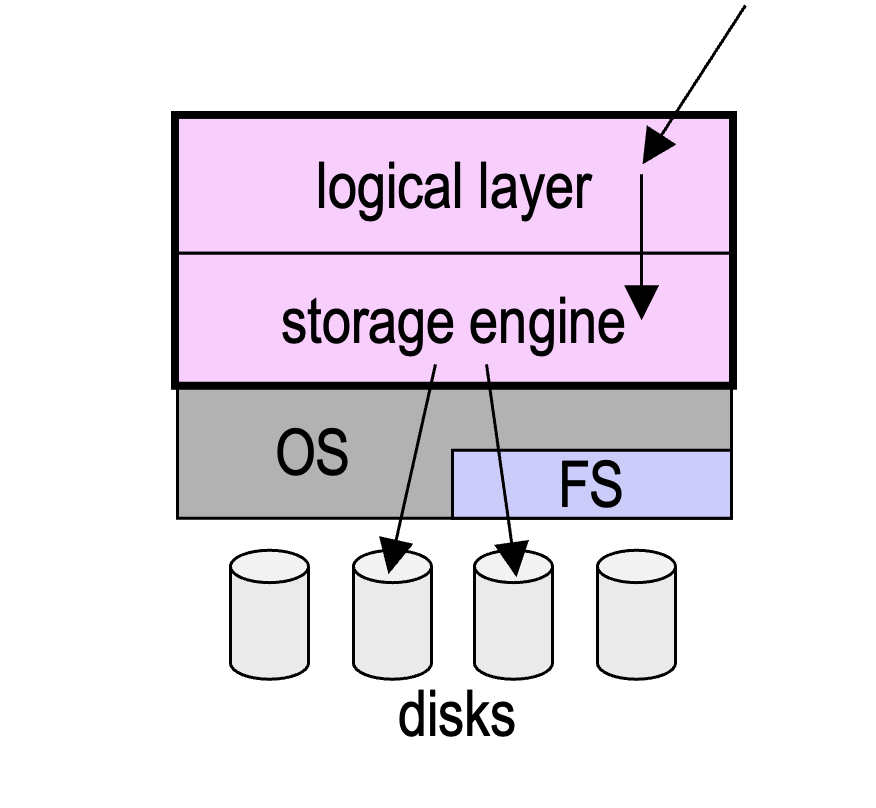{width="100%"}
:::
::::

## Course Overview

- data models/representations (logical layer), including:
    - entity-relationship (ER): used in database design
    - relational (including SQL)
    - semistructured: XML, JSON
    - noSQL variants

::: {.fragment}
- implementation issues (storage layer), including:
    - storage and index structures
    - transactions
    - concurrency control
    - logging and recovery
    - distributed databases and replication
:::

## Course Staff

- Instructor:
    - Mark Crovella (crovella@bu.edu)
    - Abdullah Bin Faisal (abfaisal@bu.edu)
- Teaching fellows
    - Belina (Zhiqui) Wang (bbelina@bu.edu)
    - TBD
- Course Assistants
    - Selina Zhang (selinaz@bu.edu)
    - Eduardo Torres (torrese9@bu.edu)
- Office hours: Calendar on Piazza
- For questions: **post on Piazza**

## Prerequisite

- DS 110 and DS 210
    - data structures
    - proficiency in Python
    - see me if you're not sure

## Course Materials

- **Slides:** will be posted on Piazza

::: {.fragment}
- **Optional** textbooks:
    - *Database System Concepts* (7th edition) by Silberschatz, Korth, and Sudarshan
    - *Database Systems: The Complete Book* (2nd edition) by Garcia-Molina et al.
    - *Database Management Systems* by Ramakrishnan & Gehrke
:::

## Grading

- Eight homework assignments (15%)
    - Late assignments are *not accepted*
    - Your score will be calculated based on the 6 highest homeworks
    - So you can skip two homeworks without grade impact
    - Homework 1 is assigned today; due Sept 15

::: {.fragment}
- Eight discussion quizzes (25%)
    - Your score will be calculated based on the 6 highest quizzes
    - So you can skip two quizzes without grade impact
:::

::: {.fragment}
- Participation (5%)
    - Attending 85% of discussion sections gets you full credit
:::

::: {.fragment}
- Exams
    - Midterm (25%) -- during lecture Oct 15, no makeups!
    - Final (30%) -- Cumulative
:::

## Review

- Policies:
    - Generative AI
    - Academic Honesty
- Schedule of Topics

- ... on the syllabus

## Database Design

- In database design, we determine:
    - which pieces of data to include
    - how they are related
    - how they should be grouped/decomposed

::: {.fragment}
- End result: a *logical schema* for the database
    - describes the contents and structure of the database
:::

## ER Models

- An *entity-relationship (ER) model* is a tool for database design.
    - graphical
    - implementation-neutral

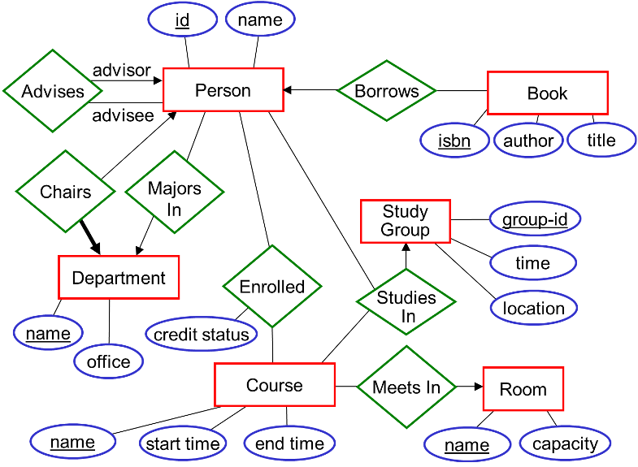{width="55%" fig-align="center"}

- ER models specify:
    - the relevant entities ("things") in a given domain
    - the relationships between them

## Sample Domain: A University

- Want to store data about:
    - employees
    - students
    - courses
    - departments
- How many tables do you think we'll need?

::: {.incremental}
- This can be hard to tell before doing the design!
- In particular, hard to determine which tables are needed to encode *relationships* between data items
:::

## Entities: the "Things"

- Represented using rectangles.
- Examples:

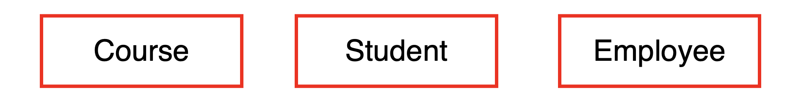{width="65%" fig-align="center"}

::: {.fragment}
- Strictly speaking, each rectangle represents an *entity set*, which is a collection of individual entities.

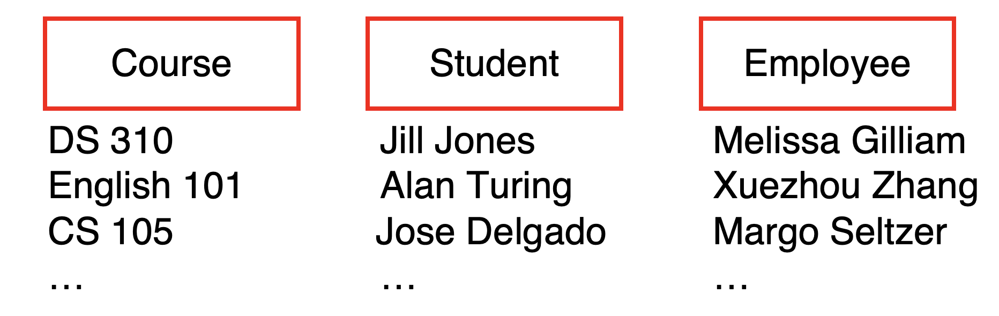{width="65%" fig-align="center"}
:::

## Attributes

Associated with entities are *attributes* that describe them.

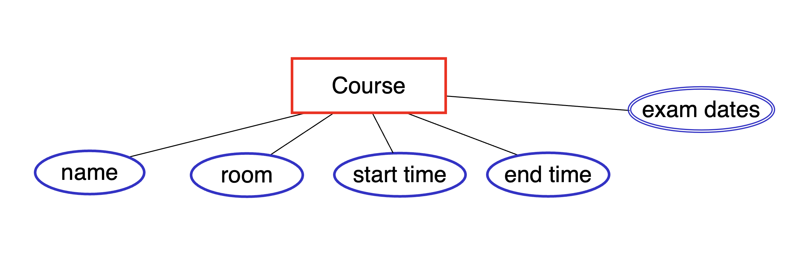{width="60%" fig-align="center"}

- represented as ovals connected to the entity by a line
- double oval = attribute that can have multiple values

## Keys

- A *key* is an attribute or collection of attributes that can be used to uniquely identify each entity in an entity set.

- Observe that an entity set may have more than one possible key.

{width="55%" fig-align="center"}

- Possible keys include:
    - *id*
    - *email*
    - *(id, email)*
    - *(id, name)*

## Candidate Key

A *candidate key* is a *minimal* collection of attributes that is a key.
    Note that minimal = no unnecessary attributes are included (*not* the same as *minimum*)

{width="55%" fig-align="center"}

**Example 1**: assume (name, address, age) is a key for Person

- It is a *minimal* key because we lose uniqueness if we remove any of the three attributes.

Observe that:

- (name, address) may not be unique, e.g., a father and son with the same name and address
- (name, age) may not be unique
- (address, age) may not be unique

---

{width="55%" fig-align="center"}

**Example 2**: (id, email) is a key for Person

- It is *not* minimal, because just one of these attributes is sufficient for uniqueness
- It is *not* a candidate key

## Keys and Candidate Keys (cont.)

Consider an entity set for books:

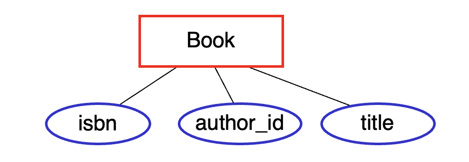{width="50%" fig-align="center"}

Assume that:

- *each book has a unique isbn*
- *an author doesn't write two books with the same title*

## Which of these are candidate keys of this entity set?

{width="40%" fig-align="center"}

::: {.aside}
*Candidate key:* can be used to uniquely identify a given entity, and none of the attributes are unnecessary.
:::

A. `isbn` [--- **yes**]{.fragment}  
B. `(author_id, title)` [--- **yes**, both needed for uniqueness]{.fragment}  
C. `(author_id, isbn)` [--- **no**, `author_id` isn't needed]{.fragment}   
D. A and B, but not C  
E. A, B, and C  

[**Answer**: D. A and B, but not C]{.fragment}

## Which of these are keys of this entity set?

{width="55%" fig-align="center"}

::: {.aside}
*Key:* can be used to uniquely identify a given entity.
:::

A. `isbn`.   
B. `(author_id, title)`.  
C. `(author_id, isbn)`.  
D. A and B, but not C.  
E. A, B, and C.  

::: {.fragment}
**Answer**: E. A, B, and C --- adding `author_id` to `isbn` still uniquely identifies a book; it's just not *minimal*.
:::

## Key vs. Candidate Key

Consider the same Book entity set, with the assumption that each book has a unique `isbn` and an author doesn't write two books with the same title.

|                       | key? | candidate key? |
|-----------------------|------|----------------|
| `isbn`                | yes  | yes            |
| `author_id, title`    | yes  | yes            |
| `author_id, isbn`     | yes  | no             |
| `author_id`           | ?    | ?              |

::: {.fragment}
**Answer**: Key is no, and candidate key is no --- `author_id` by itself cannot be used to uniquely identify a book, so it's not a key, and since it's not a key, it can't be a candidate key.
:::

## Primary Key

- We typically choose one of the candidate keys as the *primary key*.
- In an ER diagram, the primary key attribute(s) are underlined.

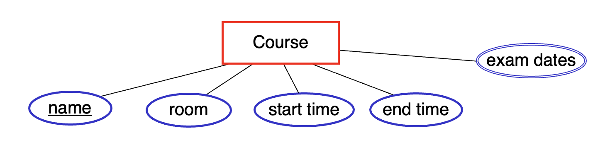{width="60%" fig-align="center"}

## Relationships Between Entities

- Relationships between entities are represented using diamonds that are connected to the relevant entity sets.
- For example: students are enrolled in courses

{width="60%" fig-align="center"}

::: {.fragment}
- Another example: courses meet in rooms

{width="60%" fig-align="center" .nostretch}
:::

## Relationships Between Entities (cont.)

- Strictly speaking, each diamond represents a *relationship set*, which is a collection of relationships between individual entities.

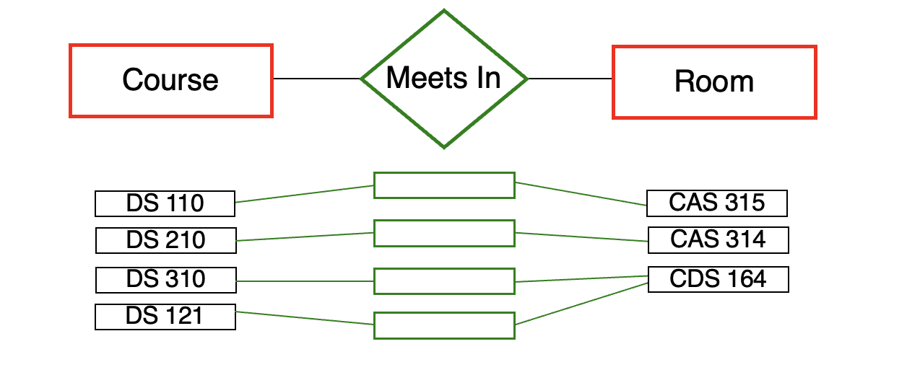{width="55%" fig-align="center"}

::: {.incremental}
- In a given set of relationships:
    - an individual entity may appear 0, 1, or multiple times (e.g. CDS 164)
- a given *combination* of entities may appear at most once
    - example: the combination (DS 110, CAS 315) may appear at most once
:::

## Attributes of Relationships

A relationship set can also have attributes.These attributes specify information associated with the relationships in the set.

Example:

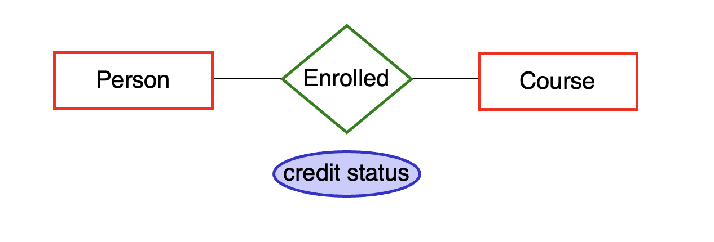{width="55%" fig-align="center"}

## Key of a Relationship Set

A key of a relationship set can be formed by taking the union of the primary keys of its participating entities.

Example: (person.id, course.name) is a key of *enrolled*

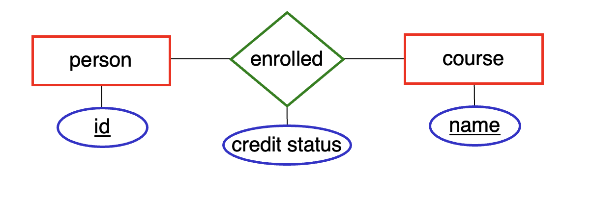{width="55%" fig-align="center"}

The resulting key may or may not be a primary key. Why?

::: {.fragment}
**It may not be minimal.**
:::

## Degree of a Relationship Set

*Enrolled* is a *binary* relationship set: it connects two entity sets. It has a degree = 2.

{width="50%" fig-align="center"}

::: {.fragment}
It's also possible to have higher-degree relationship sets. A *ternary* relationship set connects three entity sets. It has degree = 3.

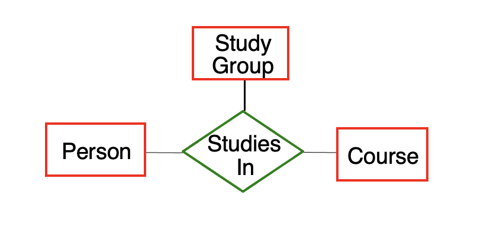{width="40%" fig-align="center"}
:::

## Relationships with Role Indicators

- It's possible for a relationship set to involve more than one entity from the same entity set.
- For example: every student has a faculty advisor, where students and faculty members are both members of the Person entity set.

::: {.r-stack}
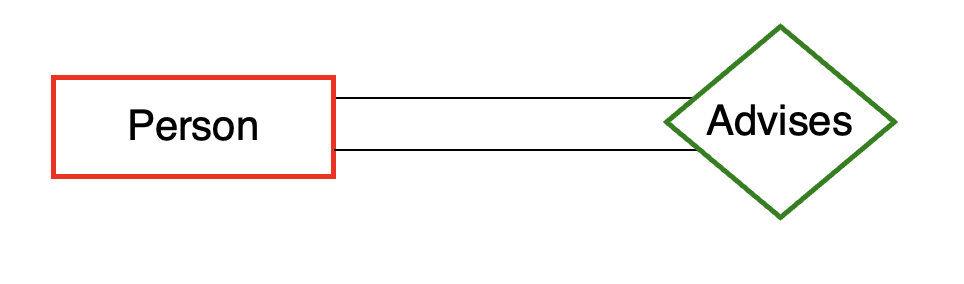{.fragment .fade-out data-fragment-index="1" width="55%" fig-align="center"}

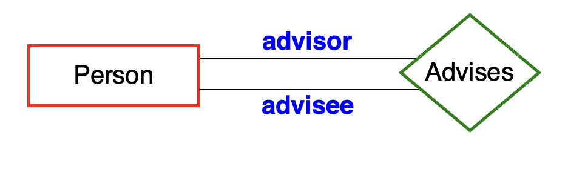{.fragment .fade-in data-fragment-index="1" width="55%" fig-align="center"}
:::

::: {.fragment fragment-index="1"}
- In such cases, we use *role indicators* (labels on the lines) to distinguish the roles of the entities in the relationship.
:::

## Cardinality (or Key) Constraints

- A *cardinality constraint* (or *key constraint*) limits the number of times that a given entity can appear in a relationship set.

Example: each course meets in at most one room

{width="55%" fig-align="center"}

::: {.incremental}
- A key constraint specifies a functional mapping from one entity set to another.
    - each course is mapped to at most one room (course → room)
- As a result, each course appears in at most one relationship in the *meets in* relationship set.
- The arrow in the ER diagram has same direction as the mapping.
:::

## Cardinality Constraints (cont.)

- The presence or absence of cardinality constraints divides relationships into three types:
    - many-to-one
    - one-to-one
    - many-to-many
- We'll now look at each type of relationship.

## Many-to-One Relationships

{width="55%" fig-align="center"}

- *Meets In* is an example of a *many-to-one* relationship.
- We need to specify a *direction* for this type of relationship.
    - example: *Meets In* is many-to-one [from Course to Room]{.underline}

::: {.fragment}
- Each course participates in *at most one* *Meets In* relationship.
    - could be 0 (if the course doesn't have a room)
    - could be 1
    - cannot be more than 1
:::

::: {.fragment}
- Each room can participate in an arbitrary number (0, 1, 2, ...) of *Meets In* relationships.
:::

## Many-to-One Relationships (cont.)

In general, in a many-to-one relationship from A to B:

{width="55%" fig-align="center"}

:::: {.incremental}
- an entity in A can be related to *at most one* entity in B
- an entity in B can be related to an arbitrary number of entities in A (0 or more)
:::

## Another Example of a Many-to-One Relationship

{width="55%" fig-align="center"}

- The diagram above says that:
    - a given book can be borrowed by at most one person
    - a given person can borrow an arbitrary number of books

::: {.fragment}
- *Borrows* is a many-to-one relationship [from Book to Person]{.underline}.
:::

## One-to-One Relationships

- In a *one-to-one relationship* involving A and B:  &nbsp;&nbsp;[\[not *from* A to B\]]{style="color:#c00;"}
    - an entity in A can be related to *at most one* entity in B
    - an entity in B can be related to *at most one* entity in A
- We indicate a one-to-one relationship by putting an arrow on both sides of the relationship:

{width="50%" fig-align="center"}

::: {.fragment}
- Example: each department has at most one chairperson, and each person chairs at most one department.

{width="55%" fig-align="center"}
:::

## Many-to-Many Relationships

- In a *many-to-many relationship* involving A and B:
    - an entity in A can be related to an arbitrary number of entities in B (0 or more)
    - an entity in B can be related to an arbitrary number of entities in A (0 or more)

::: {.fragment}
- If a relationship has no cardinality constraints specified (i.e., if there are no arrows on the connecting lines), it is assumed to be many-to-many.

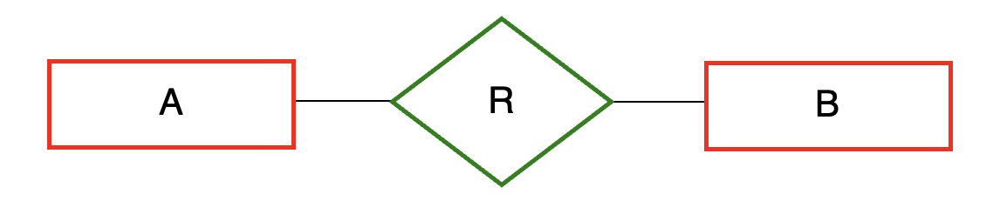{width="50%" fig-align="center"}
:::

## How can we indicate that each student has at most one major?

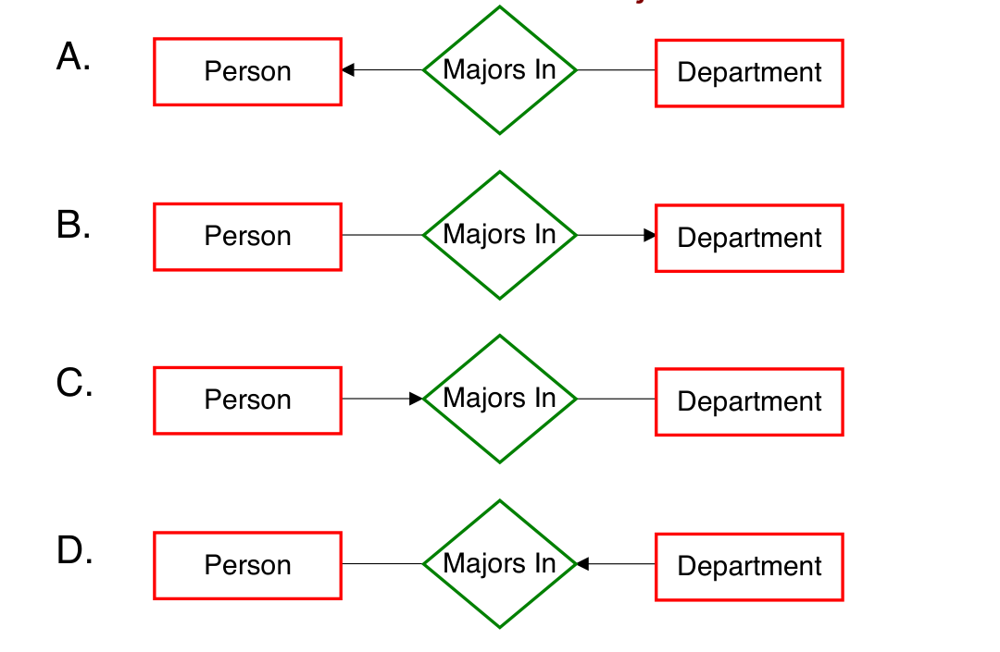{width="60%" fig-align="center"}

::: {.fragment}
- **Answer: B.** &nbsp; The arrow goes from Person *into* Majors In (toward Department), encoding "each Person majors in at most one Department."
:::

## What type of relationship is Majors In?

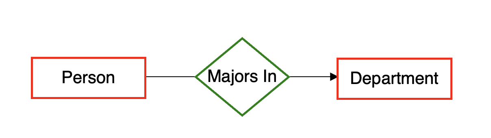{width="55%" fig-align="center"}

A. many-to-many  
B. many-to-one from Person to Department  
C. many-to-one from Department to Person  
D. one-to-one  

::: {.fragment}
- **Answer**: B. many-to-one from Person to Department
:::

::: {.incremental}
- A given person can major in *at most one* department.
- A given department can have *an arbitrary number* of people majoring in it.
:::

## What if each student can have more than one major?

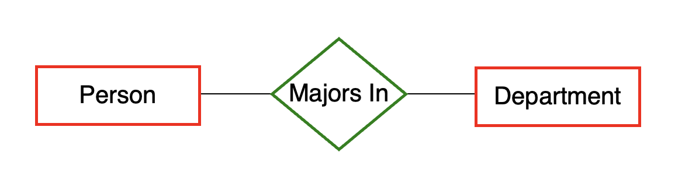{width="55%" fig-align="center"}

::: {.incremental}
- Observe that there are no *arrows*.
- *Majors In* is what type of relationship in this case?
    - **many-to-many**
:::

## Cardinality Constraints and Ternary Relationship Sets

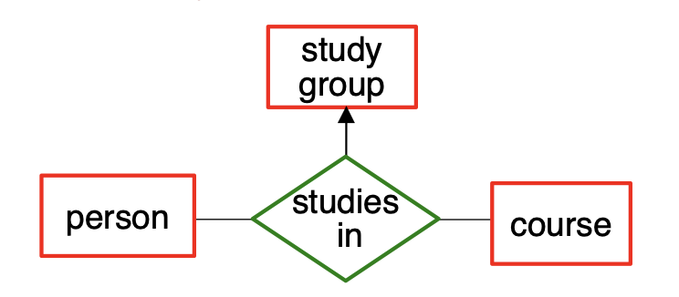{width="50%" fig-align="center"}

::: {.incremental}
- The arrow into "study group" encodes the following constraint: "a person studies in at most one study group *for a given course*."
- In other words, a given (person, course) combination is mapped to at most one study group.
- a given person or course can itself appear in multiple studies-in relationships
- For relationship sets of degree >= 3, we use at most one arrow, since otherwise the meaning can be ambiguous.
:::

## Participation Constraints

- Cardinality constraints allow us to specify that each entity will appear *at most* once in a given relationship set.
- Participation constraints allow us to specify that each entity will appear *at least* once (i.e., 1 or more time).
    - [indicate using a thick line (or double line)]{style="color:#3a5fcd;"}

::: {.fragment}
- Example: each department must have at least one chairperson.

{width="55%" fig-align="center"}

::: {.aside}
*Note that we're omitting the cardinality constraints for now*
:::
:::

::: {.fragment}
- We say Department has *total participation* in Chairs.
    - by contrast, Person has *partial participation*
:::

## Participation Constraints (cont.)

We can combine cardinality and participation constraints.

{width="50%" fig-align="center"}

- a person chairs at most one department
    - specified by which arrow? &nbsp; [the one into Department]{.fragment style="color:#3a5fcd;"}

::: {.incremental}
- a department has *exactly one* person as a chair
    - arrow into Person specifies *at most one*
    - thick line from Dept to Chairs specifies *at least one*
    - at most one + at least one = exactly one
:::

---

