## The Relational Model: A Brief History

:::: {.columns}
::: {.column width="65%"}
- Defined in a landmark 1970 paper by Edgar 'Ted' Codd.
- Earlier data models were closely tied to the physical representation of the data.
- The model was revolutionary because it provided *data independence* &mdash; separating the *logical* model of the data from its underlying *physical* representation.
- Allows users to access the data *without* understanding how it is stored on disk.
:::
::: {.column width="35%"}
{width="55%" fig-align="center"}
:::
::::

## The Relational Model: Basic Concepts

- A *database* consists of a collection of *tables*.
- Each *row* in a table holds data that describes either:
    - an *entity*
    - a *relationship* between two or more entities

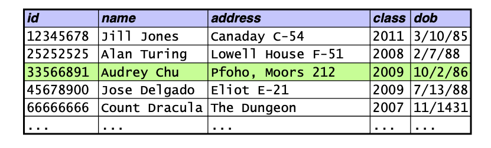{width="60%" fig-align="center"}

- Each *column* in a table represents one attribute of an entity.
    - each column has a *domain* of possible values

## Relational Model: Terminology

- Two sets of terminology:
    - table = relation
    - row = tuple
    - column = attribute
- We'll use both sets of terms.

## Requirements of a Relation

- Each column must have a unique name.
- The values in a column must be of the same type (i.e., must come from the same domain).
    - integers, real numbers, dates, strings, etc.
- Each cell must contain a single value.
    - example: we *can't* have a column holding a list of phone numbers

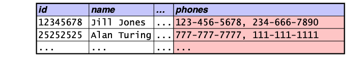{width="60%" fig-align="center"}

- No two rows can be identical.
    - identical rows are known as *duplicates*

## Null Values

- By default, the domains of most columns include a special value called *null*.

::: {.fragment}
- Null values can be used to indicate that:
    - the value of an attribute is unknown for a particular tuple
    - the attribute doesn't apply to a particular tuple

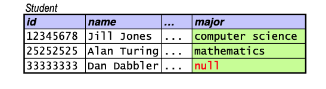{width="55%" fig-align="center"}
:::

## Relational Schema

- The *schema* of a relation consists of:
    - the name of the relation
    - the names of its attributes
    - the attributes' domains (although we'll ignore them for now)
- Example:
    - *Student(id, name, address, email, phone)*

::: {.fragment}
- The schema of a relational database consists of the schema of all of the relations in the database.
:::

## ER Diagram to Relational Database Schema

- Basic process:
    - entity set $\rightarrow$ a relation with the same attributes
    - relationship set $\rightarrow$ a relation whose attributes are:
        - the primary keys of the connected entity sets
        - the attributes of the relationship set

::: {.fragment}
- Example of converting a relationship set:

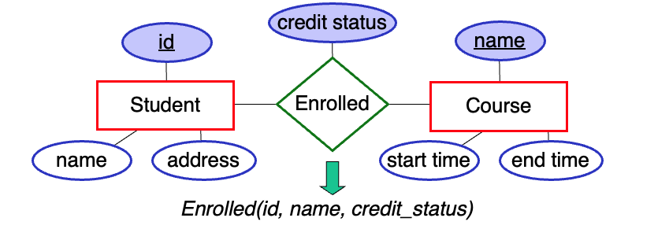{width="55%" fig-align="center"}

Note that we would also create a relation for each entity set.
::::

## Renaming Attributes

When converting a relationship set to a relation, there may be multiple attributes with the same name. In which case, we need to rename them.

::: {.fragment}
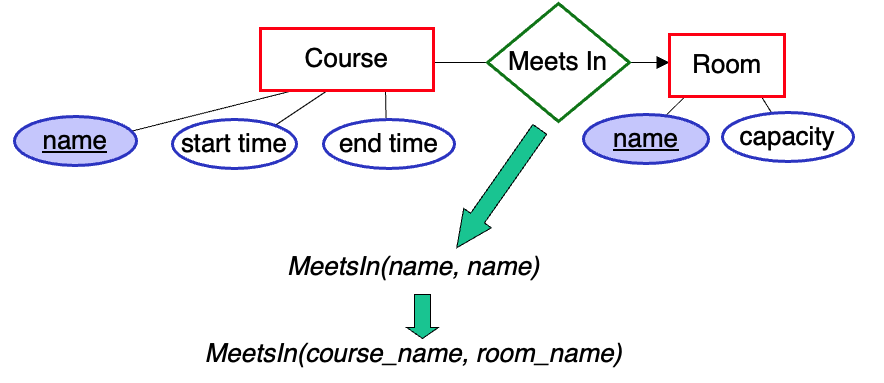{width="55%" fig-align="center"}

We are also free to rename attributes for the sake of clarity.
:::

## Special Case: Many-to-One Relationship Sets

Ordinarily, a binary relationship set will produce three relations:

- one for the relationship set
- one for each of the connected entity sets

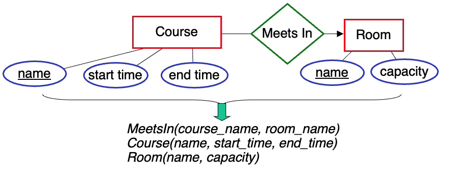{width="55%" fig-align="center"}

## Special Case: Many-to-One Relationship Sets (cont.)

However, if a relationship set is many-to-one, we often: 

- eliminate the relation for the relationship set
- capture the relationship set in the relation used for the entity set on the *many side* of the relationship

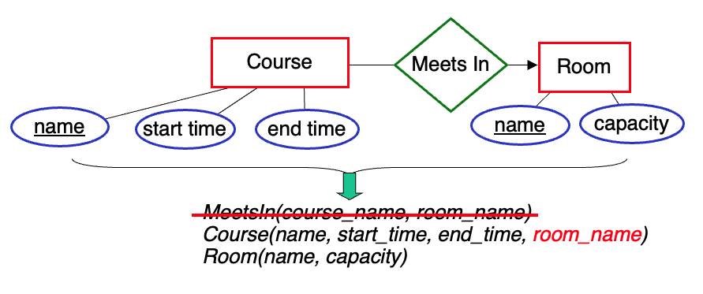{width="55%" fig-align="center"}

## Special Case: Many-to-One Relationship Sets (cont.)

Advantages of this approach:

- makes some types of queries more efficient to execute
- uses less space

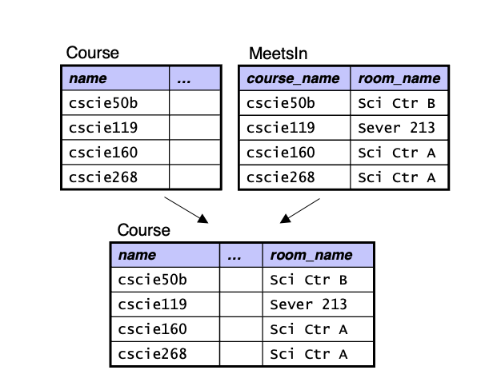{width="55%" fig-align="center"}

## Special Case: Many-to-One Relationship Sets (cont.)

- If one or more entities don't participate in the relationship, there will be null attributes for the fields that capture the relationship.
- If a large number of entities don't participate in the relationship, it may be better to use a separate relation.

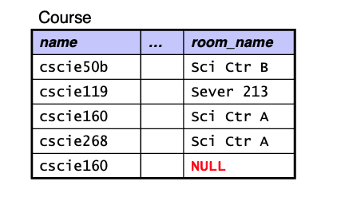{.nostretch width="50%" fig-align="center"}

## Special Case: One-to-One Relationship Sets

- Here again, we're able to have only two relations &ndash; one for each of the entity sets.
- In this case, we can capture the relationship set in the relation used for *either of the entity sets.*

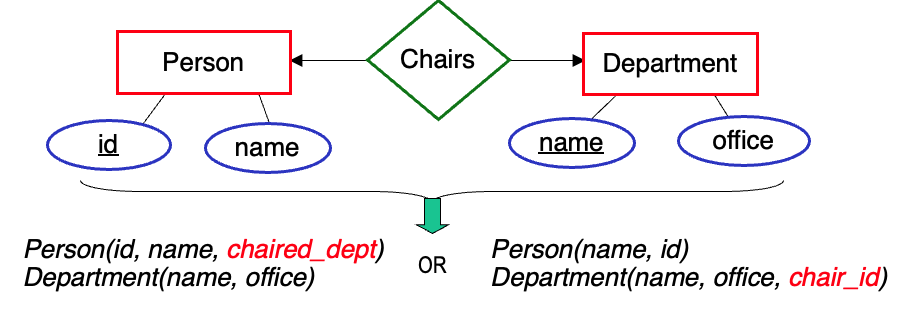{width="55%" fig-align="center"}

Which of these would probably make more sense?

::: {.fragment}
- [the second one, since almost every Department has a chair]{style="color:#3a5fcd;"}
:::

## Many-to-Many Relationship Sets

For many-to-many relationship sets, we need to use a *separate relation* for the relationship set.

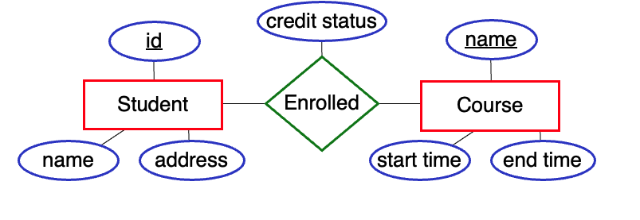{width="50%" fig-align="center"}

- Can't capture the relationships in the *Student* table
    - a given student can be enrolled in multiple courses
- Can't capture the relationships in the *Course* table
    - a given course can have multiple students enrolled in it
- Need to use a separate table:
    - *Enrolled(student_id, course_name, credit_status)*

## Recall: Keys and Candidate Keys

A key is an attribute or collection of attributes that can be used to uniquely identify each entity in an entity set. 

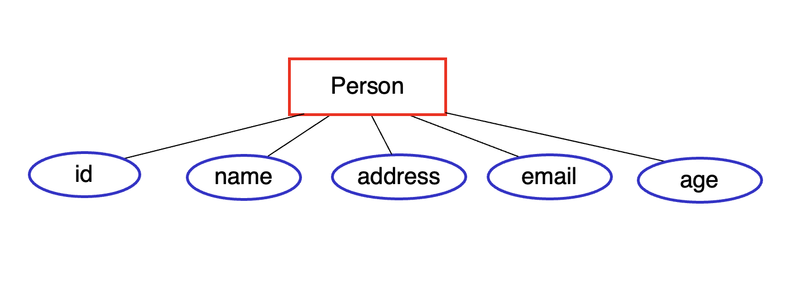{fig-align="center"}

Possible keys include: 

- id
- email
- (id, name)

A **candidate key** is a minimal collection of attributes that is a key.

- minimal = no unnecessary attributes are included
 
Note that (id, name) is not minimal, because we can remove name and still have a key

## Recall: Primary Key

We typically choose one of the candidate keys as the primary key. In an ER diagram, we underline the primary key attribute(s).

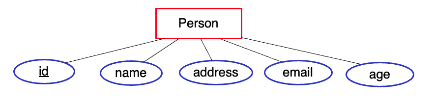

In the relational model, we also designate a primary key by underlying it.

::: {style="text-align: center;"}
Person(<u>id</u>, name, address, ...)
:::

A relational DBMS will ensure that no two rows have  the same value / combination of values for the primary key.

- known as a **uniqueness constraint**

## Primary Keys of Relations for Entity Sets

- When translating an *entity set* to a relation, the relation gets the same primary key as the entity set.

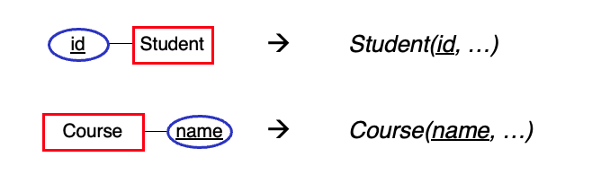{.nostretch width="80%" fig-align="center"}

## Primary Keys of Relations for Relationship Sets

- When translating a *relationship set* to a relation, the primary key depends on the cardinality constraints.
- For a *many-to-many* relationship set, we take the union of the primary keys of the connected entity sets.

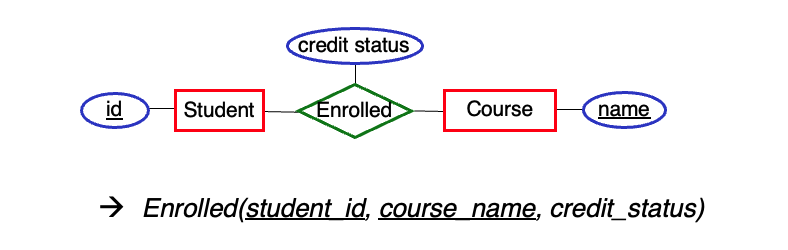{width="50%" fig-align="center"}

- Doing so prevents a given *combination* of entities from appearing more than once in the relation
- It still allows a single entity to appear multiple times, as part of different combinations

## Primary Keys of Relations for Relationship Sets (cont.)

For a many-to-one relationship set, if we decide to use a separate relation for it, what should that relation's primary key include?

::: {.r-stack}
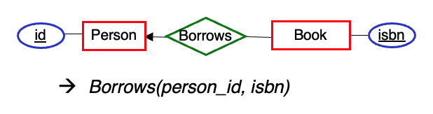{.fragment .fade-out data-fragment-index="1" width="100%" fig-align="center"}

{.fragment .fade-in data-fragment-index="1" width="100%" fig-align="center"}
:::

::: {.fragment data-fragment-index="1" style="color: #3a5fcd;"}
- Only the primary key of the entity set at the many end
:::

:::: {.fragment}
Limiting the primary key enforces the cardinality constraint 

- in this example, the DBMS will ensure that a given book is borrowed by at most once person

How else could we capture this relationship set?
::::

::: {.fragment style="color: #3a5fcd;"}
- eliminate the relation for Borrows; put the borrower's id in the Book relation
:::

## Primary Keys of Relations for Relationship Sets (cont.)

- For a *one-to-one* relationship set, what should the primary key of the resulting relation be?

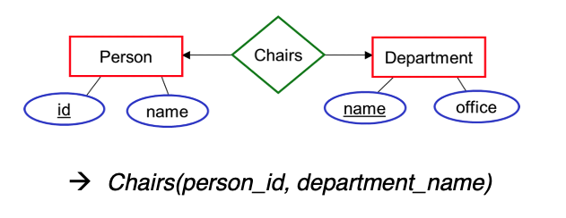{width="55%" fig-align="center"}

::: {.fragment}
[The primary key of *either* entity set]{style="color:#3a5fcd;"}.
:::

## Foreign Keys

- A *foreign key* is attribute(s) in one relation that take on values from the primary-key attribute(s) of another relation.
    - example: *MajorsIn* has two foreign keys

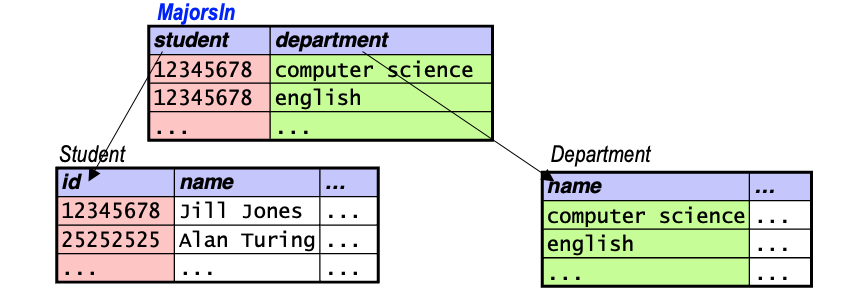{width="55%" fig-align="center"}

- We use foreign keys to capture relationships between entities.
- All values of a foreign key must match the referenced attribute(s) of some tuple in the other relation.
    - known as a **referential integrity** constraint

## Enforcing Constraints

- Example: assume the tables below show *all* of their tuples.
- Which of the following additions would the DBMS allow?

{width="50%" fig-align="center"}

A. adding (12345678, 'John Smith', ...) to *Student* [&emsp; no]{.fragment style="color:#c00;"}

B. adding (33333333, 'Howdy Doody', ...) to *Student* [&emsp; yes]{.fragment style="color:#3a5fcd;"}

C. adding (12345678, 'physics') to *MajorsIn* [&emsp; no]{.fragment style="color:#c00;"}

D. adding (25252525, 'english') to *MajorsIn* [&emsp; yes]{.fragment style="color:#3a5fcd;"}

## Design Issue: Attribute or Entity Set?

- It can sometimes be hard to decide if something should be treated as an attribute or an entity set.

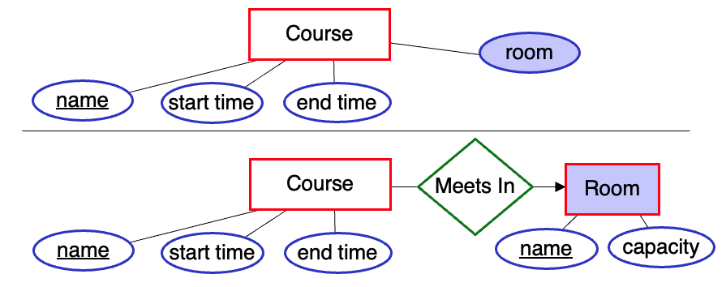{width="55%" fig-align="center"}

Indications that you should use an entity set:

::: {.incremental}
- if it has attributes of its own that you wish to capture
- if, as an attribute, it could have multiple values
    - multi-valued attributes are problematic in some data models
:::

---

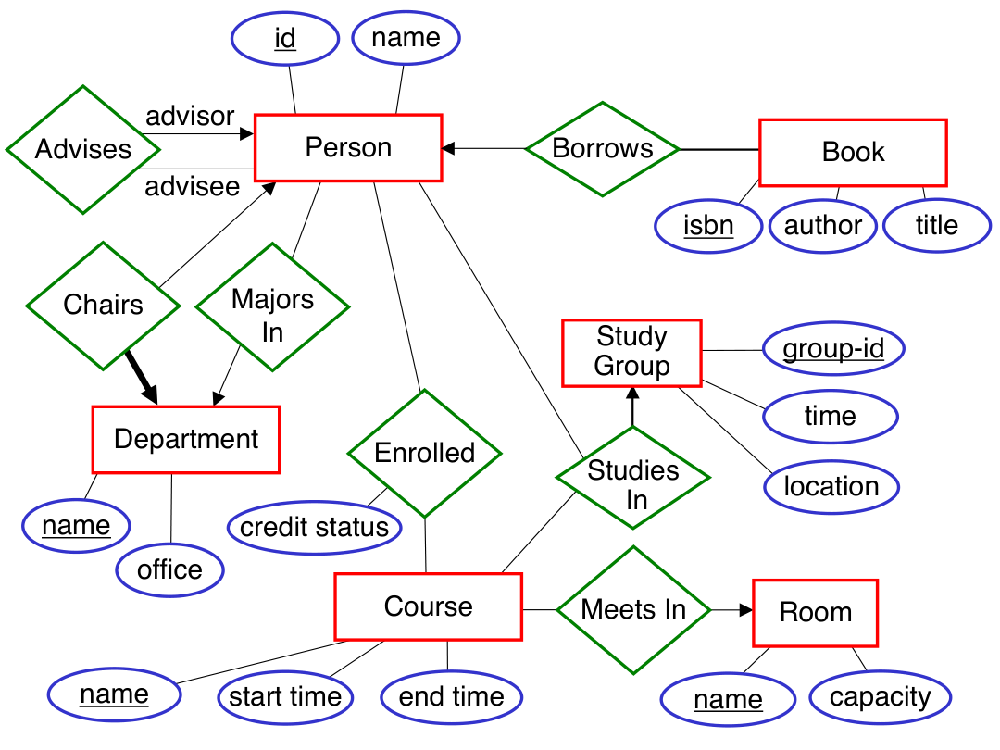{fig-align="center"}

::: {.center}
## Relational Algebra
:::

## Example Domain: a University

- Four relations that store info. about a type of entity:
    - *Student(*[*id*]{.underline}*, name)*
    - *Department(*[*name*]{.underline}*, office)*
    - *Room(*[*id*]{.underline}*, name, capacity)*
    - *Course(*[*name*]{.underline}*, start_time, end_time, room_id)*
- Two relations that capture relationships between entities:
    - *MajorsIn(student_id, dept_name)*
    - *Enrolled(student_id, course_name, credit_status)*

::: {.fragment}
- What would the primary keys of MajorsIn and Enrolled be?
:::

::: {.fragment}
- What do student_id, dept_name, and course_name have in common?
    - [they are all foreign keys]{style="color:#3a5fcd;"}
:::

::: {.fragment}
- Where else do we have a foreign key?
    - room_id in Course (takes on values from id in Room)
    - dept_name in MajorsIn (takes on values from name in Department)
:::

---

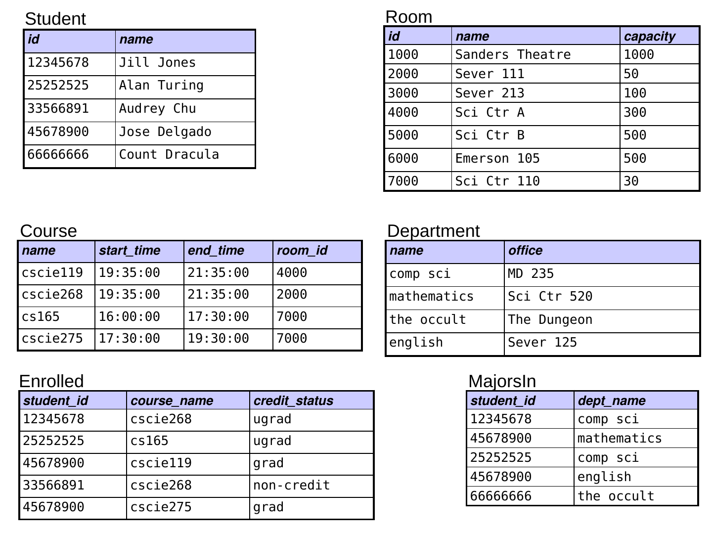

## Relational Algebra

- The query language proposed by Codd.
    - a collection of operations on relations
- Each operation:
    - takes one or more relations
    - produces a relation

{.nostretch width="75%" fig-align="center"}

- Relations are treated as sets.
    - all duplicate tuples are removed from an operation's result

## Selection

- What it does: selects tuples from a relation that match a predicate
    - predicate = condition
- Syntax: $\sigma_{\text{predicate}}(\text{relation})$

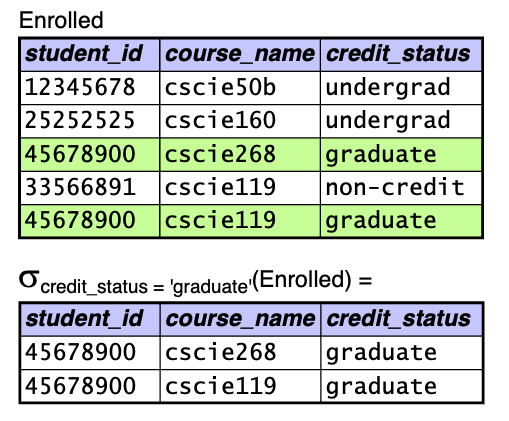{width="55%" fig-align="center"}

- Predicates may include: $>$, $<$, $=$, $\ne$, etc., as well as *and*, *or*, *not*

## Projection

- What it does: extracts attributes from a relation
- Syntax: $\pi_{\text{attributes}}(\text{relation})$

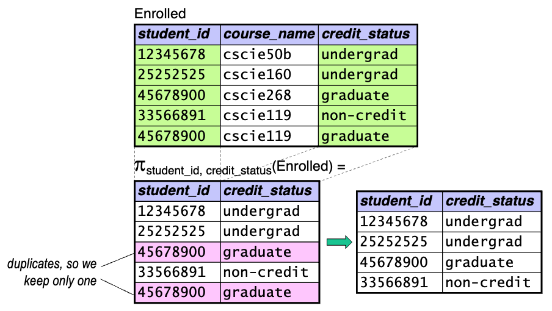{width="55%" fig-align="center"}

## Combining Operations

- Since each operation produces a relation, we can combine them.

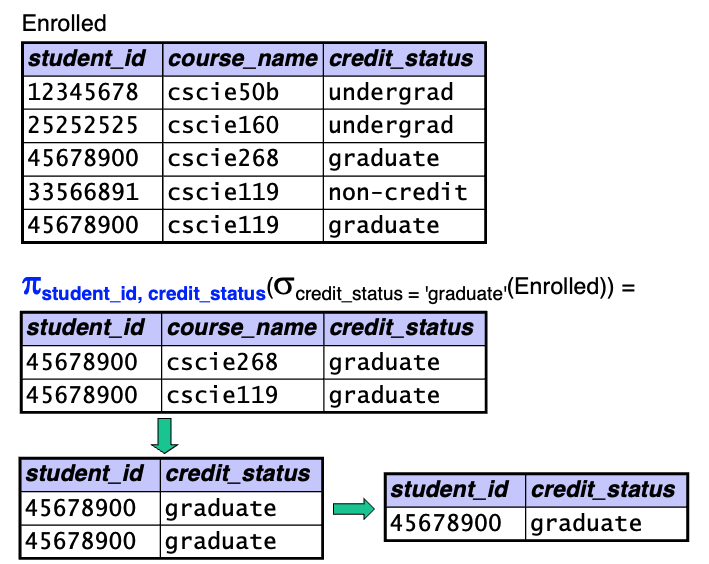{width="55%" fig-align="center"}

## How many rows are in the result of this query?

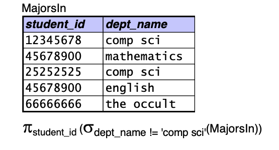{width="60%" fig-align="center"}

A. 1 

[B. 2]{.fragment .highlight-blue}

C. 3

D. 4 

E. 5 

---

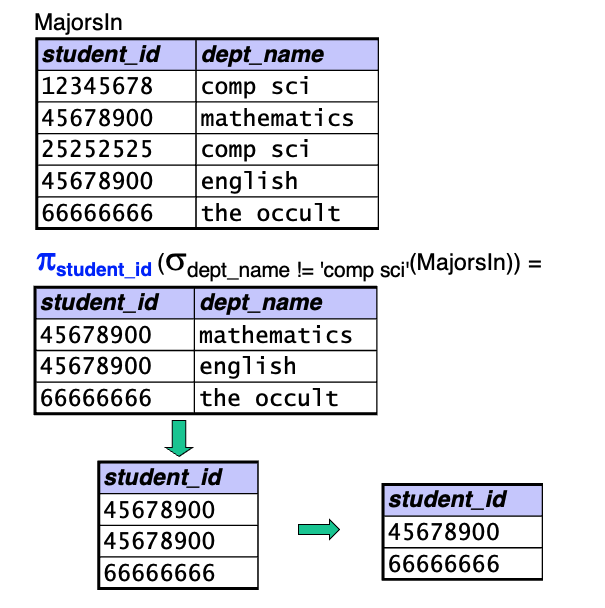{.nostretch width="70%" fig-align="center"}

## Mathematical Foundations: Cartesian Product

- Let [$A$]{.set-a} be the set of values [$\{ a_1, a_2, \ldots \}$]{.set-a}, [$B$]{.set-b} be the set of values [$\{ b_1, b_2, \ldots \}$]{.set-b}
- The *Cartesian product* of two sets [$A$]{.set-a} and [$B$]{.set-b} (written [$A$]{.set-a} $\times$ [$B$]{.set-b}) is the set of all possible ordered pairs ([$a_i$]{.set-a}, [$b_j$]{.set-b}), where [$a_i \in A$]{.set-a} and [$b_j \in B$]{.set-b}.

::: {.fragment data-fragment-index="0"}
- Example:
    - [$A$]{.set-a} $=$ [$\{ \text{apple}, \text{pear}, \text{orange} \}$]{.set-a}
    - [$B$]{.set-b} $=$ [$\{ \text{cat}, \text{dog} \}$]{.set-b}
    - [$A$]{.set-a} $\times$ [$B$]{.set-b} $=$ { ([apple]{.set-a}, [cat]{.set-b}), ([apple]{.set-a}, [dog]{.set-b}), ([pear]{.set-a}, [cat]{.set-b}), ([pear]{.set-a}, [dog]{.set-b}), ([orange]{.set-a}, [cat]{.set-b}), ([orange]{.set-a}, [dog]{.set-b}) }
:::

::: {.fragment data-fragment-index="1"}
- [$C$]{.set-c} $=$ [$\{ 5, 10 \}$]{.set-c}
- [$D$]{.set-d} $=$ [$\{ 2, 4 \}$]{.set-d}
:::

::: {.r-stack}
::: {.fragment .fade-in-then-out data-fragment-index="1"}
[$C$]{.set-c} $\times$ [$D$]{.set-d} $=$ ?
:::

::: {.fragment .fade-in data-fragment-index="2"}
[$C$]{.set-c} $\times$ [$D$]{.set-d} $=$ { ([5]{.set-c}, [2]{.set-d}), ([5]{.set-c}, [4]{.set-d}), ([10]{.set-c}, [2]{.set-d}), ([10]{.set-c}, [4]{.set-d}) }
:::
:::

## Mathematical Foundations: Cartesian Product (cont.)

- We can also take the Cartesian product of three or more sets.
- [$A$]{.set-a} $\times$ [$B$]{.set-b} $\times$ [$C$]{.set-c} is the set of all possible ordered triples ([$a_i$]{.set-a}, [$b_j$]{.set-b}, [$c_k$]{.set-c}), where [$a_i \in A$]{.set-a}, [$b_j \in B$]{.set-b}, and [$c_k \in C$]{.set-c}.
    - example:
    - [$C$]{.set-c} $=$ [$\{ 5, 10 \}$]{.set-c}
    - [$D$]{.set-d} $=$ [$\{ 2, 4 \}$]{.set-d}
    - [$E$]{.set-e} $=$ [$\{ \text{hi}, \text{there} \}$]{.set-e}
    - [$C$]{.set-c} $\times$ [$D$]{.set-d} $\times$ [$E$]{.set-e} $=$ { ([5]{.set-c}, [2]{.set-d}, [hi]{.set-e}), ([5]{.set-c}, [2]{.set-d}, [there]{.set-e}), ([5]{.set-c}, [4]{.set-d}, [hi]{.set-e}), ([5]{.set-c}, [4]{.set-d}, [there]{.set-e}), ([10]{.set-c}, [2]{.set-d}, [hi]{.set-e}), ([10]{.set-c}, [2]{.set-d}, [there]{.set-e}), ([10]{.set-c}, [4]{.set-d}, [hi]{.set-e}), ([10]{.set-c}, [4]{.set-d}, [there]{.set-e}) }

::: {.fragment}
- $A_1 \times A_2 \times \cdots \times A_n$ is the set of all possible ordered *tuples* $(a_{1i}, a_{2j}, \ldots, a_{nk})$, where $a_{de} \in A_d$.
:::

## Cartesian Product in Relational Algebra

- What it does: takes two relations, $R_1$ and $R_2$, and forms a new relation containing all possible combinations of tuples from $R_1$ with tuples from $R_2$
- Syntax: $R_1 \times R_2$

- Rules: $R_1$ and $R_2$ must have different names

The resulting relation has a schema that consists of the attributes of $R_1$ followed by the attributes of $R_2$:

$$
(a_{11} a_{12}, \ldots, a_{1m}) \times (a_{21}, \ldots, a_{2n}) \rightarrow (a_{11}, \ldots, a_{1m}, a_{21}, \ldots, a_{2n})
$$

If there are two attributes with the same name, we prepend the name of the original relation

Example: the attributes of Enrolled $\times$ MajorsIn would be

*(Enrolled.student_id, course_name, credit_status, MajorsIn.student_id, dept_name)*

## Cartesian Product in Relational Algebra (cont.)

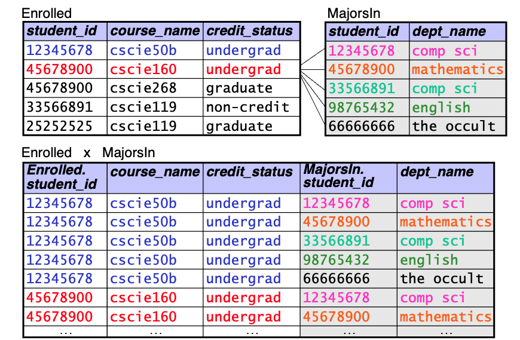{width="60%" fig-align="center"}

## Rename

- What it does: gives a (possibly new) name to a relation, and optionally to its attributes
- Syntax: $\rho_{\text{rel_name}}(\text{relation})$
    - $\rho_{\text{rel_name}(A_1, A_2, \ldots, A_n)}~(\text{relation})$

::: {.fragment}
Examples:

- renaming to allow us to take the Cartesian product of a relation with itself:
    - $\rho_{E_1}(\text{Enrolled}) \times \rho_{E_2}(\text{Enrolled})$
- renaming to give a name to the result of an operation:
    - $\sigma_{\text{room = BigRoom.name}}(\text{Course} \times \rho_{\text{BigRoom}}(\sigma_{\text{capacity} > 200}(\text{Room})))$
:::

## Natural Join

- What it does: performs a "filtered" Cartesian product
    - filters out / removes the tuples in which attributes with the same name have different values
- Syntax: $R_1 \bowtie R_2$

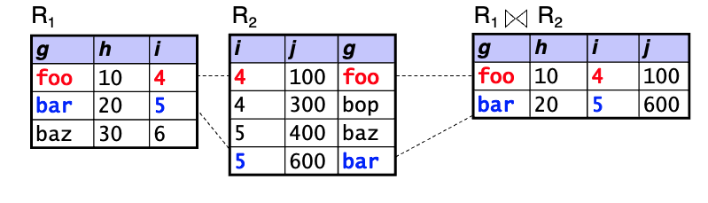{width="55%" fig-align="center"}

## Performing the Natural Join (Step 1)

- Take the full Cartesian product

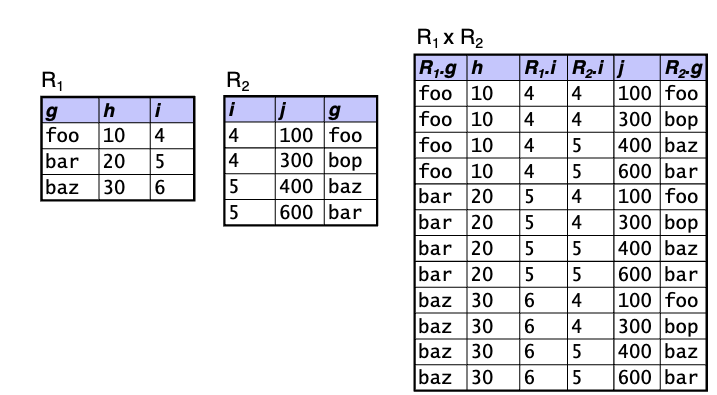{width="55%" fig-align="center"}

## Performing the Natural Join (Step 2)

- Perform a selection in which we filter out tuples in which attributes with the same name have different values
- If there are no attributes with the same name, skip this step 

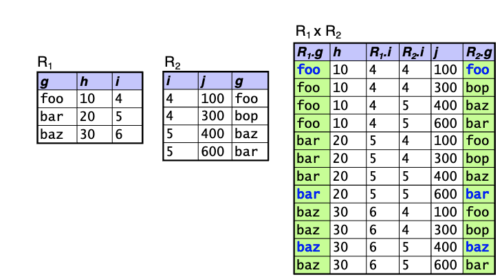{width="55%" fig-align="center"}

## Performing the Natural Join (Step 2)

- Perform a selection in which we filter out tuples in which attributes with the same name have different values
- If there are no attributes with the same name, skip this step 

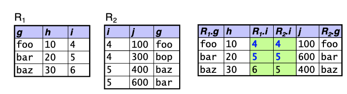{width="55%" fig-align="center"}

## Performing the Natural Join (Step 3)

Perform a projection that keeps only one copy of each duplicated column

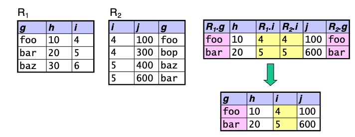{width="55%" fig-align="center"}

## Performing the Natural Join

- Final result: a table with all combinations of "matching" rows from the original tables.

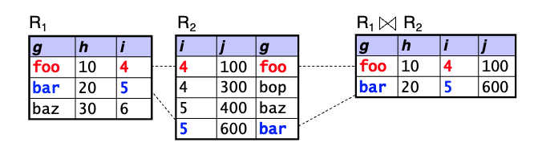{width="55%" fig-align="center"}

## How many rows and how many columns are in Enrolled $\bowtie$ MajorsIn?

::: {.r-stack}
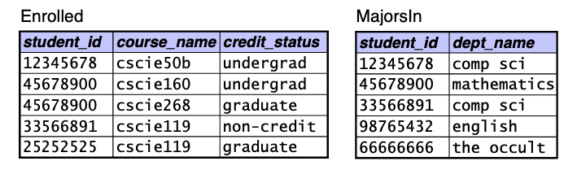{.fragment .fade-out data-fragment-index="1" width="100%"}

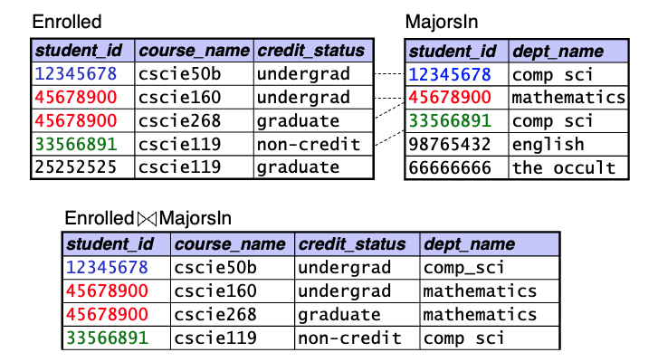{.fragment .fade-in data-fragment-index="1" width="100%"}
:::

A. 3 rows, 5 columns  
B. 3 rows, 4 columns  
C. 4 rows, 5 columns  
D. [4 rows, 4 columns]{.fragment .highlight-blue data-fragment-index="1"}  

## Natural Join: Summing Up

- The natural join is equivalent to the following:
    - Cartesian product, then selection, then projection
- The resulting relation's schema consists of the attributes of $R_1 \times R_2$, but with common attributes included only once
    - $(a, b, c) \times (a, d, c, f) \rightarrow (a, b, c, d, f)$
- If there are no common attributes, $R_1 \bowtie R_2 = R_1 \times R_2$

## Condition Joins (aka Theta Joins)

- What it does: performs a "filtered" Cartesian product according to a specified predicate
- Syntax: $R_1 \bowtie_{\theta} R_2$, where $\theta$ is a predicate
- Fundamental-operation equivalent: cross, select using $\theta$

::: {.r-stack}
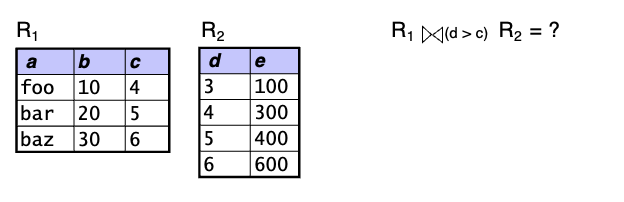{.fragment .fade-out data-fragment-index="1" width="100%"}

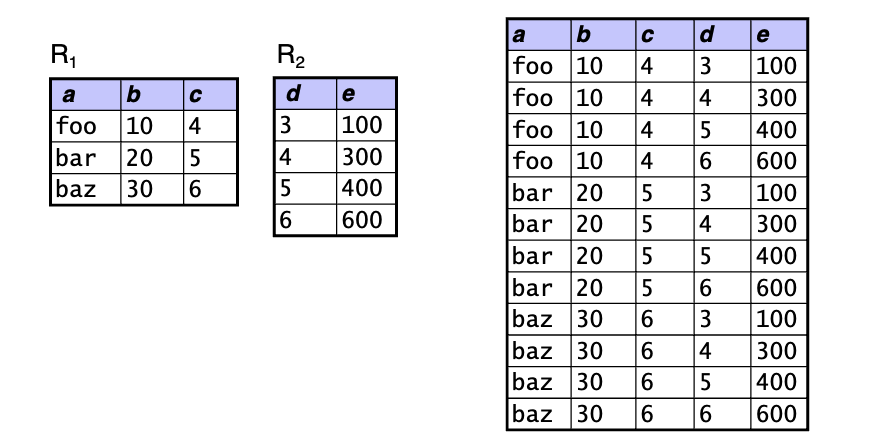{.fragment .fade-in-then-out data-fragment-index="1" width="100%"}

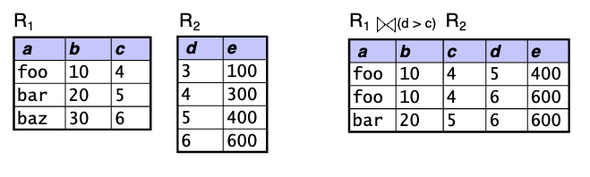{.fragment .fade-in data-fragment-index="2" width="100%"}
:::

## Which of these queries finds the names of all courses taken by comp sci majors?

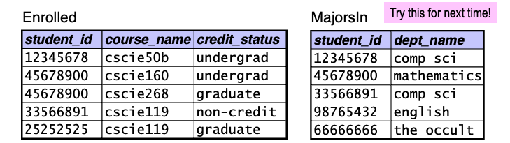{width="60%" fig-align="center"}

A. $\pi_{\text{course_name}}(\sigma_{\text{dept_name} = \text{'comp sci'}}(\text{Enrolled} \times \text{MajorsIn}))$  
B. $\pi_{\text{course_name}}(\sigma_{\text{dept_name} = \text{'comp sci'}}(\text{Enrolled} \bowtie \text{MajorsIn}))$      
C. $\pi_{\text{course_name}}(\text{Enrolled} \bowtie_{\text{dept_name = 'comp sci'}} \text{MajorsIn})$  
D. $\pi_{\text{course_name}}(\text{Enrolled} \bowtie (\sigma_{\text{dept_name = 'comp sci'}}((\text{MajorsIn})))$