## Aggregate Functions

- The SELECT clause can include an *aggregate function*, which performs a computation on a collection of values of an attribute.
- Example: find the average capacity of rooms in the Sci Ctr:

```sql
SELECT AVG(capacity)
FROM Room
WHERE name LIKE 'Sci Ctr%';
```

::: {.r-stack}
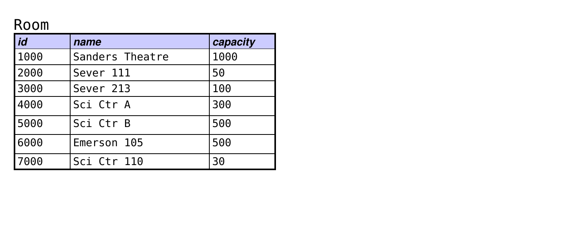{width="80%"}

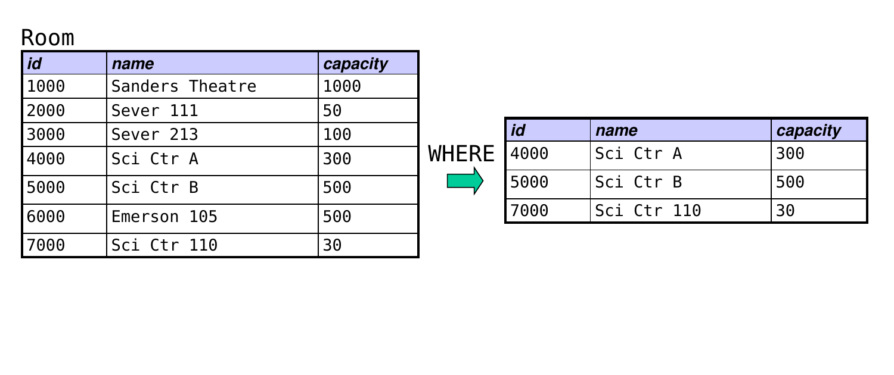{.fragment width="80%"}

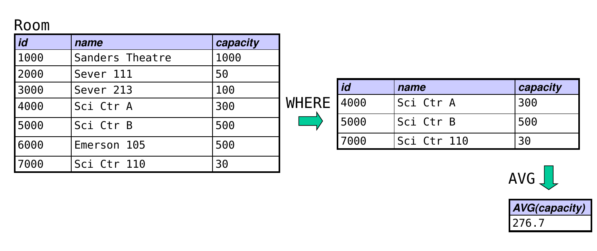{.fragment width="80%"}
:::

## Aggregate Functions (cont.)

- Possible functions include:
    - MIN, MAX: find the minimum/maximum of a value
    - AVG, SUM: compute the average/sum of numeric values
    - COUNT: count the number of values

::: {.fragment}
- For AVG, SUM, and COUNT, we can add the keyword DISTINCT to perform the computation on all distinct values.
    - example: find the number of students enrolled for courses:

```sql
SELECT COUNT(DISTINCT student)
FROM Enrolled;
```
:::

## Aggregate Functions (cont.)

- SELECT COUNT(\*) will count the number of tuples in the result of the select command.
    - example: find the number of DS courses

```sql
SELECT COUNT(*)
FROM Course
WHERE name LIKE 'ds%';
```

::: {.fragment .sub}
- COUNT(attribute) counts the number of non-NULL values of attribute, so it won't always be equivalent to COUNT(\*)
:::

::: {.fragment}
- Aggregate functions cannot be used in the WHERE clause.
- Practice with aggregate functions: write a query to find the largest capacity of any room in the Science Center:
:::

::: {.fragment}
```sql
SELECT MAX(capacity)
FROM Room
WHERE name LIKE 'Sci Ctr%';
```
:::

## Aggregate Functions (cont.)

- What if we wanted the name of the room with the max. capacity?
- The following will *not* work!

```sql
SELECT name, MAX(capacity)
FROM Room
WHERE name LIKE 'Sci Ctr%';
```

::: {.fragment}
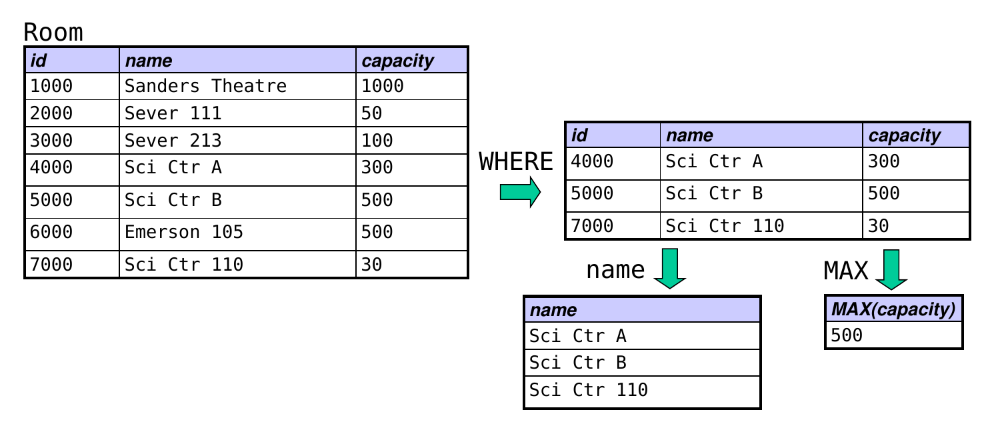{width="80%" fig-align="center"}
:::

::: {.fragment}
- In general, you can't mix aggregate functions with column names in the SELECT clause.
:::

## Subqueries

- A subquery allows us to use the result of one query in the evaluation of another query.
    - the queries can involve the same table or different tables
- We can use a subquery to solve the previous problem:

```sql
SELECT name, capacity
FROM Room
WHERE name LIKE 'Sci Ctr%'
  AND capacity = (SELECT MAX(capacity)      -- the subquery
                  FROM Room
                  WHERE name LIKE 'Sci Ctr%');
```

::: {.fragment}
- Since the subquery evaluates to 500, this is equivalent to:

```sql
SELECT name, capacity
FROM Room
WHERE name LIKE 'Sci Ctr%'
  AND capacity = 500;
```
:::

## How could we find the shortest PG-13 movie in the database?

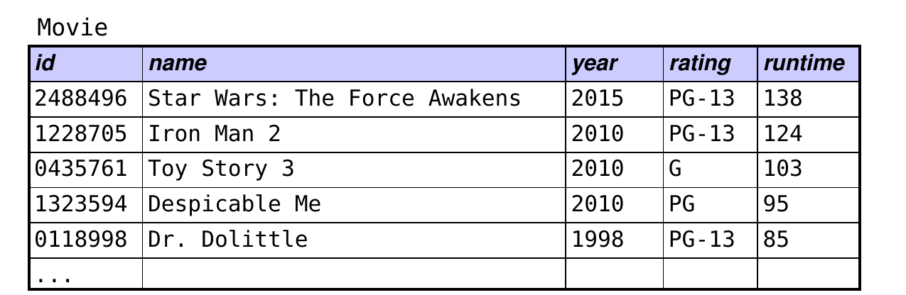{width="60%" fig-align="center"}

A\. &nbsp;`SELECT name, MIN(runtime) FROM Movie WHERE rating = 'PG-13';`

B\. &nbsp;`SELECT name, runtime FROM Movie WHERE runtime = (SELECT MIN(runtime) FROM Movie WHERE rating = 'PG-13');`

C\. &nbsp;`SELECT name, runtime FROM Movie WHERE rating = 'PG-13' AND runtime = (SELECT MIN(runtime) FROM Movie WHERE rating = 'PG-13');`

D\. &nbsp;two of these would work

E\. &nbsp;all three would work

## How could we find the shortest PG-13 movie in the database? (answer)

A\. &nbsp;`SELECT name, MIN(runtime) FROM Movie WHERE rating = 'PG-13';` [&larr; no: can't combine an aggregate with a "plain" column unless you are grouping by the column]{.fragment fragment-index=2 style="color:#c00;"}

B\. &nbsp;`SELECT name, runtime FROM Movie WHERE runtime = (SELECT MIN(runtime) FROM Movie WHERE rating = 'PG-13');` [&larr; could also get non-PG-13 movies with the same runtime]{.fragment fragment-index=3 style="color:#c00;"}

C\. &nbsp;`SELECT name, runtime FROM Movie WHERE rating = 'PG-13' AND runtime = (SELECT MIN(runtime) FROM Movie WHERE rating = 'PG-13');` [&larr; correct!]{.fragment fragment-index=1 style="color:#3a5fcd;"}

::: {.fragment fragment-index=3}
{width="55%" fig-align="center"}
:::

## A Restriction on Aggregate Functions

```sql
SELECT name, MIN(runtime)
FROM Movie
WHERE rating = 'PG-13';
```

[This does not work in standard SQL!]{style="color:#c00; font-weight:bold;"}

::: {.r-stack}
{width="80%"}

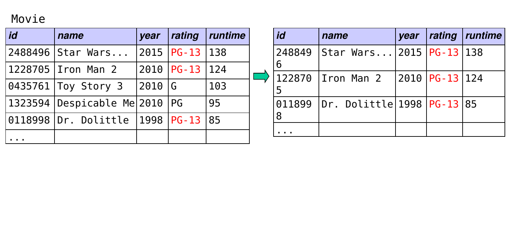{.fragment width="80%"}

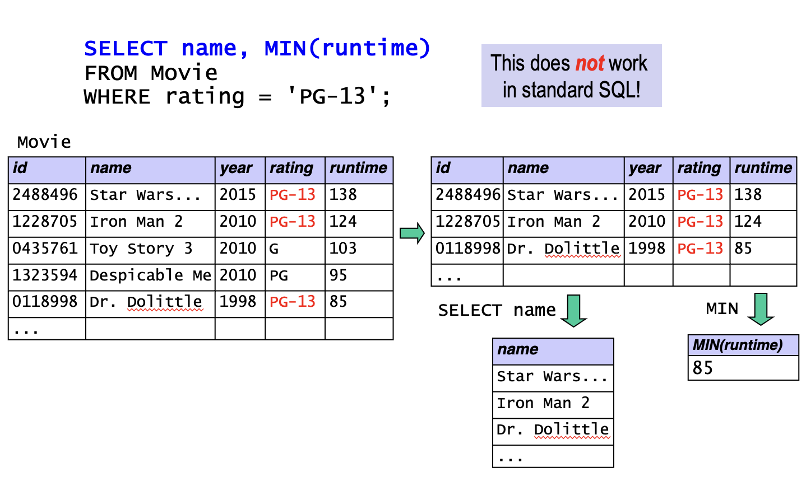{.fragment width="80%"}

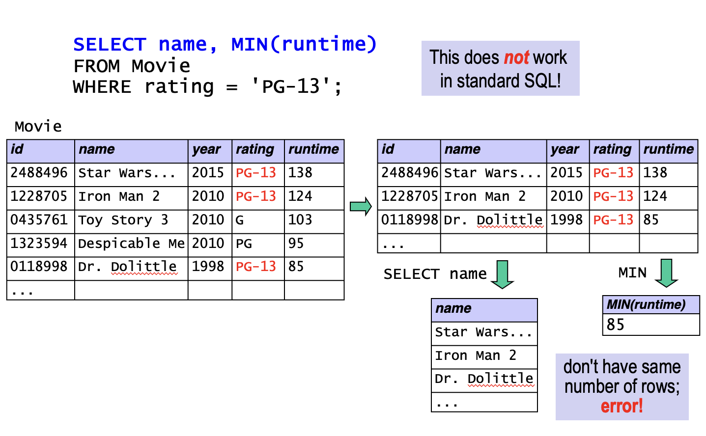{.fragment width="80%"}
:::

## A Restriction on Aggregate Functions (cont.)

```sql
SELECT name, MIN(runtime)
FROM Movie
WHERE rating = 'PG-13';    -- does not work in standard SQL!
```

- In general, a SELECT clause cannot combine:
    - an aggregate function
    - a column name that is on its own (and is not being operated on by an aggregate function)

::: {.fragment}
- We'll see an important exception to this soon.
- Warning: SQLite lets you violate this rule, but...
:::

::: {.fragment .sub}
- doing so is not standard SQL
- you should not do this in your work for this class!
:::

## Subqueries and Set Membership

- Subqueries can be used to test for set membership in conjunction with the IN and NOT IN operators.
    - example: find all students who are not enrolled in CSCI E-268

```sql
SELECT name
FROM Student
WHERE id NOT IN (SELECT student
                 FROM Enrolled
                 WHERE course = 'cscie268');
```

::: {.r-stack}
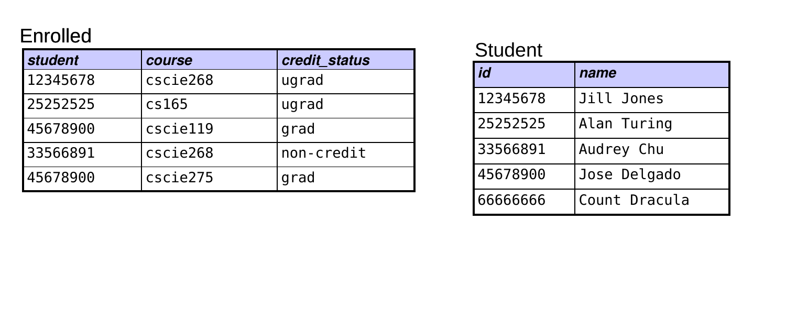{width="75%"}

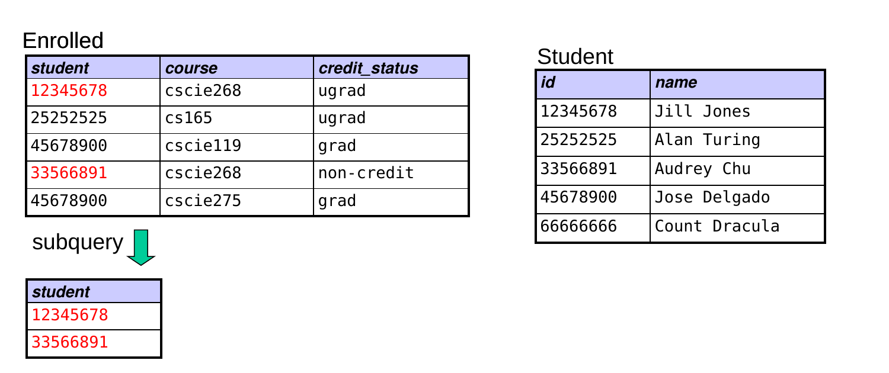{.fragment width="75%"}

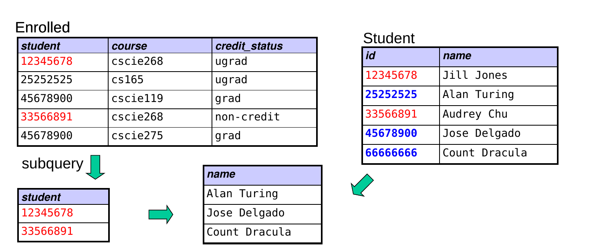{.fragment width="75%"}
:::

## Subqueries and Set Comparisons

- Subqueries also enable comparisons with elements of a set using the ALL and SOME operators.
    - example: find rooms larger than all rooms in Sever Hall

```sql
SELECT name, capacity
FROM Room
WHERE capacity > ALL (SELECT capacity
                      FROM Room
                      WHERE name LIKE 'Sever%');
```

::: {.fragment .sub}
- example: find rooms larger than at least one room in Sever

```sql
SELECT name, capacity
FROM Room
WHERE capacity > SOME (SELECT capacity
                       FROM Room
                       WHERE name LIKE 'Sever%');
```
:::

## Applying an Aggregate Function to Subgroups

- A GROUP BY clause allows us to:
    - group together tuples that have a common value
    - apply an aggregate function to the tuples in each subgroup
- Example: find the enrollment of each course:

```sql
SELECT course, COUNT(*)
FROM Enrolled
GROUP BY course;
```

::: {.fragment}
- When you group by an attribute, you [can]{.underline} include it in the SELECT clause with an aggregate function.
:::

::: {.fragment .sub}
- because we're grouping by that attribute, every tuple in a given group will have the same value for it
:::

## Evaluating a query with GROUP BY

```sql
SELECT course, COUNT(*)
FROM Enrolled
GROUP BY course;
```

::: {.r-stack}
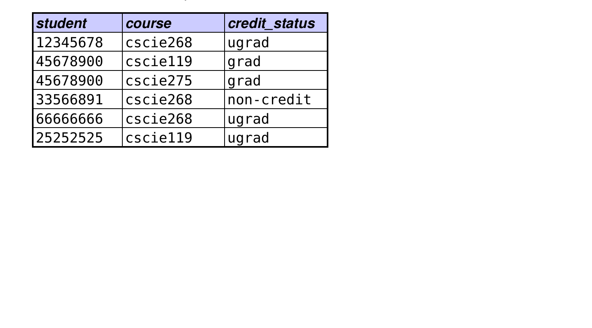{width="70%"}

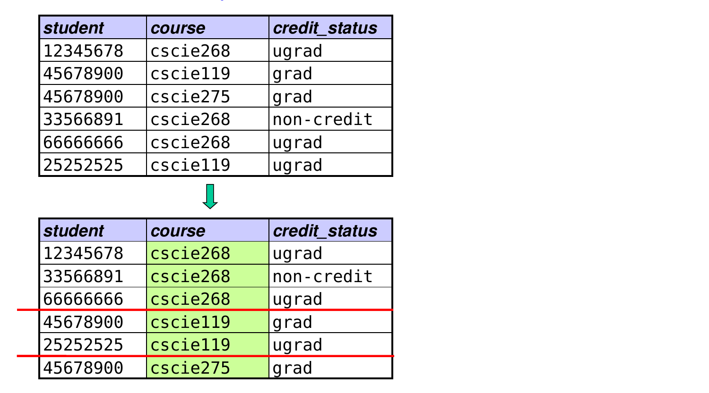{.fragment width="70%"}

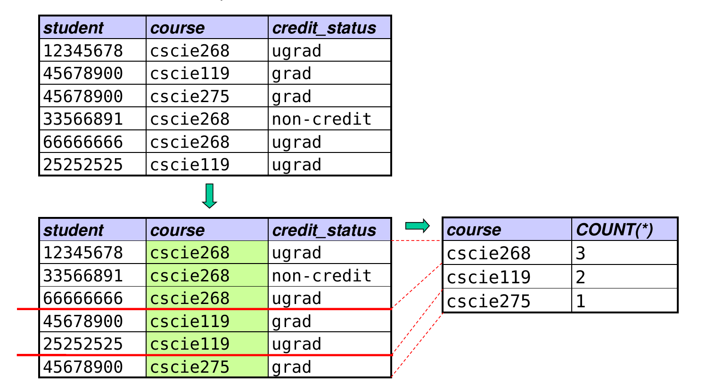{.fragment width="70%"}
:::

## Applying a Condition to Subgroups

- A HAVING clause allows us to apply a selection condition to the subgroups produced by a GROUP BY clause.
    - example: find enrollments of courses with at least 2 students

```sql
SELECT course, COUNT(*)
FROM Enrolled
GROUP BY course
HAVING COUNT(*) > 1;
```

::: {.r-stack}
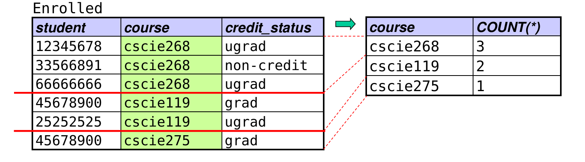{.fragment width="80%" fragment-index=1}

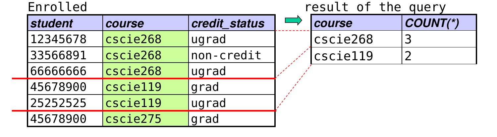{.fragment width="80%" fragment-index=2}
:::

::: {.fragment fragment-index=3}
- Important difference:
    - a WHERE clause is applied *before* grouping
    - a HAVING clause is applied *after* grouping
:::

## Subqueries in FROM clauses

- A subquery can also appear in a FROM clause.
- Useful when you need to perform a computation on values obtained by applying an aggregate.
    - example: find the average enrollment in a DS course

```sql
SELECT AVG(count)
FROM (SELECT course, COUNT(*) as count
      FROM Enrolled
      GROUP BY course) AS enrollCounts
WHERE course LIKE 'ds%';
```

- Some systems require that you assign a FROM-clause subquery a name (e.g., `enrollCounts` above).

## Sorting the Results

- An ORDER BY clause sorts the tuples in the result of the query by one or more attributes.
    - ascending order by default, use DESC to get descending
    - example:

```sql
SELECT name, capacity
FROM Room
WHERE capacity > 100
ORDER BY capacity DESC, name;
```

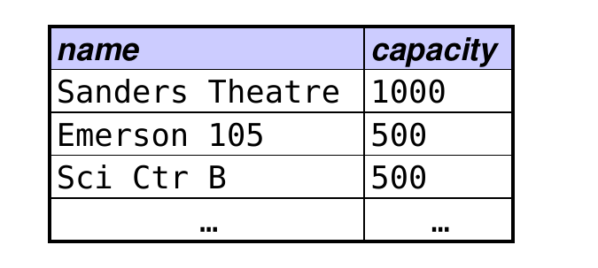{width="40%" fig-align="center"}

## Set Operations

- UNION, INTERSECTION, EXCEPT (set difference)
- Example: find the IDs of students and advisors

```sql
SELECT student
FROM Enrolled
UNION
SELECT advisor
FROM Advises;
```

## Outer Joins

- Syntax for left outer join:

```sql
SELECT …
FROM T1 LEFT OUTER JOIN T2 ON join condition
WHERE …
```

::: {.fragment}
- The result is equivalent to:
    - forming the Cartesian product `T1 x T2`
:::

::: {.fragment .sub}
- selecting the tuples in the Cartesian product that satisfy the join condition in the ON clause
:::

::: {.fragment .sub}
- including an extra tuple for each row from T1 that does not have a match with a row from T2 based on the ON clause
    - the T2 attributes in the extra tuples are given null values
:::

::: {.fragment .sub}
- applying the remaining clauses as before
:::

::: {.fragment}
- Also available: RIGHT OUTER JOIN, FULL OUTER JOIN
:::

## Outer Joins (cont.)

- Example: get the IDs and majors of all enrolled students.

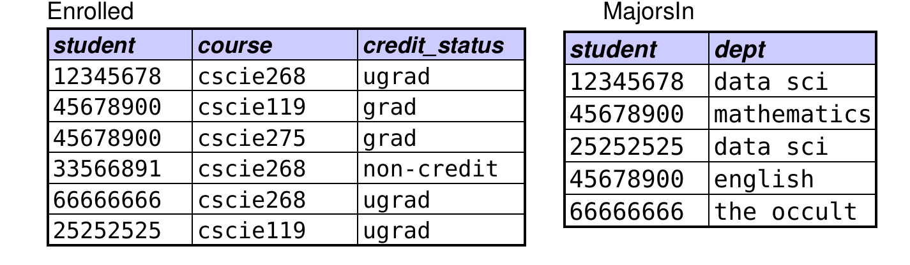{width="70%" fig-align="center"}

```sql
SELECT DISTINCT Enrolled.student, dept
FROM Enrolled LEFT OUTER JOIN MajorsIn
ON Enrolled.student = MajorsIn.student;
```

::: {.fragment}
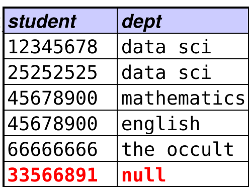{width="32%" fig-align="center"}
:::

## Outer Joins (cont.)

- Another example: find the IDs and majors of all students enrolled in cscie268 (including those with no major):

```sql
SELECT Enrolled.student, dept
FROM Enrolled LEFT OUTER JOIN MajorsIn
     ON Enrolled.student = MajorsIn.student
WHERE course = 'cscie268';
```

::: {.fragment .sub}
- in this case, there is a WHERE clause with an additional selection condition
:::

::: {.fragment .sub}
- the additional condition belongs in the WHERE clause because it's not a join condition &ndash; i.e., it isn't used to match up tuples from the two tables
:::

::: {.fragment}
- Note: when there is no additional condition, we don't need a WHERE clause &ndash; the join condition is in the ON clause.
:::

## Evaluating a SELECT command

```sql
SELECT column1, column2, …
FROM table1, table2, ...
...
```

- The result is equivalent to:
    - evaluating any subqueries in the FROM clause
    - forming the Cartesian product of the tables in the FROM clause: `table1 x table2 x …`
    - if there is an OUTER JOIN, applying its join condition and adding extra tuples as needed
    - applying the remaining clauses in the following order:

```text
WHERE (including any subqueries)   GROUP BY   HAVING   SELECT   ORDER BY
```

## CREATE TABLE

- What it does: creates a relation with the specified schema
- Basic syntax:

```sql
CREATE TABLE relation_name(
    attribute1_name attribute1_type,
    attribute2_name attribute2_type,
    …
    attributeN_name attributeN_type );
```

- Examples:

```sql
CREATE TABLE Student(id CHAR(8), name VARCHAR(30));

CREATE TABLE Room(id CHAR(4), name VARCHAR(30),
                  capacity INTEGER);
```

## Data Types

- An attribute's type specifies the domain of the attribute.
- The set of possible types depends on the DBMS.
- Standard SQL types include:
    - INTEGER: a four-byte integer (-2147483648 to +2147483647)
    - CHAR(n): a fixed-length string of n characters
    - VARCHAR(n): a variable-length string of up to n characters
    - REAL: a real number (i.e., one that may have a fractional part)
    - NUMERIC(n, d): a numeric value with at most n digits, exactly d of which are after the decimal point
    - DATE: a date of the form yyyy-mm-dd
    - TIME: a time of the form hh:mm:ss
- When specifying a non-numeric value, you should surround it with single quotes (e.g., 'Jill Jones' or '2007-01-26').

## CHAR  vs.  VARCHAR

- CHAR(n): a fixed-length string of *exactly* n characters
    - the DBMS will pad with spaces as needed
    - example: with `id CHAR(6)`, '12345' will be stored as '12345&nbsp;'

::: {.fragment}
- VARCHAR(n): a variable-length string of *up to* n characters
    - the DBMS does not pad the value
:::

::: {.fragment}
- In both cases, values will be truncated if they're too long.
- If a string attribute can have a wide range of possible lengths, it's usually better to use VARCHAR.
:::

## Types in SQLite

- SQLite has its own types, including:
    - INTEGER
    - REAL
    - TEXT
- It also allows you to use the typical SQL types, but it converts them to one of its own types.

::: {.fragment}
- As a result, the length restrictions indicated for CHAR and VARCHAR are not observed.
- It is also more lax in type checking than typical DBMSs.
:::

## String Comparisons

- String comparisons ignore any trailing spaces added for padding.
    - ex: an attribute named id of type CHAR(5)
    - insert a tuple with the value 'abc' for id
    - value is stored as 'abc&nbsp;&nbsp;' (with 2 spaces of padding)
    - the comparison `id = 'abc'` is true for that tuple

::: {.fragment}
- In standard SQL, string comparisons using both `=` and LIKE are case sensitive.
    - some DBMSs provide a case-insensitive version of LIKE
:::

::: {.fragment}
- In SQLite:
    - there are no real CHARs, so padding isn't added
    - string comparisons using `=` are case sensitive
    - string comparisons using LIKE are case insensitive
        - `'abc' = 'ABC'` is false
        - `'abc' LIKE 'ABC'` is true
:::

## Terms Used to Express Constraints

- primary key:

```sql
CREATE TABLE Student(id char(8) primary key,
    name varchar(30));

CREATE TABLE Enrolled(student char(8),
    course varchar(20), credit_status varchar(15),
    primary key (student, course));
```

::: {.fragment .sub}
- no two tuples can have the same combination of values for the primary-key attributes (a uniqueness constraint)
- a primary-key attribute can never have a null value
:::

::: {.fragment}
- unique: specifies attribute(s) that form a (non-primary) key
- not null: specifies that an attribute can never be null

```sql
CREATE TABLE Course(name varchar(20) primary key,
    start_time time, end_time time, room char(4),
    unique (start_time, end_time, room));

CREATE TABLE Student(id char(8) primary key,
    name varchar(30) not null);
```
:::

## Terms Used to Express Constraints (cont.)

- foreign key … references:

```sql
CREATE TABLE MajorsIn(student char(8),
    dept varchar(30),
    foreign key (student) references Student(id),
    foreign key (dept) references Department(name));
```

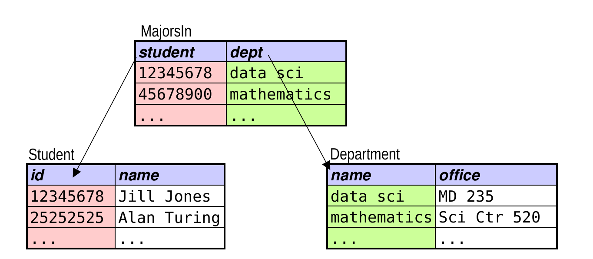{width="65%" fig-align="center"}

## Terms Used to Express Constraints (cont.)

- foreign key / references (cont.):
    - all values of a foreign key must match the referenced attribute(s) of some tuple in the other relation (known as a *referential integrity* constraint)

::: {.fragment .sub style="margin-left: 1em"}
- foreign-key attributes may refer to other attributes in the same relation:

```{{sql}}
CREATE TABLE Employee( id char(10) primary key,
    name varchar(30), supervisor char(10),
    foreign key (supervisor) references Employee(id));
```
:::

::: {.fragment .sub style="margin-left: 1em"}
- a foreign-key attribute may have a null value
:::

## Enforcing Constraints

- Example: assume that the tables below show *all* of their tuples.

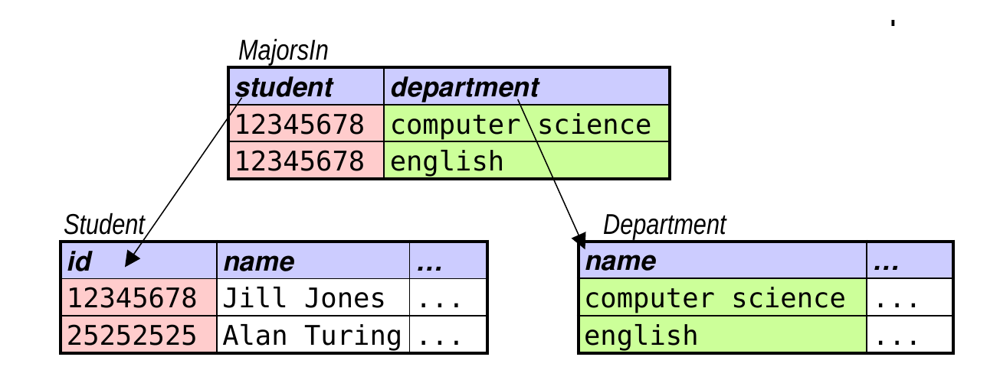{width="70%" fig-align="center"}

- Which of the following operations would the DBMS allow?
    - adding (12345678, 'John Smith', …) to Student [&larr; not allowed]{.fragment fragment-index=1 style="color:#c00;"}
    - adding (33333333, 'Howdy Doody', …) to Student [&larr; allowed]{.fragment fragment-index=2 style="color:#3a5fcd;"}
    - adding (12345678, 'physics') to MajorsIn [&larr; not allowed]{.fragment fragment-index=3 style="color:#c00;"}
    - adding (25252525, 'english') to MajorsIn [&larr; allowed]{.fragment fragment-index=4 style="color:#3a5fcd;"}

## DROP TABLE

- What it does: removes an entire relation from a database
    - including all of its existing rows
- Syntax:

```sql
DROP TABLE relation_name;
```

- Example:

```sql
DROP TABLE MajorsIn;
```

::: {.fragment}
- Note: if a relation is referred to by a foreign key in another relation, it cannot be dropped until either:
    1. the other relation is dropped first
    2. the foreign-key constraint is dropped from the other table (we won't look at how to do this)
:::

## INSERT

- What it does: adds a tuple to a relation
- Syntax:

```sql
INSERT INTO relation VALUES (val1, val2, …);
```

- the values of the attributes must be given in the order in which the attributes were specified when the table was created

::: {.fragment}
- Example:

```sql
INSERT INTO MajorsIn VALUES ('10005000', 'math');
```

- \[ Recall the CREATE TABLE command: `CREATE TABLE MajorsIn(student char(8), dept varchar(30), …);` \]
:::

## INSERT (cont.)

- Alternate syntax:

```sql
INSERT INTO relation(attr1, attr2, …)
VALUES (val1, val2, …);
```

- allows you to:
    - specify values of the attributes in a different order
    - specify values for only a subset of the attributes

::: {.fragment}
- Example:

```sql
INSERT INTO MajorsIn(dept, student)
VALUES ('math', '10005000');
```
:::

::: {.fragment}
- If the value of a column is not specified, it is assigned a default value.
    - depends on the data type of the column
:::

## DELETE

:::: {.columns}
::: {.column width="58%"}
- What it does: remove one or more tuples from a relation
    - basic syntax:

```sql
DELETE FROM table
WHERE selection condition;
```

- example:

```sql
DELETE FROM Student
WHERE id = '4567800';
```

::: {.fragment fragment-index=1}
- Before deleting a row, we must first remove all references to that row from foreign keys in other tables.
:::

::: {.fragment fragment-index=2 .sub}
- ex: before deleting from Student, delete the corresponding rows in Enrolled and MajorsIn
:::
:::

::: {.column width="42%"}
::: {.fragment fragment-index=1}
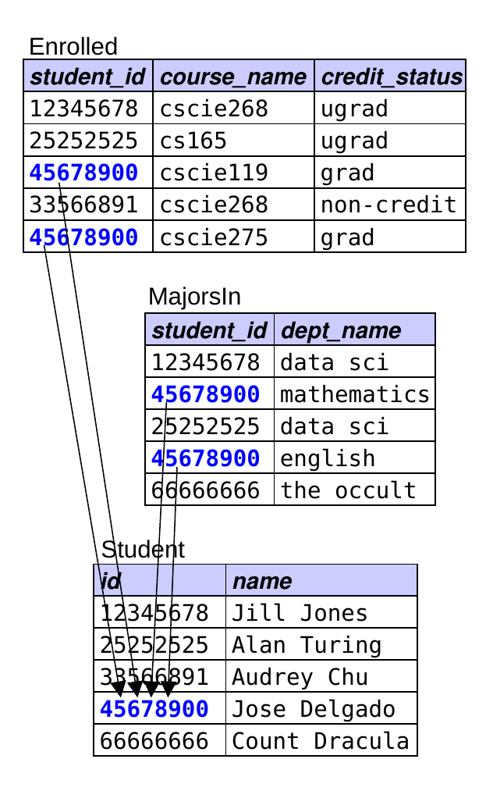{width="85%"}
:::
:::
::::

## UPDATE

- What it does: modify attributes of one or more tuples in a relation
    - basic syntax:

```sql
UPDATE table
SET list of assignments
WHERE selection condition;
```

::: {.fragment .sub}
- examples:

```sql
UPDATE MajorsIn
SET dept = 'physics'
WHERE student = '10005000';

UPDATE Course
SET start_time = '11:00:00', end_time = '12:30:00'
WHERE name = 'cs165';
```
:::

## Writing Queries: Rules of Thumb

- Start with the FROM clause. Which table(s) do you need?

::: {.fragment}
- If you need more than one table, determine the necessary join conditions.
    - for N tables, you typically need N &ndash; 1 join conditions
    - is an outer join needed &ndash; i.e., do you want unmatched tuples?
:::

::: {.fragment}
- Determine if a GROUP BY clause is needed.
    - are you performing computations involving subgroups?
:::

::: {.fragment}
- Determine any other conditions that are needed.
    - if they rely on aggregate functions, put in a HAVING clause
    - otherwise, add to the WHERE clause
    - is a subquery needed?
:::

::: {.fragment}
- Fill in the rest of the query: SELECT, ORDER BY?
    - is DISTINCT needed?
:::

## Which tables do I need?

- Find the names of all rooms that DS majors have courses in.

```sql
SELECT
FROM ???
WHERE
```

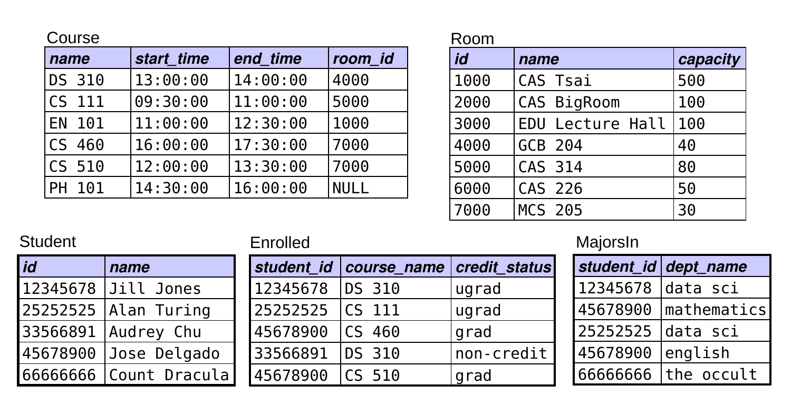{width="70%" fig-align="center"}

::: {.fragment}
```sql
FROM Course, Room, Enrolled, MajorsIn
```
:::

## How many join conditions do I need?

- Find the names of all rooms that DS majors have courses in.

```sql
SELECT
FROM Course, Room, Enrolled, MajorsIn
WHERE ???
```

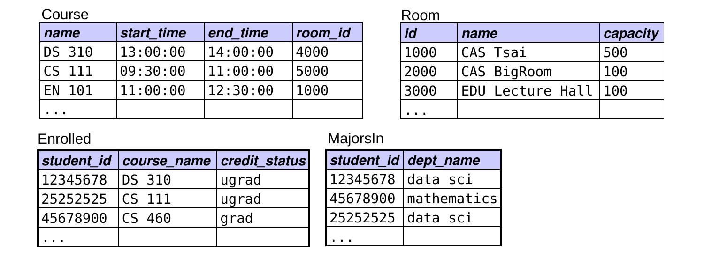{width="72%" fig-align="center"}

::: {.fragment}
[3 join conditions. For N tables, you need N &ndash; 1 join conditions!]{style="color:#3a5fcd;"}
:::

## Which of these is a correctly formed join condition for this problem?

{width="72%" fig-align="center"}

A\. &nbsp;`room_id = id` [&larr; correct!]{.fragment style="color:#3a5fcd;"}

B\. &nbsp;`course_name = name`

C\. &nbsp;`student_id = student_id`

D\. &nbsp;two or more are correct

## How would I fix the other two?

- Find the names of all rooms that DS majors have courses in.

```sql
SELECT
FROM Course, Room, Enrolled, MajorsIn
WHERE room_id = id AND ...
```

::: {.fragment}
- Qualify the ambiguous names &ndash; using aliases for the tables:

```sql
SELECT
FROM Course C, Room R, Enrolled E, MajorsIn M
WHERE room_id = id
  AND course_name = C.name
  AND E.student_id = M.student_id
```
:::

## What else do I need?

- Find the names of all rooms that DS majors have courses in.

```sql
SELECT
FROM Course C, Room R, Enrolled E, MajorsIn M
WHERE room_id = id
  AND course_name = C.name
  AND E.student_id = M.student_id
```

::: {.fragment}
- The selection condition, plus DISTINCT in the SELECT clause:

```sql
SELECT DISTINCT R.name
FROM Course C, Room R, Enrolled E, MajorsIn M
WHERE room_id = id
  AND course_name = C.name
  AND E.student_id = M.student_id
  AND dept_name = 'data sci';
```
:::

## Writing Queries: Rules of Thumb

- Start with the FROM clause. Which table(s) do you need?
- If you need more than one table, determine the necessary join conditions.
    - for N tables, you typically need N &ndash; 1 join conditions
    - is an outer join needed? &ndash; i.e., do you want unmatched tuples?
- Determine if a GROUP BY clause is needed.
    - are you performing computations involving subgroups?
- Determine any other conditions that are needed.
    - if they rely on aggregate functions, put in a HAVING clause
    - otherwise, add to the WHERE clause
    - is a subquery needed?
- Fill in the rest of the query: SELECT, ORDER BY?
    - is DISTINCT needed?

## Finding the Majors of Enrolled Students

- We want the IDs and majors of every student who is enrolled in a course &ndash; including those with no major.

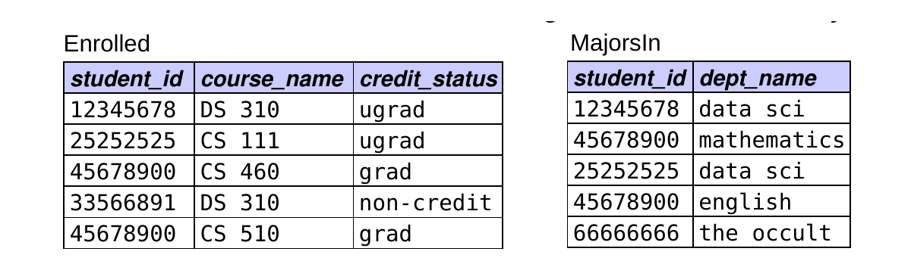{width="72%" fig-align="center"}

:::: {.columns}
::: {.column width="42%"}
- Desired result:

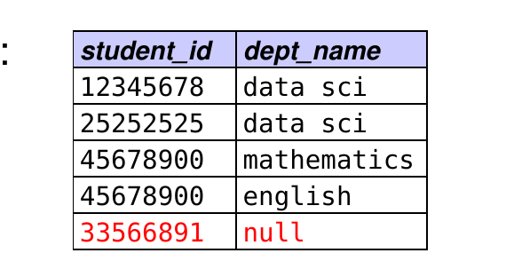{width="72%"}
:::

::: {.column width="58%"}
- Relational algebra:

π<sub>student_id, dept_name</sub>(Enrolled ⟕ MajorsIn)

::: {.fragment}
- SQL:

```sql
SELECT DISTINCT Enrolled.student_id, dept_name
FROM Enrolled LEFT OUTER JOIN MajorsIn
  ON Enrolled.student_id = MajorsIn.student_id;
```
:::
:::
::::

## Left Outer Joins

:::: {.columns}
::: {.column width="44%"}
```sql
SELECT DISTINCT
    Enrolled.student_id, dept_name
FROM Enrolled
    LEFT OUTER JOIN MajorsIn
    ON Enrolled.student_id =
       MajorsIn.student_id;
```

- The result is equivalent to:
    - forming the Cartesian product `T1 x T2`
    - selecting the rows in `T1 x T2` that satisfy the join condition in the ON clause
    - including an extra row for each unmatched row from T1 (the "left table")
        - filling the T2 attributes in the extra rows with nulls
    - applying the other clauses as before
:::

::: {.column width="56%"}
::: {.r-stack}
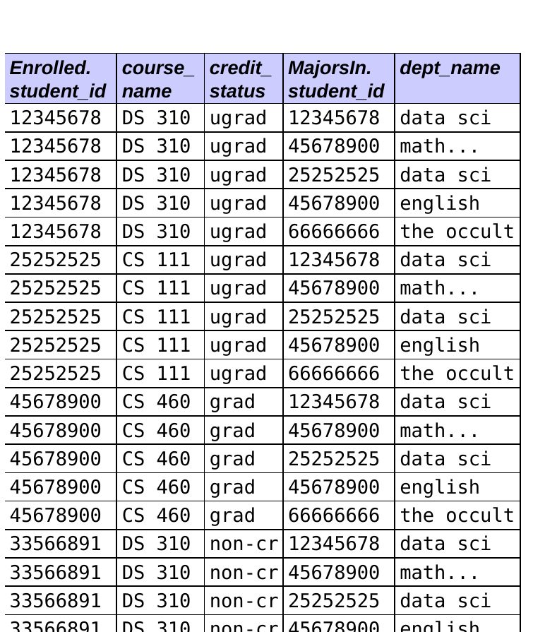{width="82%"}

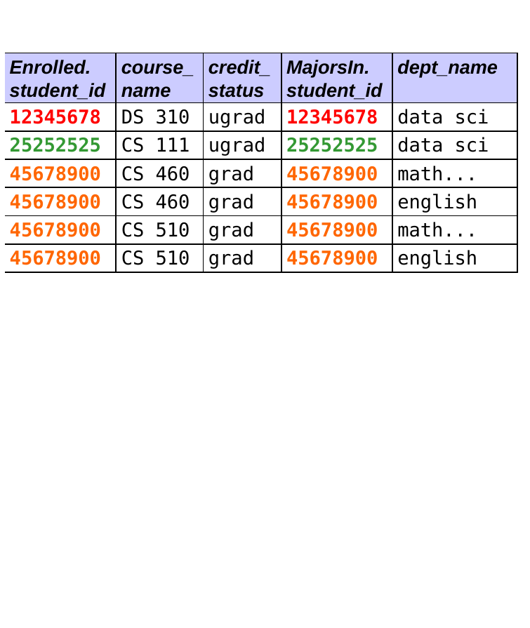{.fragment width="82%"}

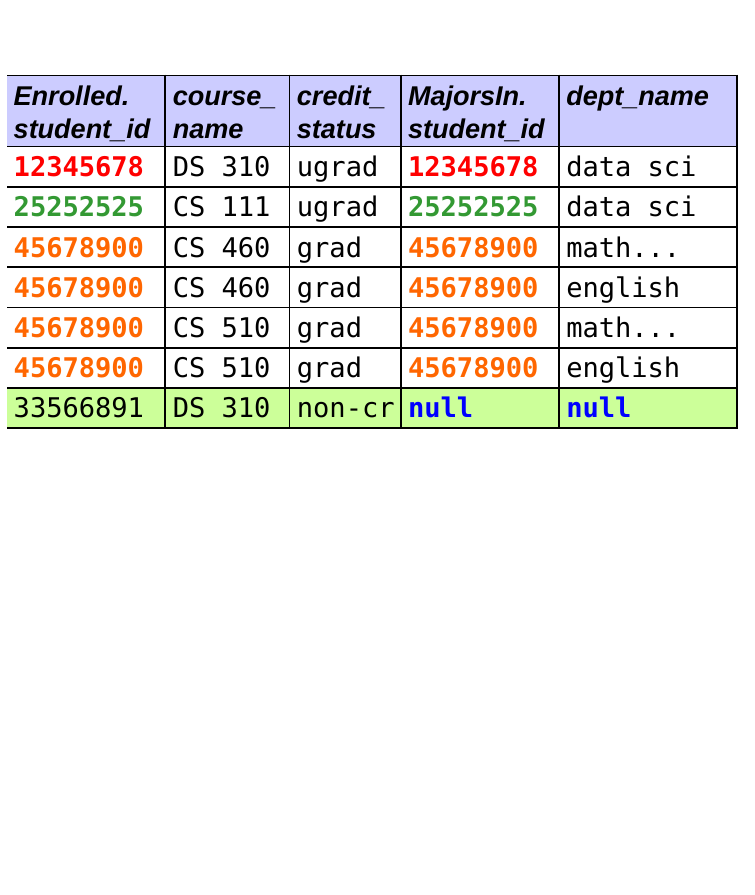{.fragment width="82%"}

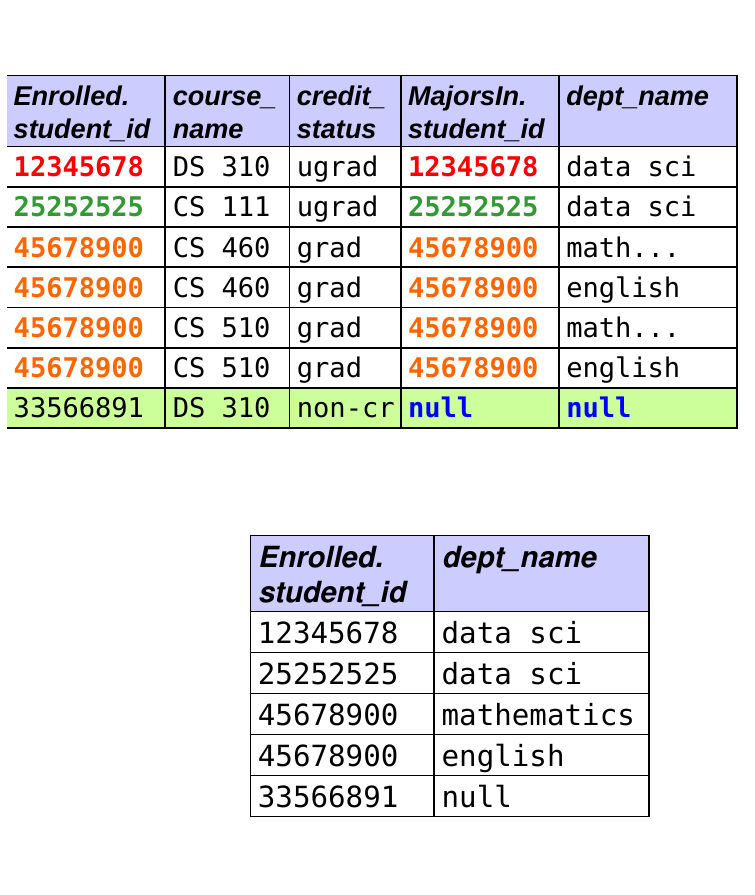{.fragment width="82%"}
:::
:::
::::

## Outer Joins Can Have a WHERE Clause

- Example: find the IDs and majors of all students enrolled in DS 310 (including those with no major):

```sql
SELECT Enrolled.student_id, dept_name
FROM Enrolled LEFT OUTER JOIN MajorsIn
     ON Enrolled.student_id = MajorsIn.student_id
WHERE course_name = 'DS 310';
```

- to limit the results to students in DS 310, we need a WHERE clause with the appropriate condition
- this new condition should *not* be in the ON clause because it's not being used to match up rows from the two tables

## Outer Joins Can Have Extra Tables

- Example: find the names and majors of all students enrolled in DS 310 (including those with no major):

```sql
SELECT Student.name, dept_name
FROM Student, Enrolled LEFT OUTER JOIN MajorsIn
     ON Enrolled.student_id = MajorsIn.student_id
WHERE Student.id = Enrolled.student_id
  AND course_name = 'DS 310';
```

- we need Student in the FROM clause to get the student's names
- the extra table requires an additional join condition, which goes in the WHERE clause

## Extra Practice Writing Queries

```text
Person(id, name, dob, pob)
Movie(id, name, year, rating, runtime, genre, earnings_rank)
Actor(actor_id, movie_id)      Director(director_id, movie_id)
Oscar(movie_id, person_id, type, year)
```

1\) &nbsp;Find all people in the database who acted in Avatar.

::: {.fragment}
```sql
SELECT P.name
FROM Person P, Actor A, Movie M
WHERE P.id = A.actor_id
  AND M.id = A.movie_id
  AND M.name = 'Avatar';
```
:::

## Extra Practice Writing Queries (cont.)

```text
Person(id, name, dob, pob)
Movie(id, name, year, rating, runtime, genre, earnings_rank)
Actor(actor_id, movie_id)      Director(director_id, movie_id)
Oscar(movie_id, person_id, type, year)
```

2\) &nbsp;How many people in the database did *not* act in Avatar? Will this work?

```sql
SELECT COUNT(*)
FROM Person P, Actor A, Movie M
WHERE P.id = A.actor_id AND M.id = A.movie_id
  AND M.name != 'Avatar';
```

::: {.fragment}
- If not, what will?

```sql
SELECT COUNT(*)
FROM Person
WHERE id NOT IN (SELECT actor_id
                 FROM Actor A, Movie M
                 WHERE A.movie_id = M.id
                   AND M.name = 'Avatar');
```
:::

## Extra Practice Writing Queries (cont.)

```text
Person(id, name, dob, pob)
Movie(id, name, year, rating, runtime, genre, earnings_rank)
Actor(actor_id, movie_id)      Director(director_id, movie_id)
Oscar(movie_id, person_id, type, year)
```

4\) &nbsp;Which people in the database have acted in a movie directed by James Cameron?

::: {.fragment}
```sql
SELECT DISTINCT ActP.id, ActP.name
FROM Person ActP, Actor A,
     Director D, Person DirP
WHERE ActP.id = A.actor_id
  AND A.movie_id = D.movie_id
  AND D.director_id = DirP.id
  AND DirP.name = 'James Cameron';
```
:::

## Extra Practice Writing Queries (cont.)

```text
Person(id, name, dob, pob)
Movie(id, name, year, rating, runtime, genre, earnings_rank)
Actor(actor_id, movie_id)      Director(director_id, movie_id)
Oscar(movie_id, person_id, type, year)
```

6\) &nbsp;For each person in the database born in Boston, find the number of movies in the database (possibly 0) in which the person has acted.

::: {.fragment}
```sql
SELECT name, COUNT(movie_id)
FROM Person LEFT OUTER JOIN Actor
     ON id = actor_id
WHERE pob LIKE 'Boston, Mass%'
GROUP BY name;
```
:::

## What does this give?

```sql
SELECT name
FROM Movie, Oscar;
```

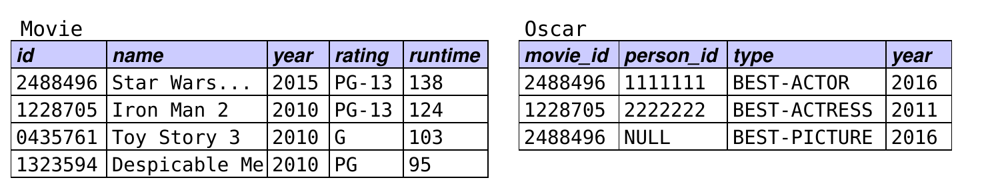{width="80%" fig-align="center"}

::: {.fragment fragment-index=1}
[The full Cartesian product!]{style="color:#3a5fcd;"}
:::

::: {.r-stack}
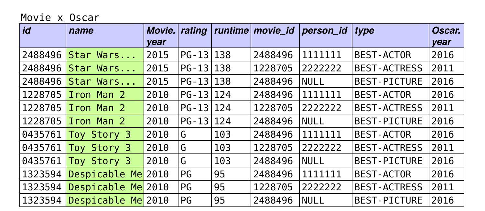{.fragment width="68%" fragment-index=1}

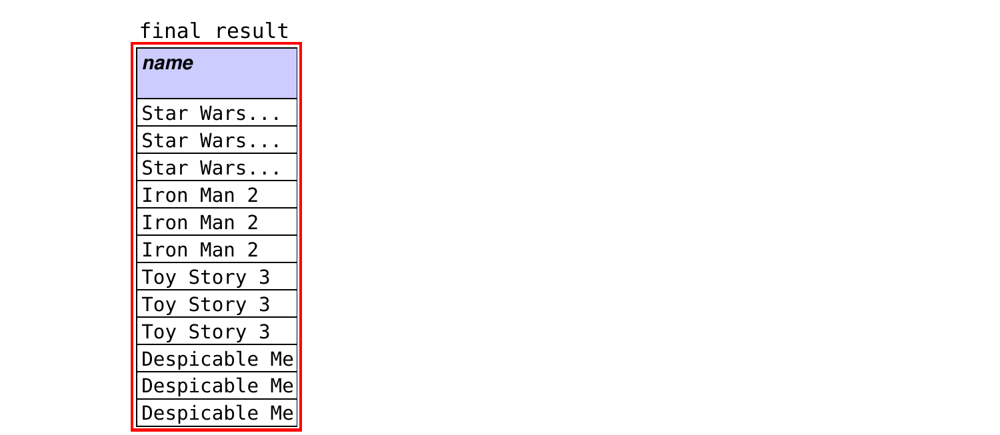{.fragment width="68%" fragment-index=2}
:::

## How can we get just the movies that won Oscars?

```sql
SELECT name
FROM Movie, Oscar
WHERE id = movie_id;    -- add an appropriate join condition!
```

{width="75%" fig-align="center"}

::: {.r-stack}
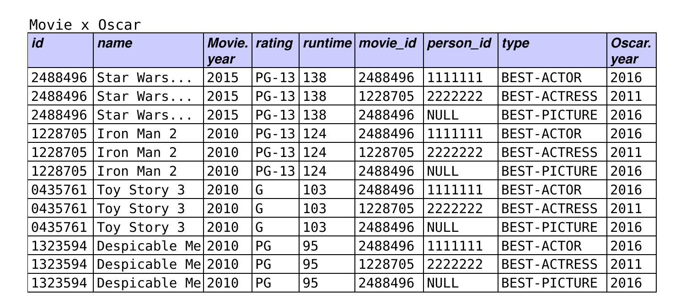{.fragment width="68%"}

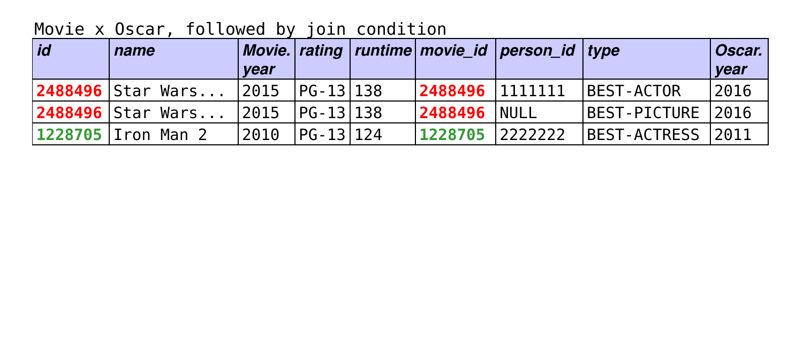{.fragment width="68%"}

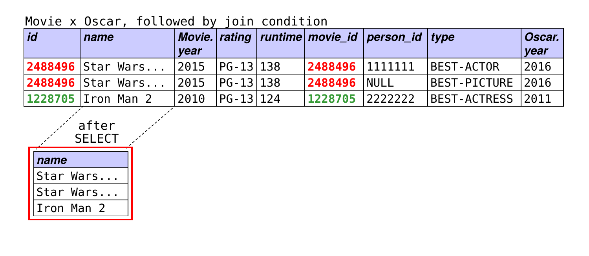{.fragment width="68%"}
:::

## Counting Oscars Won by Movies

```sql
SELECT name, COUNT(*)
FROM Movie, Oscar
WHERE id = movie_id
GROUP BY name;
```

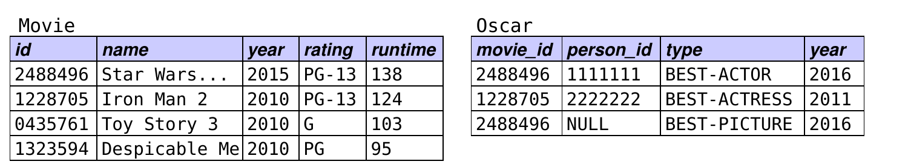{width="72%" fig-align="center"}

::: {.r-stack}
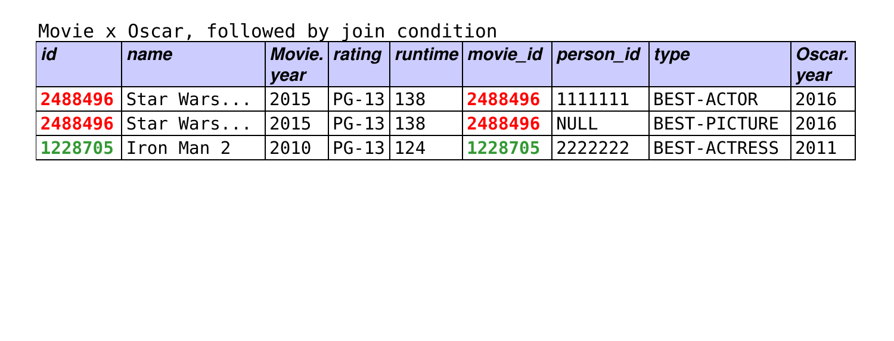{.fragment width="70%"}

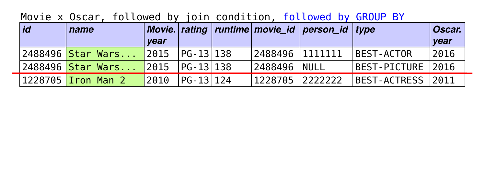{.fragment width="70%"}

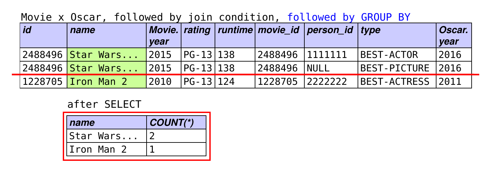{.fragment width="70%"}
:::

## What if we wanted a count for each movie?

```sql
SELECT name, COUNT(*)
FROM Movie, Oscar
WHERE id = movie_id
GROUP BY name;
```

{width="72%" fig-align="center"}

::: {.fragment}
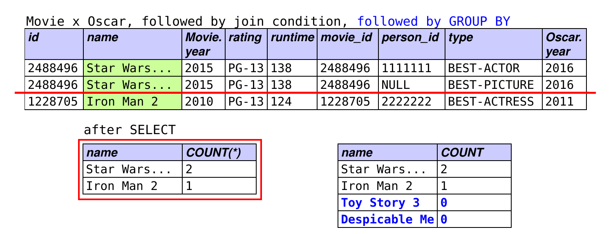{width="70%" fig-align="center"}
:::

## Which of these would work?

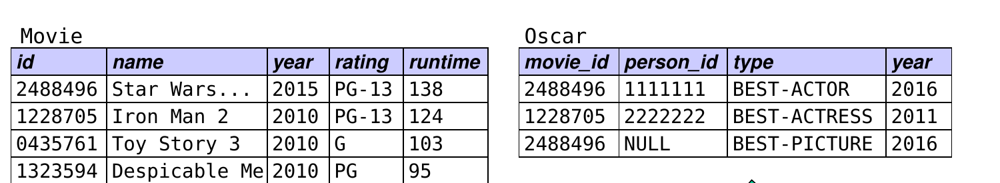{width="70%" fig-align="center"}

:::: {.columns}
::: {.column width="30%"}
- Desired result:

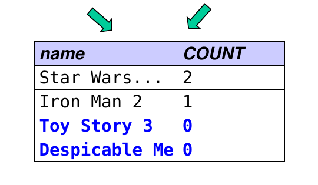{width="95%"}
:::

::: {.column width="70%"}
A\.

```sql
SELECT name, COUNT(*) FROM Movie, Oscar
WHERE id = movie_id GROUP BY name;
```

B\.

```sql
SELECT name, COUNT(type) FROM Movie, Oscar
WHERE id = movie_id GROUP BY name;
```

C\.

```sql
SELECT name, COUNT(type) FROM Movie LEFT OUTER JOIN Oscar
ON id = movie_id GROUP BY name;
```

D\.

```sql
SELECT name, COUNT(*) FROM Movie LEFT OUTER JOIN Oscar
ON id = movie_id GROUP BY name;
```
:::
::::

## Which of these would work? (answer)

::: {.fragment fragment-index=1}
- A and B use a regular join, which *loses* the movies with no Oscars:

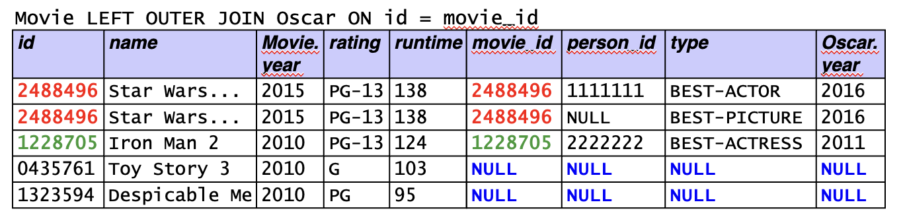{width="85%" fig-align="center"}
:::

::: {.fragment fragment-index=2}
:::: {.columns}
::: {.column width="55%"}
- C is [correct]{style="color:#3a5fcd;"}: COUNT(type) ignores the NULLs, giving 0 for movies with no Oscars.

::: {.fragment fragment-index=3}
- D does *not* work: COUNT(\*) counts the all-NULL rows, giving 1 instead of 0.
:::
:::

::: {.column width="45%"}
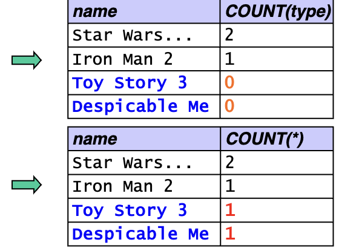{width="85%"}
:::
::::
:::

## Extra Practice

## Practice Writing Queries

```text
Student(id, name)    Department(name, office)    Room(id, name, capacity)
Course(name, start_time, end_time, room_id)      MajorsIn(student_id, dept_name)
Enrolled(student_id, course_name, credit_status)
```

1\) &nbsp;Find the names of all courses taken by data sci majors.

::: {.fragment}
```sql
SELECT DISTINCT course_name
FROM Enrolled E, MajorsIn M
WHERE E.student_id = M.student_id
  AND dept_name = 'data sci';
```
:::

2\) &nbsp;Find the number of students majoring in each department. (The result should be tuples of the form (dept name, # students).)

::: {.fragment}
```sql
SELECT dept_name, COUNT(*)
FROM MajorsIn
GROUP BY dept_name;
```
:::

## Practice Writing Queries (cont.)

```text
Student(id, name)    Department(name, office)    Room(id, name, capacity)
Course(name, start_time, end_time, room_id)      MajorsIn(student_id, dept_name)
Enrolled(student_id, course_name, credit_status)
```

3\) &nbsp;Find the names and ids of all students who have a course in GCB 204.

::: {.fragment}
```sql
SELECT
FROM Student S, Enrolled E, Course C, Room R
WHERE S.id = E.student_id
  AND E.course_name = C.name
  AND C.room_id = R.id
```
:::

::: {.fragment}
```sql
SELECT DISTINCT S.id, S.name
FROM Student S, Enrolled E, Course C, Room R
WHERE S.id = E.student_id
  AND E.course_name = C.name
  AND C.room_id = R.id
  AND R.name = 'GCB 204';
```
:::

## Practice Writing Queries (cont.)

```text
Student(id, name)    Department(name, office)    Room(id, name, capacity)
Course(name, start_time, end_time, room_id)      MajorsIn(student_id, dept_name)
Enrolled(student_id, course_name, credit_status)
```

4\) &nbsp;Find the names of all rooms in which one or more DS courses meet.

::: {.fragment}
```sql
SELECT DISTINCT Room.name
FROM Course, Room
WHERE room_id = id
  AND Course.name LIKE 'DS%';
```
:::

## Practice Writing Queries (cont.)

```text
Student(id, name)    Department(name, office)    Room(id, name, capacity)
Course(name, start_time, end_time, room_id)      MajorsIn(student_id, dept_name)
Enrolled(student_id, course_name, credit_status)
```

5a\) &nbsp;Find the number of DS majors enrolled in DS 310.

::: {.fragment}
```sql
SELECT COUNT(*)
FROM Enrolled E, MajorsIn M
WHERE E.student_id = M.student_id
  AND course_name = 'DS 310'
  AND dept_name = 'data sci';
```
:::

5b\) &nbsp;Find the number of DS majors enrolled in a course.

::: {.fragment}
```sql
SELECT COUNT(DISTINCT E.student_id)
FROM Enrolled E, MajorsIn M
WHERE E.student_id = M.student_id
  AND dept_name = 'data sci';
```
:::

## Practice Writing Queries (cont.)

```text
Student(id, name)    Department(name, office)    Room(id, name, capacity)
Course(name, start_time, end_time, room_id)      MajorsIn(student_id, dept_name)
Enrolled(student_id, course_name, credit_status)
```

6\) &nbsp;Find the number of majors that each student has declared.

::: {.fragment}
```sql
SELECT id, name, COUNT(dept_name)
FROM Student LEFT JOIN MajorsIn
     ON Student.id = MajorsIn.student_id
GROUP BY id, name;
```
:::

::: {.fragment}
- The following will *not* work, because it counts the rows, rather than the number of non-NULL values:

```sql
SELECT id, name, COUNT(*)
FROM Student LEFT JOIN MajorsIn
     ON Student.id = MajorsIn.student_id
GROUP BY id, name;
```
:::

## Practice Writing Queries (cont.)

```text
Student(id, name)    Department(name, office)    Room(id, name, capacity)
Course(name, start_time, end_time, room_id)      MajorsIn(student_id, dept_name)
Enrolled(student_id, course_name, credit_status)
```

7\) &nbsp;For each department with more than one majoring student, output the department's name and the number of majoring students.

::: {.fragment}
```sql
SELECT dept_name, COUNT(*)
FROM MajorsIn
GROUP BY dept_name
HAVING COUNT(*) > 1;
```
:::
