## Database Normalization

- In proposing the relational model, Codd had some very specific advantages in mind.

1. Simple conceptual framework. Everything is a relation, and access is through the precise relational algebra
2. The structure of the database, and the rules of the DBMS, should ensure *data integrity*
    - Logical relationships among data items cannot be violated
3. He proposed certain constraints on how databases should be structured
    - Called *normal forms*
4. These form successively more strict rules
    - There are many &ndash; more than six
    - We will study the first three (most important)

## Not in 1NF

:::: {.columns}
::: {.column width="55%"}
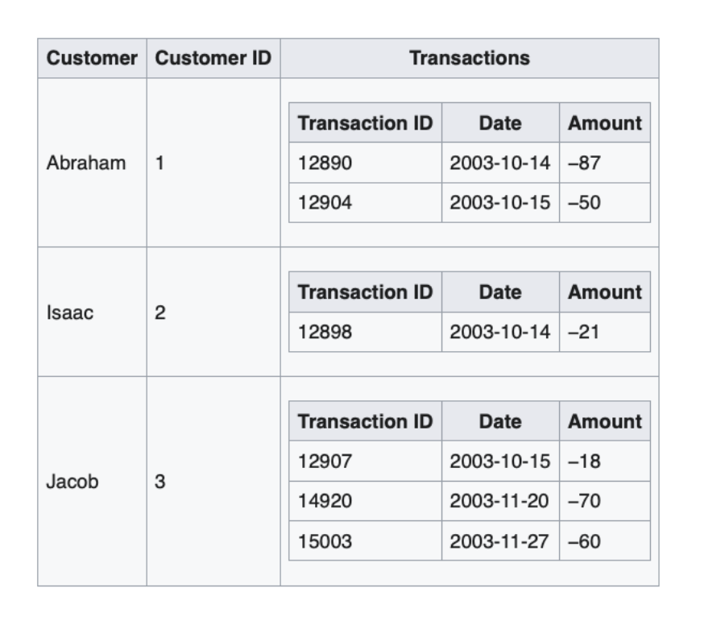{width="95%"}
:::

::: {.column width="45%"}
- Previous DBMSs allowed structures like this
- Tables nested inside tables!
- This is called a *hierarchical database*
- Creates a complex data object that is hard to reason about
- Can't use relational algebra on it
:::
::::

::: {.aside}
Source: wikipedia
:::

## In 1NF

:::: {.columns}
::: {.column width="55%"}
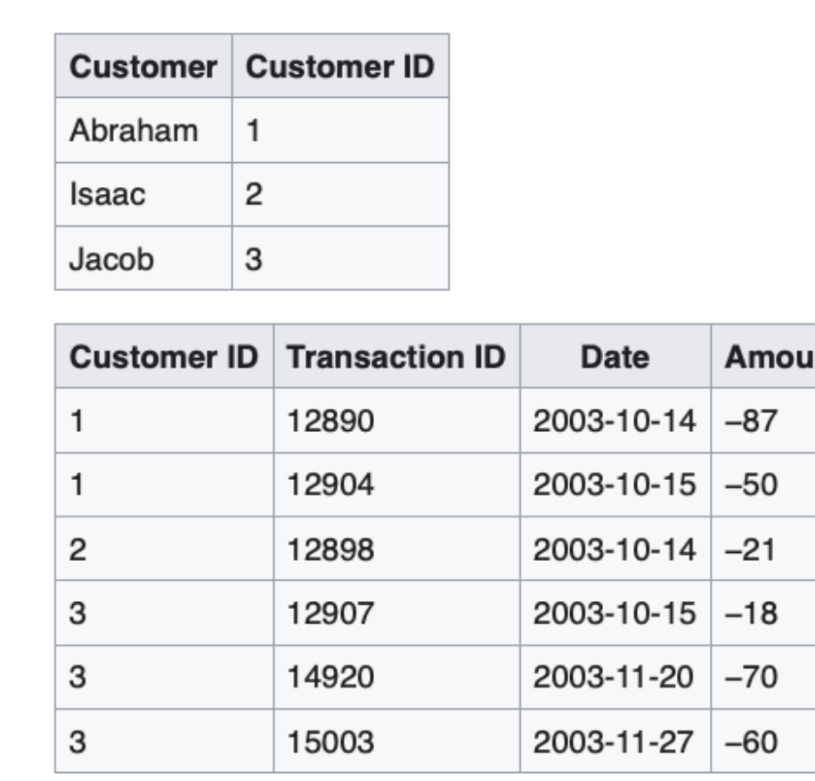{width="95%"}
:::

::: {.column width="45%"}
- The previous structure can be converted into two tables
- Doing so puts the database in *first normal form* (1NF)
:::
::::

::: {.aside}
Source: wikipedia
:::

## 1NF

- First normal form (1NF): everything is a relation
- In other words, no attribute domain has relations as elements
- This is enforced by relational algebra or SQL: it's not possible to create tables that have tables as elements.
- Advantages:
    - simplifies the data language (relational algebra or SQL)
    - supports one-one and many-to-many (wasn't possible in previous systems)
    - makes further normalization levels possible

## 2NF

- The next problem Codd wanted to solve using normalization was 'hidden dependencies'
- Consider this relation:

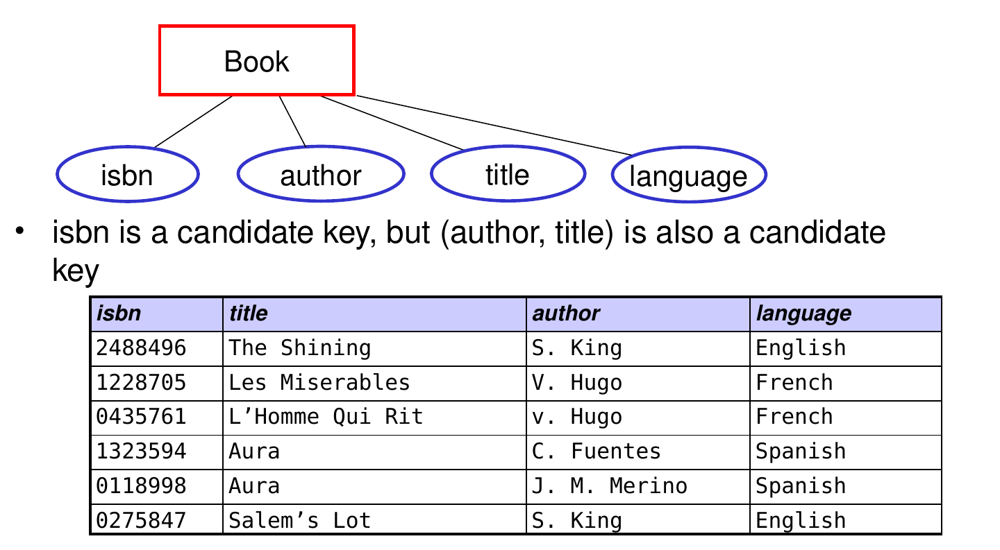{width="72%" fig-align="center"}

## What can go wrong?

*Assume each author only writes in one language*

- What can go wrong when this table is updated?

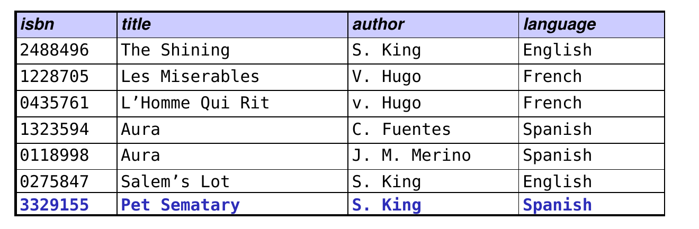{width="72%" fig-align="center"}

::: {.fragment}
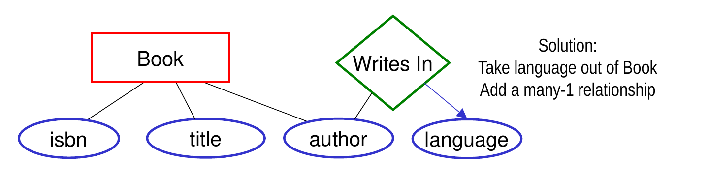{width="76%" fig-align="center"}
:::

## Second Normal Form (2NF)

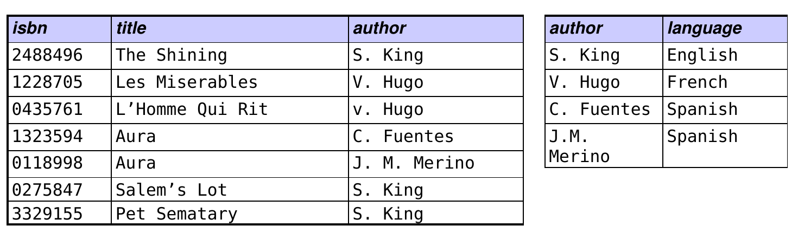{width="90%" fig-align="center"}

- Formally, a database is in 2NF when
    - It is in 1NF, and
    - It does not have any non-prime attribute that is functionally dependent on any proper subset of any candidate key
- A non-prime attribute is an attribute that is not part of any candidate key (language is a non-prime attribute)
- Proper subset: (author) is a proper subset of (title, author)
- language is functionally dependent on author

## 3NF

- The next problem Codd wanted to solve using normalization was 'dependent updates'
- Consider this relation:

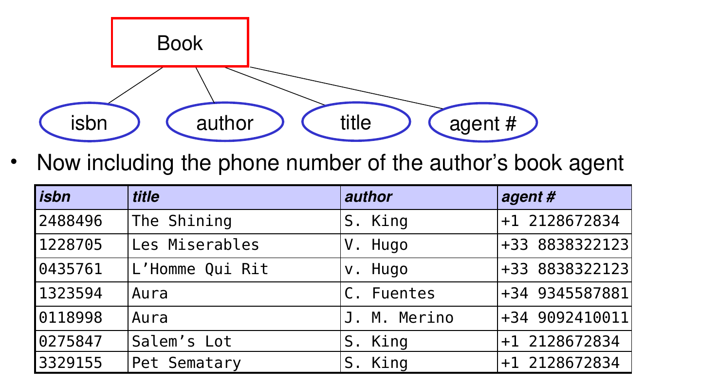{width="72%" fig-align="center"}

## What can go wrong?

- What happens when Stephen King changes book agents?

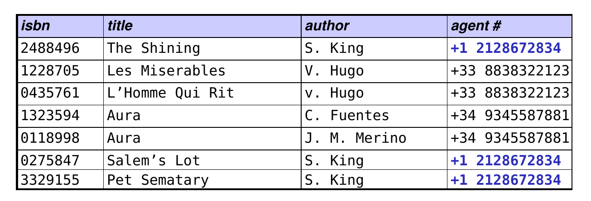{width="72%" fig-align="center"}

::: {.fragment}
- Many updates need to be made, and this is ***error prone***
:::

## 3NF

- The solution is:
- First put the database in 2NF:

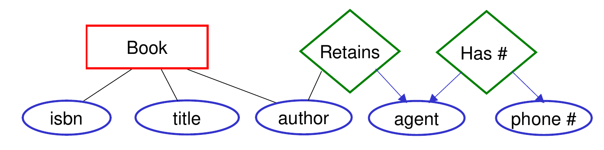{width="80%" fig-align="center"}

- Then capture the functional relationship between agent and phone number in a separate relation
- Now, when King changes agents, we only update a single record in the Retains relation

## 3NF (cont.)

- This could be done as follows:

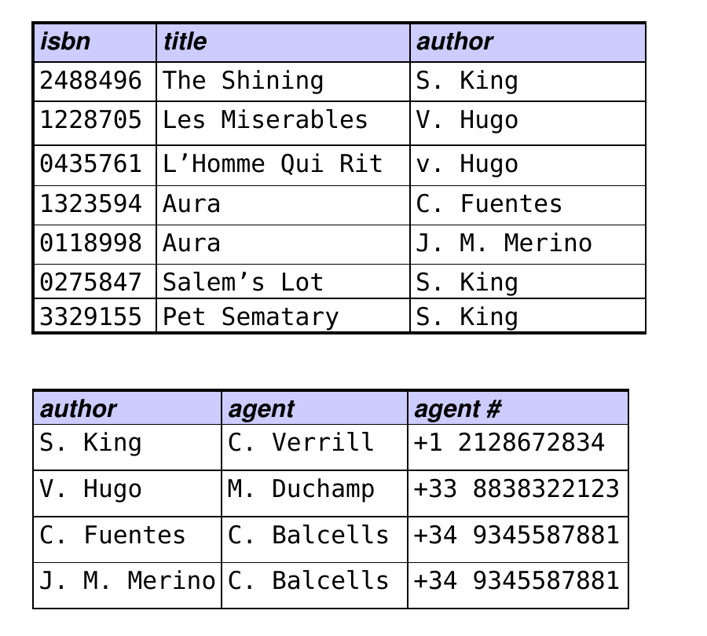{width="46%" fig-align="center"}

## 3NF (cont.)

- Or alternatively:

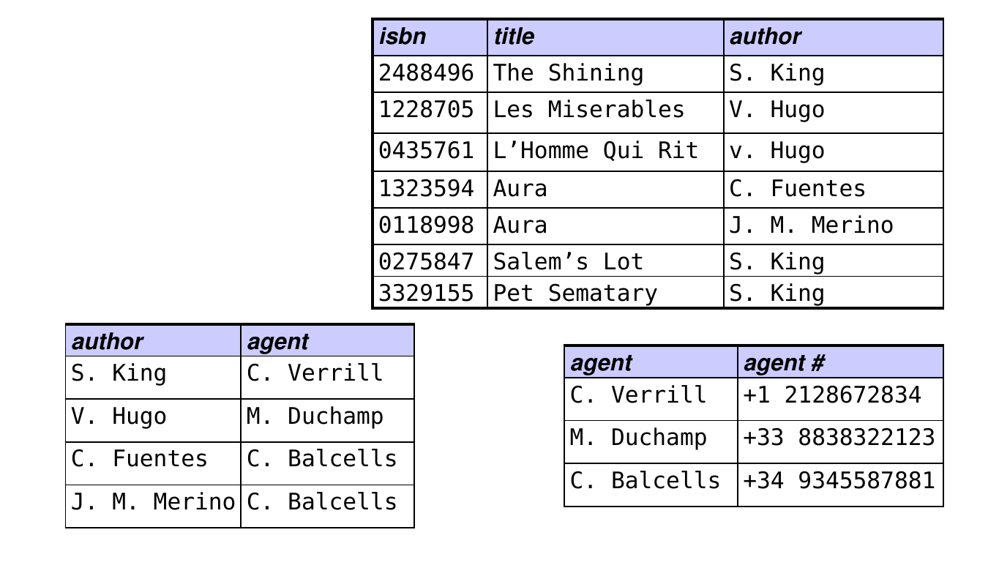{width="62%" fig-align="center"}

::: {.fragment}
- Can you think of reasons for preferring this strategy to the previous slide's strategy?
:::

## 3NF (cont.)

- Formally, a database is in 3NF when:
    - It is in 2NF, and
    - No non-prime attribute is transitively dependent on the primary key
- A non-prime attribute is an attribute that is not part of any primary key

::: {.fragment}
- A transitive dependency is a functional dependency in which X &rarr; Z (X determines Z) indirectly, by virtue of X &rarr; Y, and Y &rarr; Z
- Here: X is author, Y is agent, and Z is agent's phone number
:::

## Benefits of Normal Forms

- 1NF: All relations are flat tables; conceptually simple
- 2NF: A legal database update cannot violate any hidden dependencies
- 3NF: A change to a dependent attribute only needs to be made in one place
- Central Theme: the structure of the database, and the rules of the database management system, enforce *integrity* on the data

## Criticisms of the Relational Model

- Performance can worsen for some operations. If you are retrieving a many-to-one relation, you need to access multiple tables (perhaps three). In a non-relational model, we could store the "many" in the same table as the "one", making it possible to retrieve them all more quickly.

::: {.fragment}
- Databases that store complex data structures do not map well to the relational model. Object-oriented databases, graph databases, and the new vector databases (used with LLMs) do not use the relational model.
:::

::: {.fragment}
- For the above reasons, there are more databases in the world than just relational &hellip; and we will study them
- But relational is far and away the most common structure for databases in practice
:::

## SQL Data Types

- Numeric types include:
    - INTEGER
    - REAL: a real number (i.e., one that may have a fractional part)
- Non-numeric types include:
    - DATE (e.g., '2017-02-23')
    - TIME (e.g., '15:30:30')
    - two types for *strings* (i.e., arbitrary sequences of characters)
        - CHAR
        - VARCHAR

## Creating the Student table&hellip;

:::: {.columns}
::: {.column width="58%"}
```sql
CREATE TABLE Student(
  id CHAR(8) PRIMARY KEY,
  name VARCHAR(30)
);
```
:::

::: {.column width="42%"}
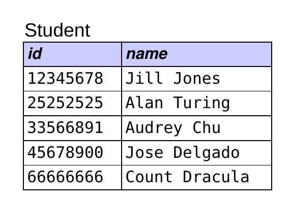{width="85%"}
:::
::::

## Inserting a Row&hellip;

:::: {.columns}
::: {.column width="58%"}
```sql
CREATE TABLE Student(
  id CHAR(8) PRIMARY KEY,
  name VARCHAR(30)
);
```

```sql
INSERT INTO Student
  VALUES ('4567', 'Robert Brown');
```
:::

::: {.column width="42%"}
{width="85%"}
:::
::::

## Given the CREATE TABLE command shown below, what tuple would be added by the INSERT command?

:::: {.columns}
::: {.column width="58%"}
```sql
CREATE TABLE Student(
  id CHAR(8) PRIMARY KEY,
  name VARCHAR(30)
);
```

```sql
INSERT INTO Student
  VALUES ('4567', 'Robert Brown');
```
:::

::: {.column width="42%"}
{width="85%"}
:::
::::

```text
A.  ('4567    ', 'Robert Brown                  ')

B.  ('4567    ', 'Robert Brown')

C.  ('4567', 'Robert Brown                  ')

D.  ('4567', 'Robert Brown')
```

::: {.fragment}
[B is correct &mdash; CHAR(8) pads the id with spaces; VARCHAR(30) does not pad.]{style="color:#3a5fcd; font-weight:bold;"}
:::

## What if we swapped the two values in the INSERT?

:::: {.columns}
::: {.column width="58%"}
```sql
CREATE TABLE Student(
  id CHAR(8) PRIMARY KEY,
  name VARCHAR(30)
);
```

```sql
INSERT INTO Student
  VALUES ('Robert Brown', '4567');
```
:::

::: {.column width="42%"}
{width="85%"}
:::
::::

::: {.fragment}
[`('Robert B', '4567')` &nbsp;would be stored]{style="color:#3a5fcd;"}
:::

## Types in SQLite

- SQLite has its own types, including:
    - INTEGER
    - REAL
    - TEXT
- It also allows you to use the typical SQL types, but it converts them to one of its own types.

::: {.fragment}
- As a result, the length restrictions indicated for CHAR and VARCHAR are not observed.
- It is also more lax in type checking than typical DBMSs.
:::

## Creating the Enrolled table...

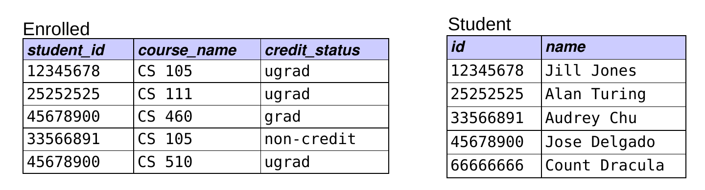{width="80%" fig-align="center"}

::: {.r-stack}
::: {style="width:100%;"}
```sql
CREATE TABLE Enrolled(
  student_id CHAR(8), course_name VARCHAR(10),
  credit_status VARCHAR(10));
 
 
```
:::

::: {.fragment style="width:100%;"}
```sql
CREATE TABLE Enrolled(
  student_id CHAR(8), course_name VARCHAR(10),
  credit_status VARCHAR(10),
  PRIMARY KEY (student_id, course_name));
 
```
:::

::: {.fragment style="width:100%;"}
```sql
CREATE TABLE Enrolled(
  student_id CHAR(8), course_name VARCHAR(10),
  credit_status VARCHAR(10),
  PRIMARY KEY (student_id, course_name),
  FOREIGN KEY (student_id) REFERENCES Student(id));
```
:::
:::

## What about the other foreign key in Enrolled?

{width="70%" fig-align="center"}

```sql
CREATE TABLE Enrolled(
  student_id CHAR(8), course_name VARCHAR(10),
  credit_status VARCHAR(10),
  PRIMARY KEY (student_id, course_name),
  FOREIGN KEY (student_id) REFERENCES Student(id),
  __________________________________________________);
```

:::: {.columns}
::: {.column width="48%"}
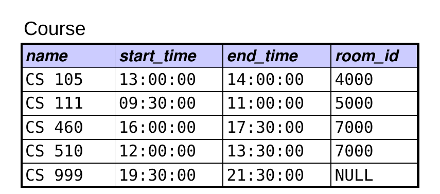{width="80%"}
:::

::: {.column width="52%"}
::: {.fragment}
```sql
FOREIGN KEY (course_name)
    REFERENCES Course(name));
```
:::
:::
::::

## Does the order of these insertions matter?

{width="70%" fig-align="center"}

&#9312; &nbsp;`INSERT INTO Enrolled VALUES('4567', 'CS 105', 'grad');`

&#9313; &nbsp;`INSERT INTO Student VALUES ('4567', 'Robert Brown');`

A\. &nbsp;&#9312; must come before &#9313;

B\. &nbsp;&#9313; must come before &#9312; [&larr; correct &nbsp;why?]{.fragment fragment-index=1 style="color:#3a5fcd; font-weight:bold;"} [referential integrity!]{.fragment fragment-index=2 style="color:#3a5fcd; font-weight:bold;"}

C\. &nbsp;the order of the two INSERT commands doesn't matter

## How could I correctly remove MCS&nbsp; 205?

::: {.r-stack}
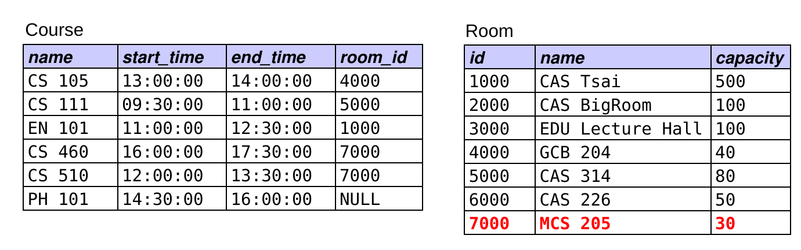{width="85%"}

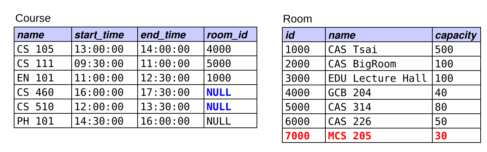{.fragment fragment-index=2 width="85%"}

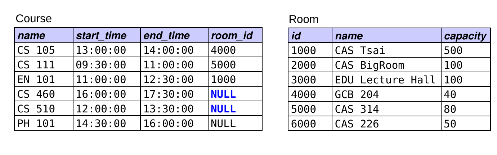{.fragment fragment-index=3 width="85%"}
:::

A\. &nbsp;`DELETE FROM Room WHERE id = '7000';`

B\. &nbsp;`DELETE FROM Room WHERE id = '7000';`<br>&nbsp;&nbsp;&nbsp;&nbsp;`UPDATE Course SET room_id = NULL WHERE room_id = '7000';`

C\. &nbsp;`UPDATE Course SET room_id = NULL WHERE room_id = '7000';`<br>&nbsp;&nbsp;&nbsp;&nbsp;`DELETE FROM Room WHERE id = '7000';` [&larr; correct]{.fragment fragment-index=1 style="color:#3a5fcd; font-weight:bold;"}

D\. &nbsp;two or more of the above would work

## Recall: Subqueries and Set Membership

- Subqueries can be used to test for *set membership* in conjunction with the IN and NOT IN operators.
    - example: find all students who are *not* enrolled in CS 105

```sql
SELECT name
FROM Student
WHERE id NOT IN (SELECT student_id
                 FROM Enrolled
                 WHERE course_name = 'CS 105');
```

::: {.r-stack}
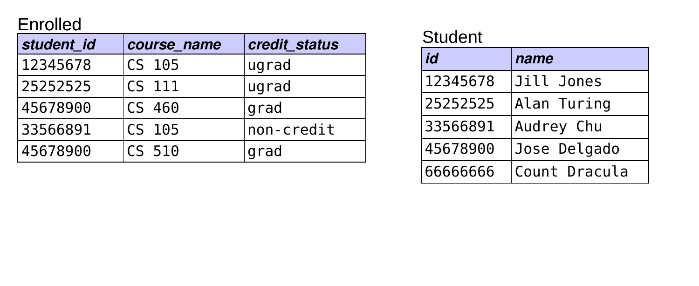{width="70%"}

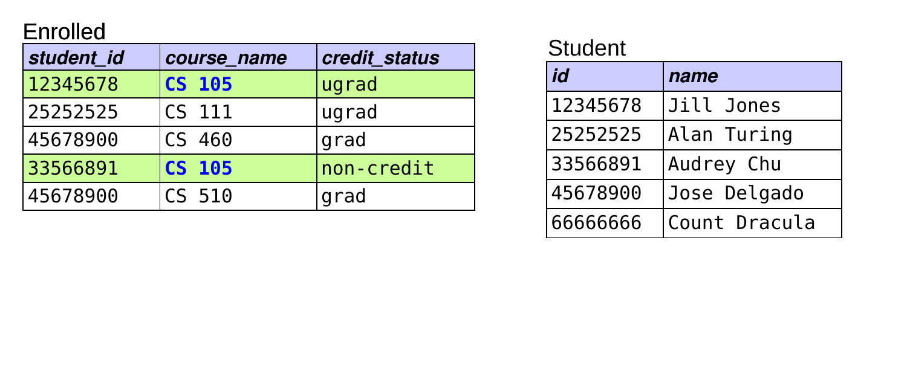{.fragment width="70%"}

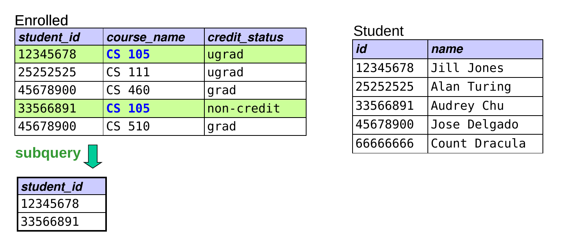{.fragment width="70%"}

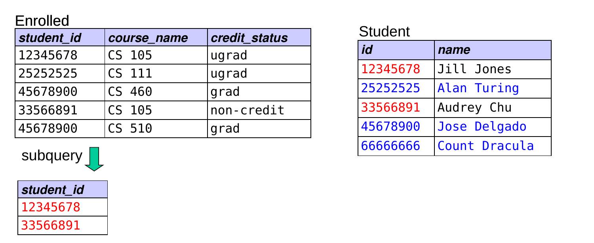{.fragment width="70%"}

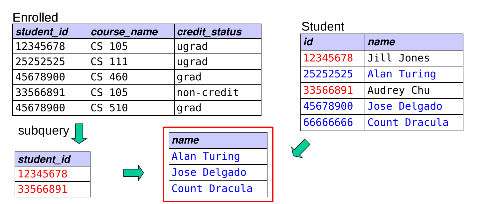{.fragment width="70%"}
:::

## Writing Queries: Rules of Thumb

- Start with the FROM clause. Which table(s) do you need?

::: {.fragment}
- If you need more than one table, determine the necessary join conditions.
    - for N tables, you typically need N &ndash; 1 join conditions
    - is an outer join needed? &ndash; i.e., do you want unmatched tuples?
:::

::: {.fragment}
- Determine if a GROUP BY clause is needed.
    - are you performing computations involving subgroups?
:::

::: {.fragment}
- Determine any other conditions that are needed.
    - if they rely on aggregate functions, put in a HAVING clause
    - otherwise, add to the WHERE clause
    - is a subquery needed?
:::

::: {.fragment}
- Fill in the rest of the query: SELECT, ORDER BY?
    - is DISTINCT needed?
:::

## Extra Practice Writing Queries

```text
Person(id, name, dob, pob)
Movie(id, name, year, rating, runtime, genre, earnings_rank)
Actor(actor_id, movie_id)      Director(director_id, movie_id)
Oscar(movie_id, person_id, type, year)
```

1\) &nbsp;Find the names of people in the database who acted in *Avatar*.

::: {.r-stack}
::: {style="width:100%;"}
```sql
SELECT
FROM ???
WHERE
 
 
 
```
:::

::: {.fragment style="width:100%;"}
```sql
SELECT
FROM Person P, Actor A, Movie M
WHERE ???
 
 
 
```
:::

::: {.fragment style="width:100%;"}
```sql
SELECT
FROM Person P, Actor A, Movie M
WHERE P.id = A.actor_id
  AND M.id = A.movie_id
 
 
```
:::

::: {.fragment style="width:100%;"}
```sql
SELECT
FROM Person P, Actor A, Movie M
WHERE P.id = A.actor_id
  AND M.id = A.movie_id
  AND M.name = 'Avatar';
 
```
:::

::: {.fragment style="width:100%;"}
```sql
SELECT P.name
FROM Person P, Actor A, Movie M
WHERE P.id = A.actor_id
  AND M.id = A.movie_id
  AND M.name = 'Avatar';
 
```
:::
:::

## Extra Practice Writing Queries (cont.)

```text
Person(id, name, dob, pob)
Movie(id, name, year, rating, runtime, genre, earnings_rank)
Actor(actor_id, movie_id)      Director(director_id, movie_id)
Oscar(movie_id, person_id, type, year)
```

2\) &nbsp;How many people in the database did *not* act in *Avatar*? Will this work?

```sql
SELECT COUNT(*)
FROM Person P, Actor A, Movie M
WHERE P.id = A.actor_id AND M.id = A.movie_id
  AND M.name != 'Avatar';
```

::: {.fragment}
- If not, what will?

```sql
SELECT COUNT(*)
FROM Person
WHERE id NOT IN (SELECT actor_id
                 FROM Actor A, Movie M
                 WHERE A.movie_id = M.id
                   AND M.name = 'Avatar');
```
:::

## Extra Practice Writing Queries (cont.)

```text
Person(id, name, dob, pob)
Movie(id, name, year, rating, runtime, genre, earnings_rank)
Actor(actor_id, movie_id)      Director(director_id, movie_id)
Oscar(movie_id, person_id, type, year)
```

3\) &nbsp;How many people in the database who were born in California have won an Oscar? (assume pob = city, state, country)

::: {.r-stack}
::: {style="width:100%;"}
```sql
SELECT
FROM
WHERE
 
```
:::

::: {.fragment style="width:100%;"}
```sql
SELECT
FROM Person P, Oscar O
WHERE
 
```
:::

::: {.fragment style="width:100%;"}
```sql
SELECT
FROM Person P, Oscar O
WHERE P.id = O.person_id
 
```
:::

::: {.fragment style="width:100%;"}
```sql
SELECT
FROM Person P, Oscar O
WHERE P.id = O.person_id
  AND P.pob LIKE '%California, USA';
```
:::

::: {.fragment style="width:100%;"}
```sql
SELECT COUNT(DISTINCT P.id)
FROM Person P, Oscar O
WHERE P.id = O.person_id
  AND P.pob LIKE '%California, USA';
```
:::
:::

## Extra Practice Writing Queries (cont.)

```text
Person(id, name, dob, pob)
Movie(id, name, year, rating, runtime, genre, earnings_rank)
Actor(actor_id, movie_id)      Director(director_id, movie_id)
Oscar(movie_id, person_id, type, year)
```

4\) &nbsp;Find the ids and names of everyone in the database who has acted in a movie directed by James Cameron. (*Hint:* One table is needed twice!)

::: {.r-stack}
::: {style="width:100%;"}
```sql
SELECT
FROM
WHERE
 
 
```
:::

::: {.fragment style="width:100%;"}
```sql
SELECT
FROM Person ActP, Actor A, Director D, Person DirP
WHERE
 
 
```
:::

::: {.fragment style="width:100%;"}
```sql
SELECT
FROM Person ActP, Actor A, Director D, Person DirP
WHERE ActP.id = A.actor_id AND A.movie_id = D.movie_id
  AND D.director_id = DirP.id
 
```
:::

::: {.fragment style="width:100%;"}
```sql
SELECT
FROM Person ActP, Actor A, Director D, Person DirP
WHERE ActP.id = A.actor_id AND A.movie_id = D.movie_id
  AND D.director_id = DirP.id
  AND DirP.name = 'James Cameron';
```
:::

::: {.fragment style="width:100%;"}
```sql
SELECT DISTINCT ActP.id, ActP.name
FROM Person ActP, Actor A, Director D, Person DirP
WHERE ActP.id = A.actor_id AND A.movie_id = D.movie_id
  AND D.director_id = DirP.id
  AND DirP.name = 'James Cameron';
```
:::
:::

## Extra Practice Writing Queries (cont.)

```text
Person(id, name, dob, pob)
Movie(id, name, year, rating, runtime, genre, earnings_rank)
Actor(actor_id, movie_id)      Director(director_id, movie_id)
Oscar(movie_id, person_id, type, year)
```

5\) &nbsp;Which movie ratings have an avg runtime greater than 120 min, and what are their average runtimes?

::: {.r-stack}
::: {style="width:100%;"}
```sql
SELECT
FROM Movie
 
 
```
:::

::: {.fragment style="width:100%;"}
```sql
SELECT
FROM Movie
GROUP BY rating
 
```
:::

::: {.fragment style="width:100%;"}
```sql
SELECT
FROM Movie
GROUP BY rating
HAVING AVG(runtime) > 120;
```
:::

::: {.fragment style="width:100%;"}
```sql
SELECT rating, AVG(runtime)
FROM Movie
GROUP BY rating
HAVING AVG(runtime) > 120;
```
:::
:::

## Extra Practice Writing Queries (cont.)

```text
Person(id, name, dob, pob)
Movie(id, name, year, rating, runtime, genre, earnings_rank)
Actor(actor_id, movie_id)      Director(director_id, movie_id)
Oscar(movie_id, person_id, type, year)
```

6\) &nbsp;For each person in the database born in Boston, Mass, find the number of movies in the database (possibly 0) in which the person has acted. You may assume that names are unique.

::: {.r-stack}
::: {style="width:100%;"}
```sql
SELECT
FROM
WHERE
 
```
:::

::: {.fragment style="width:100%;"}
```sql
SELECT
FROM Person LEFT OUTER JOIN Actor ON id = actor_id
WHERE
 
```
:::

::: {.fragment style="width:100%;"}
```sql
SELECT
FROM Person LEFT OUTER JOIN Actor ON id = actor_id
WHERE
GROUP BY name
```
:::

::: {.fragment style="width:100%;"}
```sql
SELECT
FROM Person LEFT OUTER JOIN Actor ON id = actor_id
WHERE pob LIKE 'Boston, Mass%'
GROUP BY name;
```
:::

::: {.fragment style="width:100%;"}
```sql
SELECT name, COUNT(____________)
FROM Person LEFT OUTER JOIN Actor ON id = actor_id
WHERE pob LIKE 'Boston, Mass%'
GROUP BY name;
```
:::

::: {.fragment style="width:100%;"}
```sql
SELECT name, COUNT(movie_id)
FROM Person LEFT OUTER JOIN Actor ON id = actor_id
WHERE pob LIKE 'Boston, Mass%'
GROUP BY name;
```
:::
:::

## Practice Writing Queries

```text
Student(id, name)      Department(name, office)      Room(id, name, capacity)
Course(name, start_time, end_time, room_id)     MajorsIn(student_id, dept_name)
Enrolled(student_id, course_name, credit_status)
```

1\) &nbsp;Find the names of all courses taken by comp sci majors.

::: {.fragment}
```sql
SELECT DISTINCT course_name
FROM Enrolled E, MajorsIn M
WHERE E.student_id = M.student_id
  AND dept_name = 'comp sci';
```
:::

2\) &nbsp;Find the number of students majoring in each department. (The result should be tuples of the form (dept name, # students).)

::: {.fragment}
```sql
SELECT dept_name, COUNT(*)
FROM MajorsIn
GROUP BY dept_name;
```
:::

## Practice Writing Queries (cont.)

```text
Student(id, name)      Department(name, office)      Room(id, name, capacity)
Course(name, start_time, end_time, room_id)     MajorsIn(student_id, dept_name)
Enrolled(student_id, course_name, credit_status)
```

3\) &nbsp;Find the names and ids of all students who have a course in GCB 204.

::: {.fragment}
```sql
SELECT DISTINCT S.id, S.name
FROM Student S, Enrolled E, Course C, Room R
WHERE S.id = E.student_id
  AND E.course_name = C.name
  AND C.room_id = R.id
  AND R.name = 'GCB 204';
```
:::

4\) &nbsp;Find the names of all rooms in which one or more CS courses meet.

::: {.fragment}
```sql
SELECT DISTINCT Room.name
FROM Course, Room
WHERE room_id = id
  AND Course.name LIKE 'CS%';
```
:::

## Practice Writing Queries (cont.)

```text
Student(id, name)      Department(name, office)      Room(id, name, capacity)
Course(name, start_time, end_time, room_id)     MajorsIn(student_id, dept_name)
Enrolled(student_id, course_name, credit_status)
```

5a\) &nbsp;Find the number of CS majors enrolled in CS 105.

::: {.fragment}
```sql
SELECT COUNT(*)
FROM Enrolled E, MajorsIn M
WHERE E.student_id = M.student_id
  AND course_name = 'CS 105'
  AND dept_name = 'comp sci';
```
:::

5b\) &nbsp;Find the number of CS majors enrolled in a course.

::: {.fragment}
```sql
SELECT COUNT(DISTINCT E.student_id)
FROM Enrolled E, MajorsIn M
WHERE E.student_id = M.student_id
  AND dept_name = 'comp sci';
```
:::

## Practice Writing Queries (cont.)

```text
Student(id, name)      Department(name, office)      Room(id, name, capacity)
Course(name, start_time, end_time, room_id)     MajorsIn(student_id, dept_name)
Enrolled(student_id, course_name, credit_status)
```

6\) &nbsp;Find the number of majors that each student has declared.

::: {.r-stack}
::: {style="width:100%;"}
```sql
SELECT
FROM
 
 
```
:::

::: {.fragment style="width:100%;"}
```sql
SELECT
FROM Student LEFT JOIN MajorsIn
     ON Student.id = MajorsIn.student_id
 
```
:::

::: {.fragment style="width:100%;"}
```sql
SELECT
FROM Student LEFT JOIN MajorsIn
     ON Student.id = MajorsIn.student_id
GROUP BY id, name;
```
:::

::: {.fragment style="width:100%;"}
```sql
SELECT id, name, COUNT(dept_name)
FROM Student LEFT JOIN MajorsIn
     ON Student.id = MajorsIn.student_id
GROUP BY id, name;
```
:::
:::

::: {.fragment}
- The following will *not* work, because it counts the rows, rather than the number of non-NULL values:

```sql
SELECT id, name, COUNT(*)
FROM Student LEFT JOIN MajorsIn
     ON Student.id = MajorsIn.student_id
GROUP BY id, name;
```
:::

## Practice Writing Queries (cont.)

```text
Student(id, name)      Department(name, office)      Room(id, name, capacity)
Course(name, start_time, end_time, room_id)     MajorsIn(student_id, dept_name)
Enrolled(student_id, course_name, credit_status)
```

7\) &nbsp;For each department with more than one majoring student, output the department's name and the number of majoring students.

::: {.r-stack}
::: {style="width:100%;"}
```sql
SELECT
FROM MajorsIn
 
 
```
:::

::: {.fragment style="width:100%;"}
```sql
SELECT
FROM MajorsIn
GROUP BY dept_name
 
```
:::

::: {.fragment style="width:100%;"}
```sql
SELECT
FROM MajorsIn
GROUP BY dept_name
HAVING COUNT(*) > 1;
```
:::

::: {.fragment style="width:100%;"}
```sql
SELECT dept_name, COUNT(*)
FROM MajorsIn
GROUP BY dept_name
HAVING COUNT(*) > 1;
```
:::
:::

## Which of these problems would require a GROUP BY?

```text
Person(id, name, dob, pob)
Movie(id, name, year, rating, runtime, genre, earnings_rank)
Actor(actor_id, movie_id)      Director(director_id, movie_id)
Oscar(movie_id, person_id, type, year)
```

A\. &nbsp;finding the Best-Picture winner with the best/smallest earnings rank

B\. &nbsp;finding the number of Oscars won by each person that has won an Oscar

C\. &nbsp;finding the number of Oscars won by each person, including people who have not won any Oscars

D\. &nbsp;both B and C, but not A [&larr; correct: B and C need computations for multiple subgroups]{.fragment fragment-index=1 style="color:#3a5fcd; font-weight:bold;"}

E\. &nbsp;A, B, and C

::: {.fragment fragment-index=2}
Which would require a subquery? &nbsp;[A]{style="color:#3a5fcd; font-weight:bold;"}
:::

::: {.fragment fragment-index=3}
Which would require a LEFT OUTER JOIN? &nbsp;[C]{style="color:#1a7a1a; font-weight:bold;"}
:::

## Now Write the Queries!

```text
Person(id, name, dob, pob)
Movie(id, name, year, rating, runtime, genre, earnings_rank)
Actor(actor_id, movie_id)      Director(director_id, movie_id)
Oscar(movie_id, person_id, type, year)
```

1\) &nbsp;Find the Best-Picture winner with the best/smallest earnings rank. The result should have the form (name, earnings_rank). Assume no two movies have the same earnings rank.

::: {.r-stack}
::: {style="width:100%;"}
```sql
SELECT
FROM
WHERE                 (SELECT
                       FROM
                       WHERE                  );
 
```
:::

::: {.fragment style="width:100%;"}
```sql
SELECT
FROM
WHERE                 (SELECT
                       FROM
                       WHERE M.id = O.movie_id);
 
```
:::

::: {.fragment style="width:100%;"}
```sql
SELECT
FROM
WHERE                 (SELECT
                       FROM Movie M, Oscar O
                       WHERE M.id = O.movie_id);
 
```
:::

::: {.fragment style="width:100%;"}
```sql
SELECT
FROM
WHERE                 (SELECT
                       FROM Movie M, Oscar O
                       WHERE M.id = O.movie_id
                         AND O.type = 'BEST-PICTURE');
```
:::

::: {.fragment style="width:100%;"}
```sql
SELECT
FROM
WHERE                 (SELECT MIN(earnings_rank)
                       FROM Movie M, Oscar O
                       WHERE M.id = O.movie_id
                         AND O.type = 'BEST-PICTURE');
```
:::

::: {.fragment style="width:100%;"}
```sql
SELECT
FROM Movie
WHERE earnings_rank = (SELECT MIN(earnings_rank)
                       FROM Movie M, Oscar O
                       WHERE M.id = O.movie_id
                         AND O.type = 'BEST-PICTURE');
```
:::

::: {.fragment style="width:100%;"}
```sql
SELECT name, earnings_rank
FROM Movie
WHERE earnings_rank = (SELECT MIN(earnings_rank)
                       FROM Movie M, Oscar O
                       WHERE M.id = O.movie_id
                         AND O.type = 'BEST-PICTURE');
```
:::
:::

*Hold off on 2 and 3 for now!*
