## Trouble with DB Browser installation?

- Go to John's Office Hour on Friday: 2:00&ndash;4:00PM on the 14th floor of CDS

## Storage

:::: {.columns}
::: {.column width="55%"}
- Today we'll start to discuss aspects of how data is physically stored.
- We'll use as our model for storage the hard disk.
- A hard disk is *persistent* storage, which means that the data is preserved when the power is turned off.
- The disk surface consists of many small magnetic domains that can be oriented either "up" or "down" to represent a single bit.
- The head moves across the spinning platter and reads and writes the magnetic domains.
:::

::: {.column width="45%"}
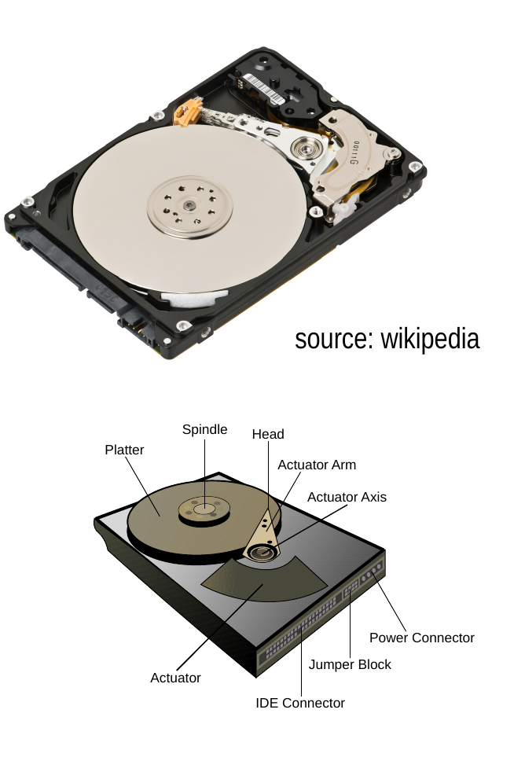{width="100%"}
:::
::::

## Organization of a Disk

:::: {.columns}
::: {.column width="38%"}
- The surfaces of the platters are divided into tracks and blocks.
- A track is a complete ring at a given radial distance, on a single platter.
- The track is divided into blocks, which are the smallest unit that can be read or written.
- Typically tracks are 4K or 8K blocks.
:::

::: {.column width="62%"}
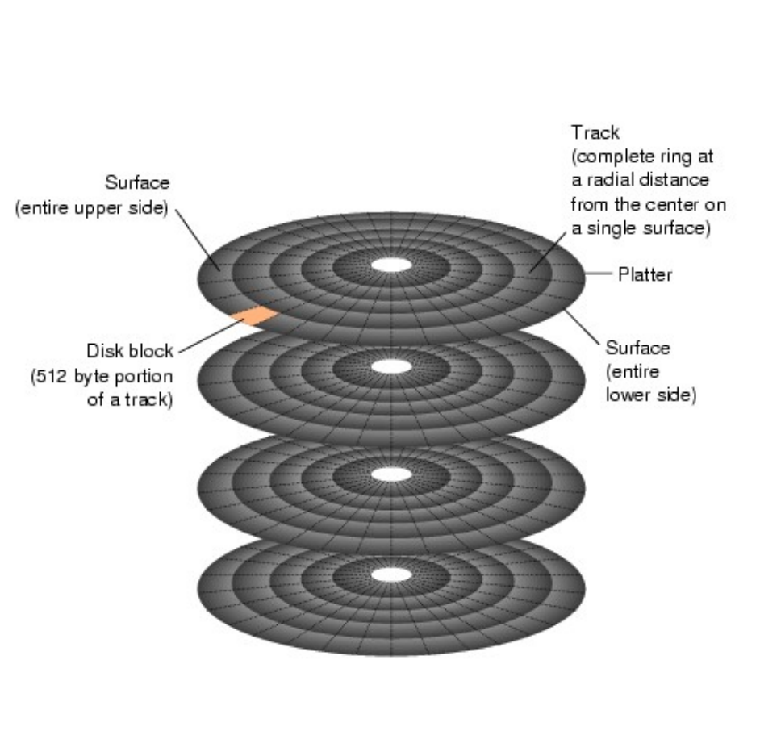{width="100%"}
:::
::::

## Using a Hard Disk

- A disk drive responds only to very simple commands
- For example:
    - "read block 17"
    - "write these bytes: &lt;xxxxxxxxx&gt; to block 23"
    - "read blocks 35 through 43"
- A disk drive does not know anything about
    - Files
    - Tables or Relations
    - Records

## Logical to Physical

- The database creates a logical view of the data, which we call the *logical layer* (eg: tables, records, fields)
- The disk provides low-level access to the data, which we call the *physical layer* (eg: disk blocks)
- In order to store something like a database table on a disk drive, we need a *logical to physical* mapping
    - For example, how are tables "laid out" on a disk?
    - How are the table's data objects arranged when written to disk blocks?
- Note that a file system solves a similar problem
    - File system logical layer = files
    - Similar problem: how to lay out files on a disk&hellip;

## Accessing the Disk

- Data is arranged on disk in units called *blocks*.
    - typically fairly large (e.g., 4K or 8K)

::: {.fragment}
- Relatively speaking, disk I/O is very expensive.
    - in the time it takes to read a single disk block, the processor could be executing millions of instructions!
:::

::: {.fragment}
- The DBMS tries to minimize the number of disk accesses.
:::

## Review: DBMS Architecture

:::: {.columns}
::: {.column width="60%"}
- A DBMS can be viewed as a composition of two layers.
- At the bottom is the *storage layer* or *storage engine*, which takes care of storing and retrieving the data.

::: {.fragment fragment-index=1}
- Above that is the *logical layer*, which provides an abstract representation of the data.
:::
:::

::: {.column width="40%"}
::: {.r-stack}
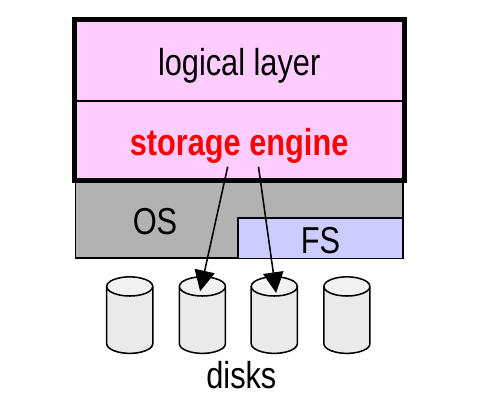{width="80%"}

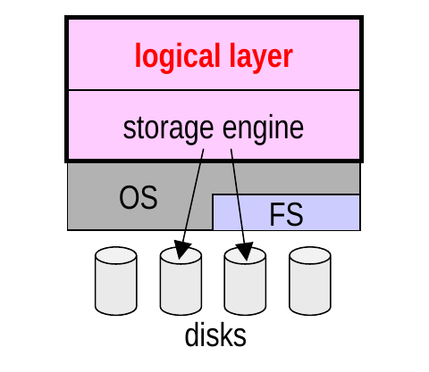{.fragment fragment-index=1 width="80%"}
:::
:::
::::

## Logical-to-Physical Mapping

:::: {.columns}
::: {.column width="62%"}
- The logical layer implements a mapping between:
    - the *logical schema* of a database
    - its *physical representation*

::: {.fragment}
- In the relational model, the schema includes:
    - attributes/columns, including their types
    - tuples/rows
    - relations/tables
:::

::: {.fragment}
- To be model-neutral, we'll use these terms instead:
    - *field* for an individual data value
    - *record* for a group of fields
    - *collection* for a group of records
:::
:::

::: {.column width="38%"}
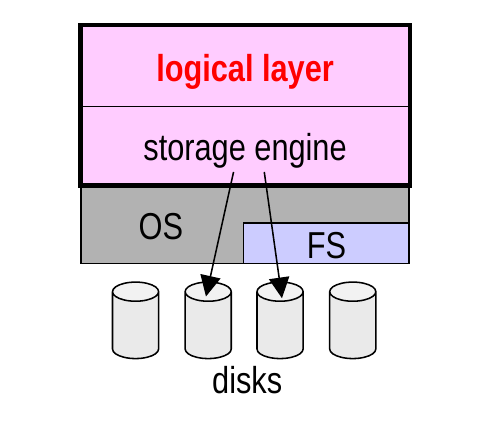{width="85%"}
:::
::::

## Logical-to-Physical Mapping (cont.)

:::: {.columns}
::: {.column width="60%"}
- A DBMS may use the filesystem, or it may bypass it and use its own disk manager.

::: {.fragment}
- In either case, a DBMS may use units called *pages* that have a different size than the block size.
    - can be helpful in performance tuning
:::
:::

::: {.column width="40%"}
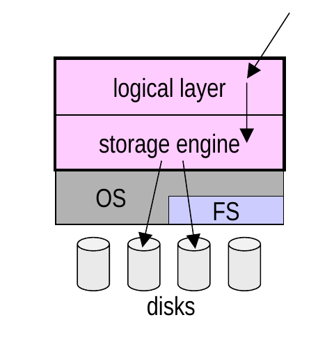{width="90%"}
:::
::::

## Logical-to-Physical Mapping (cont.)

- We'll consider:
    - how to map logical records to their physical representation
    - how to organize the records in a given collection
        - including the use of index structures

::: {.fragment}
- Different approaches require different amounts of *metadata* &ndash; data about the data.
    - example: the types and lengths of the fields
:::

::: {.fragment .sub}
- *per-record* metadata &ndash; stored within each record
:::

::: {.fragment .sub}
- *per-collection* metadata &ndash; stored once for the entire collection
:::

::: {.fragment}
- Assumptions about data in the rest of this set of slides:
    - each character is stored using 1 byte
    - Integer data values are stored using 4 bytes &ndash; upto 4 billion
    - Integer metadata (e.g., offsets) are stored using 2 bytes &ndash; upto 65k
:::

## Fixed- or Variable-Length Records?

- This choice depends on:
    - the types of fields that the records contain
    - the number of fields per record, and whether it can vary

::: {.fragment}
- Simple case: use fixed-length records when
    - all fields are fixed-length (e.g., CHAR or INTEGER)
    - there is a fixed number of fields per record
:::

## Fixed- or Variable-Length Records? (cont.)

- The choice is less straightforward when you have either:
    - variable-length fields (e.g., VARCHAR)
    - a variable number of fields per record (e.g., in XML)

[Two options:]{.underline}

:::: {.columns}
::: {.column width="62%"}
1. *fixed-length records*: always allocate the maximum possible length
:::

::: {.column width="38%"}
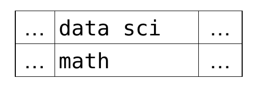{width="95%"}
:::
::::

::: {.fragment .sub style="margin-left: 2em"}
- plusses and minuses:
    - \+ less metadata is needed, because:
        - every record has the same length
        - a given field is in a consistent position within all records
:::

::: {.fragment .sub style="margin-left: 3em"}
- \+ changing a field's value doesn't change the record's length
    - thus, changes never necessitate moving the record
:::

::: {.fragment .sub style="margin-left: 3em"}
- &ndash; we waste space when a record has fields shorter than their max length, or is missing fields
:::

## Fixed- or Variable-Length Records? (cont.)

:::: {.columns}
::: {.column width="62%"}
2. *variable-length records*: only allocate the space that each record actually needs
:::

::: {.column width="38%"}
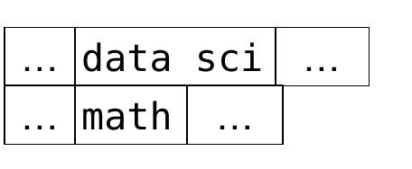{width="95%"}
:::
::::

::: {.fragment .sub style="margin-left: 2em"}
- plusses and minuses:
    - &ndash; more metadata is needed in order to:
        - determine the boundaries between records
        - determine the locations of the fields in a given record
:::

::: {.fragment .sub style="margin-left: 3em"}
- &ndash; changing a field's value can change the record's length
    - thus, we may need to move the record
:::

::: {.fragment .sub style="margin-left: 3em"}
- \+ we *don't* waste space when a record has fields shorter than their max length, or is missing fields
:::

## Format of Fixed-Length Records

- With fixed-length records, we store the fields one after the other.

::: {.fragment fragment-index=1}
- If a fixed-length record contains a variable-length field:
    - allocate the max. length of the field
:::

::: {.fragment .sub fragment-index=2}
- use a delimiter ([#]{style="color:#c00;"} below) if the value is shorter than the max.
:::

- Example: `Dept(id CHAR(7), name VARCHAR(20), num_majors INT)`

::: {.r-stack}
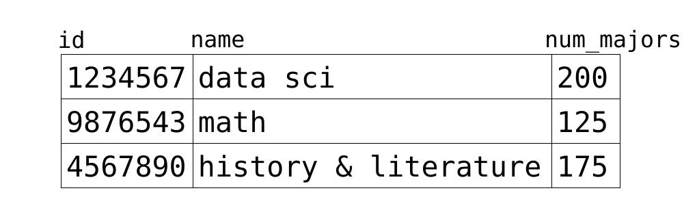{width="78%"}

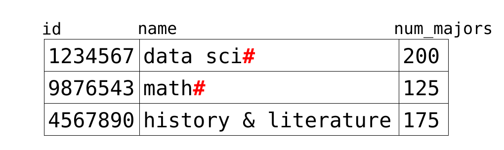{.fragment fragment-index=2 width="78%"}
:::

::: {.fragment .sub fragment-index=3}
- why doesn't `'history & literature'` need a delimiter? [its length is the max. length for its field]{.fragment fragment-index=4 style="color:#3a5fcd;"}
:::

## Format of Fixed-Length Records (cont.)

- To find the position of a field, use *per-collection* metadata.

::: {.fragment .sub fragment-index=1}
- typically store the *offset* of each field (*O~1~* and *O~2~* below) &ndash; how many bytes the field is from the start of the record
:::

::: {.r-stack}
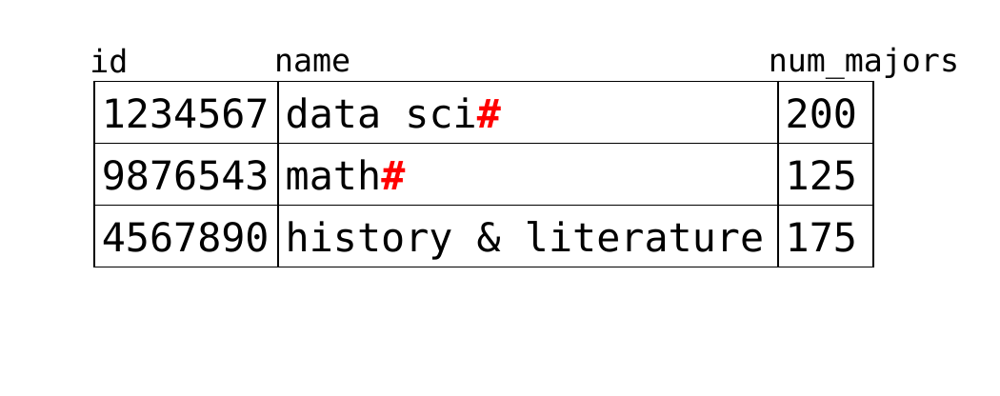{width="72%"}

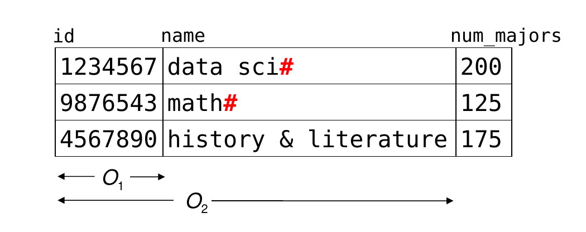{.fragment fragment-index=1 width="72%"}
:::

::: {.fragment fragment-index=2}
- Notes:
    - the delimiters are the only *per-record* metadata
:::

::: {.fragment .sub fragment-index=3}
- the records are indeed fixed-length [&ndash; 31 bytes each!]{.fragment fragment-index=7}
    - [7 bytes for `id`, which is a `CHAR(7)`]{.fragment fragment-index=4}
    - [20 bytes for `name`, which is a `VARCHAR(20)`]{.fragment fragment-index=5}
    - [4 bytes for `num_majors`, which is an `INT`]{.fragment fragment-index=6}
:::

::: {.fragment fragment-index=7 style="text-align: right; color:#3a5fcd;"}
7 + 20 + 4 = 31
:::

## Format of Variable-Length Records

- With variable-length records, we need *per-record* metadata to determine the locations of the fields.
- For simplicity, we'll assume all records in a given collection have the same # of fields.

::: {.fragment fragment-index=1}
- We'll look at how the following record would be stored:

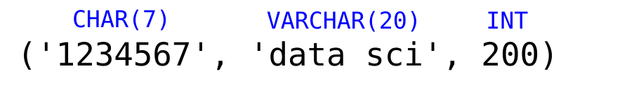{width="52%"}
:::

::: {.fragment fragment-index=2}
- We'll consider two types of operations:
:::

::: {.fragment .sub fragment-index=2}
1. finding/extracting the value of a single field

```sql
SELECT num_majors
FROM Dept
WHERE name = 'data sci';
```
:::

::: {.fragment .sub fragment-index=3}
2. updating the value of a single field
    - its length may become smaller or larger
:::

## Format of Variable-Length Records (cont.)

- Option 1: Terminate field values with a special *delimiter* character.

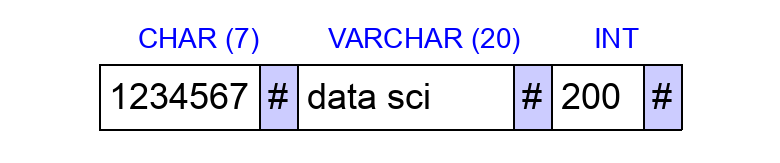{width="52%" fig-align="center"}

1. [finding/extracting the value of a single field]{.underline}\
this is very inefficient[; need to scan byte-by-byte to:]{.fragment fragment-index=1}

::: {.fragment .sub fragment-index=1}
- find the start of the field we're looking for
:::

::: {.fragment .sub fragment-index=2}
- determine the length of its value (if it is variable-length)
:::

::: {.fragment fragment-index=3}
2. [updating the value of a single field]{.underline}\
if it changes in size, we need to shift the values after it, but we don't need to change their metadata
:::

## Format of Variable-Length Records (cont.)

- Option 2: Precede each field by its *length*.

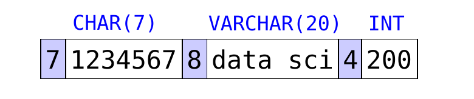{width="50%" fig-align="center"}

::: {.fragment fragment-index=1}
1. [finding/extracting the value of a single field]{.underline}\
this is more efficient
:::

::: {.fragment .sub fragment-index=1}
- can jump over fields, rather than scanning byte-by-byte (but may need to perform multiple jumps)
:::

::: {.fragment .sub fragment-index=2}
- never need to scan to determine the length of a value
:::

::: {.fragment fragment-index=3}
2. [updating the value of a single field]{.underline}\
same as option 1
:::

## Format of Variable-Length Records (cont.)

- Option 3: Put offsets and other metadata in a record header.

::: {.r-stack}
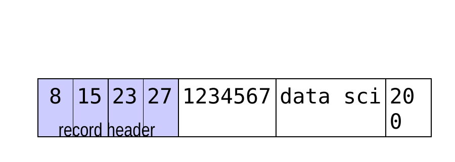{width="82%"}

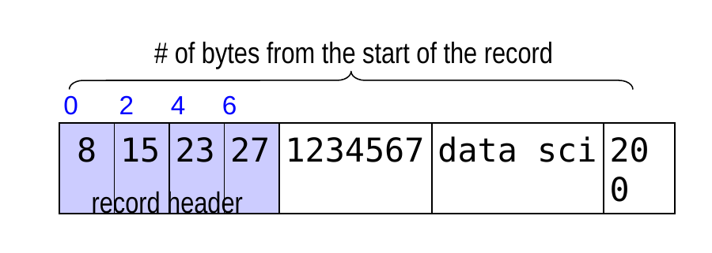{.fragment fragment-index=3 width="82%"}

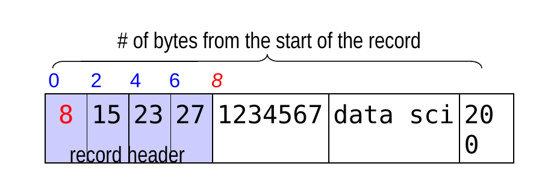{.fragment fragment-index=4 width="82%"}

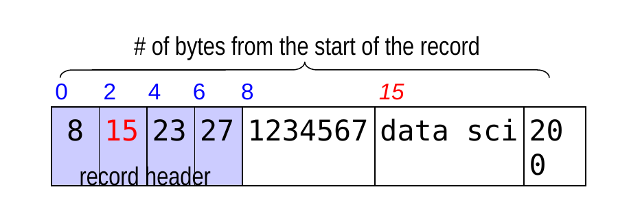{.fragment fragment-index=5 width="82%"}

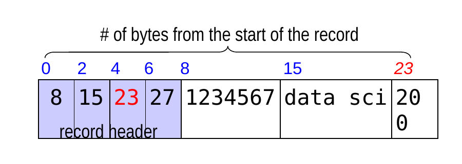{.fragment fragment-index=6 width="82%"}

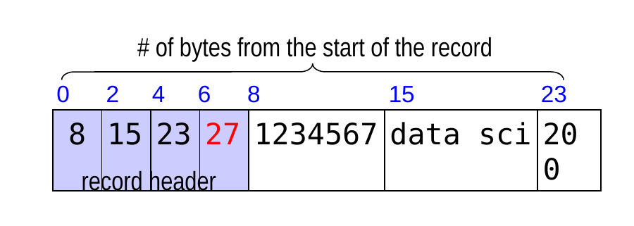{.fragment fragment-index=7 width="82%"}
:::

::: {.fragment .sub fragment-index=1}
- [computing the offsets]{.underline}
- 3 fields in record &rarr; 4 offsets, each of which is a 2-byte int
:::

::: {.fragment .sub fragment-index=2}
- thus, the offsets take up 4\*2 = 8 bytes
:::

::: {.fragment .sub fragment-index=4}
- offset~0~ = 8, because field~0~ comes right after the header
:::

::: {.fragment .sub fragment-index=5}
- offset~1~ = 8 + len('1234567') = 8 + 7 = 15
:::

::: {.fragment .sub fragment-index=6}
- offset~2~ = 15 + len('data sci') = 15 + 8 = 23
:::

::: {.fragment .sub fragment-index=7}
- offset~3~ = *offset of the end of the record* = 23 + 4 (since 200 an int) = 27
:::

::: {.fragment .sub fragment-index=8}
- [*We store this offset because it may be needed to compute the length of a field's value!*]{style="color:#3a5fcd;"}
:::

## Format of Variable-Length Records (cont.)

- Option 3 (cont.)

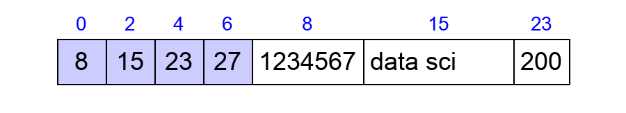{width="62%" fig-align="center"}

1. [finding/extracting the value of a single field]{.underline}\
[this representation is the most efficient. it allows us to:]{.fragment fragment-index=1}

::: {.fragment .sub fragment-index=1}
- jump directly to the field we're interested in
- compute its length without scanning through its value
:::

::: {.fragment fragment-index=2}
2. [updating the value of a single field]{.underline}\
less efficient than options 1 and 2 if the length changes. why? [in addition to shifting subsequent values, need to recompute their offsets]{.fragment fragment-index=3 style="color:#3a5fcd;"}
:::

## Representing Null Values

- Option 1: add an "out-of-band" value for every data type
    - con: need to increase the size of most data types, or reduce the range of possible values

::: {.fragment}
- Option 2: use per-record metadata
    - example: use a special offset (e.g., -1)

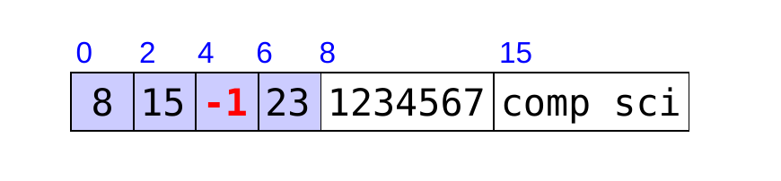{width="58%" fig-align="center"}
:::

## Which is the correct record header?

::: {.r-stack}
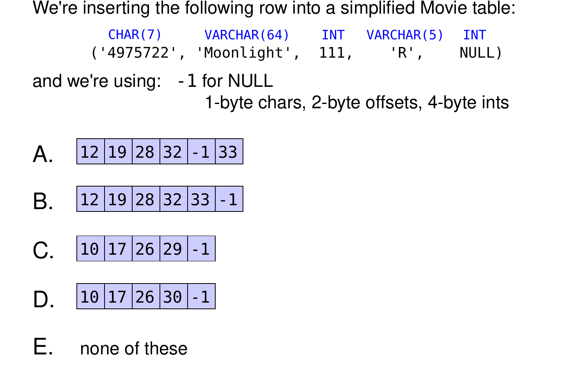{width="100%"}

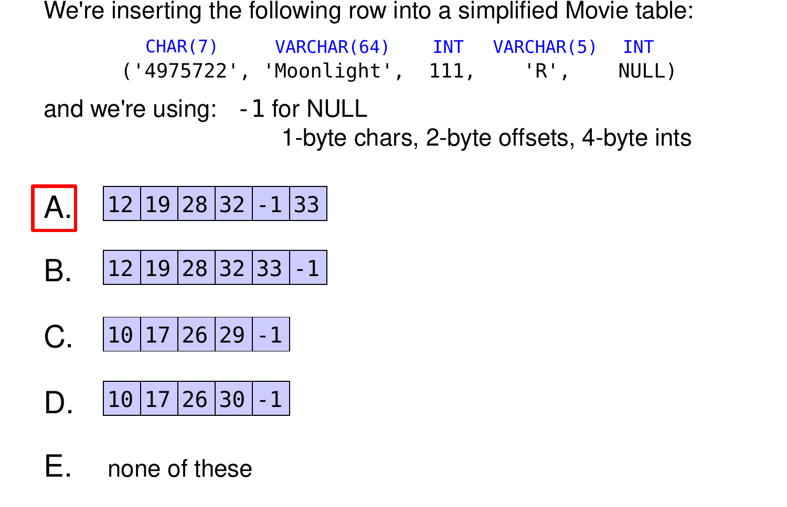{.fragment width="100%"}

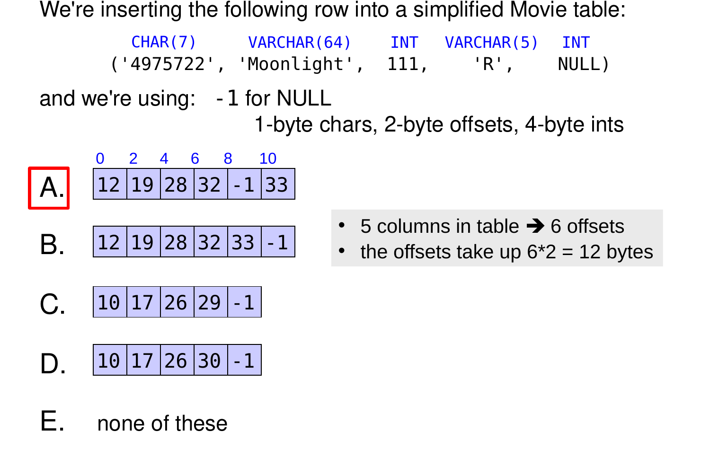{.fragment width="100%"}

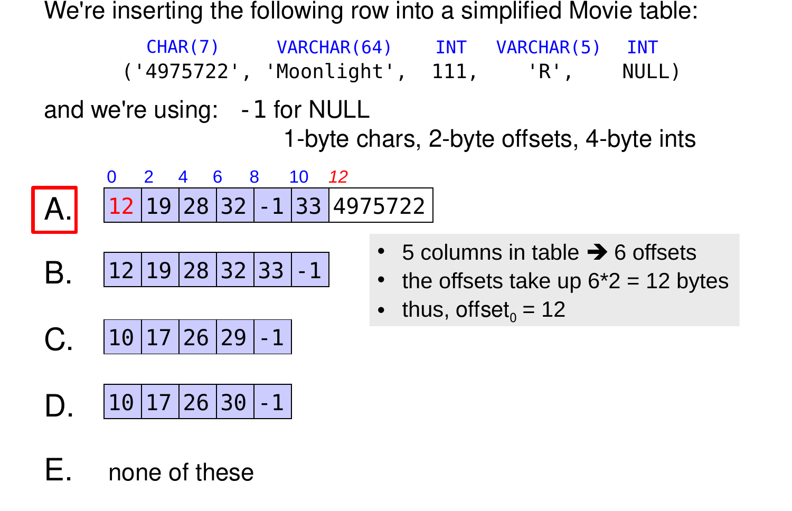{.fragment width="100%"}

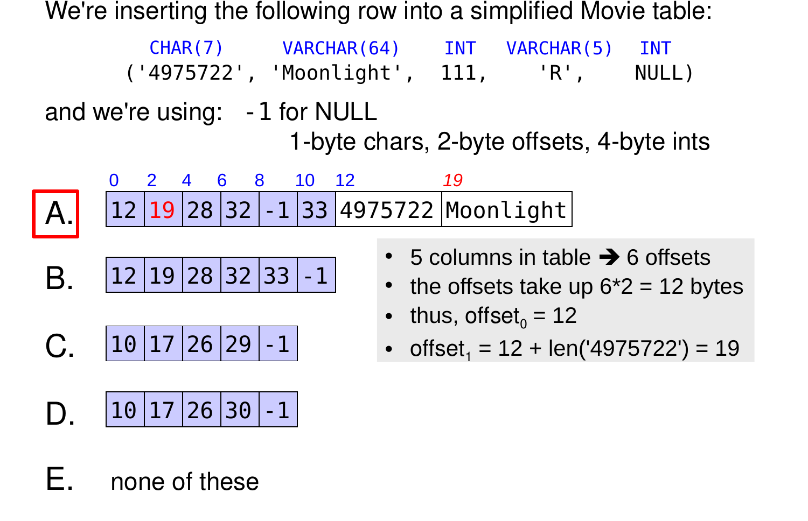{.fragment width="100%"}

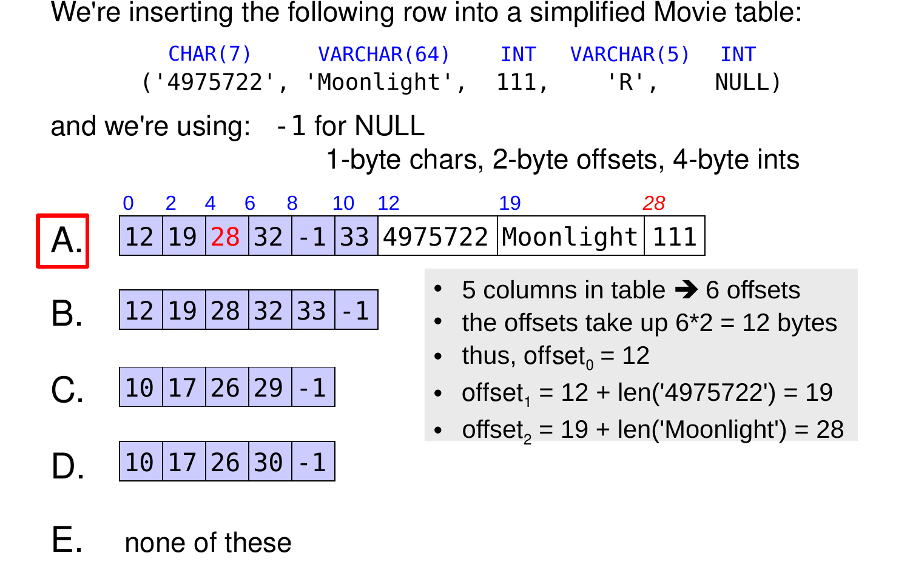{.fragment width="100%"}

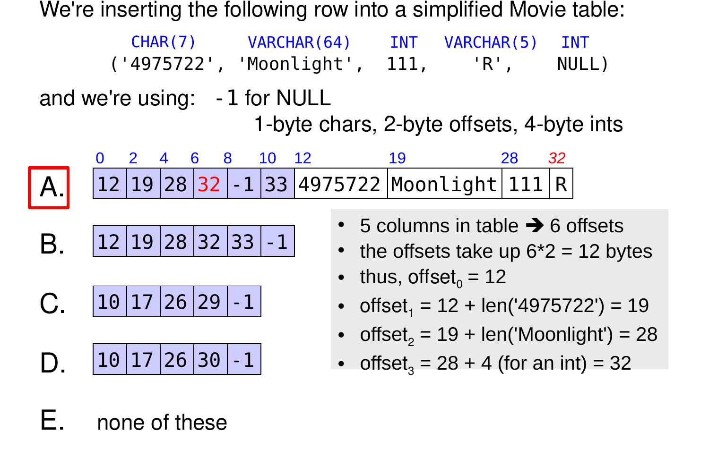{.fragment width="100%"}

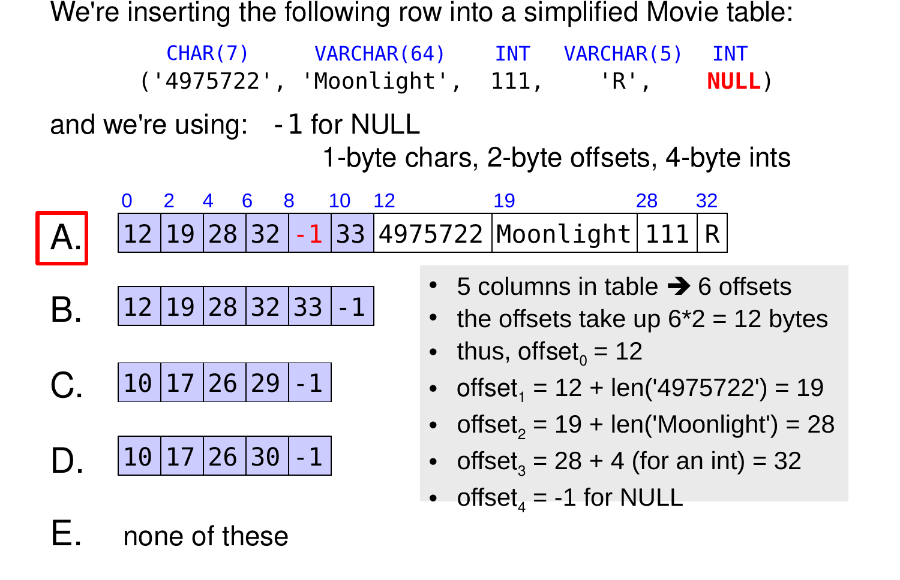{.fragment width="100%"}

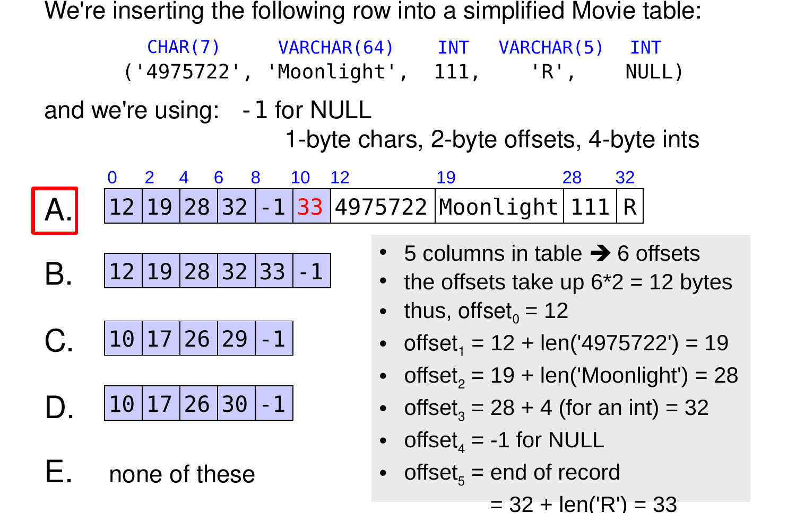{.fragment width="100%"}
:::
