## Efficient Data Access

- How can we find items quickly in a table?
- Recall that the time consuming operations in a database are *disk accesses*
    - We will consider a disk access to be reading a single block, or reading a sequence of blocks as a page
    - This is because the time needed to read from disk is dominated by the &ldquo;seek&rdquo; time &ndash; moving the head
- The simplest case to consider is looking up a record by a key

```sql
select name from employee where employee_id = '142552'
```

- To do this efficiently we will use an *index*

## Index Structures

- An index structure stores (key, value) pairs.
    - also known as a *dictionary* or *map*
    - we will sometimes refer to the (key, value) pairs as *items*

::: {.fragment}
- The index allows us to more efficiently access a given record.
    - quickly find it based on a particular field
    - instead of scanning through the entire collection to find it
:::

::: {.fragment}
- A given collection of records may have multiple index structures:
    - one *clustered* or *primary* index
    - some number of *unclustered* or *secondary* indices
:::

## Clustered/Primary Index

- The clustered index is the one that stores the full records.
    - also known as a primary index, because it is typically based on the primary key

::: {.fragment}
- If the records are stored outside of an index structure, the resulting file is sometimes called a heap file.
    - managed somewhat like the heap memory region
:::

## Unclustered/Secondary Indices

- In addition to the clustered/primary index, there can be one or more *unclustered* indices based on other fields.
    - also known as *secondary indices*

::: {.fragment}
- Example: *Customer(id, name, street, city, state, zip)*
:::

::: {.fragment .sub}
- primary index:\
  (key, value) = (*id*, all of the remaining fields in the record)
:::

::: {.fragment .sub}
- a secondary index to enable quick searches by name\
  (key, value) = (*name*, *id*)&emsp;*does not include the other fields!*
:::

::: {.fragment}
- We need two lookups when we start with the secondary index.
    - example: looking for Ted Codd's zip code
:::

::: {.fragment .sub}
- search for `'Ted Codd'` in the secondary index\
  → `'123456'` (his id)
:::

::: {.fragment .sub}
- search for `'123456'` in the primary index\
  → his full record, including his zip code
:::

## B-Trees

- A B-tree of order *m* is a tree in which each node has:
    - at most 2*m* items (and, for internal nodes, 2*m* + 1 children)
    - at least *m* items (and, for internal nodes, *m* + 1 children)

::: {.fragment .sub}
- exception: the root node may have as few as 1 item
:::

- Example: a B-tree of order 2&emsp;*(we're just showing the keys)*

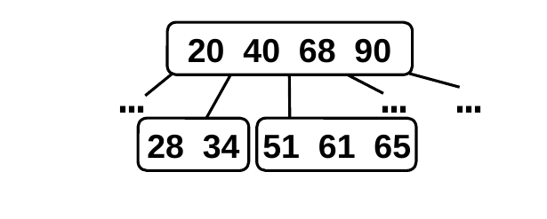{width="45%" fig-align="center"}

::: {.fragment}
- A B-tree has *perfect balance*: all paths from the root node to a leaf node have the same length.
:::

## Search in B-Trees

::: {.r-stack}
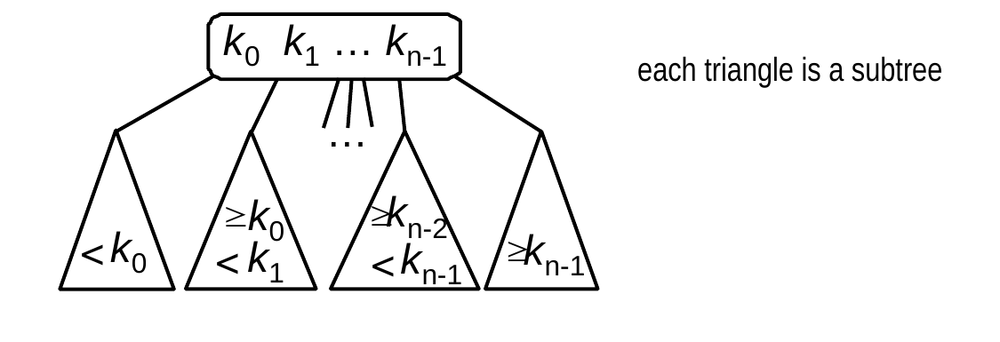{width="82%"}

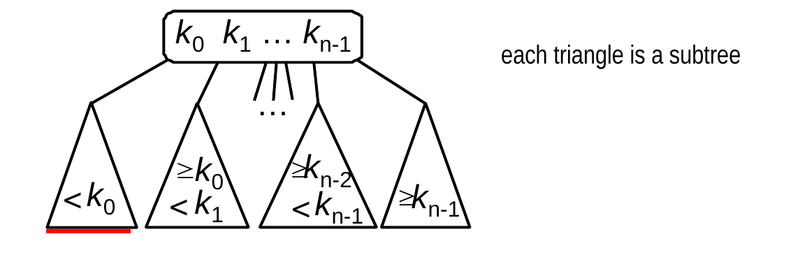{.fragment fragment-index=2 width="82%"}

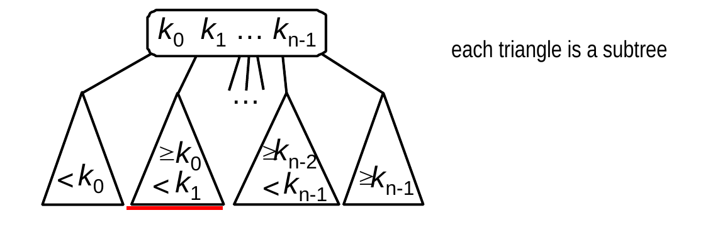{.fragment fragment-index=3 width="82%"}

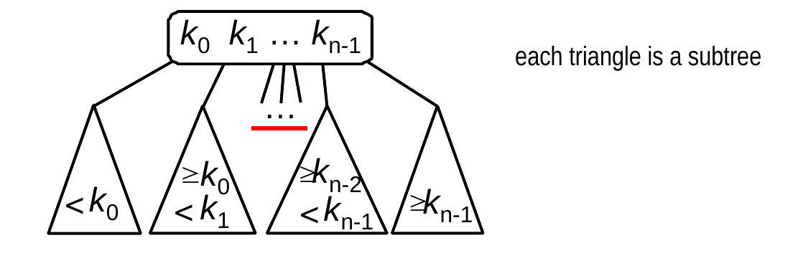{.fragment fragment-index=4 width="82%"}

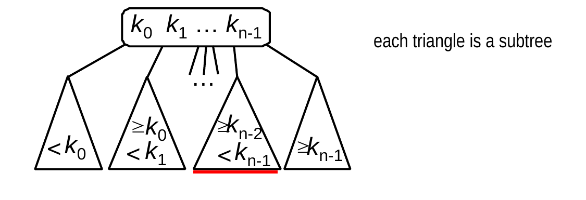{.fragment fragment-index=5 width="82%"}

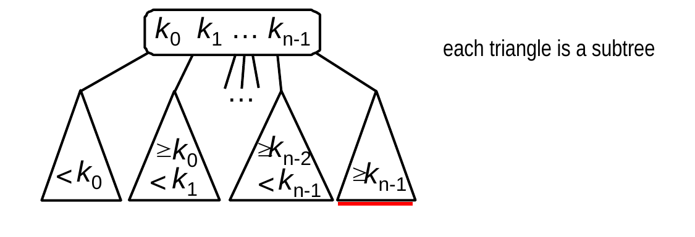{.fragment fragment-index=6 width="82%"}
:::

- A B-tree is a *search tree*.
    - like a binary search tree, but can have more keys per node

::: {.fragment fragment-index=1}
- When searching for an item whose key is *k*, we never need to enter more than one of the subtrees of a node.
:::

## Search in B-Trees (cont.)

- Example: search for the item whose key is 87

::: {.r-stack}
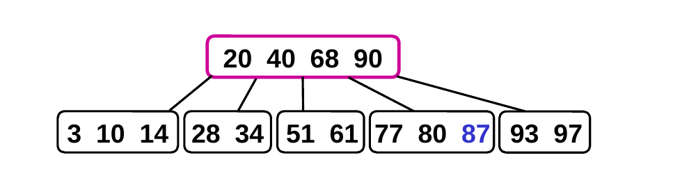{width="72%"}

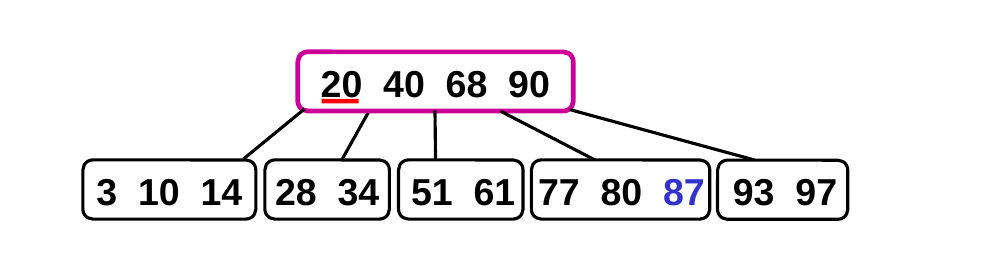{.fragment width="72%"}

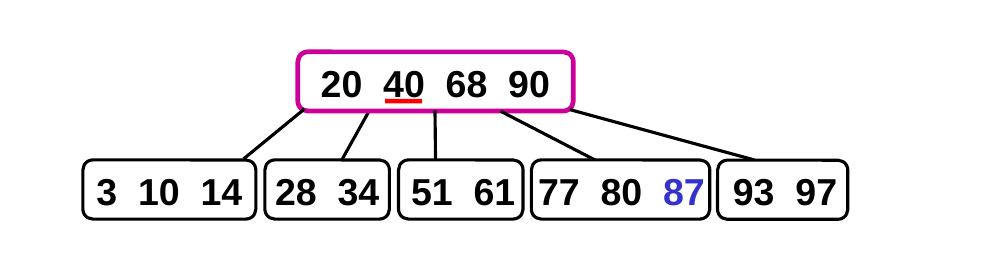{.fragment width="72%"}

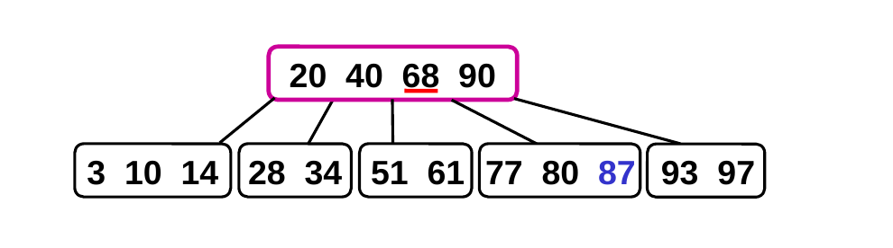{.fragment width="72%"}

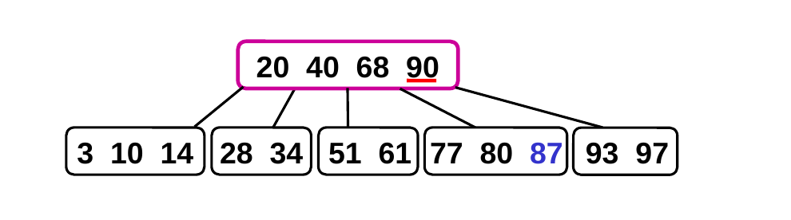{.fragment width="72%"}

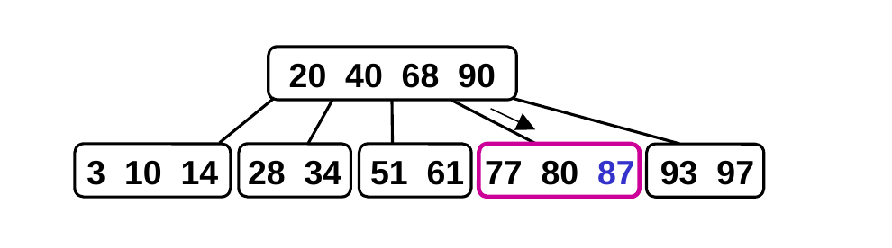{.fragment width="72%"}

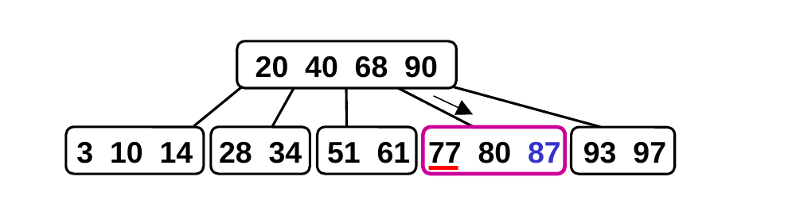{.fragment width="72%"}

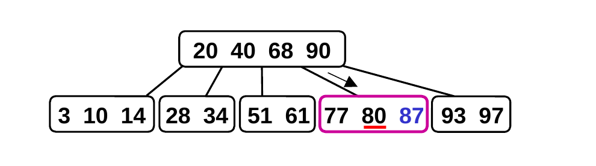{.fragment width="72%"}

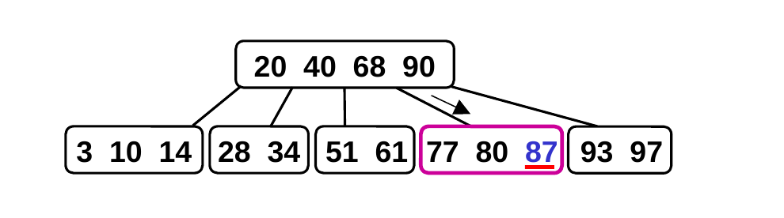{.fragment width="72%"}
:::

## Search in B-Trees (cont.)

- Example: search for the item whose key is 87

{width="60%" fig-align="center"}

- Here's pseudocode for the algorithm:

```text
search(key, node) {
    if (node == null) return null;
    i = 0;
    while (i < node.numkeys  &&  node.key[i] < key)
        i++;
    if (i == node.numkeys || node.key[i] != key)
        return search(key, node.child[i]);
    else       // node.key[i] == key
        return node.data[i];
}
```

## Insertion in B-Trees

- Algorithm for inserting an item with a key *k*:
    - search for *k* until you reach a leaf node
    - if the leaf node has fewer than 2*m* items, add the new item to the leaf node
    - else *split the node*, dividing up the 2*m* + 1 items:
        - the first/smallest *m* items remain in the original node
        - the last/largest *m* items go in a new node
        - send the middle item up and insert it (and a pointer to the new node) in the parent

::: {.fragment fragment-index=1}
- Example of an insertion without a split: insert 13
:::

::: {.r-stack}
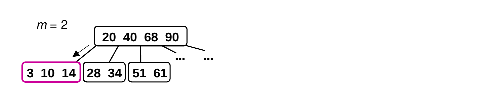{.fragment fragment-index=1 width="90%"}

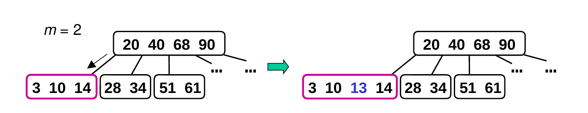{.fragment fragment-index=2 width="90%"}
:::

## Example

- Insert 5 into the result of the previous insertion:

::: {.r-stack}
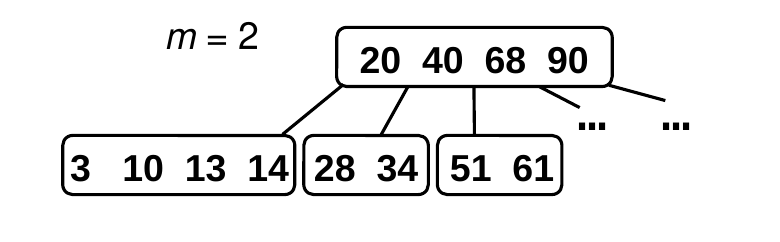{width="105%"}

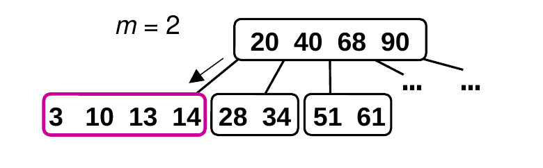{.fragment width="105%"}
:::

## What happens?

- Insert 5 into the result of the previous insertion:

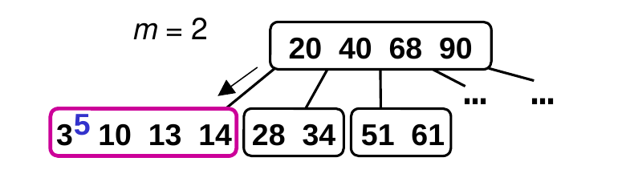{width="55%" fig-align="center"}

A\. 5 stays in that leaf, and no splits occur

B\. 5 stays in that leaf, and 10 is sent up as part of a split [← correct]{.fragment style="color:#00b; font-weight:bold;"}

C\. 5 stays in that leaf, and 14 is sent up as part of a split

D\. 5 is sent up as part of a split

## Splits in B-Trees

::: {.r-stack}
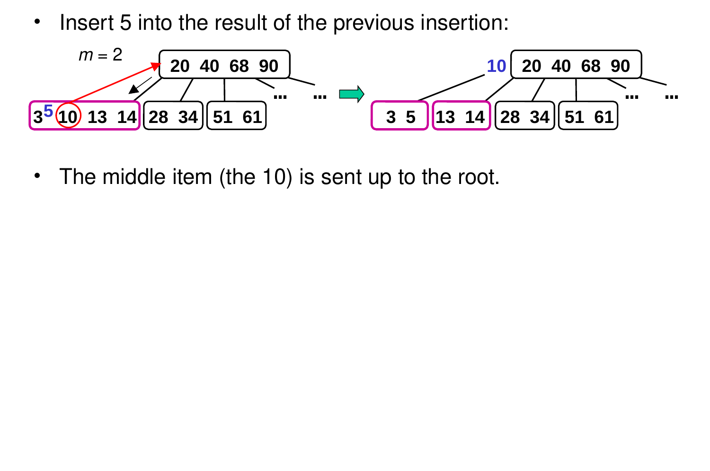{width="86%"}

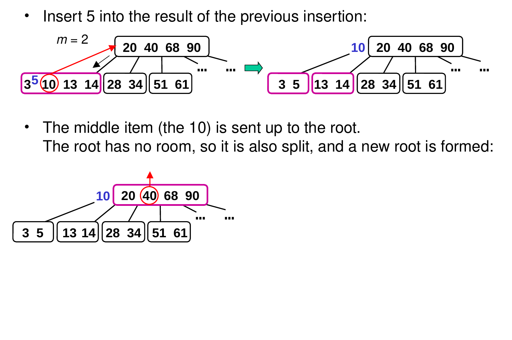{.fragment width="86%"}

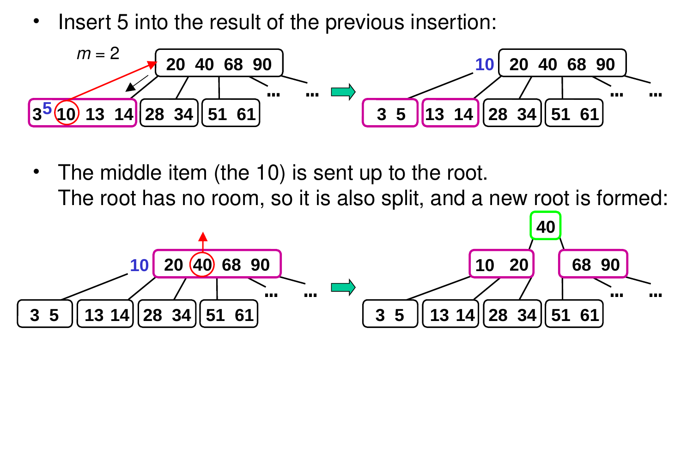{.fragment width="86%"}

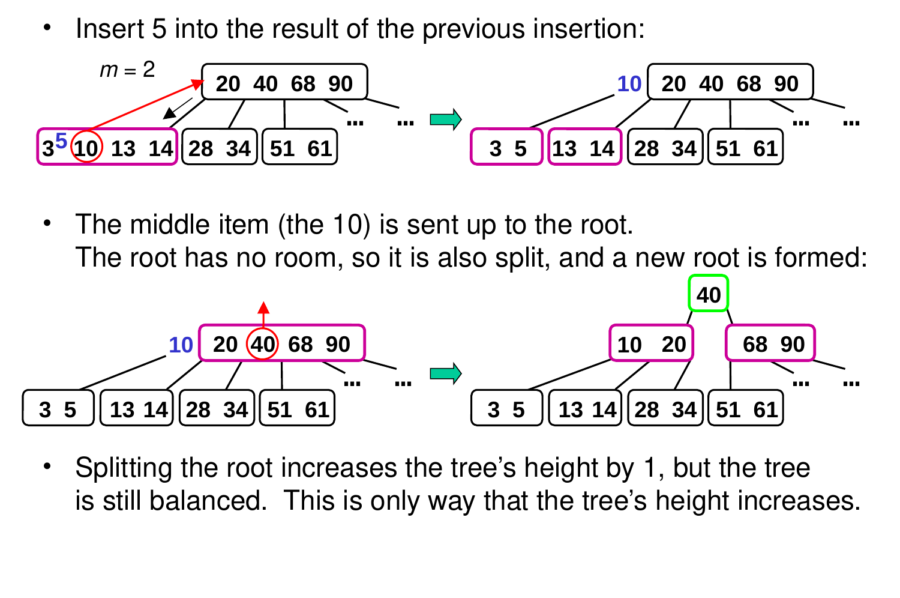{.fragment width="86%"}

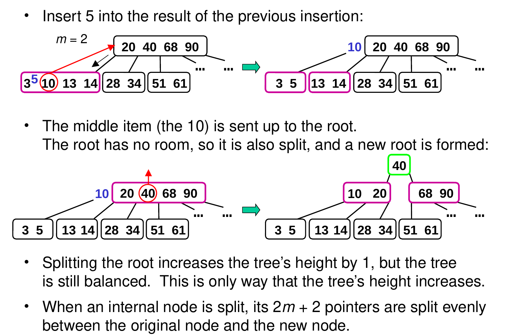{.fragment width="86%"}
:::

## Other Details of B-Trees

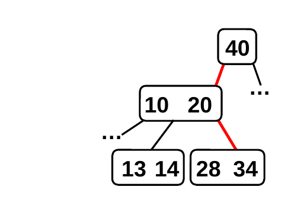{.absolute top="-40" right="0" width="24%"}

- Each node in the tree corresponds to one page in the corresponding index file.
    - child pointers = page numbers

::: {.fragment fragment-index=1}
- Efficiency: In the worst case, searching for an item involves traversing a single path from the root to a leaf node.
:::

::: {.fragment .sub style="margin-left: 2em" fragment-index=1}
- \# of nodes accessed  <=  tree height + 1
:::

::: {.fragment .sub style="margin-left: 2em" fragment-index=2}
- each internal node has at least m children
- → tree height  <=  log<sub>m</sub>n, where n = # of items
:::

::: {.fragment .sub style="margin-left: 2em" fragment-index=3}
- → search and insertion are *O*(log<sub>m</sub>n)
:::

::: {.fragment fragment-index=3}
- To minimize disk I/O, make *m* as large as possible.
:::

::: {.fragment .sub style="margin-left: 2em" fragment-index=4}
- but not too large!
- if *m* is too large, can end up with items that don't fit on the page and are thus stored in separate *overflow pages*
:::

## B+Trees

- A B+tree is a B-tree variant in which:
    - data items are only found in the leaf nodes
    - internal nodes contain only keys and child pointers
    - an item's key may appear in a leaf node *and* an internal node
- Example: a B+tree of order 2

{width="78%" fig-align="center"}

## B+Trees (cont.)

- Advantages:
    - there's more room in the internal nodes for child pointers
        - why is this beneficial?

::: {.fragment .sub fragment-index=1}
- [→ shorter tree&emsp;→ less disk I/O]{style="color:#00b;"}
:::

::: {.fragment .sub fragment-index=2}
- because all items are in leaf nodes, we can link the leaves together to improve the efficiency of operations that involve scanning the items in key order (e.g., range searches)
:::

::: {.fragment fragment-index=2}
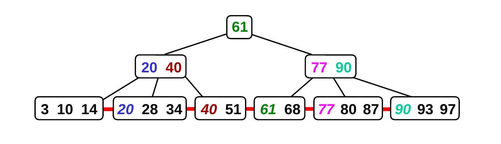{width="78%" fig-align="center"}
:::

## Differences in the Algorithms for B+Trees

- When searching, we keep going until we reach a leaf node, even if we see the key in an internal node.

::: {.fragment fragment-index=1}
- When splitting a leaf node with 2*m* + 1 items:
:::

::: {.fragment .sub fragment-index=2}
- the first *m* items remain in the original node as before
:::

::: {.fragment .sub fragment-index=4}
- *all* of the remaining *m* + 1 items are put in the new node, *including the middle item*
:::

::: {.fragment .sub fragment-index=6}
- the *key* of the middle item is *copied* into the parent
:::

::: {.fragment .sub fragment-index=8}
- why can't we move up the entire item as before?\
  [in a B+tree, all items are in leaf nodes!]{.fragment fragment-index=9 style="color:#00b;"}
:::

::: {.fragment fragment-index=1}
- Example: insert 18
:::

::: {.r-stack}
{.fragment fragment-index=1 width="88%"}

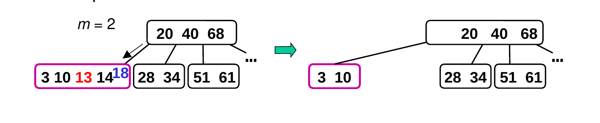{.fragment fragment-index=3 width="88%"}

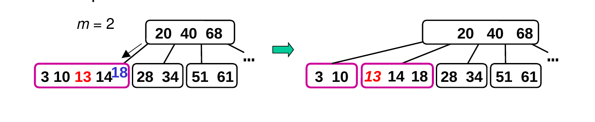{.fragment fragment-index=5 width="88%"}

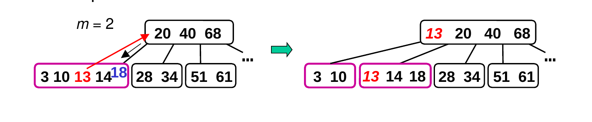{.fragment fragment-index=7 width="88%"}
:::

## Differences in the Algorithms for B+Trees (cont.)

- Splitting an internal node is the same as before, but with keys only:
    - first *m* keys stay in original node, last *m* keys go to new node
    - middle key is sent up to parent (not copied)

## Deletion in B-Trees and B+Trees

- Search for the item and remove it.
- If a node N ends up with fewer than *m* items, do one of the following:

::: {.fragment .sub style="margin-left: 1em"}
- if a sibling node has more than *m* items, take items from it and add them to N
:::

::: {.fragment .sub style="margin-left: 1em"}
- if the sibling node only has *m* items, *merge* N with the sibling
:::

::: {.fragment}
- If the key of the removed item is in an internal node, *don't* remove it from the internal node.
    - we need the key to navigate to the node's children
    - can remove when the associated child node is merged with a sibling
:::

::: {.fragment}
- Some systems don't worry about nodes with too few items.
    - assume items will be added again eventually
:::

## Ideal Case: Searching = Indexing

- The ideal index structure would be one in which:
    - key of data item = the page number where the item is stored
- In most real-world problems, we can't do this.
    - the key values may not be integers
    - we can't afford to give each key value its own page

::: {.fragment}
- To get something close to the ideal, we perform *hashing*:
    - use a *hash function* to convert the keys to page numbers\
      `h('hello')` → `5`
:::

::: {.fragment}
- The resulting index structure is known as a *hash table*.
:::

## Hash Tables: In-Memory vs. On-Disk

- In-memory:
    - the hash value is used as an index into an array

::: {.fragment .sub fragment-index=1}
- depending on the approach you're taking, a given array element may only hold one item
:::

::: {.fragment .sub fragment-index=3}
- need to deal with *collisions* = two values hashed to same index
:::

- On-disk:
    - the hash value tells you which *page* the item should be on

::: {.fragment .sub fragment-index=2}
- because pages are large, each page serves as a *bucket* that stores multiple items
:::

::: {.fragment .sub fragment-index=4}
- need to deal with full buckets
:::

## Static vs. Dynamic Hashing

- In *static hashing*, the number of buckets never changes.
    - if a bucket becomes full, we use overflow buckets/pages

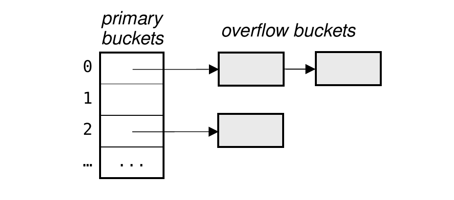{width="52%" fig-align="center"}

::: {.fragment .sub fragment-index=1}
- why is this problematic?\
  [accessing an overflow bucket may require an extra disk read]{.fragment fragment-index=2 style="color:#00b;"}
:::

::: {.fragment fragment-index=3}
- In *dynamic hashing*, the number of buckets can grow over time.
    - can be expensive if you're not careful!
:::

## A Simplistic Approach to Dynamic Hashing

- Assume that:
    - we're using keys that are strings
    - h(key) = number of characters in key
    - we use mod (%) to ensure we get a valid bucket number:\
      bucket index = h(key) % number of buckets

::: {.fragment fragment-index=2}
- When the hash table gets to be too full:
    - double the number of buckets
:::

::: {.fragment .sub fragment-index=3}
- rehash **all** existing items. why? [% may give a different result]{.fragment fragment-index=4 style="color:#00b;"}
:::

::: {.r-stack}
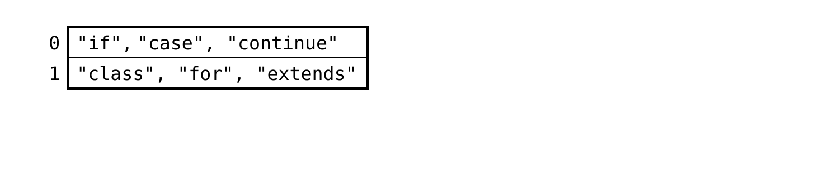{.fragment fragment-index=1 width="86%"}

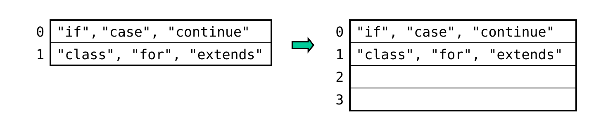{.fragment fragment-index=2 width="86%"}

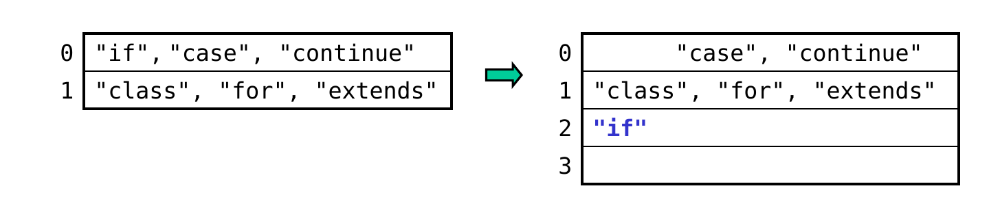{.fragment fragment-index=5 width="86%"}

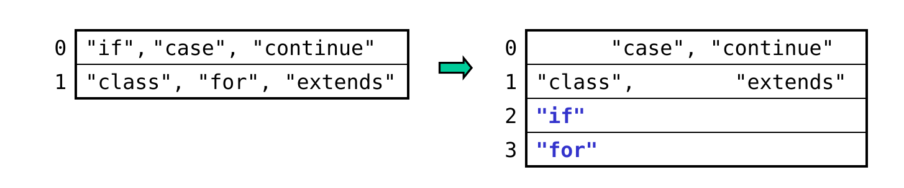{.fragment fragment-index=6 width="86%"}

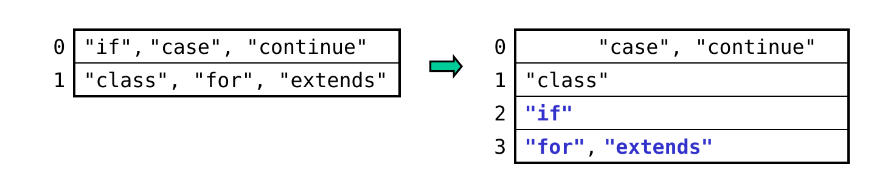{.fragment fragment-index=7 width="86%"}
:::

## Search in B-Trees (cont.)

::: {.r-stack}
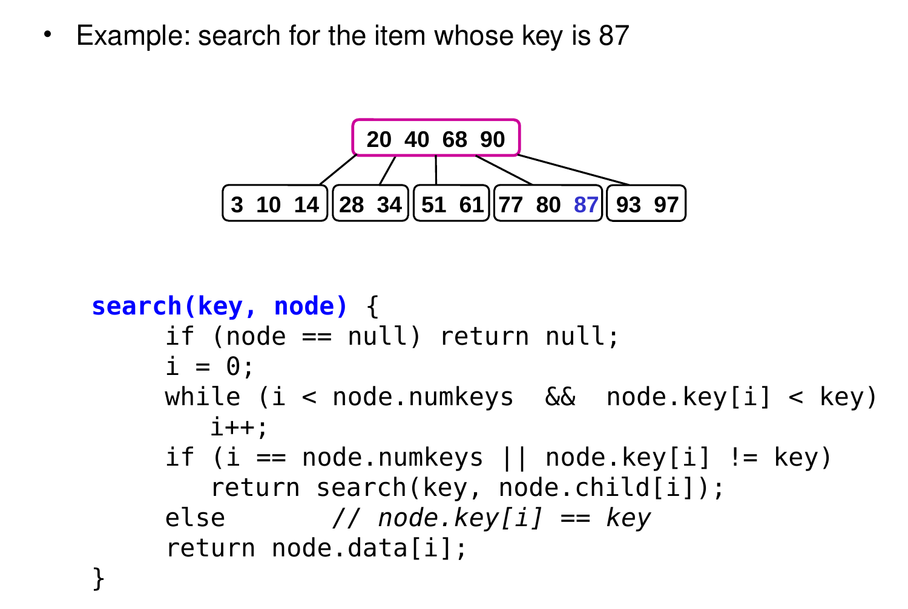{width="84%"}

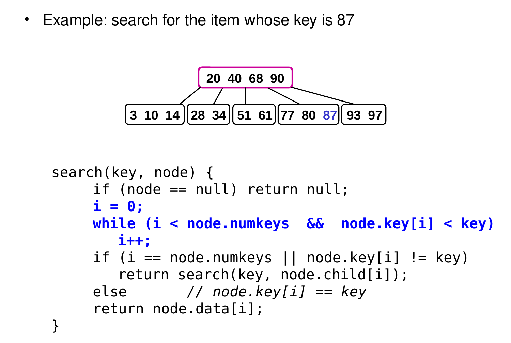{.fragment width="84%"}

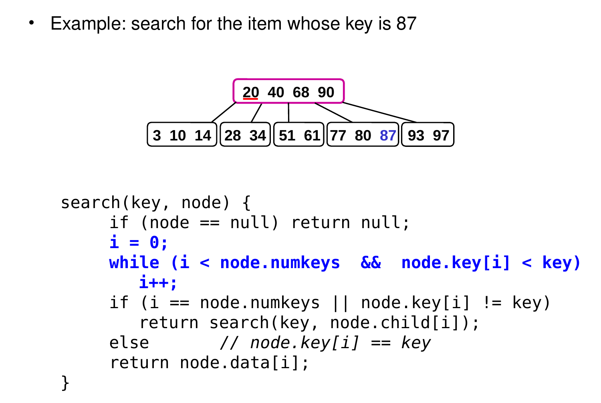{.fragment width="84%"}

{.fragment width="84%"}

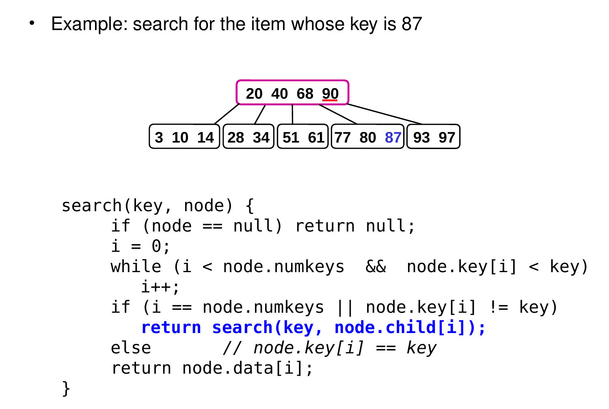{.fragment width="84%"}

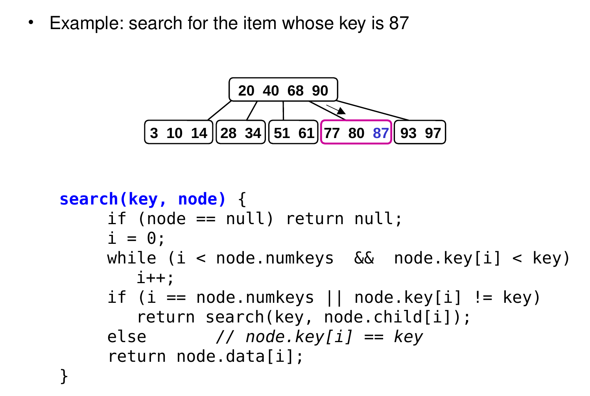{.fragment width="84%"}

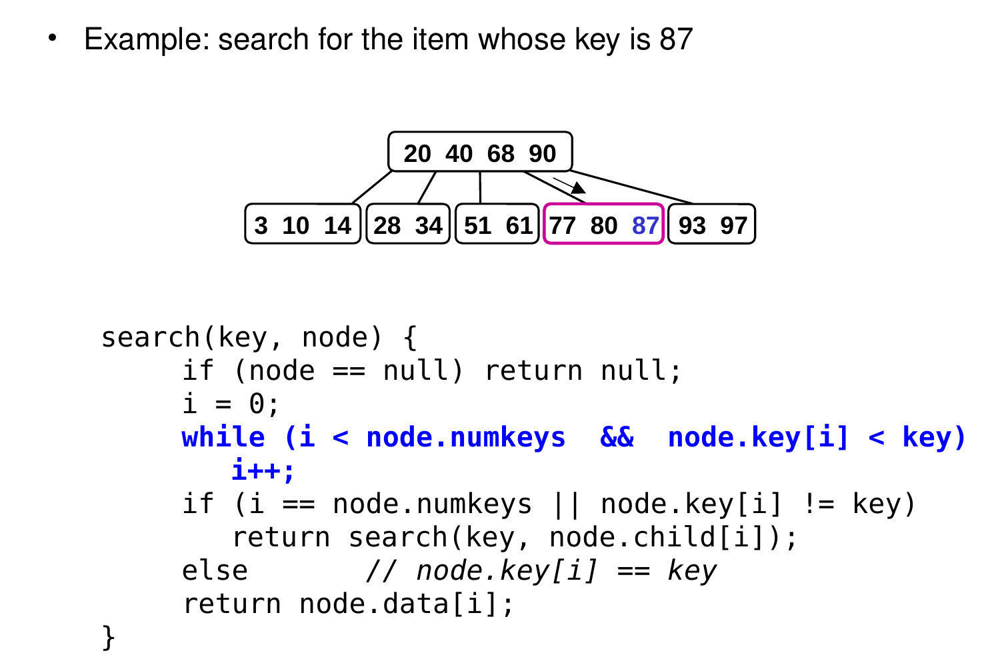{.fragment width="84%"}

{.fragment width="84%"}

{.fragment width="84%"}

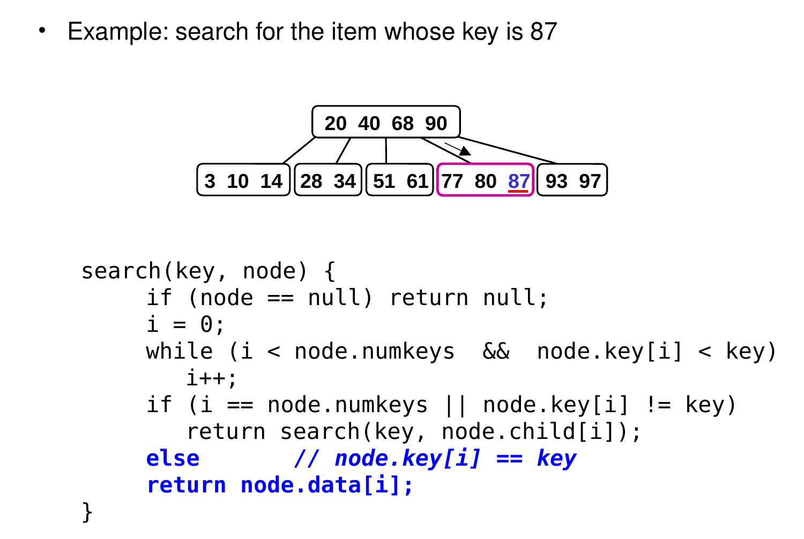{.fragment width="84%"}
:::
