## Recall: On-Disk Hash Tables

- The hash value tells you which *page* the item should be on.
- Because pages are large, each page serves as a *bucket* that stores multiple items.
- Need to deal with full buckets.

::: {.fragment}
- In *dynamic hashing*, the number of buckets can increase over time.
:::

## Recall: A Simplistic Approach to Dynamic Hashing

- Assume that:
    - we're using keys that are strings
    - h(key) = number of characters in key
    - we use mod (%) to ensure we get a valid bucket number:
        - bucket index = h(key) % number of buckets

::: {.fragment fragment-index=1}
- When the hash table gets to be too full:
    - double the number of buckets
    - rehash [**all**]{.underline} existing items. why? [% may give a different result]{.fragment fragment-index=2 style="color:#3a5fcd;"}
:::

::: {.r-stack}
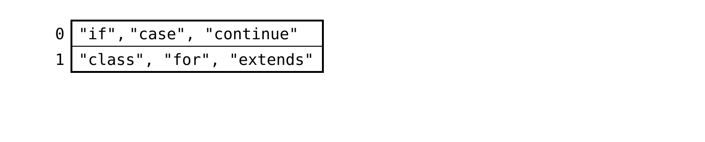{width="88%"}

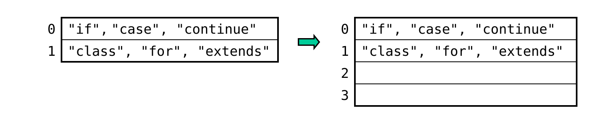{.fragment fragment-index=1 width="88%"}

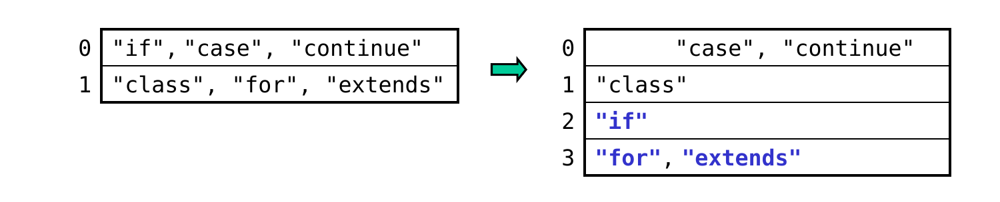{.fragment fragment-index=2 width="88%"}
:::

## Linear Hashing

- It does ***not*** use the modulus to determine the bucket index.

::: {.fragment}
- Rather, it treats the hash value as a binary number, and it uses the i *rightmost* bits of that number:
    - i = ceil(log~2~n) where n is the current number of buckets
:::

::: {.fragment .sub}
- example: n = 3 &rarr; i = ceil(log~2~3) = 2
:::

## Linear Hashing (cont.)

- example: n = 3 &rarr; i = ceil(log~2~3) = 2

::: {.fragment fragment-index=2}
- If there's a bucket with the index given by the i rightmost bits, put the key there.
:::

:::: {.columns}

::: {.column width="46%"}
::: {.fragment fragment-index=1}
[h(\"if\") &nbsp;&nbsp;= 2 = 000000[**10**]{style="color:#3a5fcd;"}]{style="font-family:'Courier New',monospace; font-size:0.85em;"}
:::

::: {.fragment fragment-index=4}
[h(\"case\") = 4 = 000001[**00**]{style="color:#3a5fcd;"}]{style="font-family:'Courier New',monospace; font-size:0.85em;"}
:::
:::

::: {.column width="54%"}
::: {.r-stack}
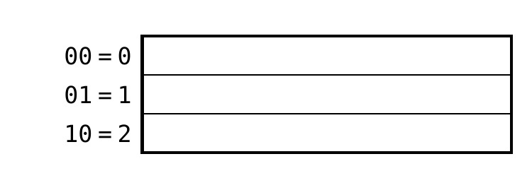{width="100%"}

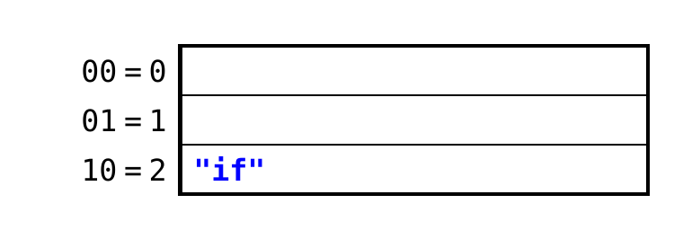{.fragment fragment-index=3 width="100%"}

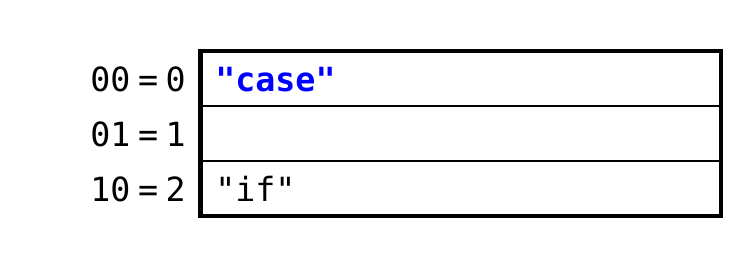{.fragment fragment-index=5 width="100%"}
:::
:::

::::

## Where should an item with the key "class" go?

:::: {.columns}

::: {.column width="46%"}
[h(\"if\") &nbsp;&nbsp;= 2 = 000000[**10**]{style="color:#3a5fcd;"}]{style="font-family:'Courier New',monospace; font-size:0.85em;"}

[h(\"case\") = 4 = 000001[**00**]{style="color:#3a5fcd;"}]{style="font-family:'Courier New',monospace; font-size:0.85em;"}

::: {.fragment fragment-index=1}
[h(\"class\") = 5 = 000001[**01**]{style="color:#3a5fcd;"}]{style="font-family:'Courier New',monospace; font-size:0.85em;"}
:::
:::

::: {.column width="54%"}
::: {.r-stack}
{width="100%"}

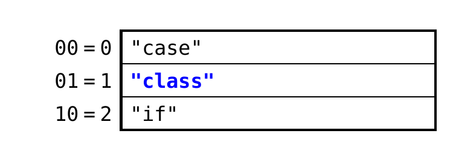{.fragment fragment-index=2 width="100%"}
:::
:::

::::

A\. bucket 0

B\. bucket 1 [**&larr; yes: the rightmost i bits are 01**]{.fragment fragment-index=2 style="color:#3a5fcd;"}

C\. bucket 2

## Linear Hashing (cont.)

- If there's a bucket with the index given by the i rightmost bits, put the key there.

::: {.fragment fragment-index=3}
- If not, use the bucket specified by the rightmost i &ndash; 1 bits
:::

:::: {.columns}

::: {.column width="50%"}
[h(\"if\") &nbsp;&nbsp;= 2 = 000000[**10**]{style="color:#3a5fcd;"}]{style="font-family:'Courier New',monospace; font-size:0.8em;"}

[h(\"case\") = 4 = 000001[**00**]{style="color:#3a5fcd;"}]{style="font-family:'Courier New',monospace; font-size:0.8em;"}

[h(\"class\") = 5 = 000001[**01**]{style="color:#3a5fcd;"}]{style="font-family:'Courier New',monospace; font-size:0.8em;"}

::: {.fragment fragment-index=1}
[h(\"continue\") = 8 = 000010[**00**]{style="color:#3a5fcd;"}]{style="font-family:'Courier New',monospace; font-size:0.8em;"}
:::

::: {.fragment fragment-index=4}
[h(\"for\") = 3 = 000000[**11**]{style="color:#c00;"}]{style="font-family:'Courier New',monospace; font-size:0.8em;"} 
[(11 = 3 is too big, so use 1)]{style="font-size:0.7em;"}
:::

::: {.fragment fragment-index=6}
[h(\"extends\") = 7 = 000001[**11**]{style="color:#c00;"}]{style="font-family:'Courier New',monospace; font-size:0.8em;"}
:::
:::

::: {.column width="50%"}
::: {.r-stack}
{width="100%"}

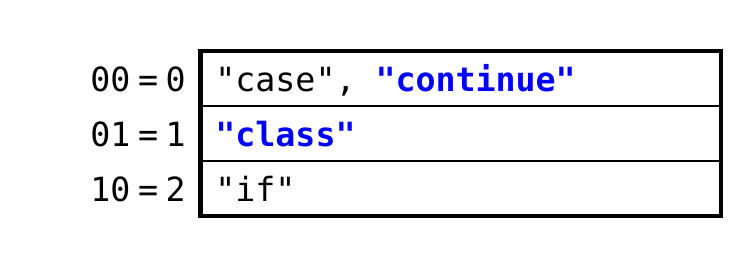{.fragment fragment-index=2 width="100%"}

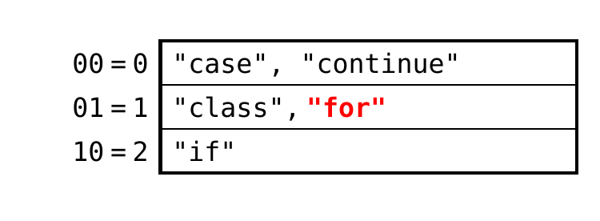{.fragment fragment-index=5 width="100%"}

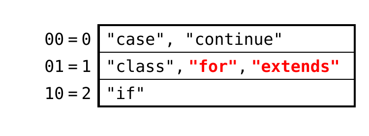{.fragment fragment-index=7 width="100%"}
:::
:::

::::

## Linear Hashing: Adding a Bucket

- In linear hashing, we keep track of three values:

::: {.fragment .sub style="margin-left: 1em"}
- n, the number of buckets
:::

::: {.fragment .sub style="margin-left: 1em"}
- i, the number of bits used to assign keys to buckets
:::

::: {.fragment .sub style="margin-left: 1em"}
- f, some measure of how full the buckets are
:::

::: {.fragment}
- When f exceeds some threshold, we:
    - add [**only one**]{.underline} new bucket
:::

::: {.fragment .sub style="margin-left: 1em"}
- increment n and update i as needed
:::

::: {.fragment .sub style="margin-left: 1em"}
- rehash/move keys as needed
:::

::: {.fragment}
- We only need to rehash the keys in [**one**]{.underline} of the old buckets!
:::

::: {.fragment .sub style="margin-left: 1em"}
- if the new bucket's binary index is 1xyz (xyz = arbitrary bits), rehash the bucket with binary index 0xyz
:::

::: {.fragment}
- This is in contrast to hashing with mod (%) which requires rehashing [all]{.underline} keys.
:::

## Example of Adding a Bucket

- Assume that:
    - our measure of fullness, f = # of items in hash table
    - we add a bucket when f > 2*n

::: {.fragment fragment-index=1}
- Continuing with our previous example:
    - n = 3; f = 6 = 2*3, so we're at the threshold
:::

::: {.fragment .sub fragment-index=2 style="margin-left: 1em"}
- adding "switch" exceeds the threshold, so we:
:::

::: {.fragment .sub fragment-index=3 style="margin-left: 1em"}
- add a new bucket whose index = 3 = 11 in binary
:::

::: {.fragment .sub fragment-index=4 style="margin-left: 1em"}
- increment n to 4 &rarr; i = ceil(log~2~4) = 2 *(unchanged)*
:::

::: {.r-stack}
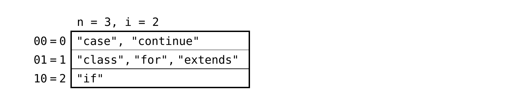{width="85%"}

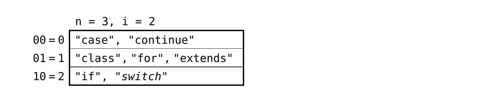{.fragment fragment-index=2 width="85%"}

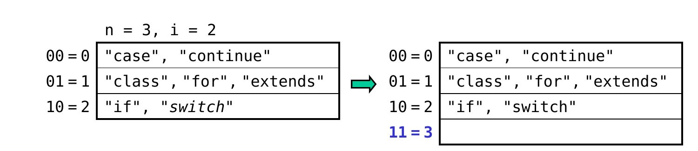{.fragment fragment-index=3 width="85%"}

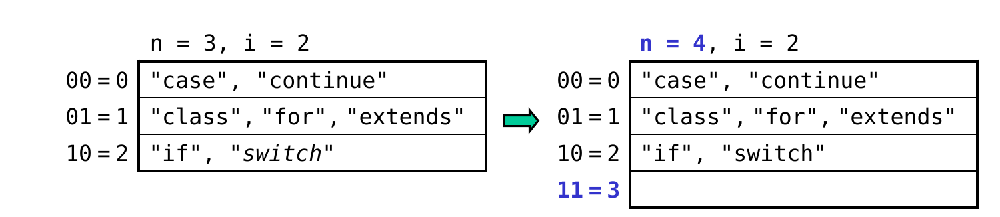{.fragment fragment-index=4 width="85%"}
:::

## Example of Adding a Bucket (cont.)

- Which previous bucket do we need to rehash?
    - new bucket has a binary index of 11

::: {.fragment .sub fragment-index=1 style="margin-left: 1em"}
- because this bucket wasn't there before, items that should now be in 11 were originally put in 01 (using the rightmost i &ndash; 1 bits)
:::

::: {.fragment .sub fragment-index=2 style="margin-left: 1em"}
- thus, we rehash bucket 01:
:::

::: {.fragment fragment-index=3}
[h(\"class\") = 5 = 000001[**01**]{style="color:#3a5fcd;"}]{style="font-family:'Courier New',monospace; font-size:0.8em;"} [(leave where it is)]{.fragment fragment-index=4 style="font-size:0.8em;"}
:::

::: {.fragment fragment-index=5}
[h(\"for\") = 3 = 000000[**11**]{style="color:#3a5fcd;"}]{style="font-family:'Courier New',monospace; font-size:0.8em;"} [(move to new bucket)]{.fragment fragment-index=6 style="font-size:0.8em;"}
:::

::: {.fragment fragment-index=7}
[h(\"extends\") = 7 = 000001[**11**]{style="color:#3a5fcd;"}]{style="font-family:'Courier New',monospace; font-size:0.8em;"} [(move to new bucket)]{.fragment fragment-index=8 style="font-size:0.8em;"}
:::

::: {.r-stack}
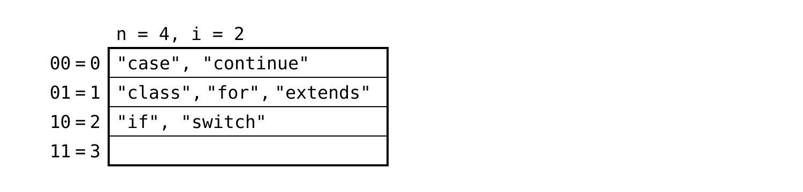{width="80%"}

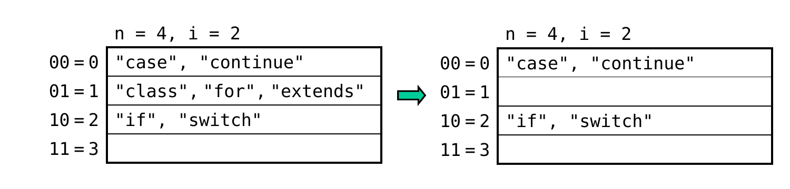{.fragment fragment-index=2 width="80%"}

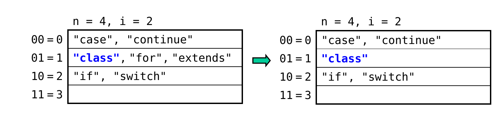{.fragment fragment-index=4 width="80%"}

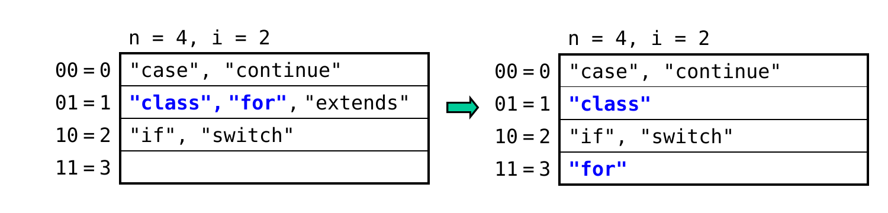{.fragment fragment-index=6 width="80%"}

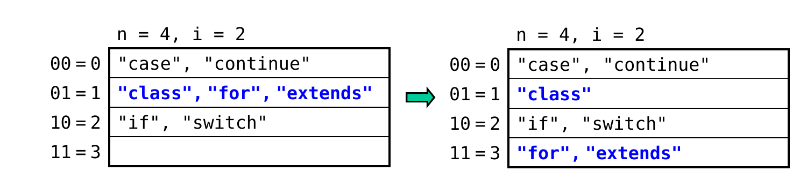{.fragment fragment-index=8 width="80%"}
:::

## Additional Details

- If the number of buckets exceeds 2^i^, we increment i and begin using one additional bit.

::: {.r-stack}
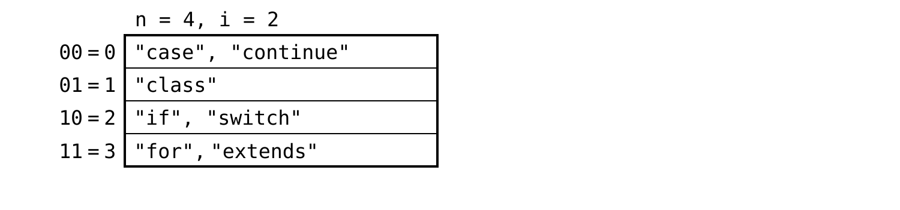{width="82%"}

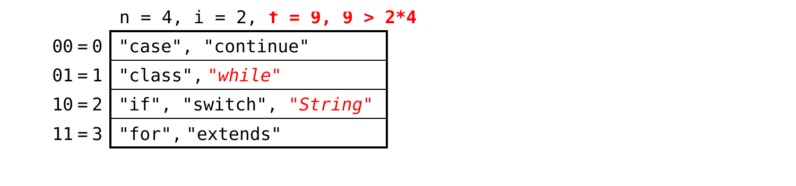{.fragment fragment-index=1 width="82%"}

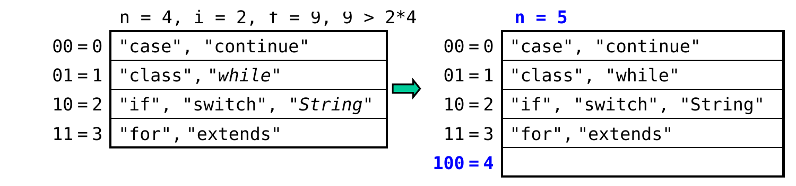{.fragment fragment-index=2 width="82%"}

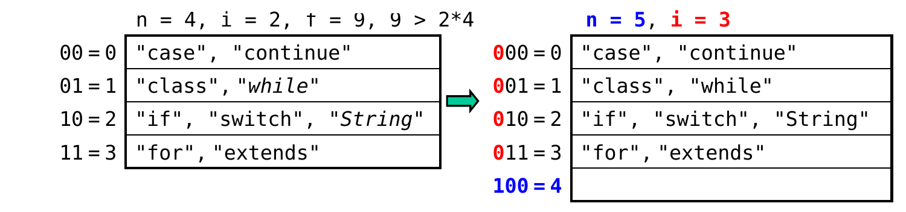{.fragment fragment-index=3 width="82%"}

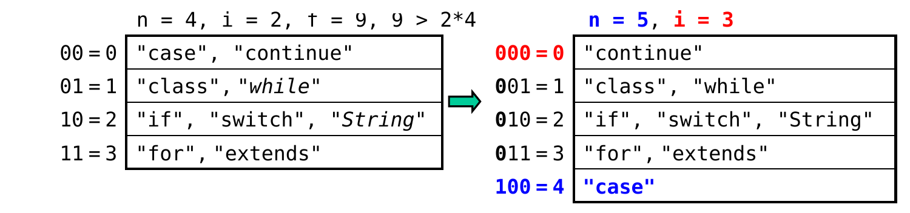{.fragment fragment-index=6 width="82%"}
:::

::: {.fragment fragment-index=4}
which bucket should be rehashed?

A\. bucket 0 [**&larr; yes: 4 = 100, and items that should now be in that bucket were put in 000 = 0 (using the rightmost i &ndash; 1 bits)**]{.fragment fragment-index=5 style="color:#3a5fcd;"}

B\. bucket 1&emsp;&emsp;C. bucket 2&emsp;&emsp;D. bucket 3
:::

## Additional Details (cont.)

{width="82%" fig-align="center"}

- The process of adding a bucket is sometimes referred to as *splitting* a bucket.

::: {.fragment .sub}
- example: adding bucket 4 &nbsp;&hArr;&nbsp; splitting bucket 0, because some of 0's items may get moved to bucket 4
:::

::: {.fragment}
- The split bucket:
    - may retain all, some, or none of its items
:::

::: {.fragment .sub style="margin-left: 1em"}
- may not be as full as other buckets
    - thus, linear hashing still allows for overflow buckets as needed
:::

## More Examples

- Assume again that we add a bucket whenever the # of items exceeds 2n.
- What will the table below look like after inserting the following sequence of keys? (assume no overflow buckets are needed)

::: {.fragment fragment-index=1}
[\"toString\": &nbsp;h(\"toString\") &nbsp;= 8 = 00001[**000**]{style="color:#3a5fcd;"}]{style="font-family:'Courier New',monospace; font-size:0.75em;"}
:::

::: {.fragment fragment-index=2}
[\"private\": &nbsp;&nbsp;h(\"private\") &nbsp;&nbsp;= 7 = 00000[**111**]{style="color:#3a5fcd;"}]{style="font-family:'Courier New',monospace; font-size:0.75em;"}
:::

::: {.fragment fragment-index=6}
[\"interface\": h(\"interface\") = 9 = 00001[**001**]{style="color:#3a5fcd;"}]{style="font-family:'Courier New',monospace; font-size:0.75em;"}
:::

::: {.r-stack}
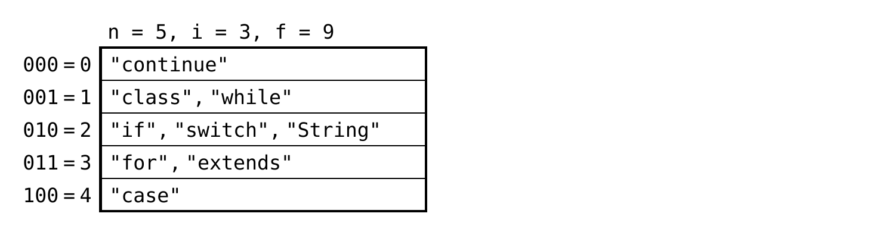{width="72%"}

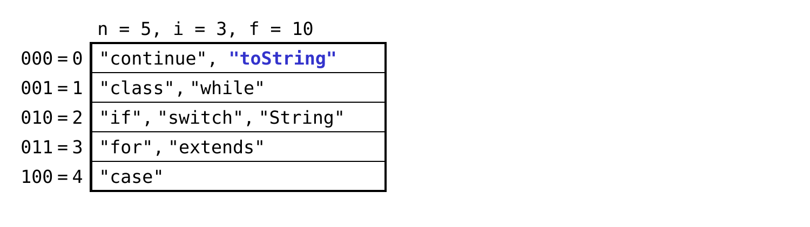{.fragment fragment-index=1 width="72%"}

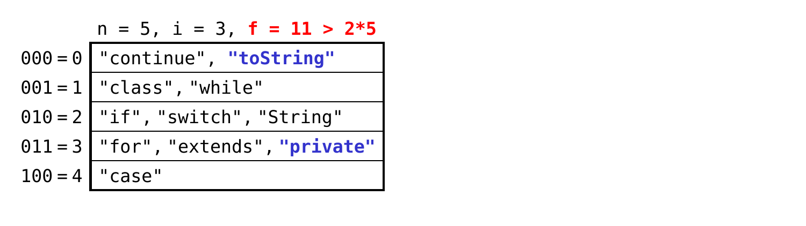{.fragment fragment-index=2 width="72%"}

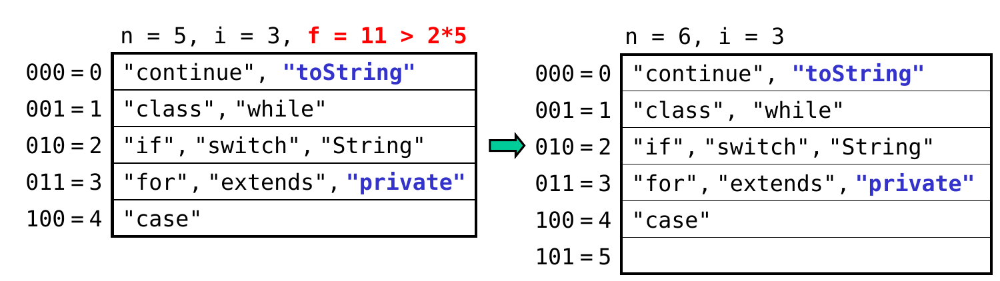{.fragment fragment-index=3 width="72%"}

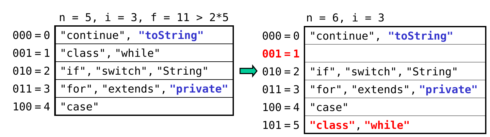{.fragment fragment-index=5 width="72%"}

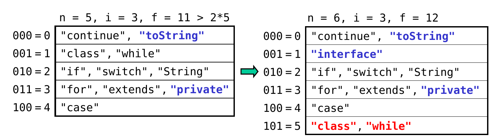{.fragment fragment-index=6 width="72%"}
:::

[**which bucket should be split/rehashed?**]{.fragment fragment-index=4 style="color:#3a5fcd;"} [**&larr; new bucket is 5 = 101, so rehash bucket 001**]{.fragment fragment-index=5 style="color:#c00;"}

## Hash Table Efficiency

- In the best case, search and insertion require at most one disk access.

::: {.fragment}
- In the worst case, search and insertion require *k* accesses, where *k* is the length of the largest bucket chain.
:::

::: {.fragment}
- Dynamic hashing can keep the worst case from being too bad.
:::

## Hash Table Limitations

- It can be hard to come up with a good hash function for a particular data set.

::: {.fragment}
- The items are not ordered by key. As a result, we can't easily:
    - access the records in sorted order
    - perform a range search
    - perform a rank search &ndash; get the kth largest value of some field
:::

::: {.fragment}
- We *can* do all of these things with a B-tree / B+tree.
:::

## Which Index Structure Should You Choose?

- Recently accessed pages are stored in a *cache* in memory.
- Working set = collection of frequently accessed pages

::: {.fragment}
- If the working set fits in the cache, use a B-tree / B+tree.
    - efficiently supports a wider range of queries (see last slide)
:::

::: {.fragment}
- If the working set can't fit in memory:
    - choose a B-tree/B+tree if the workload exhibits *locality*
        - locality = a query for a key is often followed by a query for a key that is nearby in the space of keys
:::

::: {.fragment .sub style="margin-left: 1em"}
- because the items are sorted by key, the neighbor will be in the cache
:::

::: {.fragment .sub style="margin-left: 1em"}
- choose a hash table if the working set is very large
    - uses less space for "bookkeeping" (pointers, etc.), and can thus fit more of the working set in the cache
:::

::: {.fragment .sub style="margin-left: 1em"}
- fewer operations are needed before going to disk
:::
