## Overview


:::: {.columns}
::: {.column width="60%"}
Recall that a DBMS consists of the

- logical layer (the relational model and relational algebra) and
- storage engine (the physical layer, with files, indexes, and hashing)

Query processing and optimization is the part of the DBMS that sits between these two layers. It is responsible for taking a user query (in SQL) and executing it efficiently on the contents of the database.
:::
::: {.column width="40%"}


:::
::::

## Lecture Outline

- **Part 1: Query Processing** (how a single plan is executed)
    - basic steps in query processing
    - measures of query cost
    - some algorithms for selection and joins
    - evaluating whole expressions: materialization vs. pipelining

- **Part 2: Query Optimization** (how the best plan is chosen)
    - equivalent expressions and equivalence rules
    - estimating statistics and result sizes
    - choosing a join order: cost-based and heuristic optimization

- Running examples: the *movie database* from L03/L04 (`data/movie.sqlite`)
    - *Movie(<u>id</u>, name, year, rating, runtime, genre, earnings_rank)*
    - *Person(<u>id</u>, name, dob, pob)*
    - *Actor(<u>actor_id, movie_id</u>)* &emsp; *Director(<u>director_id, movie_id</u>)* &emsp; *Oscar(...)*

# Part 1: Query Processing

## Basic Steps in Query Processing

**Query processing** refers to the range of activities involved in extracting data from a database.

- 1\. *Parsing and translation*
    - check syntax, verify relations
    - translate SQL into an internal form: a relational-algebra expression

- 2\. *Optimization*
    - a relational-algebra expression can have many equivalent forms
    - each operation can be evaluated with different algorithms
    - expression + algorithm annotations = *evaluation plan* (query plan)
    - the optimizer picks the plan with the lowest estimated cost

- 3\. *Evaluation*
    - the query-execution engine runs the chosen plan and returns the answer

---

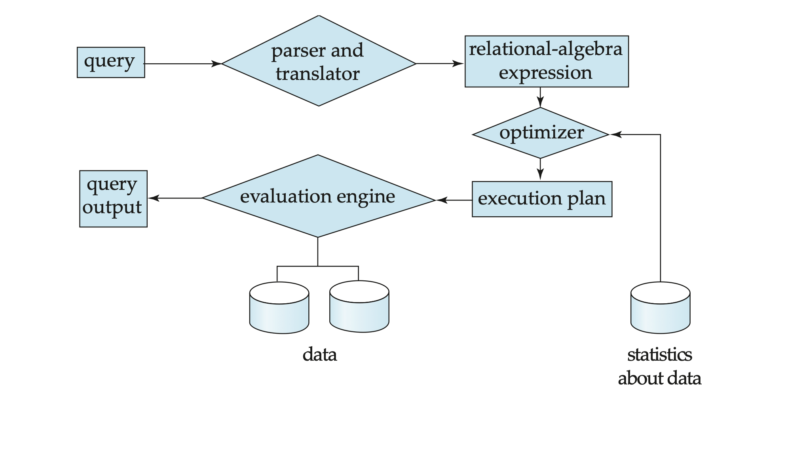{fig-align="center"}

## Example Query

Consider the following query on our movie database:

```sql
SELECT runtime
FROM Movie
WHERE  runtime < 100
```

This query can be translated into the following relational-algebra expressions:

- $\sigma_{runtime < 100}(\pi_{runtime}(\text{Movie}))$
- $\pi_{runtime}(\sigma_{runtime < 100}(\text{Movie}))$

The first expression first projects the `runtime` attribute and then filters the results, while the second expression first filters the `Movie` relation and then projects the `runtime` attribute.

---

To specify how to evaluate a query, the DBMS needs to provide instructions on how to evaluate each operation in addition to the relational algebra query.

A relational algebra operation annotated with instructions is called an **evaluation primitive**.

A sequence of primitive operations that can be used to evaluate a query is a **query plan**.

## Query Cost

Each query plan has an associated cost.

Rather than users specifying how to evaluate a query, the DBMS chooses the plan with the lowest cost.

Determining the *best* plan is **query optimization**.

{fig-align="center"}

## Recall (L06): How Data Is Stored

:::: {.columns}
::: {.column width="45%"}
- A relation is stored as a *file of blocks* on disk.
    - a block (typically 4K&ndash;8K) is the smallest unit the disk can read or write

::: {.fragment fragment-index=1}
- Disk I/O is *the* expensive operation.
    - in the time it takes to read one block, the CPU can execute millions of instructions
:::

::: {.fragment fragment-index=2}
- Notation we'll use all lecture, for a relation *r*:
    - n~r~ = number of records
    - b~r~ = number of blocks
    - f~r~ = records per block (*blocking factor*)
:::
:::

::: {.column width="55%"}
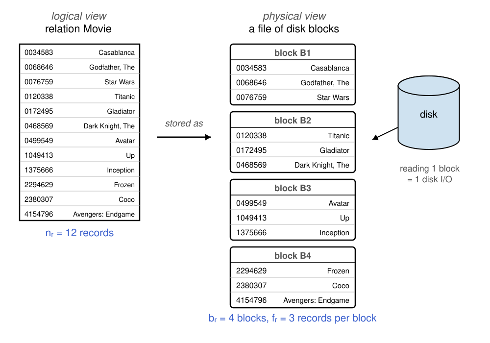{width="100%"}
:::
::::

::: {.fragment fragment-index=3}
- [Consequence: we measure the cost of an algorithm by *how many blocks it touches* &mdash; keep this picture in mind for every slide that follows.]{style="color:#3a5fcd;"}
:::

## Recall (L07): Indexes and B+Trees

:::: {.columns}
::: {.column width="48%"}
- A relation may also have *index structures*:
    - one *clustering (primary)* index &mdash; **stores the full records** (usually organized by the primary key)
    - any number of *secondary* indices &mdash; store (key, pointer) pairs, so reaching a record takes a *second* lookup

::: {.fragment fragment-index=1}
- B+trees (order *m*) are the standard index:
    - internal nodes hold m to 2m keys &rarr; m+1 to 2m+1 children; each node is one page/block
    - perfect balance: search = follow *one* root-to-leaf path
    - tree height &le; log~m~ n, and # of nodes accessed &le; height + 1
:::
:::

::: {.column width="52%"}
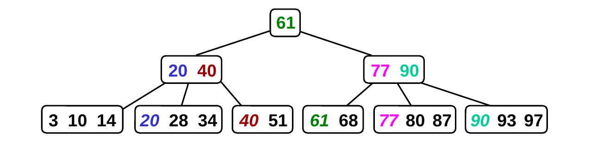{width="100%"}

::: {.fragment fragment-index=2}
- With order m = 100, every internal node has &ge; 101 children &mdash; two levels below the root already reach over 10,000 leaves.
    - hundreds of thousands of records, any of them &le; 3 block reads away
:::
:::
::::

::: {.fragment fragment-index=3}
- [An index turns "scan everything" into "follow one short path."]{style="color:#3a5fcd;"}
:::

## Measures of Query Cost

- Many factors: disk access, CPU, (network in distributed DBs)
    - disk access is typically dominant &rarr; we count disk I/O

- Cost of an operation that transfers *b* blocks with *S* seeks:
    - cost = b &times; t~T~ + S &times; t~S~
    - t~T~ = time per block transfer; t~S~ = time per seek

- Simplifications we'll make:
    - often just count *block transfers* (and sometimes seeks)
    - worst-case estimates: assume only the memory the algorithm needs

## Measures of Query Cost: Example

- Typical magnetic-disk values: t~S~ = 4 ms per seek, t~T~ = 0.1 ms per block.

::: {.fragment fragment-index=1}
- Read 100 *consecutive* blocks (one seek, then sequential transfers):
    - cost = 100 &times; 0.1 + 1 &times; 4 = [14 ms]{style="color:#3a5fcd;"}
:::

::: {.fragment fragment-index=2}
- Read 100 *scattered* blocks (every read needs its own seek):
    - cost = 100 &times; 0.1 + 100 &times; 4 = [410 ms &mdash; ~30&times; slower!]{style="color:#c00;"}
:::

::: {.fragment fragment-index=3}
- Two lessons for everything that follows:
    - fewer block reads is better&hellip;
    - &hellip;but *sequential* reads (scans) are much cheaper per block than *random* reads (index probes) &mdash; so counting transfers alone slightly flatters indexes
:::

## Selection: the Two Basic Strategies

Every selection algorithm is built from two ingredients:

- **Scan the file** (*linear search*)
    - read every block; works for *any* condition, with *no* index
- **Walk an index**
    - follow one root-to-leaf path; works only when a suitable index exists

::: {.fragment fragment-index=1}
- The full menu combines them &mdash; which combination applies depends on the *index* (clustering or secondary?) and the *condition* (equality on a key? on a non-key? a range?):
    - clustering index, equality on a non-key &rarr; walk, then read the *run* of consecutive matching blocks
    - secondary index, equality &rarr; walk, then chase one pointer *per match* (can be expensive!)
    - comparisons like &sigma;~year&le;1970~ &rarr; walk to the boundary, then scan from there
:::

::: {.fragment fragment-index=2}
- [We'll work through the two base cases carefully &mdash; everything else is a combination of them.]{style="color:#3a5fcd;"}
:::

## Selection by Scanning the File

- Running example: a toy instance of *Movie*, with n~r~ = 12 records, f~r~ = 3 records per block &rarr; b~r~ = 4 blocks.

- Linear search is the plan of last resort &mdash; it always works: no index needed, any condition, any file order.

::: {.r-stack}
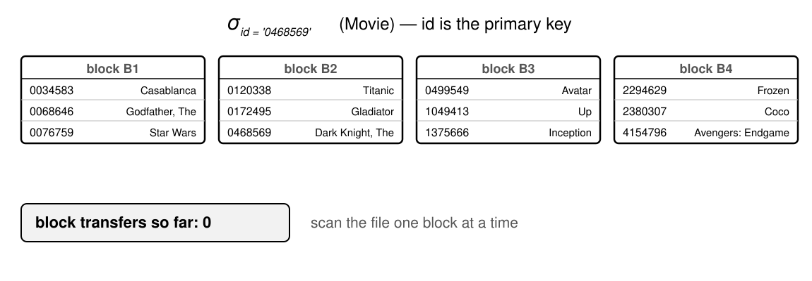{width="95%"}

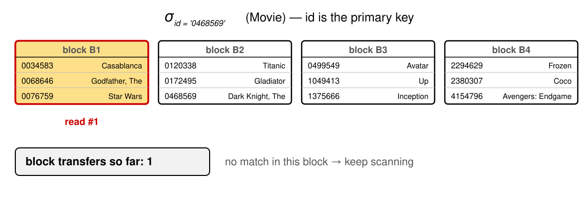{.fragment width="95%"}

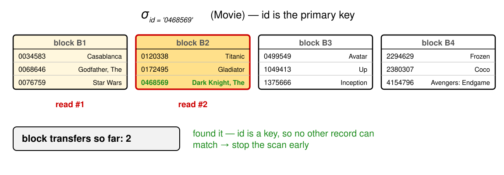{.fragment width="95%"}
:::

## Selection by Scanning: Cost

- Worst case: read the whole file
    - cost = b~r~ block transfers + 1 seek *(the blocks are consecutive &mdash; one seek suffices)*

- Equality on a *key* attribute (like `id`): stop at the first match
    - average cost &asymp; b~r~ / 2

::: {.fragment fragment-index=1}
- Equality on a *non-key* attribute (e.g., `year`, `genre`): matches can be anywhere
    - must read all b~r~ blocks, even if we find a match early
:::

::: {.fragment fragment-index=2}
- At toy scale this is fine. At real scale it hurts:

|  | b~r~ | scan average (key) |
|---|---|---|
| toy *Movie* | 4 | 2 reads |
| *Movie* in `movie.sqlite` (755 records) | 32 | 16 reads |
| *Person* at streaming-service scale (100,000) | 2,000 | 1,000 reads |
:::

## Selection via the Clustering Index

- Now use the clustering B+tree on *id* &mdash; and remember from L07 what *clustering* means: **the leaves store the full records**. The bottom level of the tree *is* the file.

- Search walks *one path*: root &rarr; leaf &mdash; and the record is in the leaf when we arrive.

::: {.r-stack}
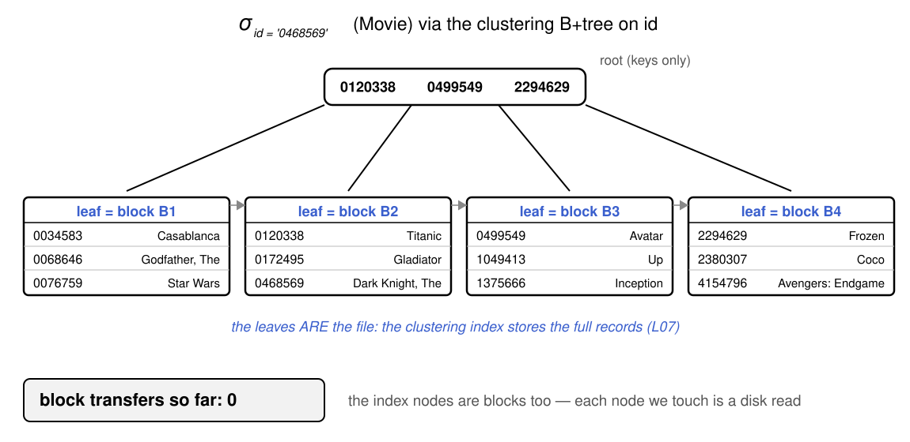{width="98%"}

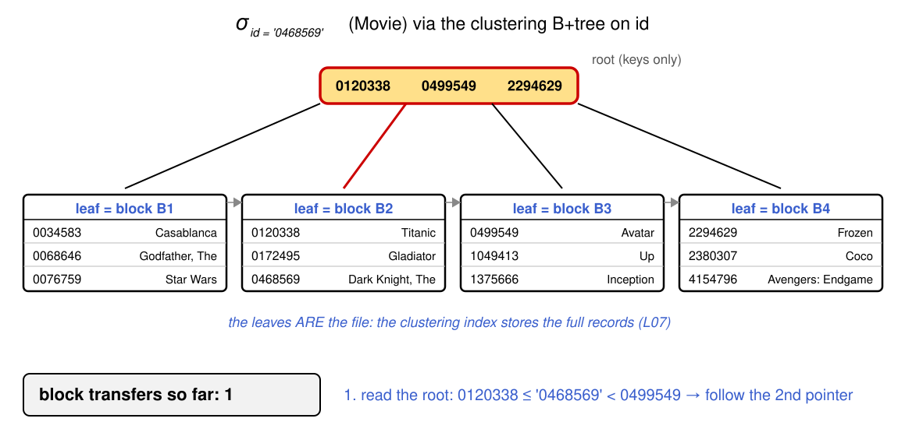{.fragment width="98%"}

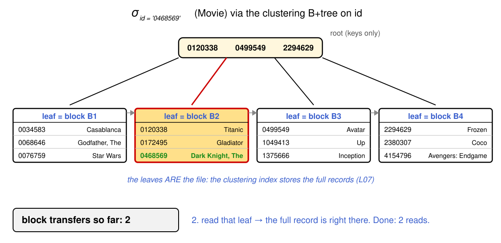{.fragment width="98%"}
:::

## Index Lookup: Cost &mdash; and When It Wins

- Cost = # of nodes on the root-to-leaf path = **height + 1** block transfers (L07)
    - each one is a *random* read: (height + 1) &times; (t~T~ + t~S~)

::: {.fragment fragment-index=1}
- On our toy file the index *didn't help*: 2 reads vs. an average of 2 for the scan!
    - index structures have overhead; on 4 blocks there's nothing to save
:::

::: {.fragment fragment-index=2}
- But the index cost grows with tree *height* (&le; log~m~ n~r~), while the scan grows with *file size*:

|  | b~r~ | scan average (key) | index (height + 1) |
|---|---|---|---|
| toy *Movie* | 4 | 2 | [2]{style="color:#c00;"} |
| *Movie* in `movie.sqlite` (755 records) | 32 | 16 | [2]{style="color:#1a8a1a;"} |
| *Person* at streaming scale (100,000) | 2,000 | 1,000 | [3]{style="color:#1a8a1a;"} |
:::

::: {.fragment fragment-index=3}
- [This tradeoff &mdash; *which plan wins depends on the data* &mdash; is exactly why the optimizer needs statistics (Part 2).]{style="color:#3a5fcd;"}
:::

## Which plan &mdash; and what cost?

Imagine *Movie* at streaming-service scale: b~r~ = 1,000 blocks, with a clustering B+tree on *id* of height 2. For the query
&sigma;~name='Casablanca'~(Movie) (no index on *name*), the best available strategy costs:

A\. 3 block transfers

B\. about 500 block transfers

C\. 1,000 block transfers [&larr; correct &mdash; linear search; *name* has no index, so we must scan every block]{.fragment style="color:#00b; font-weight:bold;"}

D\. 2,000 block transfers

::: {.fragment}
- The B+tree on *id* is useless here &mdash; an index only helps for conditions on *its* search key.
- And since *name* is not a key, we can't even stop at the first match.
:::

## Developing a Plan for a Join

- Let's follow the optimizer's problem for one concrete query &mdash; who acted in what:

```sql
SELECT p.name, a.movie_id
FROM Person p JOIN Actor a ON p.id = a.actor_id
```

:::: {.columns}
::: {.column width="55%"}
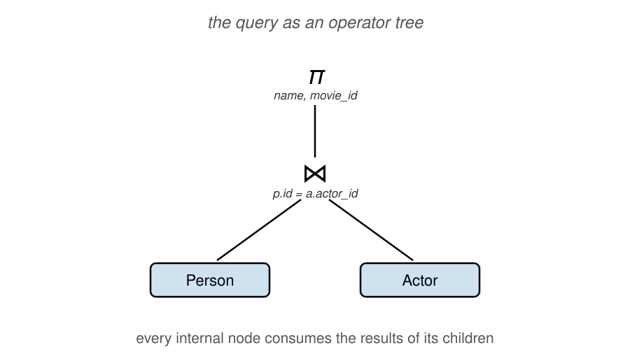{width="95%"}
:::

::: {.column width="45%"}
- Translated to relational algebra:
    - $\pi_{name,\, movie\_id}(\text{Person} \bowtie \text{Actor})$

::: {.fragment fragment-index=1}
- To turn this *expression* into a *plan*, the DBMS must decide, for the &bowtie; node:
    - which *algorithm* evaluates it
    - which input is *outer*, which is *inner*
    - whether to use an *index*
:::

::: {.fragment fragment-index=2}
- We'll price out the candidates on two scales:
    - a toy instance we can trace by hand
    - a scaled-up instance, the size a streaming service might manage
:::
:::
::::

## The Data, at Two Scales

- Toy instance (used in the traces on the next slides; short ids for readability):

|  | records n~r~ | blocks b~r~ | contents |
|---|---|---|---|
| *Person* | 4 | 2 | (101, Hanks), (102, Streep), (103, Pacino), (104, Bullock) |
| *Actor* | 6 | 3 | (101, 502), (101, 509), (102, 503), (103, 502), (103, 507), (104, 509) |

::: {.fragment}
- Scaled-up instance (a streaming service's catalog; f~r~ = 50 *Person* records or 200 *Actor* records per block):

|  | records n~r~ | blocks b~r~ |
|---|---|---|
| *Person* | 100,000 | 2,000 |
| *Actor* | 500,000 | 2,500 |

- Our `movie.sqlite` (2,698 people, 3,790 actor rows) sits in between &mdash; and at the end of the lecture we'll watch SQLite make these same choices on it.
:::

## Candidate 1: Nested-Loop Join

- The brute-force algorithm &mdash; like the linear scan, it always works (any join condition, no index needed):

```text
for each tuple t_a in Actor:           // Actor = outer relation
    for each tuple t_p in Person:      // Person = inner relation
        if t_p.id == t_a.actor_id:
            add (t_p, t_a) to the result
```

- In block terms: read each outer block once; for *every outer tuple*, re-scan all of the inner relation.
    - (the basic algorithm doesn't exploit the fact that *id* is a key &mdash; it just keeps scanning)

## Nested-Loop Join: Trace

::: {.r-stack}
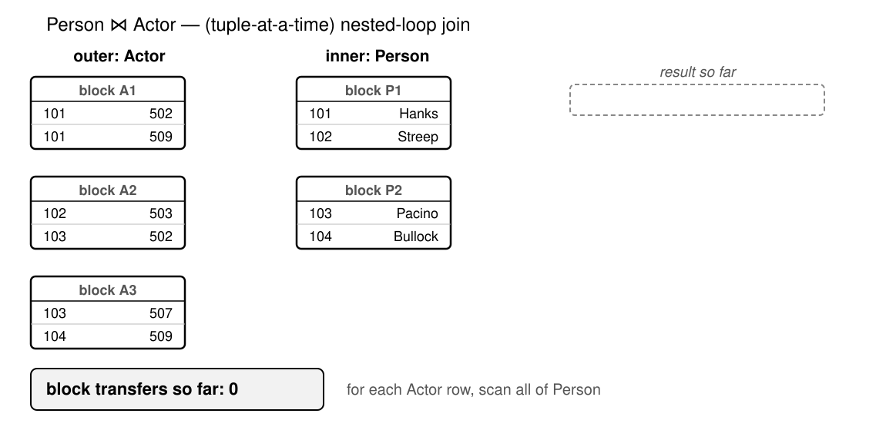{width="97%"}

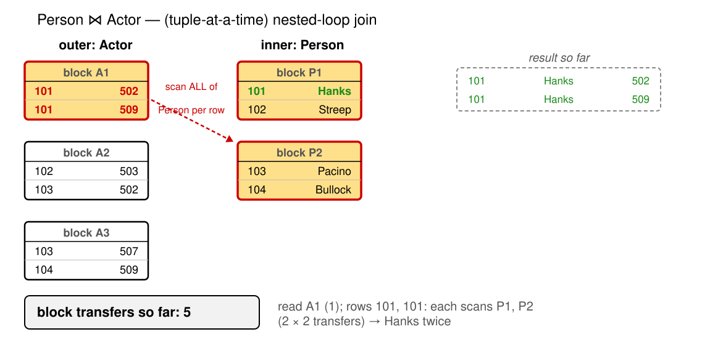{.fragment width="97%"}

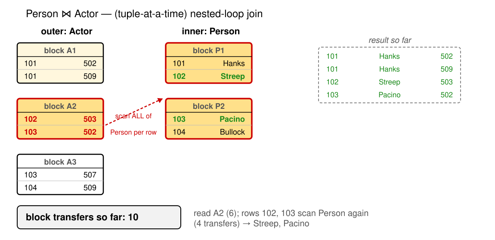{.fragment width="97%"}

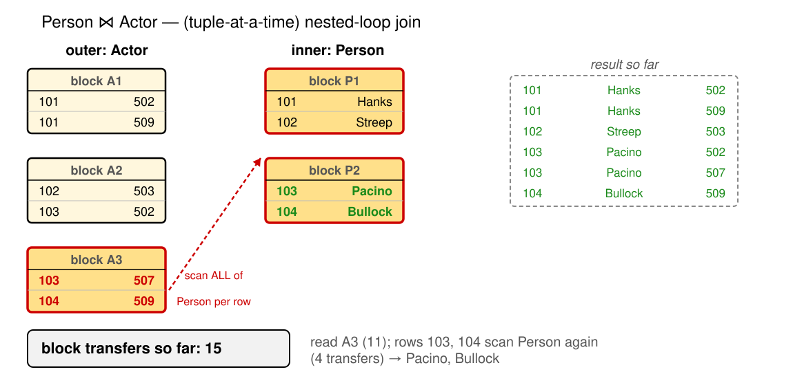{.fragment width="97%"}

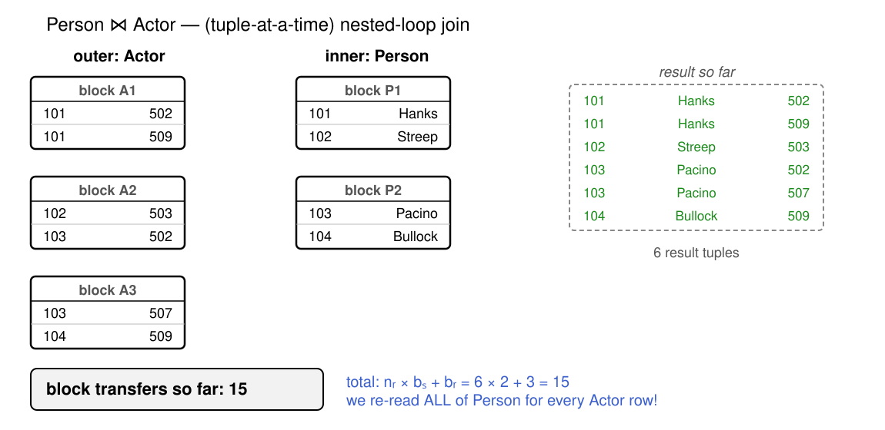{.fragment width="97%"}
:::

## Nested-Loop Join: Cost

- Worst case (only one block of memory per relation):
    - n~r~ &times; b~s~ + b~r~ block transfers &nbsp; (r = outer, s = inner)

- At streaming scale:
    - *Actor* outer: 500,000 &times; 2,000 + 2,500 = [1,000,002,500]{style="color:#c00;"} transfers
    - *Person* outer: 100,000 &times; 2,500 + 2,000 = [250,002,000]{style="color:#c00;"} transfers

::: {.fragment fragment-index=1}
- Best case: the inner relation fits entirely in memory
    - read each relation once: b~r~ + b~s~ = 4,500 transfers
:::

::: {.fragment fragment-index=2}
- *Block* nested-loop join: pair up *blocks* instead of tuples
    - worst case b~r~ &times; b~s~ + b~r~ = 2,000 &times; 2,500 + 2,000 = [5,002,000]{style="color:#3a5fcd;"} transfers
    - use the *smaller* relation as the outer relation
:::

::: {.fragment fragment-index=3}
- [Same answer, same result &mdash; a 200&times; cost difference just from how we loop.]{style="color:#3a5fcd;"}
:::

## Candidate 2: Indexed Nested-Loop Join

- Look back at the trace: for each Actor row we *re-scanned all of Person* &mdash; just to find the one record with a matching key.

::: {.fragment fragment-index=1}
- L07 gave us a better tool for exactly this &mdash; and the movie database already *has* it: the clustering B+tree on *Person(id)*.
- **Idea**: keep the outer loop, but replace each inner *scan* with an index *walk*:

```text
for each tuple t_a in Actor:              // outer, scanned as before
    walk the B+tree on Person(id)         // inner: root -> leaf
    to find the record with id == t_a.actor_id
```
:::

::: {.fragment fragment-index=2}
- Requirements:
    - an index on the *inner* relation's join attribute
    - a join condition that is an equality &mdash; like all our natural joins from L02
:::

## Indexed Nested-Loop Join: Trace

::: {.r-stack}
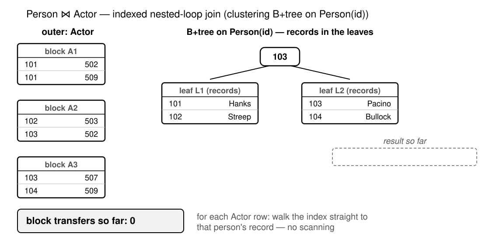{width="97%"}

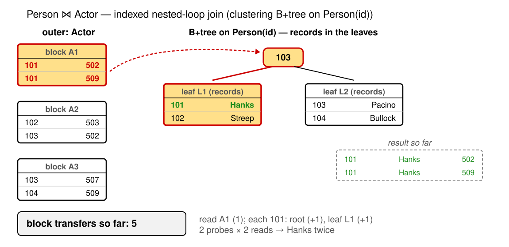{.fragment width="97%"}

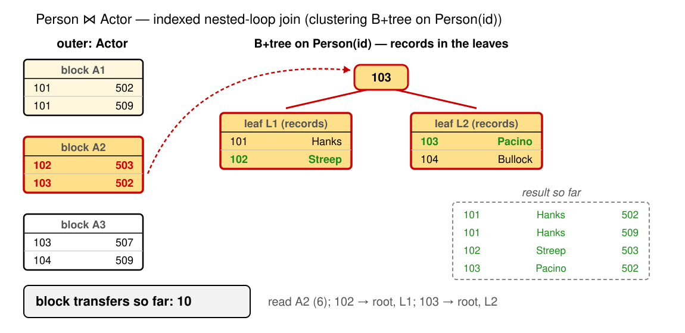{.fragment width="97%"}

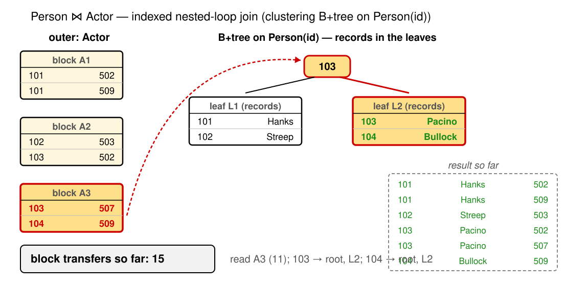{.fragment width="97%"}

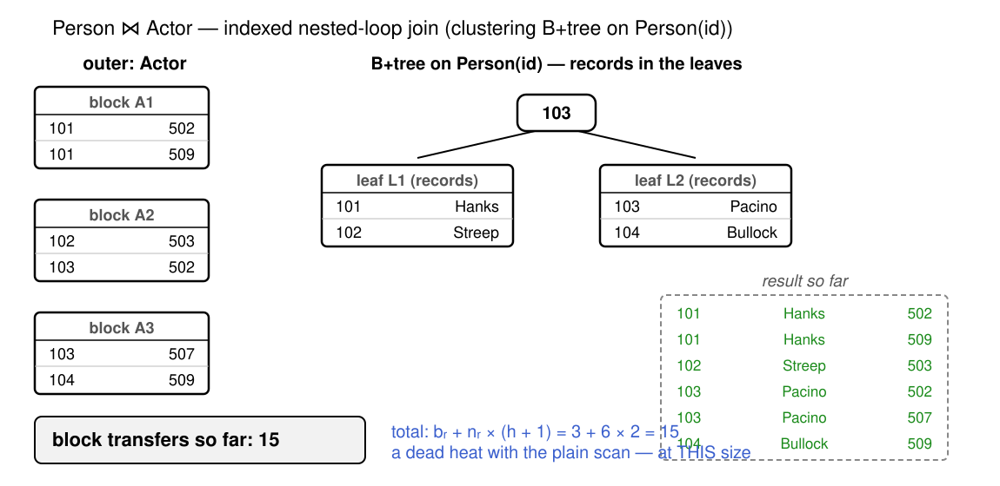{.fragment width="97%"}
:::

## Indexed Nested-Loop Join: Cost

- Cost = b~r~ + n~r~ &times; c
    - c = cost of one index lookup = height + 1 (the same formula as before)
    - c is an *estimate* &mdash; if a key's matches spanned several leaves, a probe would cost more

::: {.fragment fragment-index=1}
- On the toy instance: 3 + 6 &times; 2 = 15 transfers &mdash; a dead heat with the plain scan (15)!
    - just like selection: on tiny data, index overhead doesn't pay
:::

::: {.fragment fragment-index=2}
- At streaming scale (B+tree on *Person(id)* has height 2, so c = 3):
    - 2,500 + 500,000 &times; 3 = [1,502,500]{style="color:#1a8a1a;"} transfers

| plan | block transfers |
|---|---|
| NLJ, *Actor* outer | 1,000,002,500 |
| NLJ, *Person* outer | 250,002,000 |
| block NLJ, *Person* outer | 5,002,000 |
| **indexed NLJ, clustering index on Person(id)** | **1,502,500** |
:::

## The Winning Plan

:::: {.columns}
::: {.column width="60%"}
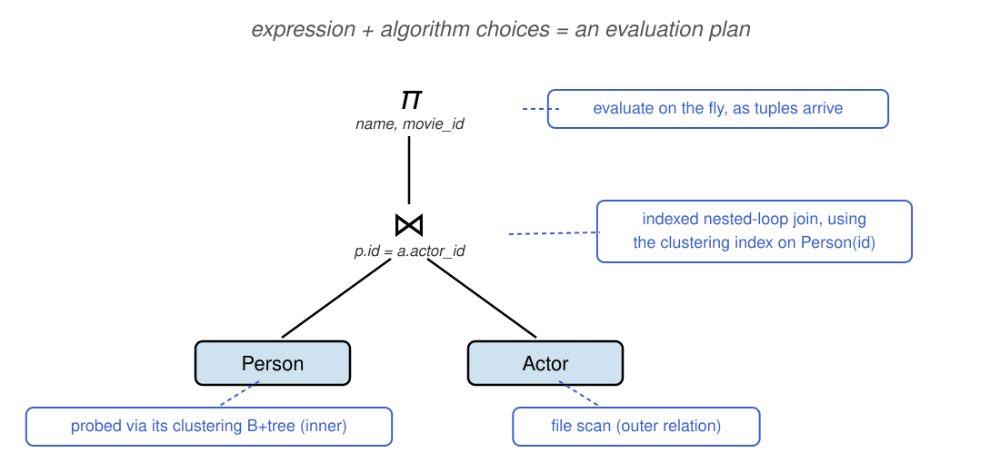{width="100%"}
:::

::: {.column width="40%"}
- The optimizer compares the *estimated* costs and annotates the tree with the cheapest choices.

::: {.fragment fragment-index=1}
- Notice how much it needed to know:
    - sizes n~r~, b~r~ of both relations
    - which indexes exist, and their heights
    - which relation to put on the outside
:::

::: {.fragment fragment-index=2}
- [Gathering those statistics and searching the space of alternatives *is* query optimization &mdash; Part 2.]{style="color:#3a5fcd;"}
:::
:::
::::

## What if Actor had an index too?

Suppose there were *also* a B+tree on *Actor(actor_id)* with lookup cost c = 3. Scanning *Person* as the outer (100,000 tuples) and probing *Actor* would cost b~r~ + n~r~ &times; c =

A\. 2,500 + 500,000 &times; 3 = 1,502,500 transfers

B\. 2,000 + 100,000 &times; 3 = 302,000 transfers [&larr; correct &mdash; *Person* is now the outer: b~r~ = 2,000, n~r~ = 100,000]{.fragment style="color:#00b; font-weight:bold;"}

C\. 2,000 + 500,000 &times; 3 = 1,502,000 transfers

D\. 2,500 + 100,000 &times; 3 = 302,500 transfers

::: {.fragment}
- Five times better &mdash; fewer outer tuples means fewer index probes.
- The best plan depends on *which indexes exist* and *which relation drives the loop*. In `movie.sqlite` only the *Person* index exists &mdash; which is why (as we'll see) SQLite scans *Actor*.
:::

## Join Operation: Merge Join and Hash Join

- *Merge join* (sort-merge join)
    - sort both inputs on the join attributes, then merge
    - cost b~r~ + b~s~ block transfers (plus the cost of sorting)
    - only for equality-based joins

- *Hash join*
    - partition both relations with a hash function on the join attributes
    - join matching partitions: build in-memory hash table, probe with the other relation
    - cost &asymp; 3(b~r~ + b~s~) if no recursive partitioning
    - only for equality-based joins

- Which join algorithm wins depends on sizes, memory, indexes, sortedness

## Other Operations

- *Duplicate elimination*: via sorting or hashing
- *Projection*: drop attributes, then eliminate duplicates
- *Aggregation / grouping*: like duplicate elimination (sort or hash on grouping attributes; combine partial aggregates)
- *Set operations* (&cup;, &cap;, &minus;): variants of merge join or hash join
- *Outer joins*: modified join algorithms that pad non-matching tuples with nulls

## Evaluating Expressions

- So far we've priced *single operations*. But a query is a *tree* of operations &mdash; how do we run the whole tree?

- Running example, one selection richer than before:
    - $\pi_{name,\, actor\_id}\big(\sigma_{year = 2008}(\text{Movie}) \bowtie \text{Actor}\big)$

- Two strategies:
    - **materialization** &mdash; evaluate one operation at a time, saving intermediate results
    - **pipelining** &mdash; evaluate several operations simultaneously, streaming tuples between them

## Materialization

:::: {.columns}
::: {.column width="62%"}
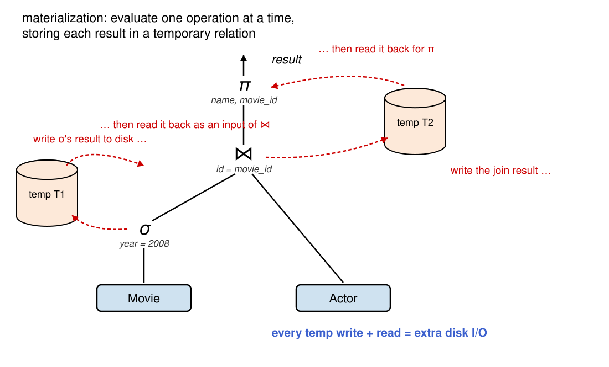{width="100%"}
:::

::: {.column width="38%"}
- Evaluate the tree *bottom-up*, one operation at a time:
    - run &sigma; to completion &rarr; write temp T1
    - join T1 with *Actor* &rarr; write temp T2
    - run &pi; over T2 &rarr; result

::: {.fragment fragment-index=1}
- \+ always applicable &mdash; any operator, any memory budget
:::

::: {.fragment fragment-index=2}
- &ndash; cost of the plan is *more than* the sum of the operator costs:
    - each temp is written *and re-read*: extra 2 &times; b~T~ transfers per temp (roughly)
    - for a big intermediate result, the temp I/O can dominate everything
:::
:::
::::

## Pipelining

:::: {.columns}
::: {.column width="62%"}
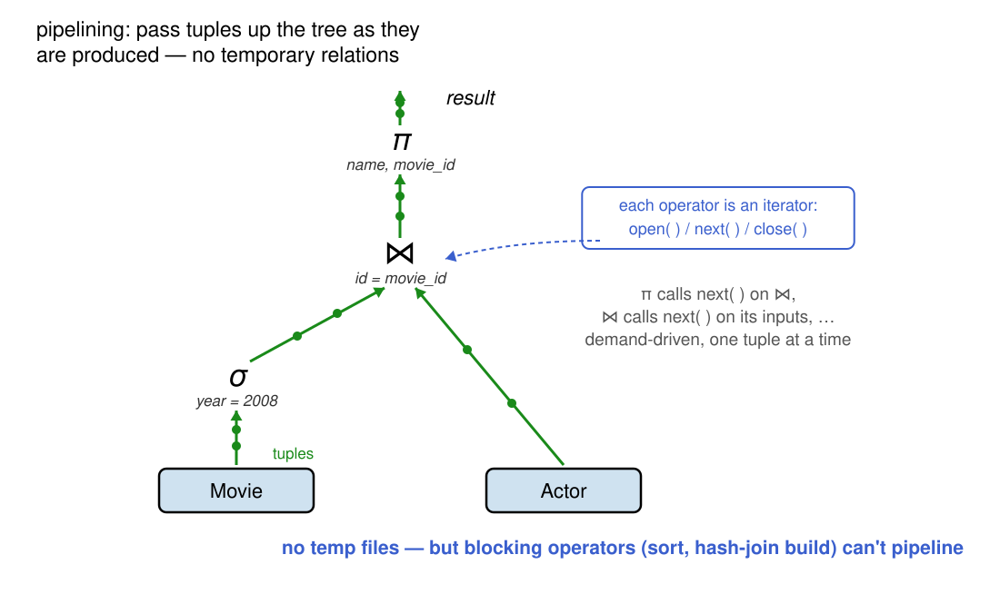{width="100%"}
:::

::: {.column width="38%"}
- Pass tuples from child to parent *as they are produced* &mdash; the operations run simultaneously.

::: {.fragment fragment-index=1}
- Implemented with the *iterator interface*: every operator provides open() / next() / close()
    - *demand-driven*: the root calls next() on its children, which call next() on theirs, &hellip;
    - each next() returns one tuple
:::

::: {.fragment fragment-index=2}
- \+ no temporary relations &mdash; the temp I/O disappears
- \+ first results appear early (nice for `LIMIT`, or for a user watching)
:::
:::
::::

## Pipelining: Not Always Possible

- Some operators are **blocking**: they must consume *all* of their input before producing their first output tuple.
    - sorting (e.g., for `ORDER BY`): can't emit the smallest tuple until it has seen every tuple
    - hash join: must finish *building* the hash table on one input before probing
    - grouped aggregation: a group's total isn't final until all input is seen

::: {.fragment fragment-index=1}
- A blocking operator cuts the pipeline: everything below it runs to completion first (materializing its output, at least logically).
:::

::: {.fragment fragment-index=2}
- Our example plan pipelines end-to-end: &sigma;, indexed NLJ, and &pi; are all non-blocking.
    - this is part of why the optimizer liked indexed NLJ!
:::

::: {.fragment}
Which of these operator trees can be *fully* pipelined?

A\. &pi; over merge-join (inputs unsorted)

B\. &sigma; over indexed nested-loop join [&larr; correct &mdash; neither operator needs to see its whole input first]{.fragment style="color:#00b; font-weight:bold;"}

C\. `ORDER BY` over &sigma;

D\. grouped `SUM` over a file scan
:::

# Part 2: Query Optimization

## Overview

- The same query &rarr; many equivalent relational-algebra expressions &rarr; many evaluation plans with wildly different costs

- Cost differences can be *orders of magnitude*

- Steps in cost-based optimization:
    - 1\. generate equivalent expressions using *equivalence rules*
    - 2\. annotate them with algorithms to get alternative plans
    - 3\. estimate each plan's cost using *statistics*, choose the cheapest

::: {.fragment}
- [We'll take the three steps in reverse order of novelty: we've already *seen* step 3 in action &mdash; that was Part 1's cost arithmetic. What's new is generating the alternatives (steps 1&ndash;2) and the statistics that feed step 3.]{style="color:#3a5fcd;"}
:::

## One Query, Many Plans

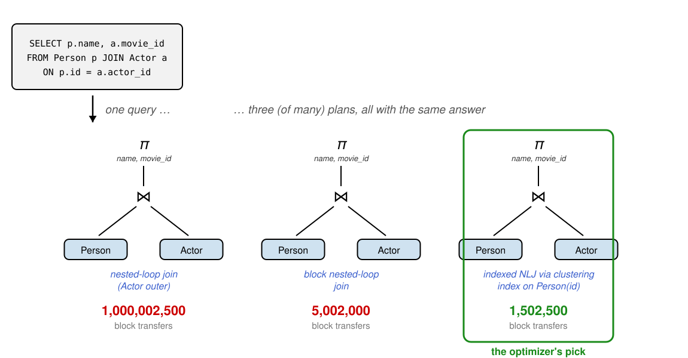{width="90%" fig-align="center"}

- This is just the *algorithm* dimension, for one fixed expression &mdash; a 650&times; spread on our two-relation query.
- Add the *expression* dimension (reordered joins, pushed-down selections) and multi-relation queries, and the spread grows further still.

## Equivalence Rules

- Two expressions are *equivalent* if they produce the same result on every legal database instance

- Highlights (there are ~16 such rules):
    - conjunctive selections can be split: &sigma;~&theta;1&and;&theta;2~(E) = &sigma;~&theta;1~(&sigma;~&theta;2~(E))
    - selection is commutative
    - joins are *commutative* and *associative* &mdash; the basis of join reordering
    - selection *distributes* over join (push selections down)
    - projection distributes over join (push projections down)
    - rules for set operations and outer joins (with caveats &mdash; e.g., outer joins are not associative)

::: {.fragment}
- [Each rule is a rewrite the optimizer may apply in either direction &mdash; the rules define the *space* of candidate expressions.]{style="color:#3a5fcd;"}
:::

## Two Rules, Pictured

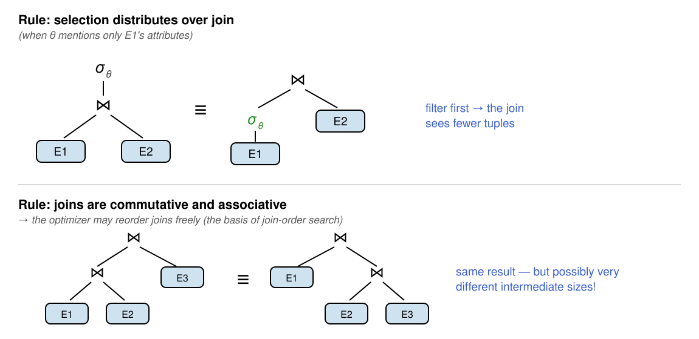{width="88%" fig-align="center"}

## Transformation Example: Step by Step

- Let's transform one query the way an optimizer would &mdash; the actors of 2008 movies (we'll meet this exact query again in SQLite):

::: {.r-stack}
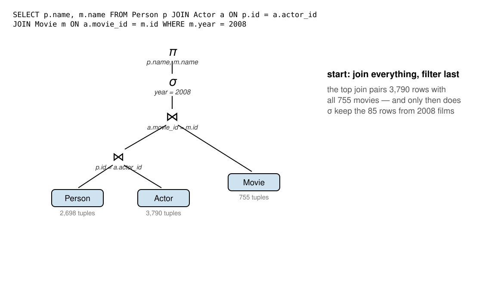{width="97%"}

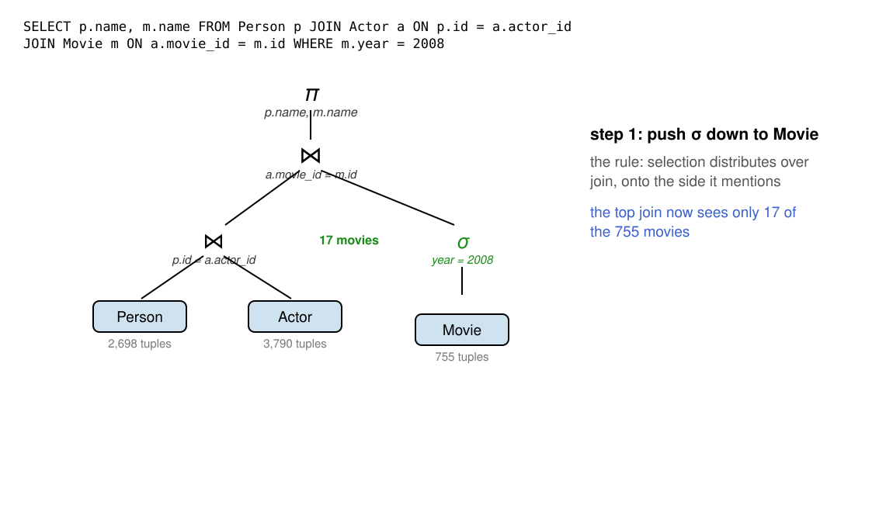{.fragment width="97%"}

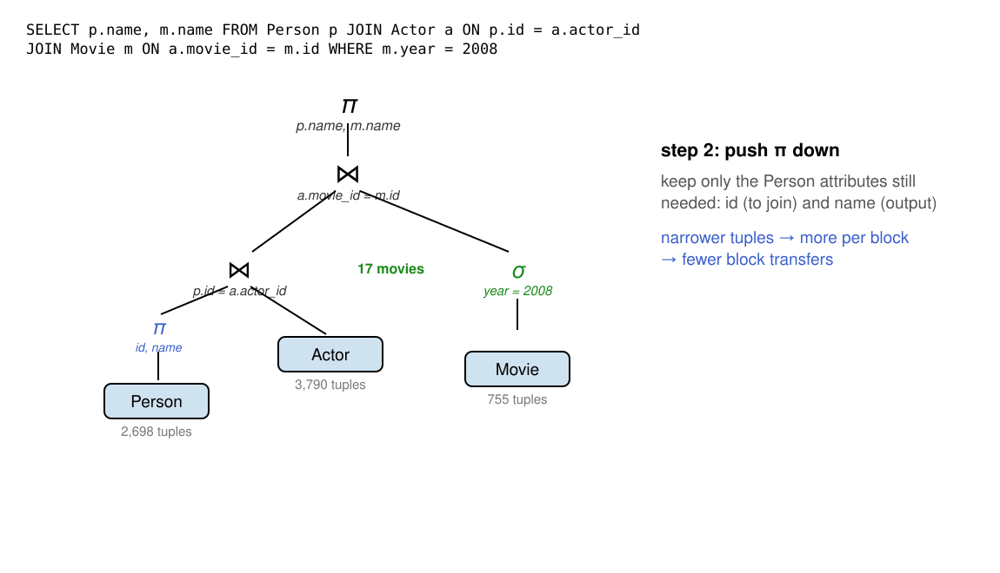{.fragment width="97%"}
:::

## Transformation Example: the Payoff

- Same answer, before and after &mdash; but compare what the top join has to do:

|  | movies entering the top join |
|---|---|
| original expression | all 755 |
| after pushing &sigma; down | 17 |

::: {.fragment fragment-index=1}
- And a smaller join input doesn't just mean fewer comparisons:
    - 17 *Movie* tuples fit in a single block &rarr; that side of the join lives entirely in memory
:::

::: {.fragment fragment-index=2}
- But wait &mdash; the optimizer chooses a plan *before running anything*. How did it know the &sigma; would keep 17 movies and not 700?
    - it didn't &mdash; it *estimated* the size, from statistics
    - that's the next stop
:::

## Statistics and Size Estimation

- The catalog stores, for each relation r:
    - n~r~ (number of tuples), b~r~ (number of blocks), l~r~ (tuple size), f~r~ (blocking factor)
    - V(A, r): number of distinct values of attribute A

- *Selection size estimates*
    - equality &sigma;~A=v~: n~r~ / V(A,r) tuples
    - ranges: use min/max, or *histograms* for better accuracy

- *Join size estimates*
    - A is a key of r: at most n~s~ tuples
    - A a foreign key of s referencing r: exactly n~s~ tuples
    - general case: n~r~ &times; n~s~ / max(V(A,r), V(A,s))

## Size Estimation, Pictured

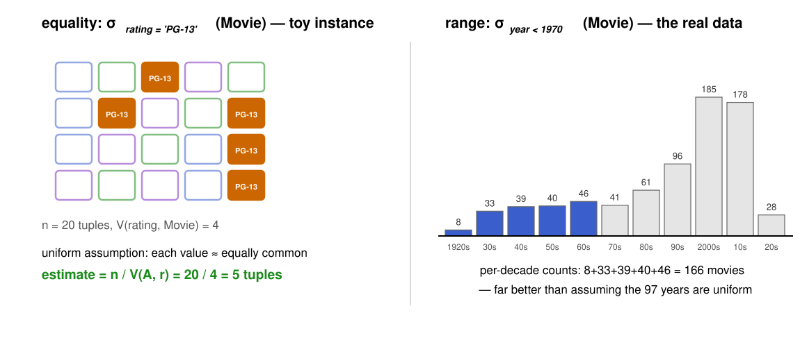{width="94%" fig-align="center"}

::: {.fragment}
- Estimates are *heuristics, not guarantees* &mdash; if PG-13 is far more common than G (it is!), n/V misjudges both.
- Wrong estimates &rarr; wrong plan choices; this is a leading cause of real-world slow queries. (Real systems: `ANALYZE`, auto-collected histograms.)
:::

## Estimate the size

*Movie* has n~r~ = 755 tuples and V(year, Movie) = 97 distinct years. The optimizer's estimate for
&sigma;~year=2008~(Movie) is:

A\. 97 tuples

B\. about 8 tuples [&larr; correct &mdash; n~r~ / V(A, r) = 755 / 97 &asymp; 7.8]{.fragment style="color:#00b; font-weight:bold;"}

C\. 17 tuples

D\. 755 tuples

::: {.fragment}
- The *actual* answer is 17 &mdash; recent years have far more movies than the 1920s, so the uniform assumption undercounts by 2&times;.
- Close enough to rank the plans correctly here &mdash; but this is exactly the kind of error that can flip a plan choice, and why real systems collect histograms.
:::

## Choosing a Join Order

- With n relations there are (2(n&minus;1))! / (n&minus;1)! join orders
    - n = 7 &rarr; 665,280 orders; n = 10 &rarr; over 176 billion

- *Dynamic programming*: find the best plan for every subset of relations, reusing sub-plans
    - "interesting sort orders" matter (e.g., merge join leaves output sorted)
    - many optimizers restrict to *left-deep* join trees

- *Heuristic optimization* (when full search is too costly):
    - perform selections and projections as early as possible
    - avoid Cartesian products
    - join the most restrictive relations first

## Join Trees: Left-Deep vs. Bushy

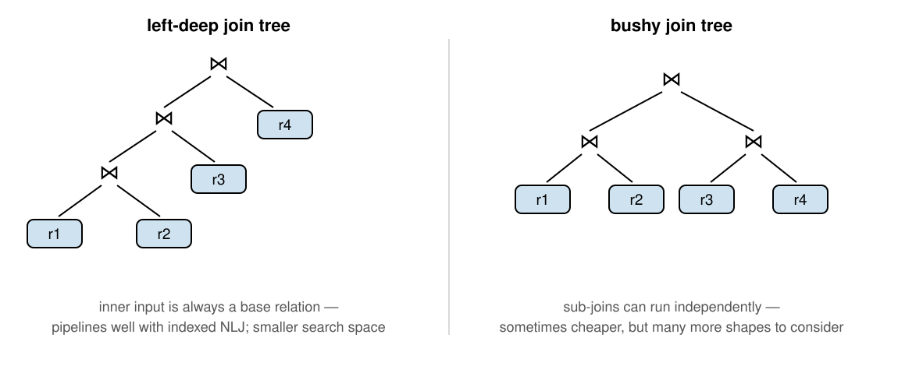{width="92%" fig-align="center"}

::: {.fragment}
- Restricting to left-deep trees shrinks the search space from (2(n&minus;1))!/(n&minus;1)! to n! &mdash; and every join can use a *base relation* (with its indexes!) as the inner input, exactly like our indexed NLJ plan.
:::

# Seeing the Optimizer at Work

## The Optimizer Is One Query Away

- Everything in this lecture happens *automatically*, on every query you run &mdash; and every real DBMS will show you its decision:
    - PostgreSQL / MySQL: `EXPLAIN` (and `EXPLAIN ANALYZE`)
    - SQLite: `EXPLAIN QUERY PLAN`

- We can inspect plans from Python, using our movie database (`data/movie.sqlite`):

```python
import sqlite3
con = sqlite3.connect("data/movie.sqlite")
cur = con.cursor()

def plan(sql):
    for row in cur.execute("EXPLAIN QUERY PLAN " + sql):
        print(row[3])          # the plan, one line per operation
```

- Each `PRIMARY KEY` gets an *automatic* index (`sqlite_autoindex_...`).
    - careful: SQLite stores the table itself in *rowid* order, so this autoindex is a **secondary** index (id &rarr; rowid) &mdash; finding a row takes an index walk *plus* one more lookup: L07's two-lookup pattern, live

## Reading a Plan: Selection

- Equality on the primary key:

```python
plan("SELECT name FROM Movie WHERE id = '0468569'")
```

```text
SEARCH Movie USING INDEX sqlite_autoindex_Movie_1 (id=?)
```

- Equality on a non-indexed attribute:

```python
plan("SELECT name FROM Movie WHERE year = 2008")
```

```text
SCAN Movie
```

::: {.fragment}
- You already know these two strategies:
    - [`SCAN` = linear search&emsp;&bull;&emsp;`SEARCH ... USING INDEX` = an index walk]{style="color:#3a5fcd;"}
:::

## Changing the Plan: CREATE INDEX

- Give the optimizer a new physical option&hellip;

```python
cur.execute("CREATE INDEX MovieYear ON Movie(year)")
plan("SELECT name FROM Movie WHERE year = 2008")
```

```text
SEARCH Movie USING INDEX MovieYear (year=?)
```

- &hellip;and it changes its choice: same query, same answer, new plan.
    - `CREATE INDEX` is a *physical-layer* change &mdash; SQL never mentions it; only the cost changes

::: {.fragment}
- The index also changes *other* queries. Remember `USE TEMP B-TREE` (that's an on-the-fly sort &mdash; a blocking operator!):

```python
plan("SELECT name FROM Movie ORDER BY year")
```

```text
-- before:  SCAN Movie  +  USE TEMP B-TREE FOR ORDER BY
-- after:   SCAN Movie USING INDEX MovieYear
```

- the index *provides* the sorted order &mdash; the sort disappears entirely
:::

## Reading a Plan: a Join

- The actors of 2008 movies &mdash; the very query from our transformation example (before adding any indexes of our own):

```python
plan("""SELECT p.name, m.name
        FROM Person p
        JOIN Actor a ON p.id  = a.actor_id
        JOIN Movie  m ON a.movie_id = m.id
        WHERE m.year = 2008""")
```

```text
SCAN a
SEARCH m USING INDEX sqlite_autoindex_Movie_1 (id=?)
SEARCH p USING INDEX sqlite_autoindex_Person_1 (id=?)
```

- Read it top-down as nested loops, outermost first:
    - for each *Actor* row (scanned) &rarr; probe *Movie* by id &rarr; probe *Person* by id

::: {.fragment}
- [This is our *indexed nested-loop join* &mdash; scan the outer, probe *Person* through its index &mdash; in a *left-deep* tree, exactly the plan we costed by hand.]{style="color:#3a5fcd;"}
:::

## Changing the Join Order

- Only 17 of the 755 movies are from 2008 &mdash; the current plan scans all 3,790 *Actor* rows anyway. Give the optimizer what it's missing:

```python
cur.execute("CREATE INDEX ActorMovie ON Actor(movie_id)")
plan(...)     # the same three-relation join
```

```text
SEARCH m USING INDEX MovieYear (year=?)
SEARCH a USING INDEX ActorMovie (movie_id=?)
SEARCH p USING INDEX sqlite_autoindex_Person_1 (id=?)
```

- The join order *flipped*: start from the &asymp;17 matching movies, probe *Actor* per movie, probe *Person* per actor.
    - "join the most restrictive relation first" &mdash; the heuristic from a few slides ago, chosen automatically
    - and the &sigma; pushdown from the transformation example is realized here as "apply the year filter first"

::: {.fragment}
- And the statistics? `cur.execute("ANALYZE")` collects them (row counts and index selectivities, stored in `sqlite_stat1`) &mdash; that's the catalog from Part 2, live.
:::

::: {.fragment}
- [Try it yourself: run these against `data/movie.sqlite`, then try your own queries &mdash; predict the plan *before* you print it.]{style="color:#3a5fcd;"}
:::

## Wrap-Up

- Processing: every operator has several algorithms, each with a cost formula
    - selection: scan the file vs. walk an index &mdash; the index wins once the data is big
    - joins: nested loops vs. index probes on the inner &mdash; a 650&times; spread on the *same* query
- Whole expressions: materialize (always works, pays temp I/O) vs. pipeline (cheap, but blocking operators cut it)
- Optimization: equivalence rules generate the options; statistics pick the winner
- The biggest lever is usually *join order* and *pushing selections down*
- All of it is one `EXPLAIN QUERY PLAN` away &mdash; on any SQLite database, from Python
- Practice: join-cost problems in the homework and discussion sections &mdash; trace tiny joins and count the operations yourself

<!-- Optional advanced topics if time permits (ch16 §16.4+):
     nested-subquery decorrelation, materialized views and view maintenance,
     top-K queries, plan caching / parametric optimization -->
