## Transactions: An Overview

- A *transaction* is a sequence of operations that is treated as a single logical operation. (abbreviation = txn)
- Example: a balance transfer

```text
transaction T1
read balance1
write(balance1 - 500)
read balance2
write(balance2 + 500)
```

::: {.fragment}
- Transactions are *all-or-nothing*: all of a transaction's changes take effect or none of them do.
:::

## Executing a Transaction

- Issue a command indicating the start of the transaction.

::: {.fragment}
- Perform the operations in the transaction.
    - in SQL: SELECT, UPDATE, etc.
:::

::: {.fragment}
- End the transaction in one of two ways:
    - *commit it*: make all of its results visible and persistent
        - *all* of the changes happen
:::

::: {.fragment .sub}
- *roll it back / abort it*: undo all of its changes, returning to the state before the transaction began
    - *none* of the changes happen
:::

## Why Do We Need Transactions?

- To prevent problems stemming from system failures.
    - example: a balance transfer

```text
read balance1
write(balance1 - 500)
CRASH
read balance2
write(balance2 + 500)
```

## Why Do We Need Transactions? (cont.)

- To ensure that operations performed by different users don't overlap in problematic ways.
    - example: this should *not* be allowed

:::: {.columns}
::: {.column width="50%"}
```text
user 1
read balance1
write(balance1 - 500)


read balance2
write(balance2 + 500)
```
:::

::: {.column width="50%"}
```text
user 2
read balance1
read balance2
if (balance1 + balance2 < min)
    write(balance1 - fee)
```
:::
::::

## ACID Properties

- A transaction has the following "ACID" properties:
    - [A]{.underline}tomicity: either all of its changes take effect or none do

::: {.fragment .sub style="margin-left: 1em"}
- [C]{.underline}onsistency preservation: its operations take the database from one consistent state to another
    - consistent = satisfies the constraints from the schema, and any other expectations about the values in the database
:::

::: {.fragment .sub style="margin-left: 1em"}
- [I]{.underline}solation: it is not affected by and does not affect other concurrent transactions
:::

::: {.fragment .sub style="margin-left: 1em"}
- [D]{.underline}urability: once it commits, its changes survive failures
:::

::: {.fragment}
- The user plays a role in consistency preservation.
    - ex: add to balance2 the same amnt subtracted from balance1
:::

::: {.fragment .sub style="margin-left: 1em"}
- the DBMS helps by rejecting changes that violate constraints
:::

## Atomicity and Durability

- These properties are guaranteed by the part of the system that performs logging and recovery.

::: {.fragment}
- After a crash, the recovery subsystem:
    - *redoes* as needed all changes by committed txns
    - *undoes* as needed all changes by uncommitted txns
        - restoring the old values of the changed data items
:::

::: {.fragment}
- We'll look more at logging and recovery later in the semester.
:::

## Isolation

- To guarantee isolation, the DBMS has to prevent problematic interleavings like the one we saw earlier:

:::: {.columns}
::: {.column width="45%"}
```text
transaction T1
read balance1
write(balance1 - 500)


read balance2
write(balance2 + 500)
```
:::

::: {.column width="55%"}
```text
transaction T2

read balance1
read balance2
if (balance1 + balance2 < min)
    write(balance1 - fee)
```
:::
::::

::: {.fragment}
- One possibility: enforce a *serial schedule* (no interleaving).

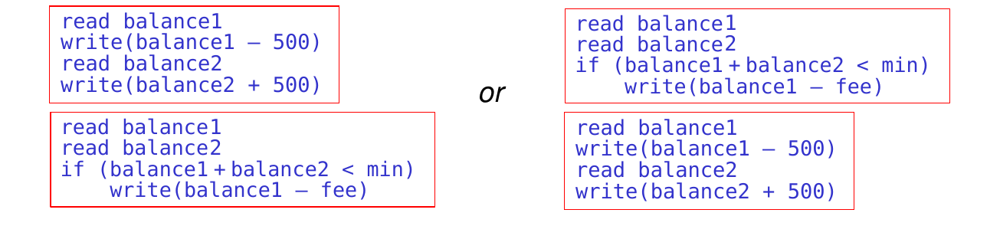{width="62%" fig-align="center"}
:::

::: {.fragment .sub}
- doesn't make sense for performance reasons. why?
:::

## Serializability

- A *serializable schedule* is one whose effects are equivalent to the effects of some serial schedule. For example:

::: {.r-stack}
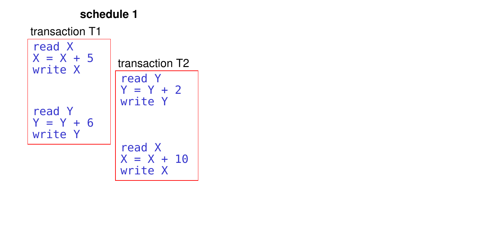{width="85%"}

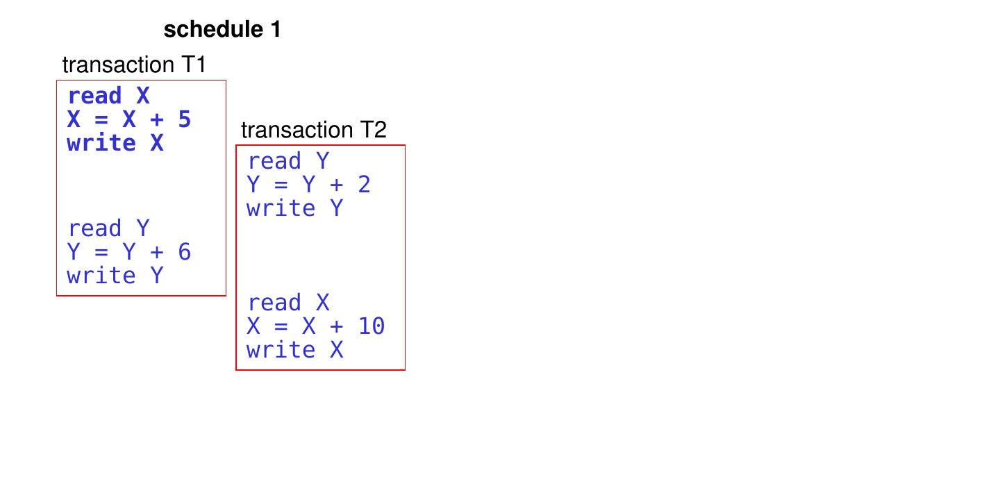{.fragment width="85%"}

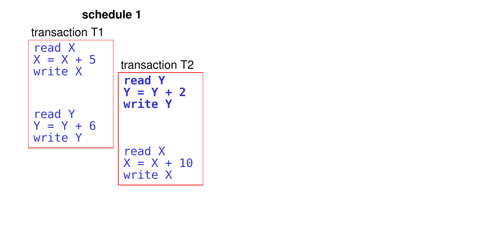{.fragment width="85%"}

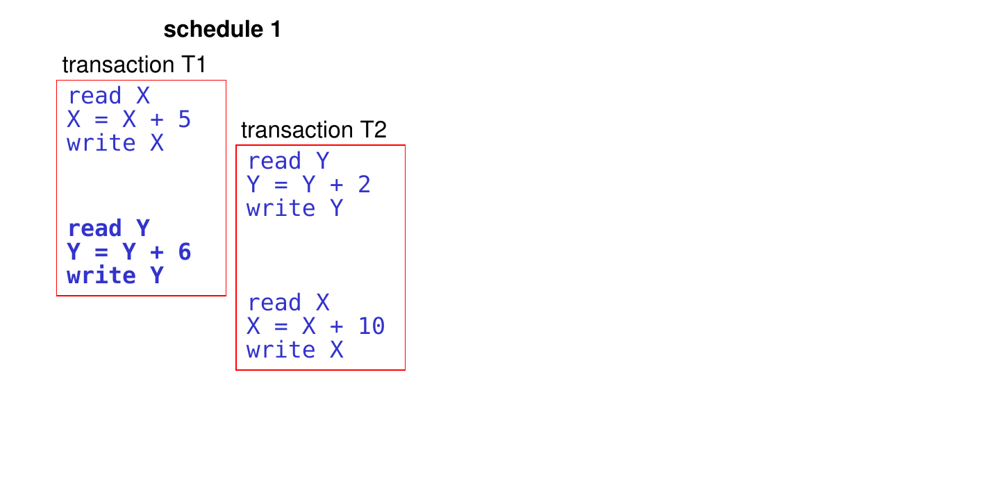{.fragment width="85%"}

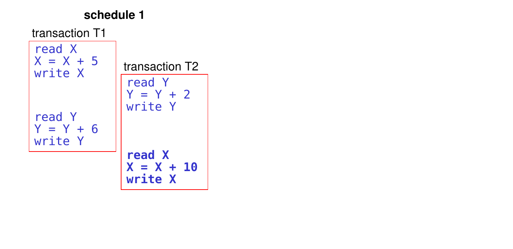{.fragment width="85%"}

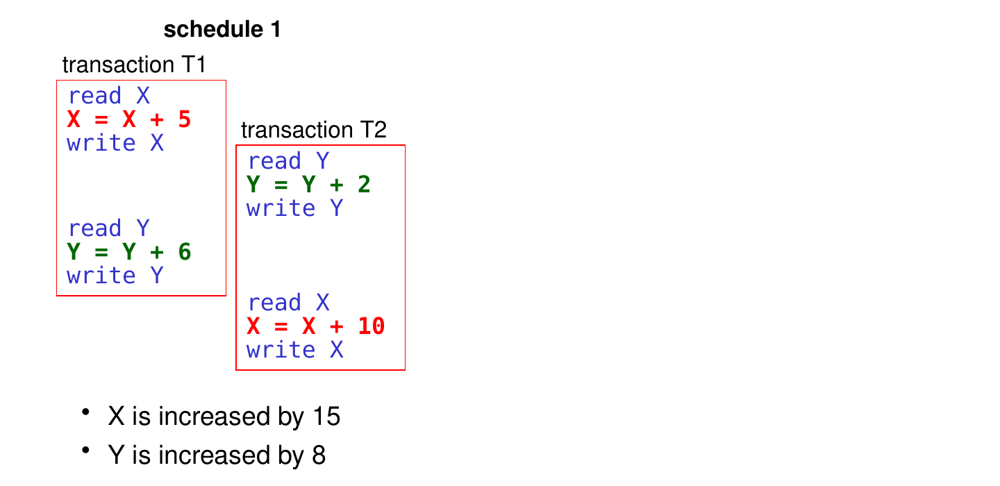{.fragment width="85%"}

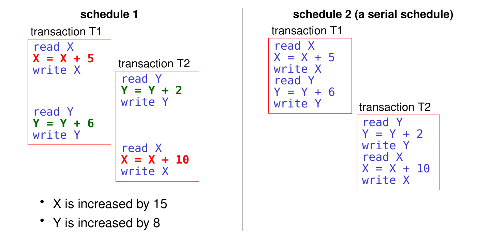{.fragment width="85%"}

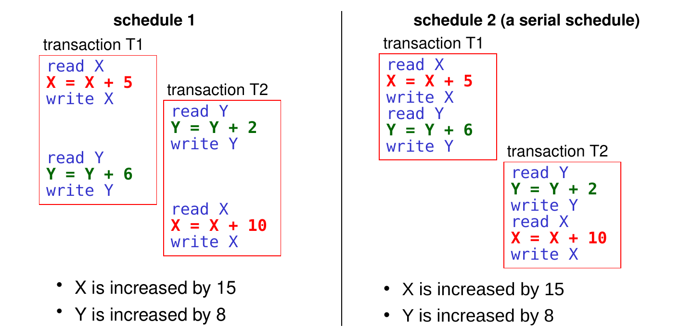{.fragment width="85%"}
:::

::: {.fragment}
- Because the effects of schedule 1 are equivalent to the effects of a serial schedule (schedule 2), schedule 1 is *serializable*.
:::

## Not All Schedules Are Serializable!

- Schedule 1 is a special case.

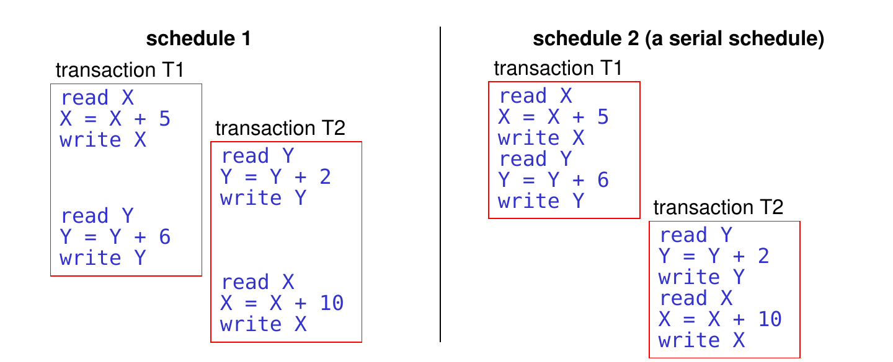{width="82%" fig-align="center"}

::: {.fragment .sub}
- both T1 and T2 use addition to change the values of X and Y
:::

::: {.fragment .sub}
- addition is commutative
:::

::: {.fragment .sub}
- thus, the order in which T1 and T2 make their changes doesn't matter!
:::

## Not All Schedules Are Serializable! (cont.)

- If we change T2 so that it uses multiplication, the original interleaving is no longer serializable.

::: {.r-stack}
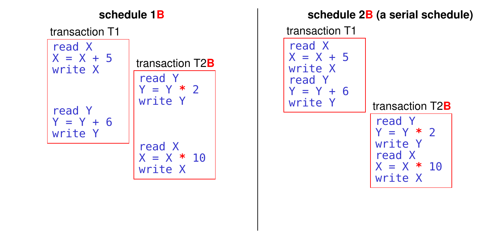{width="90%"}

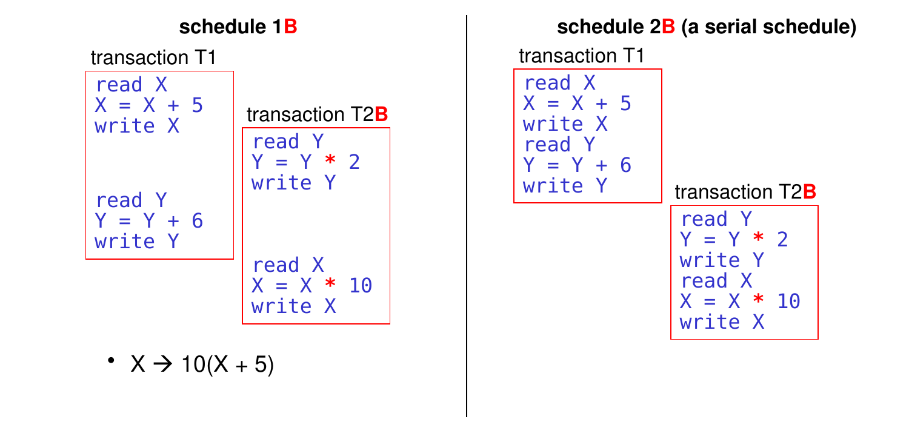{.fragment width="90%"}

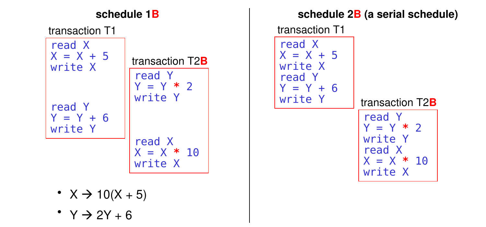{.fragment width="90%"}

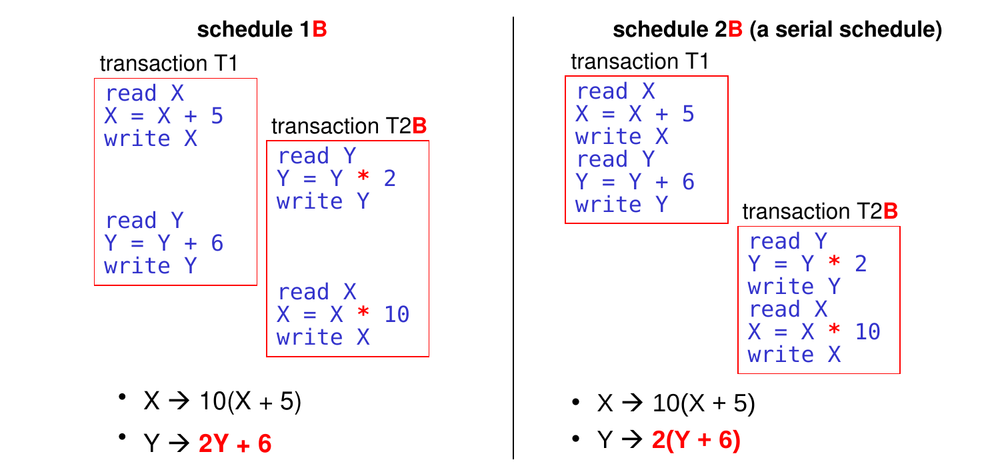{.fragment width="90%"}

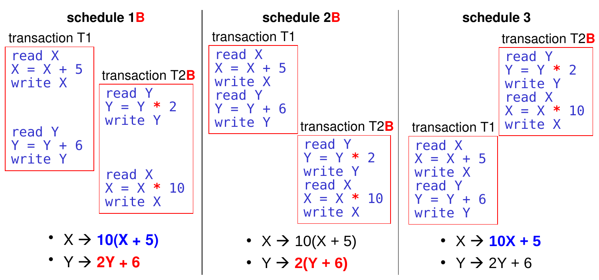{.fragment width="90%"}
:::

::: {.fragment}
- Because effects of schedule 1B are *not* equivalent to the effects of *any* serial schedule of T1 + T2B, schedule 1B is *not* serializable.
:::

## Conventions for Schedules

- We abstract all transactions into sequences of reads and writes.
    - example:

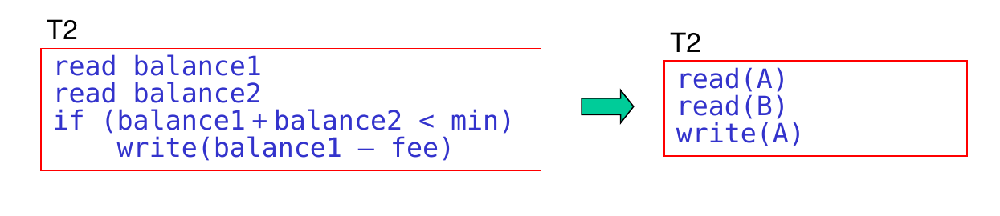{width="72%" fig-align="center"}

::: {.fragment .sub}
- we use a different variable for each data item that is read or written
:::

::: {.fragment .sub}
- we ignore:
    - the actual meaning and values of the data items
    - the nature of the changes that are made to them
    - things like comparisons that a transaction does in its own address space
:::

## Conventions for Schedules (cont.)

:::: {.columns}
::: {.column width="68%"}
- We can represent a schedule using a table.
    - one column for each transaction
    - operations are performed in the order given by reading from top to bottom
:::

::: {.column width="32%"}
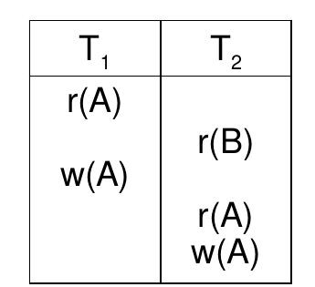{width="82%" fig-align="center"}
:::
::::

::: {.fragment}
- We can also write a schedule on a single line using this notation:
    - r~i~(A) = transaction T~i~ reads A
    - w~i~(A) = transaction T~i~ writes A
:::

::: {.fragment .sub}
- example for the table above:\
  &nbsp;&nbsp;&nbsp;&nbsp;r~1~(A)[; &nbsp;r~2~(B)]{.fragment}[; &nbsp;w~1~(A)]{.fragment}[; &nbsp;r~2~(A)]{.fragment}[; &nbsp;[w~2~(A)]{style="color:#0000ee;"}]{.fragment}
:::

## Which of the following expresses this schedule?

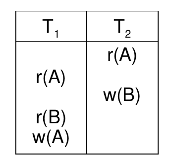{width="24%" fig-align="center"}

A\.  r~1~(A); r~2~(A); w~1~(B); r~2~(B); w~2~(A)

B\.  r~2~(A); w~2~(B); r~1~(A); r~1~(B); w~1~(A)

C\.  r~1~(A); r~1~(B); w~1~(A); r~2~(A); w~2~(B)

D\.  r~2~(A); r~1~(A); w~2~(B); r~1~(B); w~1~(A) [&larr; correct!]{.fragment style="color:#0000ee;"}

E\.  none of the above

## Serializability of Abstract Schedules

- How can we determine if an abstract schedule is serializable?
    - given that we don't know the exact nature of the changes made to the data

::: {.fragment}
- We focus on the following:
    - which transaction is the last one to write each data item
        - that's the version that will be seen after the schedule
:::

::: {.fragment .sub style="margin-left: 1em"}
- which version of a data item is read by each transaction
    - assume that if a transaction reads a different version, its subsequent behavior might be different
:::

## Conflicts in Schedules

- A *conflict* is a pair of actions that can't be swapped without potentially changing the behavior of one or more transactions.

:::: {.columns}
::: {.column width="70%"}
::: {.fragment fragment-index=1}
- Examples in the schedule at right:
:::

::: {.fragment .sub fragment-index=2}
- w~1~(A) and r~2~(A)
    - swapping them leads T2 to read a different value of A
:::

::: {.fragment .sub fragment-index=3}
- this may cause T2 to behave differently
:::

::: {.fragment .sub fragment-index=4}
- w~2~(B) and w~1~(B)
    - swapping them means later readers of B will see a different value of B
:::

::: {.fragment .sub fragment-index=5}
- this may cause them to behave differently
:::

::: {.fragment fragment-index=6}
- r~1~(B) and r~2~(B) do *not* conflict. why?
:::

::: {.fragment .sub fragment-index=7}
- [swapping them doesn't affect the value of B that txns see]{style="color:#0000ee;"}
:::
:::

::: {.column width="30%"}
::: {.r-stack}
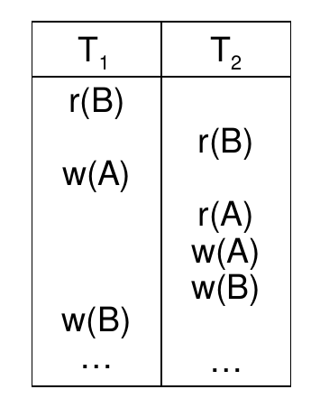{.fragment width="88%" fragment-index=1}

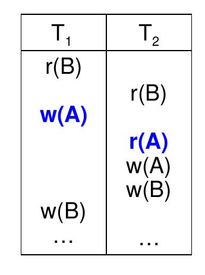{.fragment width="88%" fragment-index=2}

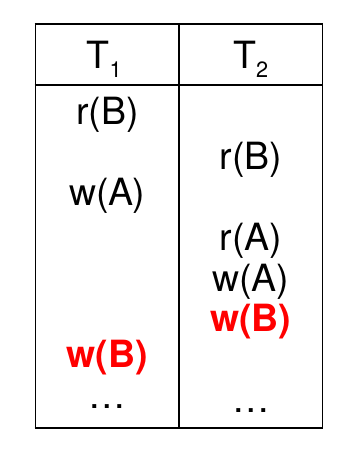{.fragment width="88%" fragment-index=4}

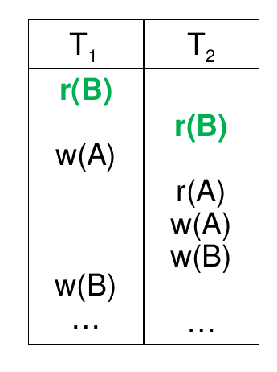{.fragment width="88%" fragment-index=6}
:::
:::
::::

## Which Actions Conflict?

- Actions in different transactions conflict if: 1) they involve the same data item *and* 2) at least one of them is a write

::: {.fragment}
- Pairs of actions that *do* conflict (assume i != j):
    - w~i~(A); r~j~(A) — the value read by T~j~ may change if we swap them
:::

::: {.fragment .sub style="margin-left: 1em"}
- r~i~(A); w~j~(A) — the value read by T~i~ may change if we swap them
:::

::: {.fragment .sub style="margin-left: 1em"}
- w~i~(A); w~j~(A) — subsequent reads may change if we swap them
:::

::: {.fragment .sub style="margin-left: 1em"}
- two actions from the same txn (their order is fixed by the client)
:::

::: {.fragment}
- Pairs of actions that *don't* conflict:
    - r~i~(A); r~j~(A) – two reads of the same item by different txns
:::

::: {.fragment .sub}
- operations on two *different* items by different txns:
    - r~i~(A); r~j~(B)
    - r~i~(A); w~j~(B)
    - w~i~(A); r~j~(B)
    - w~i~(A); w~j~(B)
:::

## Conflict Serializability

- Rather than ensuring serializability, it's easier to ensure a stricter condition known as *conflict serializability*.
- A schedule is *conflict serializable* if we can turn it into a serial schedule by swapping pairs of *consecutive* actions that *don't* conflict.

## Example of a Conflict Serializable Schedule

::: {.r-stack}
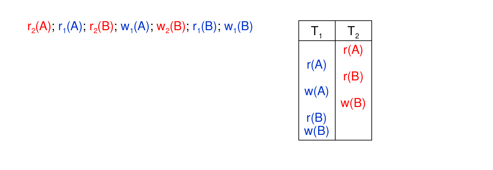{width="95%"}

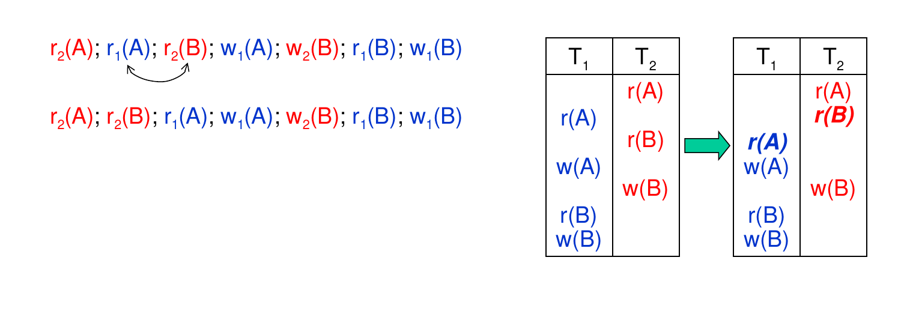{.fragment width="95%"}

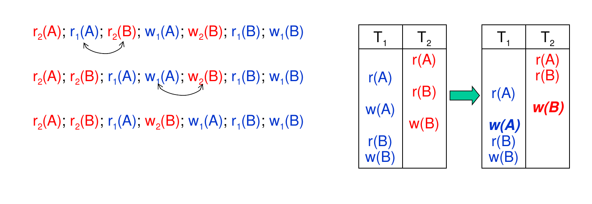{.fragment width="95%"}

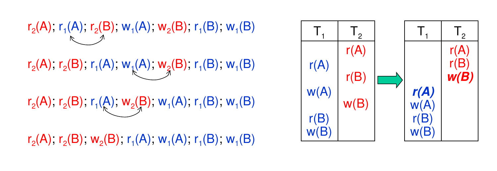{.fragment width="95%"}
:::

::: {.fragment}
- The final schedule is referred to as an *equivalent serial schedule*.
:::

::: {.fragment .sub}
- *serial* – all of T2, followed by all of T1
:::

::: {.fragment .sub}
- *equivalent* – it produces the same results as the original schedule
:::

## Testing for Conflict Serializability

- Because conflicting pairs of actions can't be swapped, they impose constraints on the order of the txns in an equivalent serial schedule.

::: {.fragment .sub style="margin-left: 1em"}
- example: if a schedule includes w~1~(A) … r~2~(A), T1 must come before T2 in any equivalent serial schedule
:::

::: {.fragment}
- To test for conflict serializability:
    - determine all such constraints
    - make sure they aren't contradictory
:::

::: {.fragment}
- Example: r~2~(A); r~1~(A); r~2~(B); w~1~(A); w~2~(B); r~1~(B); w~1~(B)
:::

::: {.fragment .sub style="margin-left: 1em"}
- r~2~(A) … w~1~(A) means T2 must come before T1
:::

::: {.fragment .sub style="margin-left: 1em"}
- r~2~(B) … w~1~(B) means T2 must come before T1
:::

::: {.fragment .sub style="margin-left: 1em"}
- w~2~(B) … r~1~(B) means T2 must come before T1
:::

::: {.fragment .sub style="margin-left: 1em"}
- w~2~(B) … w~1~(B) means T2 must come before T1
:::

::: {.fragment .sub style="margin-left: 1em"}
- [no contradictions, so this schedule is equivalent to the serial ordering T2;T1]{style="color:#0000ee;"}
:::

::: {.fragment .sub style="margin-left: 1em"}
- Thus, this schedule *is* conflict serializable.
:::

## Testing for Conflict Serializability (cont.)

- What about this schedule? &nbsp;r~1~(B); w~1~(B); r~2~(B); r~2~(A); w~2~(A); r~1~(A)
- **Which** of the following pairs of actions from this schedule conflict?

A\.  r~1~(B); r~2~(B) [— don't conflict – both are reads]{.fragment fragment-index=1 style="color:#0000ee;"}

B\.  r~1~(B); w~2~(A) [— don't conflict – they involve different data items]{.fragment fragment-index=2 style="color:#0000ee;"}

C\.  [w~1~(B); r~2~(B)]{.fragment .highlight-green fragment-index=3} [— conflict – same item, at least one write]{.fragment fragment-index=3 style="color:#0000ee;"}

D\.  [r~2~(B); r~2~(A)]{.fragment .highlight-green fragment-index=4} [— conflict – by the same txn, so can't reorder]{.fragment fragment-index=4 style="color:#0000ee;"}

E\.  [w~2~(A); r~1~(A)]{.fragment .highlight-green fragment-index=5} [— conflict – same item, at least one write]{.fragment fragment-index=5 style="color:#0000ee;"}

## Testing for Conflict Serializability (cont.)

- What about this schedule? &nbsp;r~1~(B); w~1~(B); r~2~(B); r~2~(A); w~2~(A); r~1~(A)
- ***What constraints do C and E impose on any equivalent serial schedule?***

A\.  r~1~(B); r~2~(B)

B\.  r~1~(B); w~2~(A)

C\.  [w~1~(B); r~2~(B)]{style="color:#009900;"} [— T1 must come before T2]{.fragment fragment-index=1 style="color:#0000ee;"}

D\.  r~2~(B); r~2~(A)

E\.  [w~2~(A); r~1~(A)]{style="color:#009900;"} [— T2 must come before T1]{.fragment fragment-index=2 style="color:#0000ee;"}

::: {.fragment fragment-index=2}
- [*contradiction!*]{style="color:#c00;"}
:::

::: {.fragment fragment-index=3}
- Thus, this schedule is *not* conflict serializable.
:::

## Using a Precedence Graph

- Tests for conflict serializability can use a *precedence graph*.
    - the vertices/nodes are the transactions
    - add an edge for each precedence constraint: T1 &rarr; T2 means T1 must come before T2 in an equivalent serial schedule

:::: {.columns}
::: {.column width="62%"}
::: {.fragment fragment-index=1}
- Example: r~2~(A); r~3~(A); r~1~(B); w~4~(A); w~2~(B); r~3~(B)
:::

::: {.fragment .sub fragment-index=2}
- r~2~(A) … w~4~(A) means T2 &rarr; T4
:::

::: {.fragment .sub fragment-index=3}
- r~3~(A) … w~4~(A) means T3 &rarr; T4
:::

::: {.fragment .sub fragment-index=4}
- r~1~(B) … w~2~(B) means T1 &rarr; T2
:::

::: {.fragment .sub fragment-index=5}
- w~2~(B) … r~3~(B) means T2 &rarr; T3
:::
:::

::: {.column width="38%"}
::: {.r-stack}
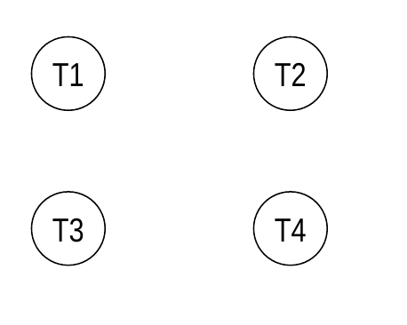{.fragment width="92%" fragment-index=1}

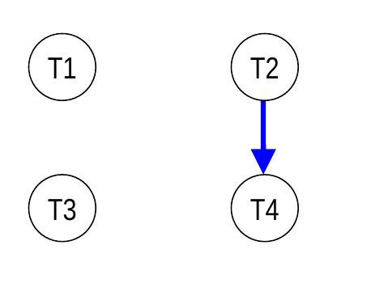{.fragment width="92%" fragment-index=2}

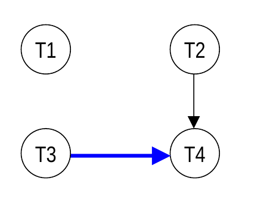{.fragment width="92%" fragment-index=3}

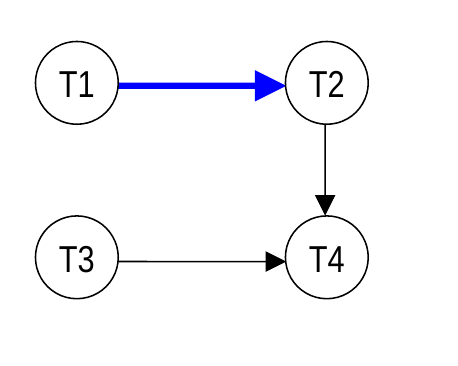{.fragment width="92%" fragment-index=4}

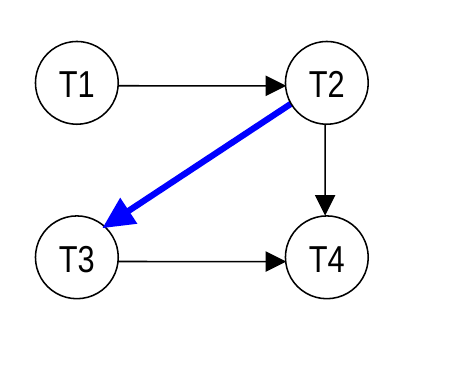{.fragment width="92%" fragment-index=5}

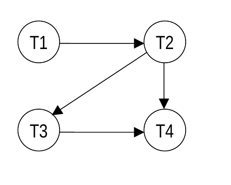{.fragment width="92%" fragment-index=6}
:::
:::
::::

::: {.fragment fragment-index=6}
- After the graph is constructed, we test for *cycles* (i.e., paths of the form A &rarr; … &rarr; A).
    - if the graph is acyclic, the schedule is conflict serializable
        - use the constraints to determine an equivalent serial schedule (in this case: T1;T2;T3;T4)
:::

::: {.fragment .sub fragment-index=7 style="margin-left: 1em"}
- if there's a cycle, the schedule is *not* conflict serializable
:::
