## From the last lecture…

- We can represent a schedule using a table.
    - one column for each transaction
    - operations are performed in the order given by reading from top to bottom

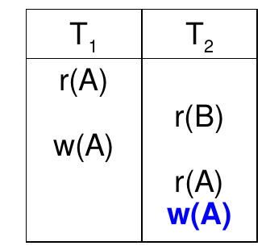{width="22%" fig-align="center"}

- We can also write a schedule on a single line using this notation:
    - r~i~(A) = transaction T~i~ reads A &emsp; [**w~i~(A) = transaction T~i~ writes A**]{style="color:#c00;"}
    - example for the table above: r~1~(A);&nbsp; r~2~(B);&nbsp; w~1~(A);&nbsp; r~2~(A);&nbsp; [**w~2~(A)**]{style="color:#0000ff;"}

## Recall: Actions That Conflict

- Actions in different transactions conflict if:
    1. they involve the same data item
    2. *and* at least one of them is a write

- Pairs of actions that *do* conflict (assume i != j):
    - w~i~(A); r~j~(A) — the value read by T~j~ may change if we swap them
    - r~i~(A); w~j~(A) — the value read by T~i~ may change if we swap them
    - w~i~(A); w~j~(A) — subsequent reads may change if we swap them
    - two actions from the same txn (their order is fixed by the client)

- Pairs of actions that *don't* conflict:
    - r~i~(A); r~j~(A) — two reads of the same item by different txns
    - r~i~(A); r~j~(B),&nbsp; r~i~(A); w~j~(B),&nbsp; w~i~(A); r~j~(B),&nbsp; w~i~(A); w~j~(B) — operations on two *different* items by different txns

## Recall: Using a Precedence Graph

- Tests for conflict serializability can use a *precedence graph*.
    - the vertices/nodes are the transactions
    - add an edge for each precedence constraint: T1 → T2 means T1 must come before T2 in an equivalent serial schedule

::::: {.columns}
:::: {.column width="52%"}
[Example:&nbsp; r~2~(A); r~3~(A); r~1~(B); w~4~(A); w~2~(B); r~3~(B)]{.fragment fragment-index=1}

[r~2~(A) … w~4~(A)&nbsp; means T2 → T4]{.fragment fragment-index=2}

[r~3~(A) … w~4~(A)&nbsp; means T3 → T4]{.fragment fragment-index=3}

[r~1~(B) … w~2~(B)&nbsp; means T1 → T2]{.fragment fragment-index=4}

[w~2~(B) … r~3~(B)&nbsp; means T2 → T3]{.fragment fragment-index=5}
::::

:::: {.column width="48%"}
::: {.r-stack}
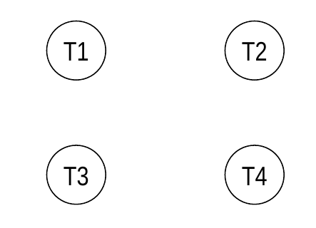{.fragment fragment-index=1 width="95%"}

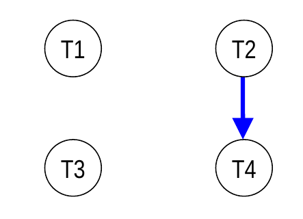{.fragment fragment-index=2 width="95%"}

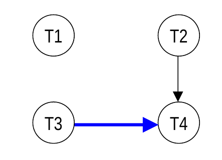{.fragment fragment-index=3 width="95%"}

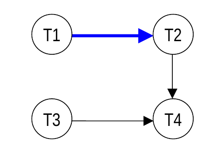{.fragment fragment-index=4 width="95%"}

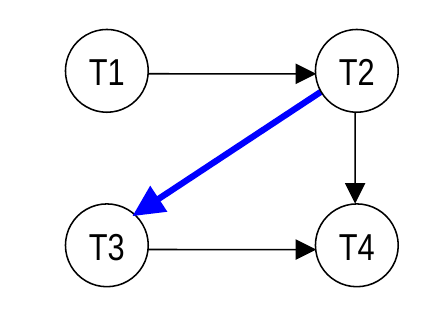{.fragment fragment-index=5 width="95%"}
:::
::::
:::::

::: {.fragment fragment-index=6}
- After the graph is constructed, we test for *cycles* (i.e., paths of the form A → … → A).
:::

::: {.fragment .sub fragment-index=7 style="margin-left: 1em"}
- if the graph is acyclic, the schedule *is* conflict serializable
    - use the constraints to determine an equivalent serial schedule (in this case: T1;T2;T3;T4)
:::

::: {.fragment .sub fragment-index=8 style="margin-left: 1em"}
- if there's a cycle, the schedule is *not* conflict serializable
:::

## More Examples

- Determine if the following are conflict serializable:
    - r~1~(A); r~3~(A); r~1~(B); w~2~(A); r~4~(A); w~2~(B); w~3~(C); w~4~(C); r~1~(C)

::::: {.columns}
:::: {.column width="50%"}
[r~1~(A) … w~2~(A)&nbsp; means T1 → T2]{.fragment fragment-index=1}

[r~3~(A) … w~2~(A)&nbsp; means T3 → T2]{.fragment fragment-index=2}

[r~1~(B) … w~2~(B)&nbsp; means T1 → T2]{.fragment fragment-index=3}

[w~2~(A) … r~4~(A)&nbsp; means T2 → T4]{.fragment fragment-index=4}

[w~3~(C) … w~4~(C)&nbsp; means T3 → T4]{.fragment fragment-index=5}

[w~3~(C) … r~1~(C)&nbsp; means T3 → T1]{.fragment fragment-index=6}

[w~4~(C) … r~1~(C)&nbsp; means T4 → T1]{.fragment fragment-index=7}
::::

:::: {.column width="50%"}
::: {.r-stack}
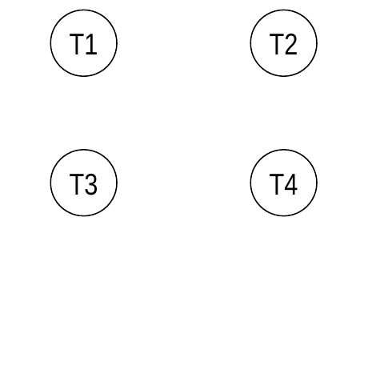{width="88%"}

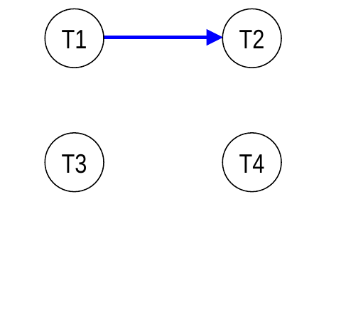{.fragment fragment-index=1 width="88%"}

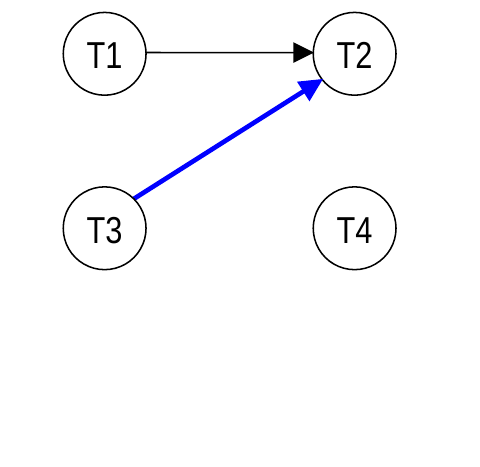{.fragment fragment-index=2 width="88%"}

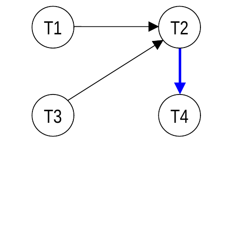{.fragment fragment-index=4 width="88%"}

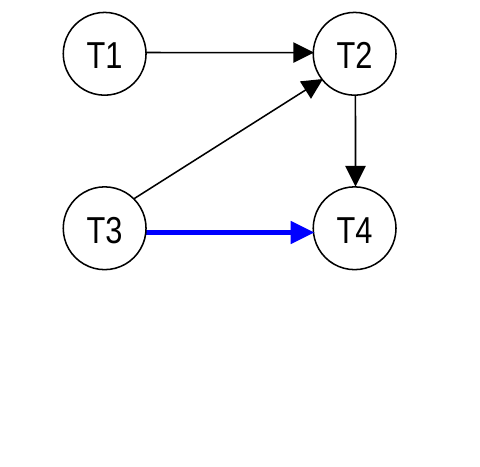{.fragment fragment-index=5 width="88%"}

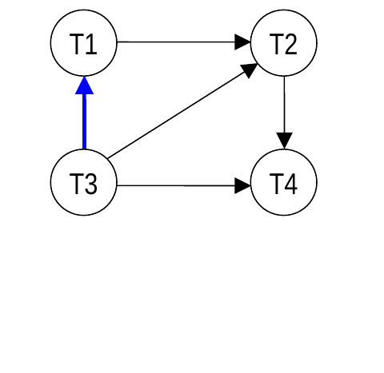{.fragment fragment-index=6 width="88%"}

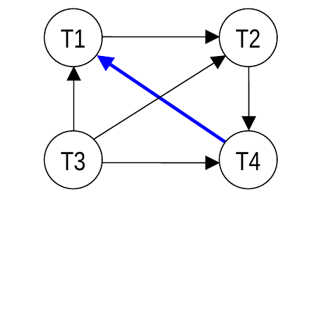{.fragment fragment-index=7 width="88%"}

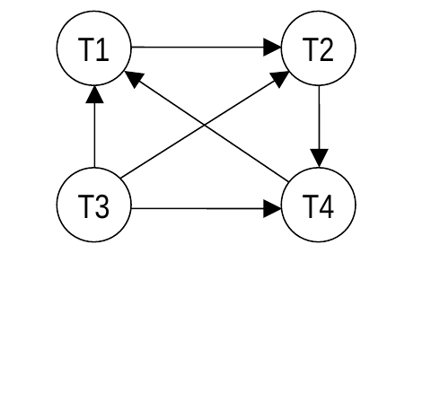{.fragment fragment-index=8 width="88%"}

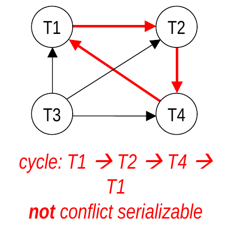{.fragment fragment-index=9 width="88%"}
:::
::::
:::::

## More Examples

- Determine if the following are conflict serializable:
    - r~1~(A); w~3~(A); w~4~(A); w~2~(B); r~2~(B); r~1~(B); r~4~(B)

::::: {.columns}
:::: {.column width="50%"}
[r~1~(A) … w~3~(A)&nbsp; means T1 → T3]{.fragment fragment-index=1}

[r~1~(A) … w~4~(A)&nbsp; means T1 → T4]{.fragment fragment-index=2}

[w~3~(A) … w~4~(A)&nbsp; means T3 → T4]{.fragment fragment-index=3}

[w~2~(B) … r~1~(B)&nbsp; means T2 → T1]{.fragment fragment-index=4}

[w~2~(B) … r~4~(B)&nbsp; means T2 → T4]{.fragment fragment-index=5}
::::

:::: {.column width="50%"}
::: {.r-stack}
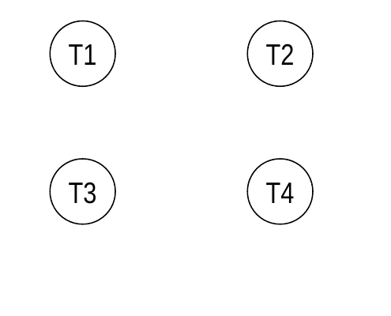{width="88%"}

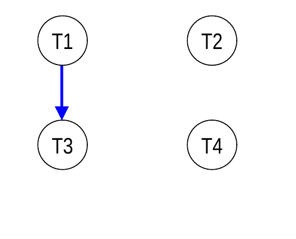{.fragment fragment-index=1 width="88%"}

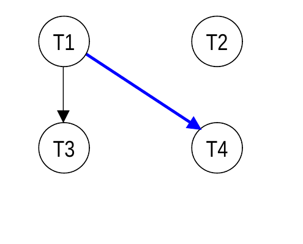{.fragment fragment-index=2 width="88%"}

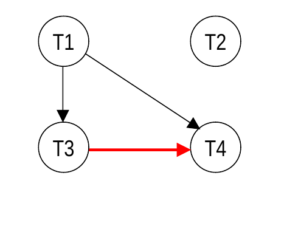{.fragment fragment-index=3 width="88%"}

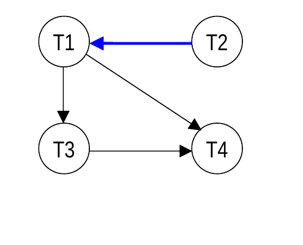{.fragment fragment-index=4 width="88%"}

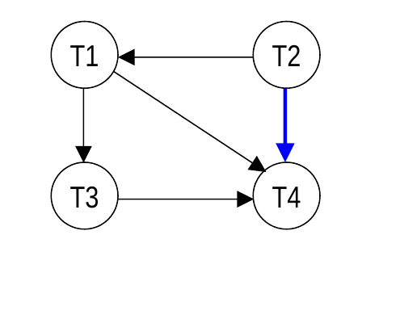{.fragment fragment-index=5 width="88%"}

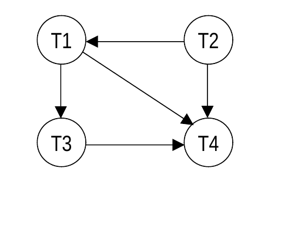{.fragment fragment-index=6 width="88%"}

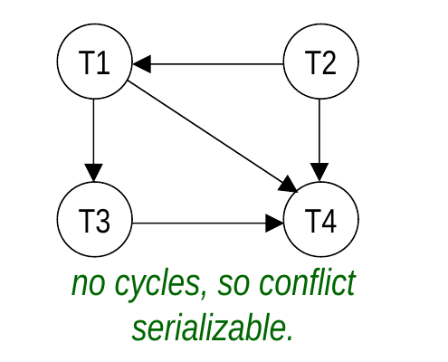{.fragment fragment-index=7 width="88%"}
:::

[equivalent serial ordering?]{.fragment fragment-index=7 style="color:#0000ff; font-weight:bold;"}

[→ equivalent to T2; T1; T3; T4]{.fragment fragment-index=8 style="color:#0000ff;"}
::::
:::::

## Is This Schedule Conflict Serializable?

- Draw the precedence graph to find out!
    - w~1~(A); r~2~(B); r~2~(A); r~4~(A); w~2~(B); r~4~(B); w~4~(C); r~3~(D); w~3~(C)

::::: {.columns}
:::: {.column width="48%"}
[w~1~(A) … r~2~(A)&nbsp; means T1 → T2]{.fragment fragment-index=1}

[w~1~(A) … r~4~(A)&nbsp; means T1 → T4]{.fragment fragment-index=2}

[w~2~(B) … r~4~(B)&nbsp; means T2 → T4]{.fragment fragment-index=3}

[w~4~(C) … w~3~(C)&nbsp; means T4 → T3]{.fragment fragment-index=4}
::::

:::: {.column width="52%"}
::: {.r-stack}
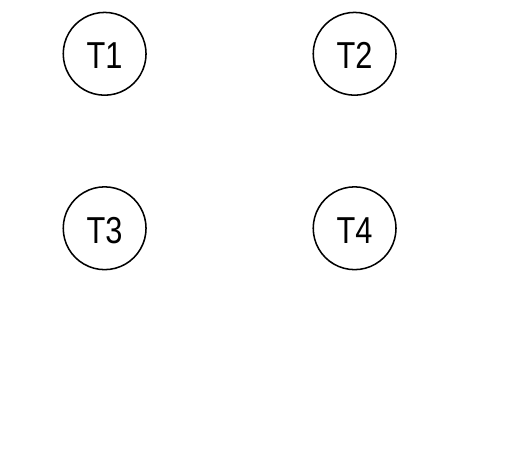{width="80%"}

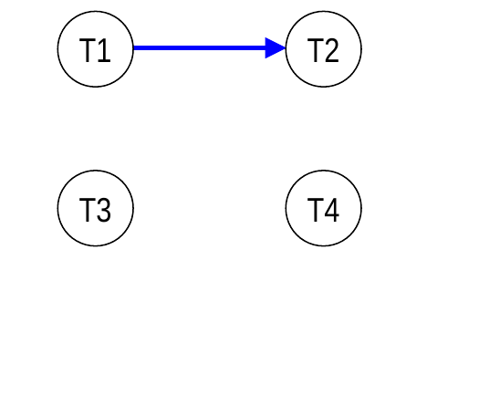{.fragment fragment-index=1 width="80%"}

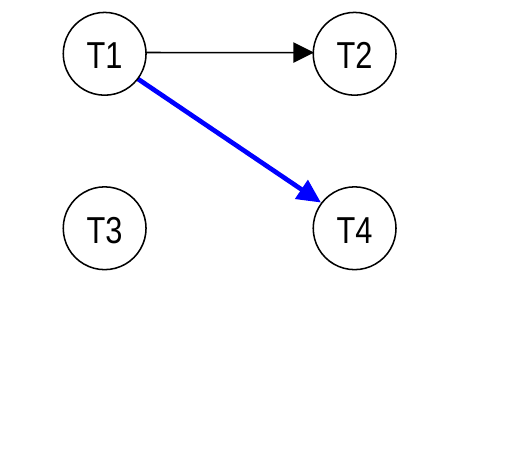{.fragment fragment-index=2 width="80%"}

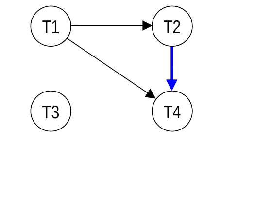{.fragment fragment-index=3 width="80%"}

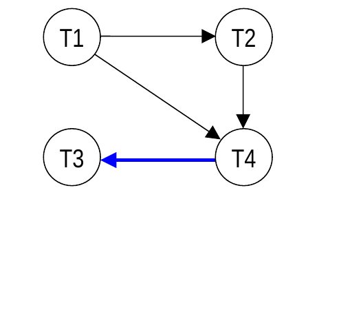{.fragment fragment-index=4 width="80%"}

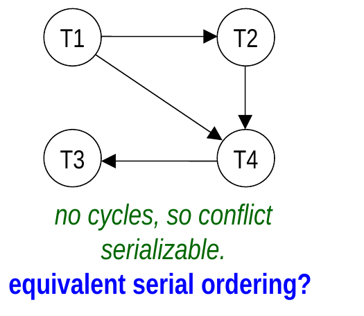{.fragment fragment-index=5 width="80%"}

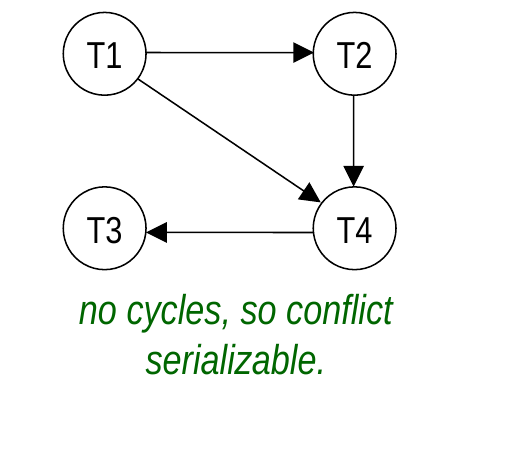{.fragment fragment-index=6 width="80%"}
:::
::::
:::::

A\. &nbsp;Yes. It is equivalent to the serial schedule T1;T2;T3;T4

B\. &nbsp;[Yes. It is equivalent to the serial schedule T1;T2;T4;T3]{.fragment .highlight-blue fragment-index=6}

C\. &nbsp;No. The graph includes the cycle T1 → T4 → T2 → T1

D\. &nbsp;No. The graph includes the cycle T1 → T2 → T4 → T1

## What If We Add This Write?

- Draw the precedence graph to find out!
    - w~1~(A); r~2~(B); r~2~(A); r~4~(A); w~2~(B); r~4~(B); w~4~(C); [***r~3~(D)***]{style="color:#0000ff;"}; w~3~(C); [**w~1~(D)**]{style="color:#0000ff;"}

::::: {.columns}
:::: {.column width="48%"}
w~1~(A) … r~2~(A)&nbsp; means T1 → T2

w~1~(A) … r~4~(A)&nbsp; means T1 → T4

w~2~(B) … r~4~(B)&nbsp; means T2 → T4

w~4~(C) … w~3~(C)&nbsp; means T4 → T3

[**r~3~(D) … w~1~(D)&nbsp; means T3 → T1**]{.fragment fragment-index=1 style="color:#0000ff;"}
::::

:::: {.column width="52%"}
::: {.r-stack}
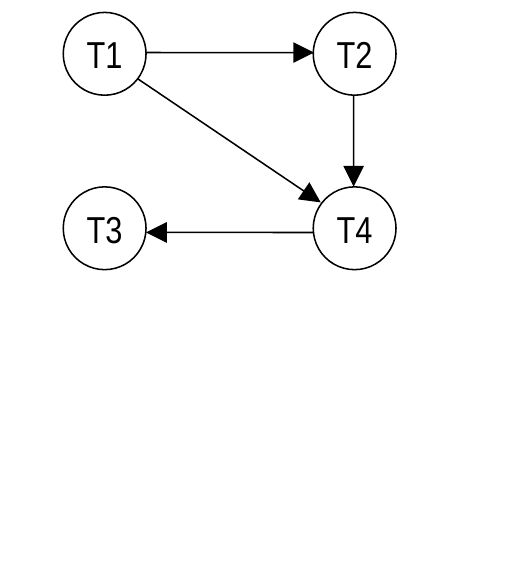{width="80%"}

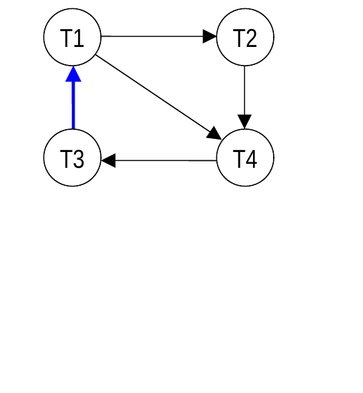{.fragment fragment-index=1 width="80%"}

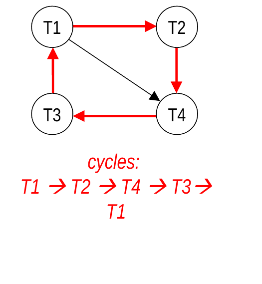{.fragment fragment-index=2 width="80%"}

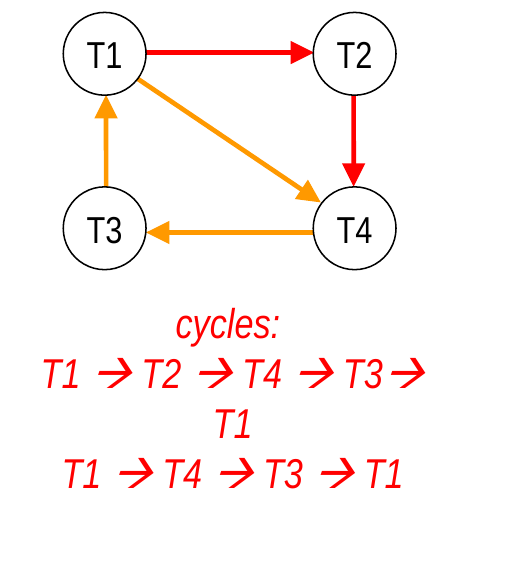{.fragment fragment-index=3 width="80%"}

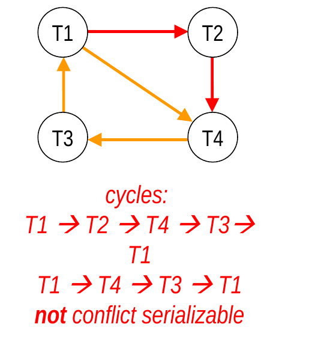{.fragment fragment-index=4 width="80%"}
:::
::::
:::::

## Conflict Serializability vs. Serializability

- Conflict serializability is a *sufficient* condition for serializability, but it's not a *necessary* condition.
    - all conflict serializable schedules are serializable
    - not all serializable schedules are conflict serializable

::: {.fragment fragment-index=1}
- Consider the following schedule involving three txns:
:::

::::: {.columns}
:::: {.column width="60%"}
::: {.fragment fragment-index=2}
- It is *not* conflict serializable, because:
    - [r~2~(A)]{style="color:#c00;"} … [w~1~(A)]{style="color:#0000ff;"} &nbsp;means T~2~ → T~1~
:::

::: {.fragment .sub fragment-index=3 style="margin-left: 1em"}
- [w~1~(A)]{style="color:#0000ff;"} … [w~2~(A)]{style="color:#c00;"} &nbsp;means T~1~ → T~2~
:::

::: {.fragment fragment-index=4}
- It *is* serializable because its effects are equivalent to either T~1~; T~2~; T~3~ &nbsp;*or*&nbsp; T~2~; T~1~; T~3~ &nbsp;— why?
:::

::: {.fragment .sub fragment-index=5}
- [only A is changed; T~3~ writes its final value in all 3 schedules.]{style="color:#0000ff;"}
:::

::: {.fragment .sub fragment-index=6}
- [T~3~ doesn't read A.]{style="color:#0000ff;"}
:::

::: {.fragment .sub fragment-index=7}
- [→ it doesn't matter what order T~1~ and T~2~ read/write A]{style="color:#0000ff;"}
:::
::::

:::: {.column width="40%"}
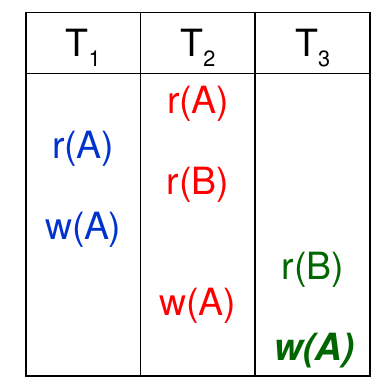{.fragment fragment-index=1 width="72%" fig-align="center"}
::::
:::::

## Executing a Transaction

- Issue a command indicating the start of the transaction.
    - in SQL: BEGIN WORK *or* START TRANSACTION

::: {.fragment}
- Perform the operations in the transaction.
    - in SQL: a set of SQL commands (SELECT, UPDATE, etc.)
:::

::: {.fragment}
- End the transaction in one of two ways:
    - *commit* it: make all of its results visible and persistent
        - *all* of the changes happen
        - in SQL: COMMIT WORK *or* COMMIT
:::

::: {.fragment .sub}
- *abort* it: undo all of its changes, returning the system to its state before the transaction began
    - *none* of the changes happen
    - in SQL: ROLLBACK WORK *or* ROLLBACK
:::

## Recoverability

::::: {.columns}
:::: {.column width="66%"}
- While serializability is important, it isn't enough for full isolation.

- Consider the serializable schedule at right.
    - includes "c" actions that indicate when the transactions commit

::: {.fragment fragment-index=1}
- Imagine that the system crashes:
    - *after* T1's commit
    - *before* T2's commit
:::

::: {.fragment fragment-index=2}
- During recovery from the crash, the system:
    - *keeps* all of T1's changes, because it committed before the crash
:::

::: {.fragment .sub fragment-index=3 style="margin-left: 1em"}
- *undoes* all of T2's changes, because it didn't commit before the crash
:::
::::

:::: {.column width="34%"}
::: {.r-stack}
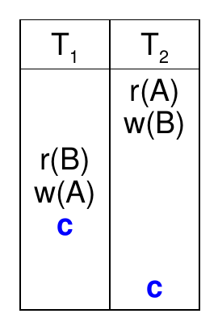{width="62%"}

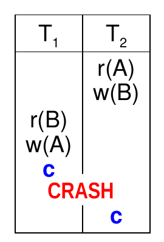{.fragment fragment-index=1 width="62%"}
:::
::::
:::::

## Recoverability (cont.)

::::: {.columns}
:::: {.column width="66%"}
- This is problematic!

::: {.fragment .sub}
- T1 reads T2's write of B
- it then performs actions that may be based on the new value of B
:::

::: {.fragment .sub}
- during recovery from the crash, T2 is rolled back → B's old value is restored
:::

::: {.fragment .sub}
- it's possible T1 would have behaved differently if it had read B's old value
:::

::: {.fragment .sub}
- it's too late to roll back T1, because it has already committed!
:::

::: {.fragment}
- We say that this schedule is *unrecoverable*.
    - if a crash occurs between the two commits, the process of recovering from the crash could lead to problematic results
:::
::::

:::: {.column width="34%"}
{width="62%"}
::::
:::::

## Recoverability (cont.)

::::: {.columns}
:::: {.column width="55%"}
- In a *recoverable* schedule, if T1 reads a value written by T2, T1 must commit *after* T2 commits.

::: {.fragment fragment-index=2}
- This allows us to safely recover from a crash at any point:
:::
::::

:::: {.column width="45%"}
::: {.r-stack}
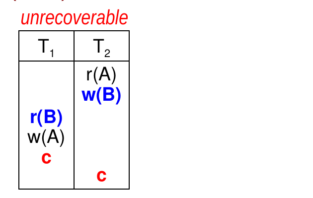{width="92%"}

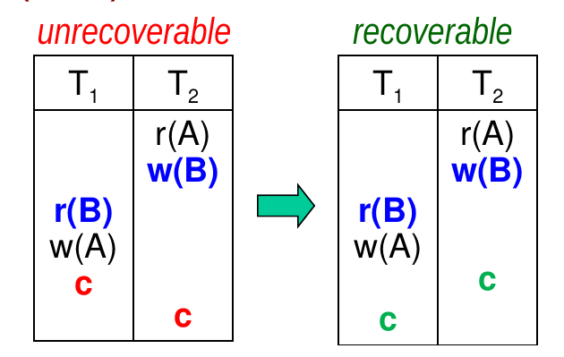{.fragment fragment-index=1 width="92%"}
:::
::::
:::::

::: {.r-stack}
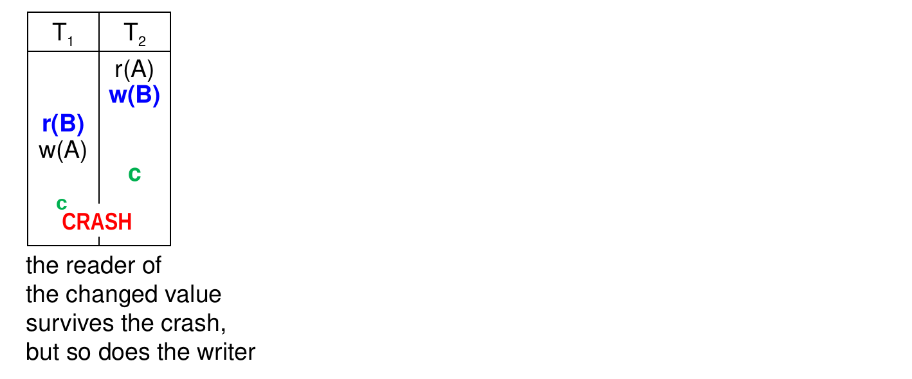{.fragment fragment-index=3 width="78%"}

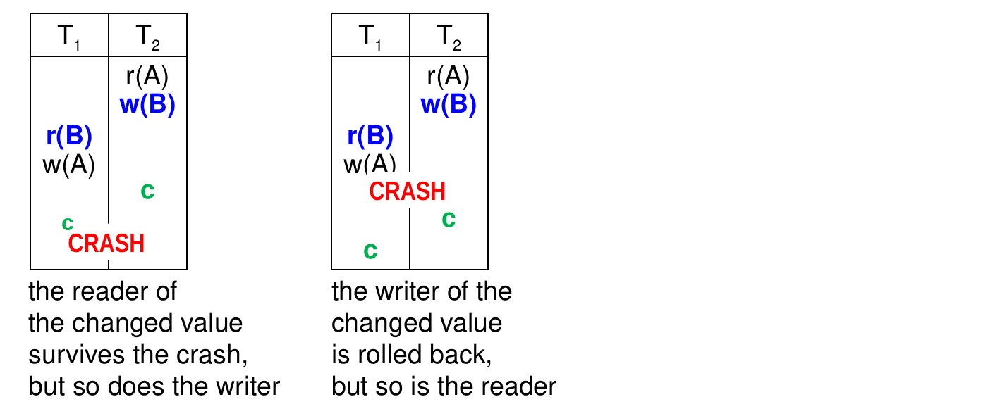{.fragment fragment-index=4 width="78%"}

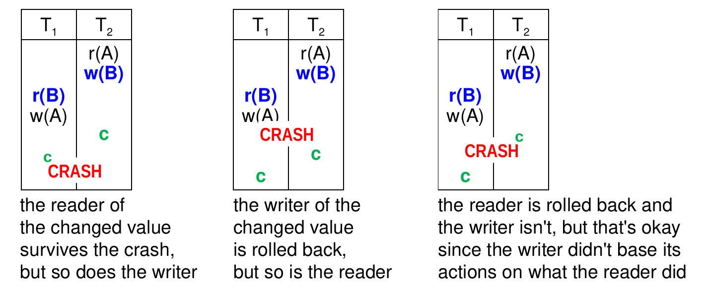{.fragment fragment-index=5 width="78%"}
:::

## Dirty Reads and Cascading Rollbacks

- *Dirty data* is data written by an uncommitted txn.

::: {.fragment .sub style="margin-left: 1em"}
- it remains dirty until the txn is either:
    - committed: in which case the data is no longer dirty and it is safe for other txns to read it
:::

::: {.fragment .sub style="margin-left: 1em"}
- rolled back: in which case the write of the dirty data is undone
:::

::: {.fragment}
- A *dirty read* is a read of dirty data.
:::

::: {.fragment}
- Dirty reads can lead to *cascading rollbacks*.
    - if the writer of the dirty data is rolled back, the reader must be, too
:::

## Dirty Reads and Cascading Rollbacks (cont.)

- We made our earlier schedule recoverable by switching the order of the commits:

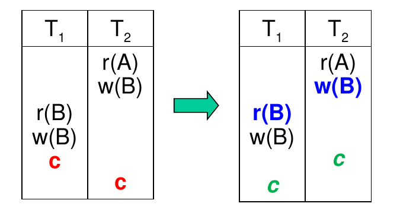{width="44%" fig-align="center"}

::: {.fragment}
- Could the revised schedule lead to a cascading rollback?
:::

::: {.fragment .sub}
- [yes! T1 performs a dirty read of T2's write of B.]{style="color:#0000ff;"}
:::

::: {.fragment .sub}
- [if T2 is later rolled back, T1 must be, too.]{style="color:#0000ff;"}
:::

::: {.fragment}
- To get a *cascadeless* schedule, don't allow dirty reads.
:::

## Extra Practice

- What scenarios involving the schedule at right could produce cascading rollbacks?

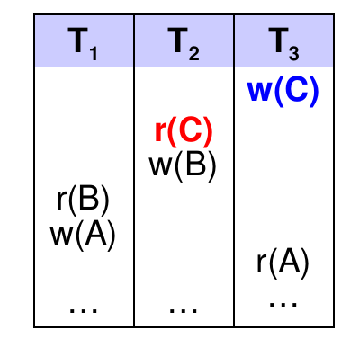{width="30%" fig-align="center"}

A\. &nbsp;T1 is rolled back sometime after T3 reads A. &emsp;[yes]{.fragment fragment-index=1 style="color:#008000; font-weight:bold;"}

B\. &nbsp;T2 is rolled back sometime after T1 reads B. &emsp;[yes]{.fragment fragment-index=2 style="color:#008000; font-weight:bold;"}

C\. &nbsp;T3 is rolled back sometime after T2 reads C. &emsp;[yes]{.fragment fragment-index=3 style="color:#008000; font-weight:bold;"}

D\. &nbsp;two of the above

E\. &nbsp;[all three of the above (A, B and C)]{.fragment .highlight-blue fragment-index=4}

## Concurrency Control Goals

- Goals: ensure that schedules of concurrent txns are:
    - *serializable*: equivalent to some serial schedule
    - *recoverable*: ordered so that the system can safely recover from a crash or undo an aborted transaction
    - *cascadeless*: ensure that an abort of one transaction does not produce a series of *cascading rollbacks*

::: {.fragment}
- To achieve these goals, we use some type of *concurrency control mechanism*.
    - *controls* the actions of *concurrent* transactions
    - prevents problematic interleavings
:::

## Locking

- Locking is one way to provide concurrency control.

- Involves associating one or more *locks* with each *database element*.
    - each page
    - each record
    - possibly even each collection

## Locking Basics

::::: {.columns}
:::: {.column width="46%"}
- A transaction must [***request and acquire a lock***]{style="color:#008000;"} for a data element before it can access it.

::: {.fragment fragment-index=1}
- In our initial scheme, every lock can be held by only one txn at a time.
:::

::: {.fragment fragment-index=2}
- As necessary, the DBMS:
    - [***denies***]{style="color:#c00;"} lock requests for elements that are currently locked
    - makes the requesting transaction wait
:::

::: {.fragment fragment-index=3}
- A transaction [***unlocks an element***]{style="color:#c000c0;"} when it's done with it.
:::

::: {.fragment fragment-index=4}
- After the unlock, the DBMS can grant the lock to a waiting txn.
    - we'll show a [***second lock request***]{style="color:#0000ff;"} when the lock is granted
:::
::::

:::: {.column width="54%"}
::: {.r-stack}
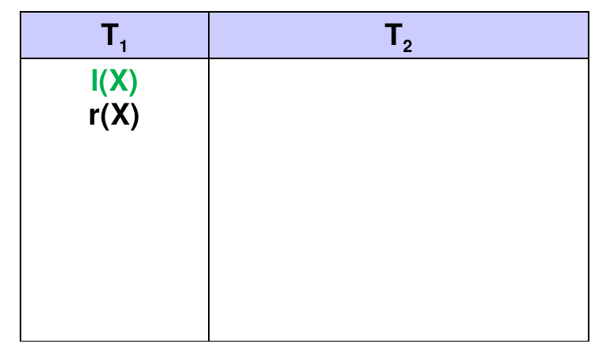{width="100%"}

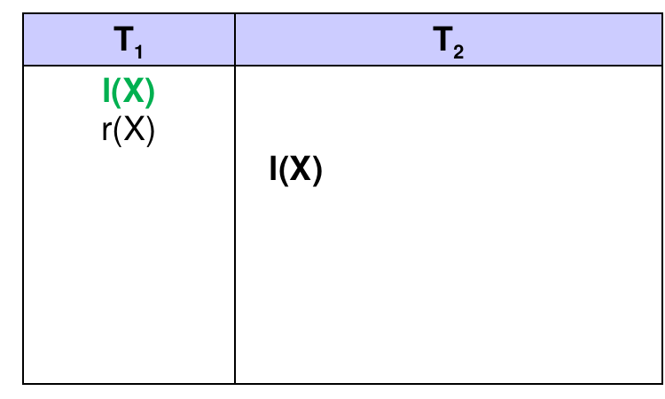{.fragment fragment-index=1 width="100%"}

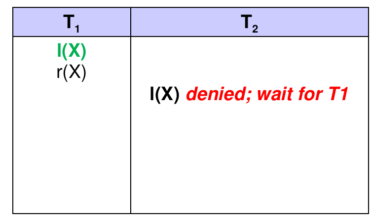{.fragment fragment-index=2 width="100%"}

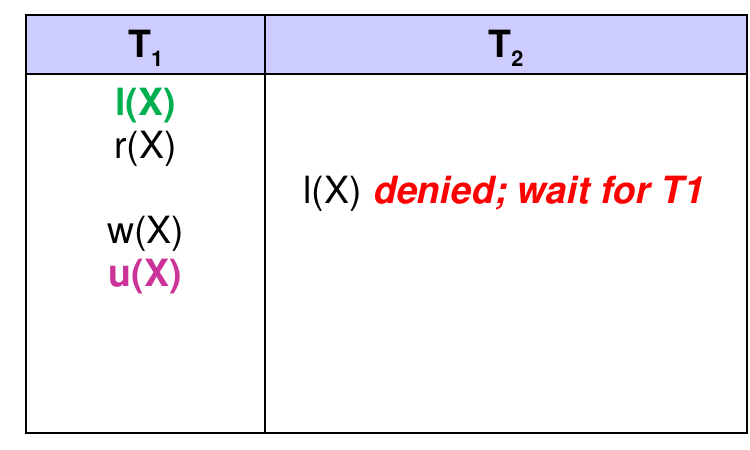{.fragment fragment-index=3 width="100%"}

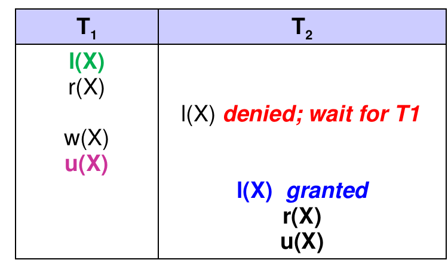{.fragment fragment-index=4 width="100%"}
:::
::::
:::::

## Locking and Serializability

- Just having locks isn't enough to guarantee serializability.

- Example: our problematic schedule can still be carried out.

::: {.r-stack}
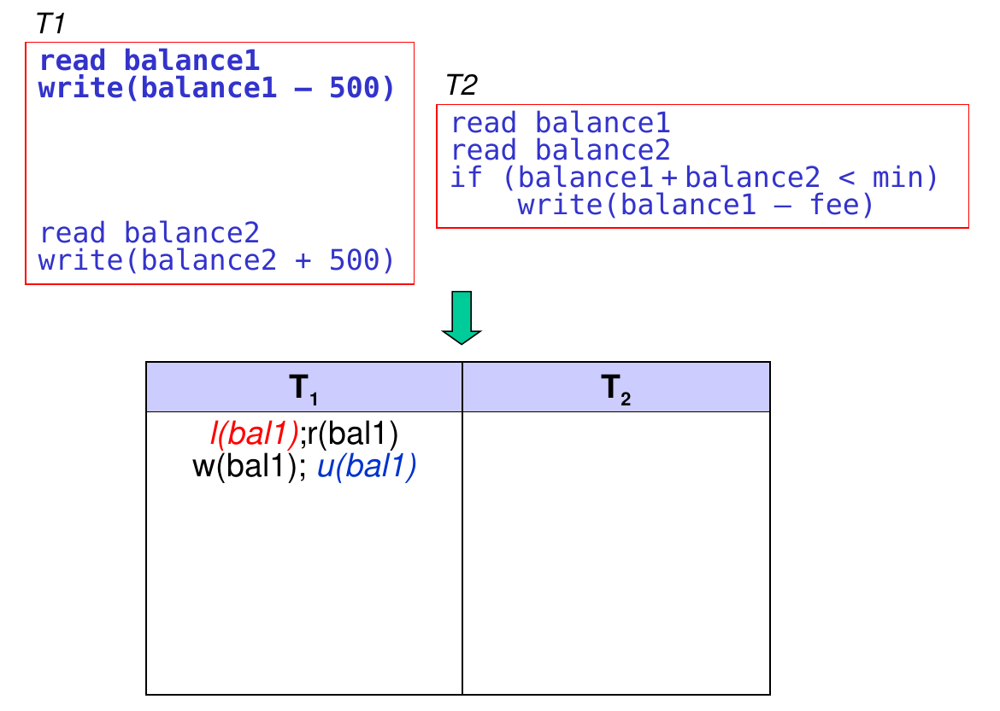{width="60%"}

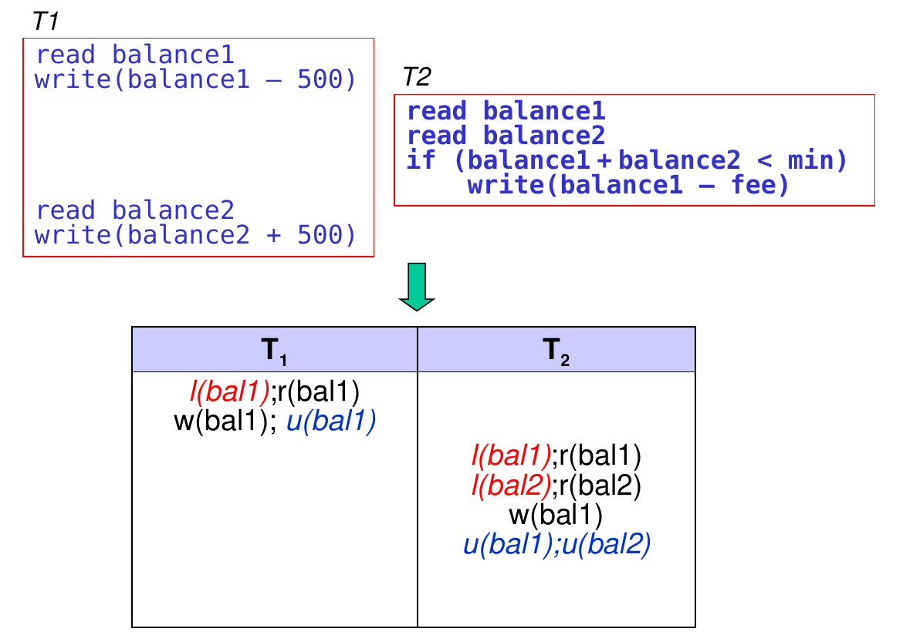{.fragment width="60%"}

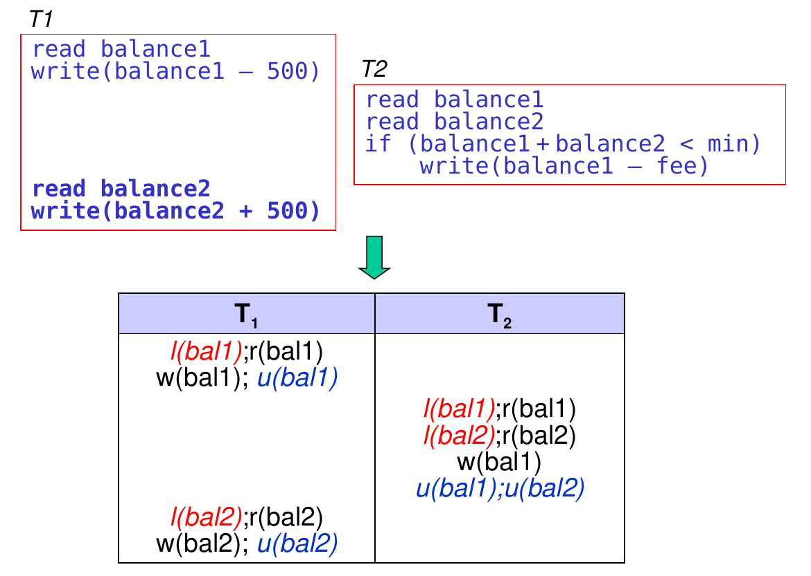{.fragment width="60%"}
:::

## Two-Phase Locking (2PL)

- One way to ensure serializability is *two-phase locking (2PL)*.

- 2PL requires that *all* of a txn's lock actions come before *all* its unlock actions.

::: {.fragment}
- Two phases:
    - lock-acquisition phase: a txn acquires locks, but it doesn't release any
:::

::: {.fragment .sub style="margin-left: 1em"}
- lock-release phase: once a txn releases a lock, it can't acquire any new ones
:::

::: {.fragment}
- Reads and writes can occur in both phases.
    - provided that a txn holds the necessary locks
:::

::: {.fragment}
- 2PL is *per-transaction*.
    - one txn could be in its lock-release phase while another txn is still in its lock-acquisition phase
:::

## Two-Phase Locking (2PL) (cont.)

- In our earlier example, T1 does *not* follow the 2PL rule.

- 2PL would prevent this interleaving.

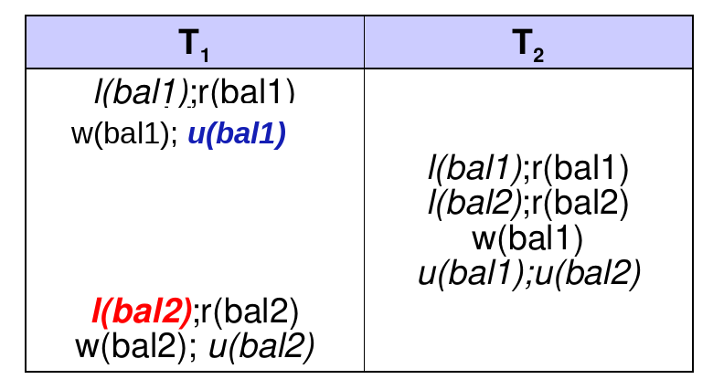{width="48%" fig-align="center"}

::: {.fragment}
- More generally, 2PL produces conflict serializable schedules.
:::

## An Informal Argument for 2PL's Correctness

- Consider schedules involving only two transactions. To get one that is ***not*** conflict serializable, we need:

1) at least one conflict that requires T1 → T2

::: {.fragment .sub fragment-index=1}
- T1 operates first on the data item in this conflict
:::

::: {.fragment .sub fragment-index=2}
- T1 must unlock it before T2 can lock it: &nbsp;[u~1~(A) .. l~2~(A)]{style="color:#0000ff;"}
:::

2) at least one conflict that requires T2 → T1

::: {.fragment .sub fragment-index=3}
- T2 operates first on the data item in this conflict
:::

::: {.fragment .sub fragment-index=4}
- T2 must unlock it before T1 can lock it: &nbsp;[u~2~(B) .. l~1~(B)]{style="color:#c00;"}
:::

::: {.fragment fragment-index=5}
- Consider all of the ways these pairs of actions could be ordered:
:::

::: {.r-stack}
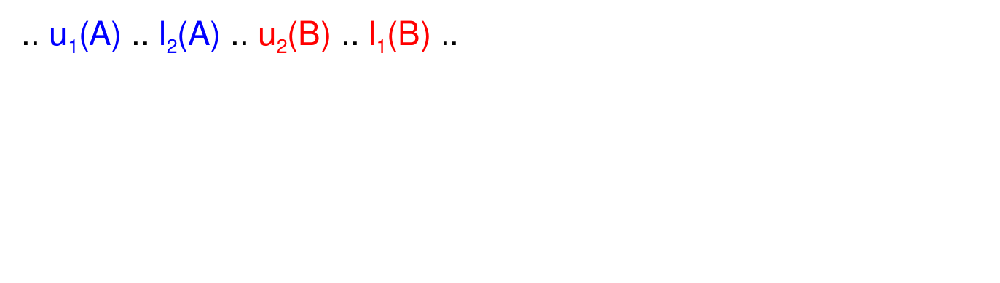{.fragment fragment-index=5 width="90%"}

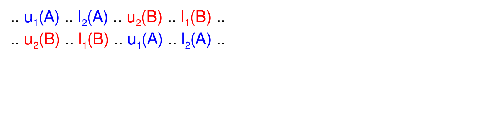{.fragment fragment-index=6 width="90%"}

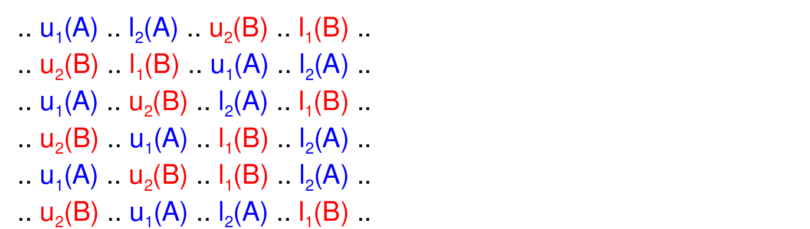{.fragment fragment-index=7 width="90%"}

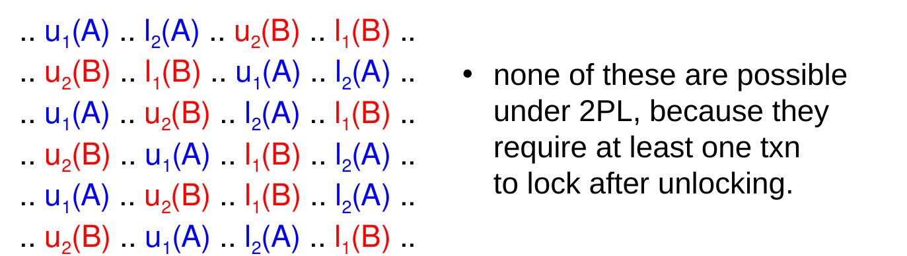{.fragment fragment-index=8 width="90%"}

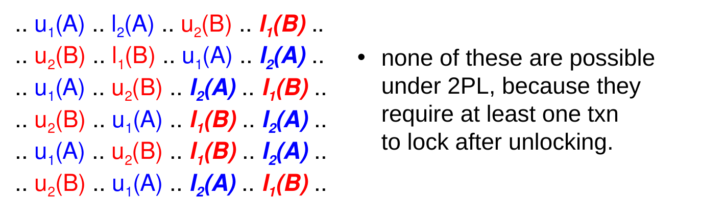{.fragment fragment-index=9 width="90%"}
:::

## Extra Practice

- Is the schedule at right: &emsp;[*(page 202)*]{style="font-size:0.7em; color:#666;"}

::::: {.columns}
:::: {.column width="55%"}
- conflict serializable?

::: {.fragment .sub fragment-index=1}
- [yes. conflicts are:]{style="color:#0000ff;"}
- [r~1~(B) … w~2~(B): &nbsp;T1 → T2]{style="color:#0000ff;"}
- [w~1~(A) … r~2~(A): &nbsp;T1 → T2]{style="color:#0000ff;"}
:::

::: {.fragment .sub fragment-index=2}
- [→ equivalent to T1;T2]{style="color:#0000ff;"}
:::

- serializable?

::: {.fragment .sub fragment-index=3}
- [yes. conflict serializable → serializable]{style="color:#0000ff;"}
:::

- recoverable?

::: {.fragment .sub fragment-index=5}
- [yes. only dirty read is r~2~(A). reader (T2) commits *after* writer (T1), so it's okay]{style="color:#0000ff;"}
:::

- cascadeless?

::: {.fragment .sub fragment-index=6}
- [no, because of dirty read. if T1 is rolled back after T2 reads A, T2 must be, too!]{style="color:#0000ff;"}
:::
::::

:::: {.column width="45%"}
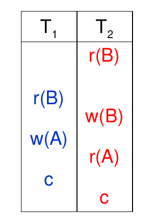{width="40%" fig-align="center"}

::: {.r-stack}
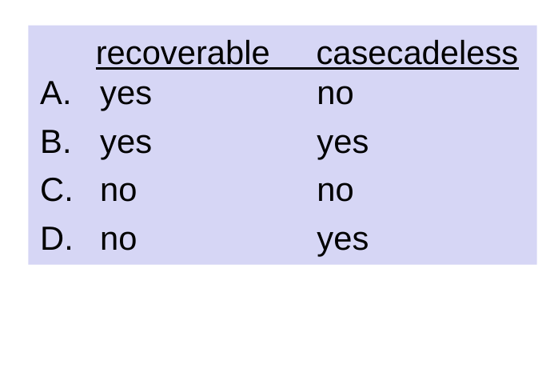{.fragment fragment-index=4 width="90%"}

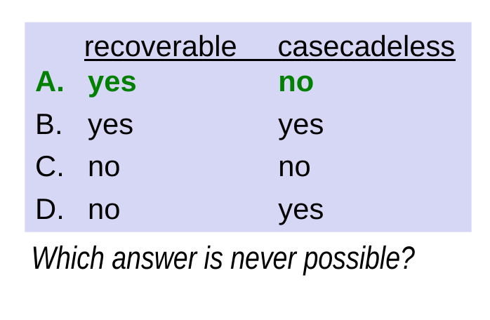{.fragment fragment-index=7 width="90%"}

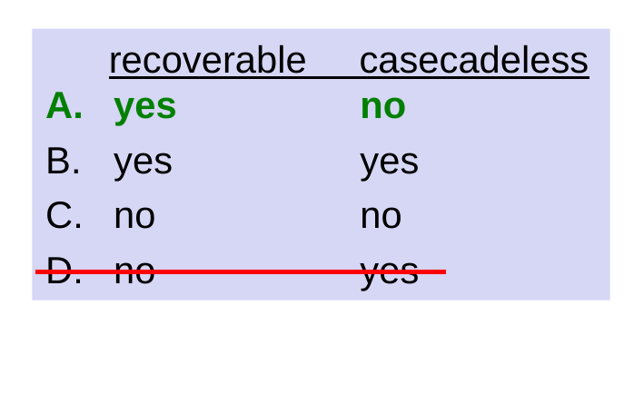{.fragment fragment-index=8 width="90%"}

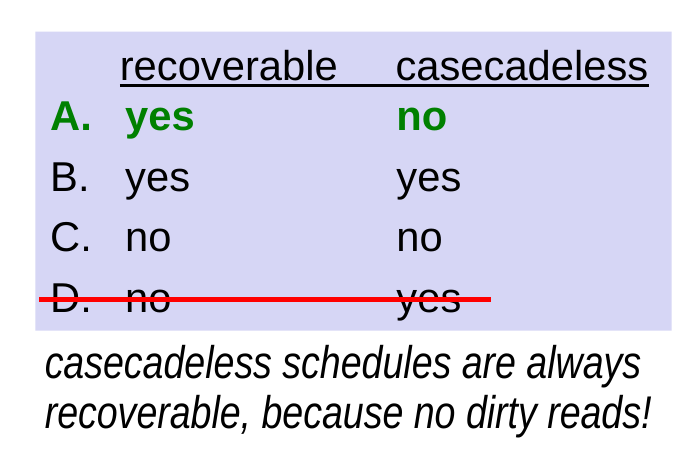{.fragment fragment-index=9 width="90%"}
:::
::::
:::::
