## Recoverability

:::: {.columns}

::: {.column width="66%"}
- While serializability is important, it isn't enough for full isolation.
- Consider the serializable schedule at right.
    - includes "c" actions that indicate when the transactions commit

::: {.fragment}
- Imagine that the system crashes:
    - *after* T1's commit
    - *before* T2's commit
:::

::: {.fragment}
- During recovery from the crash, the system:
    - *keeps* all of T1's changes, because it committed before the crash
    - *undoes* all of T2's changes, because it didn't commit before the crash
:::
:::

::: {.column width="34%"}
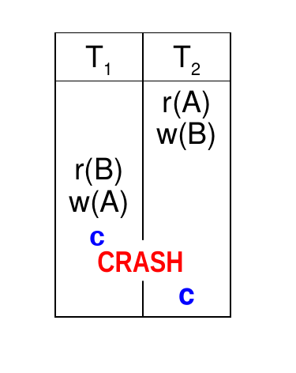{width="78%" fig-align="center"}
:::

::::

## Recoverability (cont.)

:::: {.columns}

::: {.column width="66%"}
- This is problematic!
    - T1 reads T2's write of B
    - it then performs actions that may be based on the new value of B
    - during recovery from the crash, T2 is rolled back &rarr; B's old value is restored
    - it's possible T1 would have behaved differently if it had read B's old value
    - it's too late to roll back T1, because it has already committed!

::: {.fragment}
- We say that this schedule is *unrecoverable.*
    - if a crash occurs between the two commits, the process of recovering from the crash could lead to problematic results
:::
:::

::: {.column width="34%"}
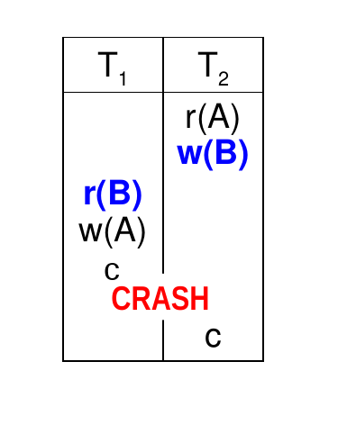{width="78%" fig-align="center"}
:::

::::

## Dirty Reads and Cascading Rollbacks

- *Dirty data* is data written by an uncommitted txn.

::: {.fragment .sub}
- it remains dirty until the txn is either:
    - committed: in which case the data is no longer dirty and it is safe for other txns to read it
:::

::: {.fragment .sub style="margin-left:2.4em;"}
- rolled back: in which case the write of the dirty data is undone
:::

::: {.fragment}
- A *dirty read* is a read of dirty data.
:::

::: {.fragment}
- Dirty reads can lead to *cascading rollbacks*.
    - if the writer of the dirty data is rolled back, the reader must be, too
:::

## Dirty Reads and Cascading Rollbacks (cont.)

- We made our earlier schedule recoverable by switching the order of the commits:

::: {.r-stack}
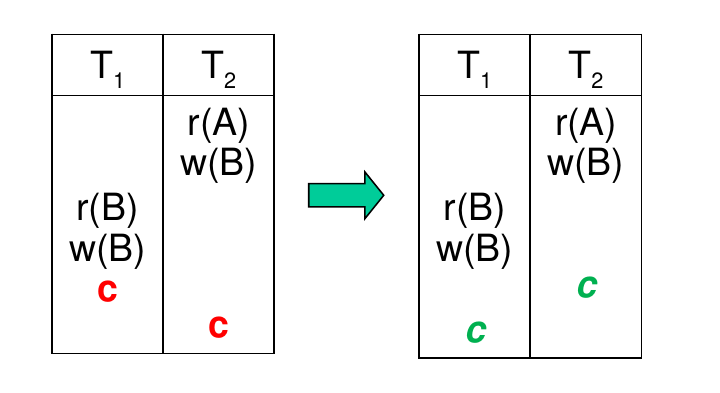{width="52%"}

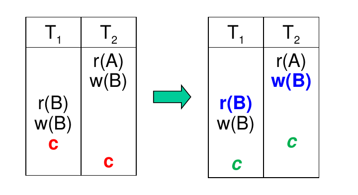{.fragment fragment-index=2 width="52%"}
:::

::: {.fragment fragment-index=1}
- Could the revised schedule lead to a cascading rollback?
:::

::: {.fragment fragment-index=2 .sub}
- [yes!]{style="color:#3a5fcd;"}
- [T1 performs a dirty read of T2's write of B.]{style="color:#3a5fcd;"}
:::

::: {.fragment fragment-index=3 .sub}
- [if T2 is later rolled back, T1 must be, too.]{style="color:#3a5fcd;"}
:::

::: {.fragment fragment-index=4}
- To get a *cascadeless* schedule, don't allow dirty reads.
:::

## Practice

:::: {.columns}

::: {.column width="68%"}
- What scenarios involving the schedule at right could produce cascading rollbacks?

A\.  T1 is rolled back sometime after T3 reads A. &nbsp; [yes]{.fragment fragment-index=1 style="color:#197300;"}

B\.  T2 is rolled back sometime after T1 reads B. &nbsp; [yes]{.fragment fragment-index=2 style="color:#197300;"}

C\.  T3 is rolled back sometime after T2 reads C. &nbsp; [yes]{.fragment fragment-index=3 style="color:#197300;"}

D\.  two of the above

E\.  [all three of the above (A, B and C)]{.fragment .highlight-blue fragment-index=4}
:::

::: {.column width="32%"}
::: {.r-stack}
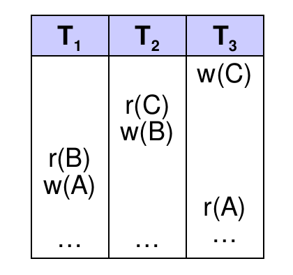{width="85%"}

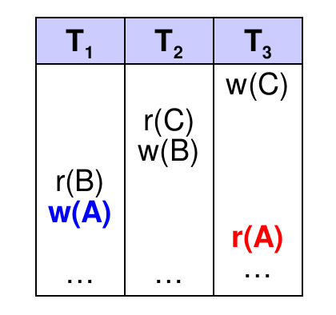{.fragment fragment-index=1 width="85%"}

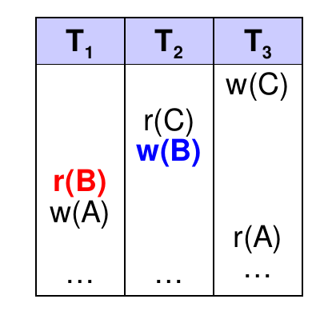{.fragment fragment-index=2 width="85%"}

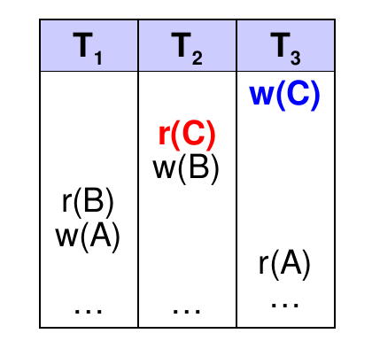{.fragment fragment-index=3 width="85%"}
:::
:::

::::

## Concurrency Control Goals

- Goals: ensure that schedules of concurrent txns are:
    - *serializable*: equivalent to some serial schedule
    - *recoverable*: ordered so that the system can safely recover from a crash or undo an aborted transaction
    - *cascadeless*: ensure that an abort of one transaction does not produce a series of *cascading rollbacks*

::: {.fragment}
- To achieve these goals, we use some type of *concurrency control mechanism*.
    - *controls* the actions of *concurrent* transactions
    - prevents problematic interleavings
:::

## Locking

- Locking is one way to provide concurrency control.
- Involves associating one or more *locks* with each *database element*.
    - each page
    - each record
    - possibly even each collection

## Locking Basics

:::: {.columns}

::: {.column width="55%"}
- A transaction must [*request and acquire a lock*]{style="color:#197300;"} for a data element before it can access it.

::: {.fragment fragment-index=1}
- In our initial scheme, every lock can be held by only one txn at a time.
:::

::: {.fragment fragment-index=2}
- As necessary, the DBMS:
    - [*denies*]{style="color:#c00;"} lock requests for elements that are currently locked
    - makes the requesting transaction wait
:::

::: {.fragment fragment-index=3}
- A transaction [*unlocks an element*]{style="color:#c000c0;"} when it's done with it.
:::

::: {.fragment fragment-index=4}
- After the unlock, the DBMS can grant the lock to a waiting txn.
    - we'll show a [*second lock request*]{style="color:#3a5fcd;"} when the lock is granted
:::
:::

::: {.column width="45%"}
::: {.r-stack}
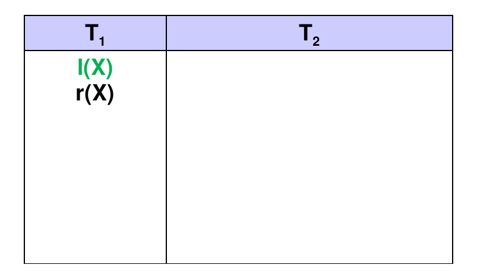{width="100%"}

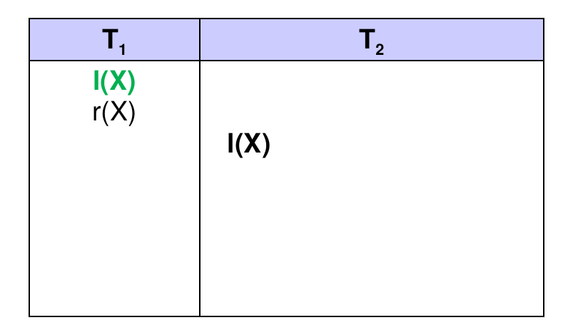{.fragment fragment-index=1 width="100%"}

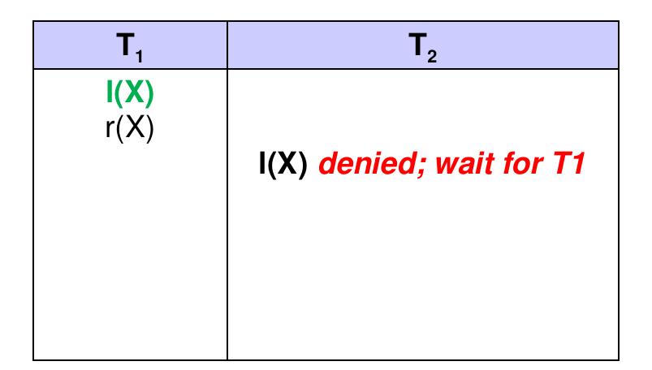{.fragment fragment-index=2 width="100%"}

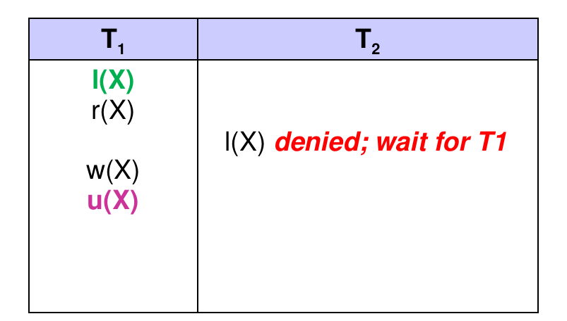{.fragment fragment-index=3 width="100%"}

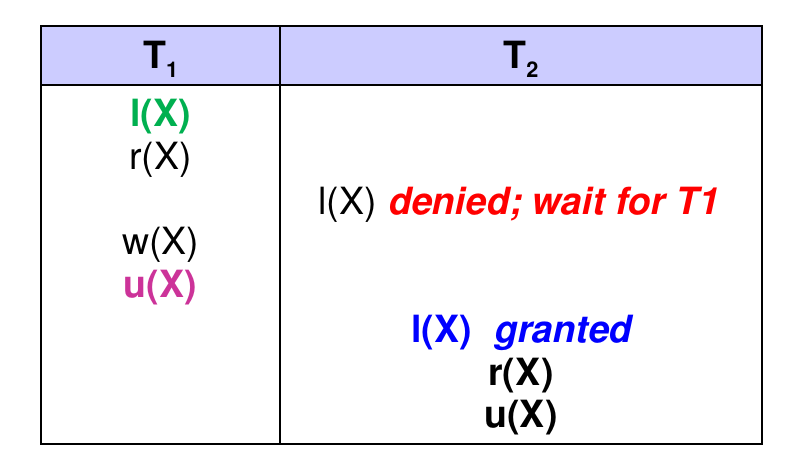{.fragment fragment-index=4 width="100%"}
:::
:::

::::

## Locking and Serializability

- Just having locks isn't enough to guarantee serializability.
- Example: our problematic schedule can still be carried out.

::: {.r-stack}
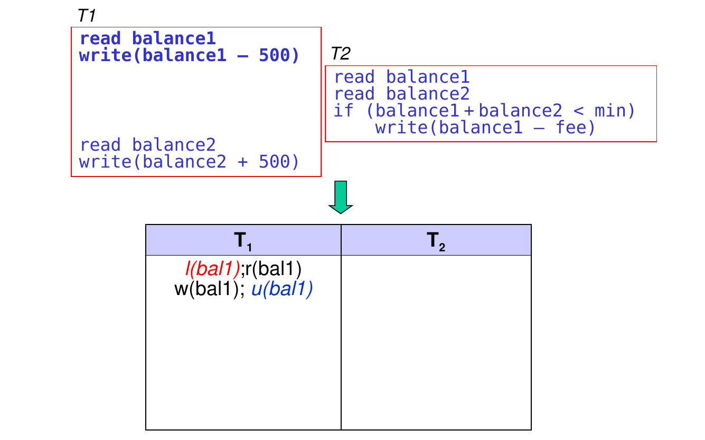{width="68%"}

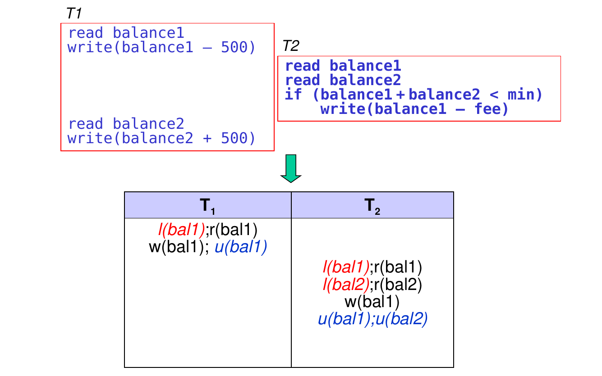{.fragment width="68%"}

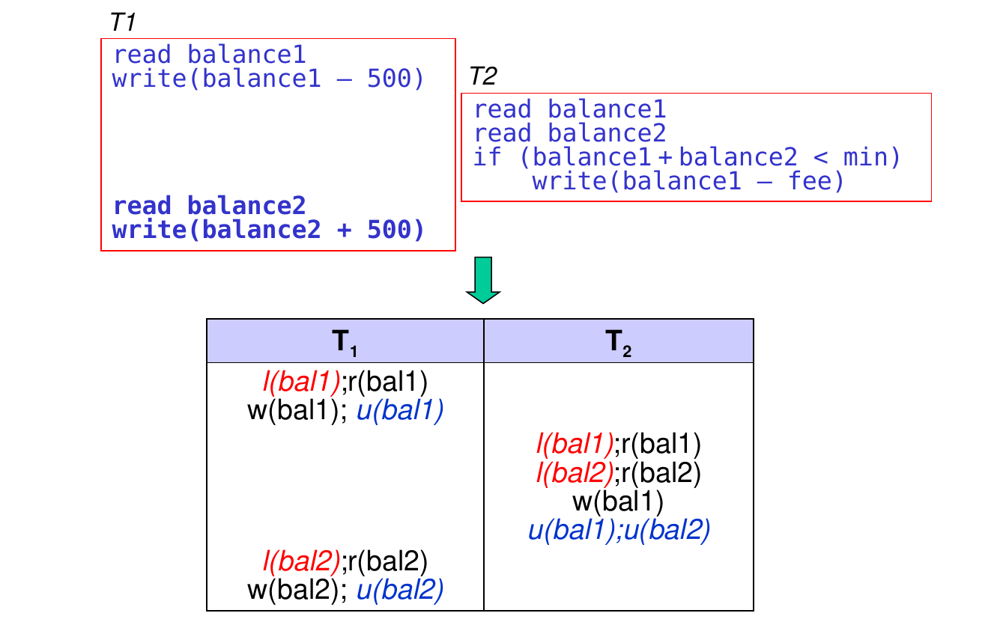{.fragment width="68%"}
:::

## Two-Phase Locking (2PL)

- One way to ensure serializability is *two-phase locking (2PL)*.
- 2PL requires that *all* of a txn's lock actions come before *all* its unlock actions.

::: {.fragment}
- Two phases:
    - lock-acquisition phase: a txn acquires locks, but it doesn't release any
:::

::: {.fragment .sub style="margin-left: 1em;"}
- lock-release phase: once a txn releases a lock, it can't acquire any new ones
:::

::: {.fragment}
- Reads and writes can occur in both phases.
    - provided that a txn holds the necessary locks
:::

::: {.fragment}
- 2PL is *per-transaction*.
    - one txn could be in its lock-release phase while another txn is still in its lock-acquisition phase
:::

## Two-Phase Locking (2PL) (cont.)

- In our earlier example, T1 does *not* follow the 2PL rule.
    - 2PL would prevent this interleaving.

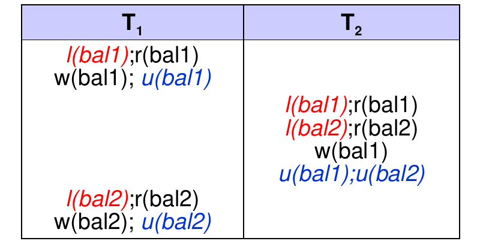{width="52%" fig-align="center"}

::: {.fragment}
- More generally, 2PL produces conflict serializable schedules.
:::

## An Informal Argument for 2PL's Correctness

- Consider schedules involving only two transactions. To get one that is ***not*** conflict serializable, we need:
    - 1\) at least one conflict that requires T1 &rarr; T2

::: {.fragment fragment-index=1 .sub style="margin-left:2.4em;"}
- T1 operates first on the data item in this conflict
:::

::: {.fragment fragment-index=2 .sub style="margin-left:2.4em;"}
- T1 must unlock it before T2 can lock it: &nbsp;u1(A) .. l2(A)
:::

::: {.sub}
- 2\) at least one conflict that requires T2 &rarr; T1
:::

::: {.fragment fragment-index=3 .sub style="margin-left:2.4em;"}
- T2 operates first on the data item in this conflict
:::

::: {.fragment fragment-index=4 .sub style="margin-left:2.4em;"}
- T2 must unlock it before T1 can lock it: &nbsp;u2(B) .. l1(B)
:::

::: {.fragment fragment-index=5}
- Consider all of the ways these pairs of actions could be ordered:
:::

::: {.r-stack}
{.fragment fragment-index=5 width="88%"}

{.fragment fragment-index=6 width="88%"}

{.fragment fragment-index=7 width="88%"}

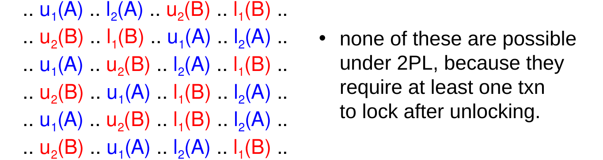{.fragment fragment-index=8 width="88%"}

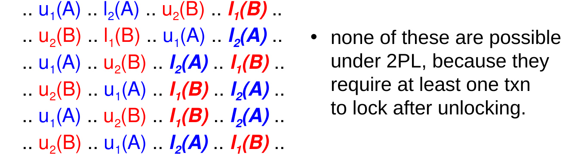{.fragment fragment-index=9 width="88%"}
:::

## Extra Practice

:::: {.columns}

::: {.column width="72%"}
- Is the schedule at right:
    - conflict serializable?

::: {.fragment .sub style="margin-left:2.4em;"}
- [yes. conflicts are:]{style="color:#3a5fcd;"}
- [r1(B) … w2(B): &nbsp;T1 &rarr; T2]{style="color:#3a5fcd;"}
:::

::: {.fragment .sub style="margin-left:2.4em;"}
- [w1(A) … r2(A): &nbsp;T1 &rarr; T2]{style="color:#3a5fcd;"}
:::

::: {.fragment .sub style="margin-left:2.4em;"}
- [&rarr; equivalent to T1;T2]{style="color:#3a5fcd;"}
:::

::: {.sub}
- serializable?
:::

::: {.fragment .sub style="margin-left:2.4em;"}
- [yes. conflict serializable &rarr; serializable]{style="color:#3a5fcd;"}
:::

::: {.sub}
- recoverable?
:::

::: {.fragment .sub style="margin-left:2.4em;"}
- [yes. only dirty read is r2(A). reader (T2) commits *after* writer (T1), so it's okay]{style="color:#3a5fcd;"}
:::

::: {.sub}
- cascadeless?
:::

::: {.fragment .sub style="margin-left:2.4em;"}
- [no, because of dirty read. if T1 is rolled back after T2 reads A, T2 must be, too!]{style="color:#3a5fcd;"}
:::
:::

::: {.column width="28%"}
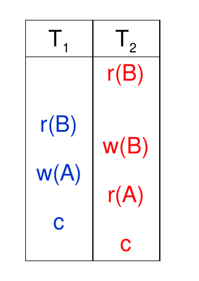{width="82%"}
:::

::::

## Extra Practice (cont.)

::: {.r-stack}
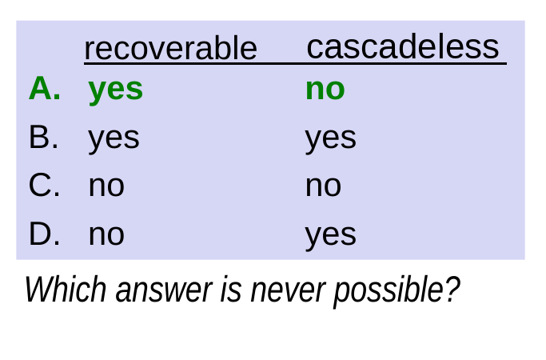{width="60%"}

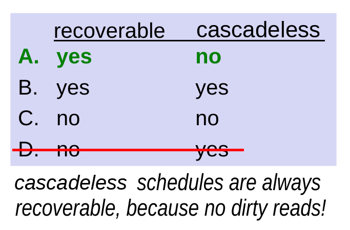{.fragment width="60%"}
:::

## The Need for Different Types of Locks

- With only one type of lock, overlapping transactions can't read the same data item, even though two reads don't conflict.
    - Two transactions could be forced to be serialized unnecessarily
    - This can have a negative impact on database performance
- To get around this, use more than one *mode* of lock.

## Exclusive vs. Shared Locks

- An *exclusive lock* allows a transaction to write or read an item.
    - gives the txn exclusive access to that item
    - only one txn can hold it at a given time

::: {.fragment}
- xli(A) = transaction Ti requests an exclusive lock for A
:::

::: {.fragment .sub style="margin-left:2.4em;"}
- if another txn holds *any* lock for A, Ti must wait until that lock is released
:::

::: {.fragment}
- A *shared lock* only allows a transaction to read an item.
    - multiple txns can hold a shared lock for the same data item at the same time
:::

::: {.fragment}
- sli(A) = transaction Ti requests a shared lock for A
:::

::: {.fragment .sub style="margin-left:2.4em;"}
- if another txn holds an *exclusive* lock for A, Ti must wait until that lock is released
:::

## Lock Compatibility Matrix

- Used to specify when a lock request for a currently locked item should be granted.

::: {.r-stack}
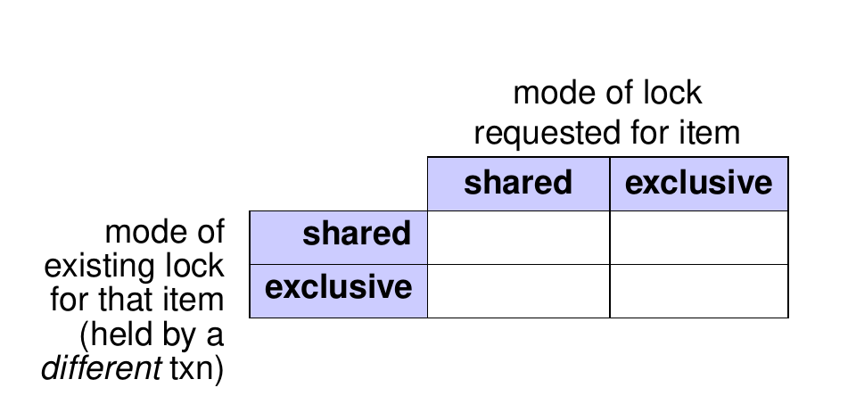{width="66%"}

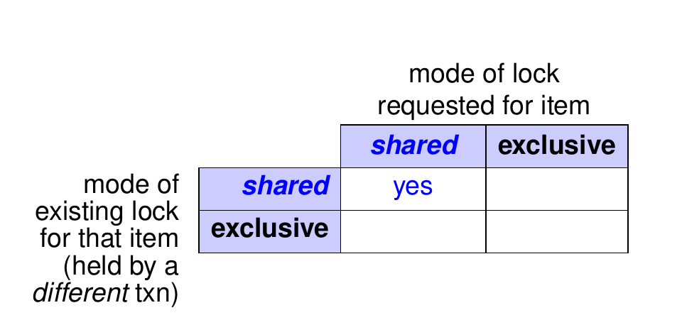{.fragment width="66%"}

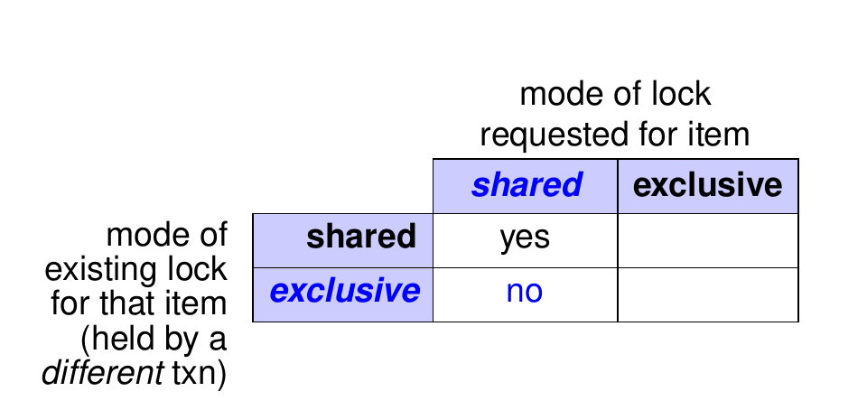{.fragment width="66%"}

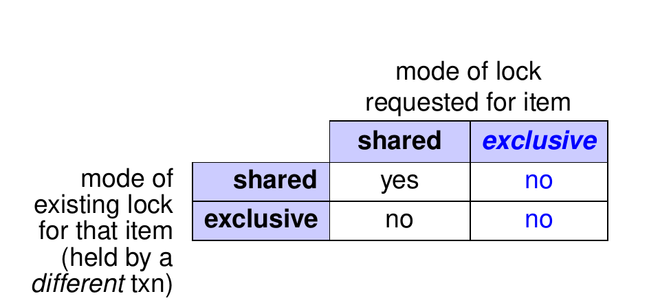{.fragment width="66%"}
:::

## Examples of Using Shared and Exclusive Locks

- sli(A) = transaction Ti requests a shared lock for A
- xli(A) = transaction Ti requests an exclusive lock for A
- Examples:

::: {.r-stack}
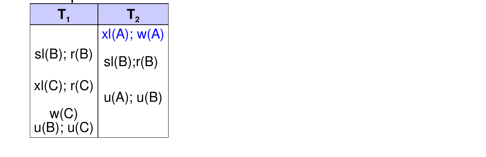{width="85%"}

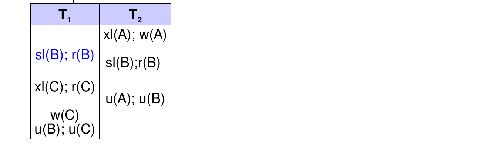{.fragment width="85%"}

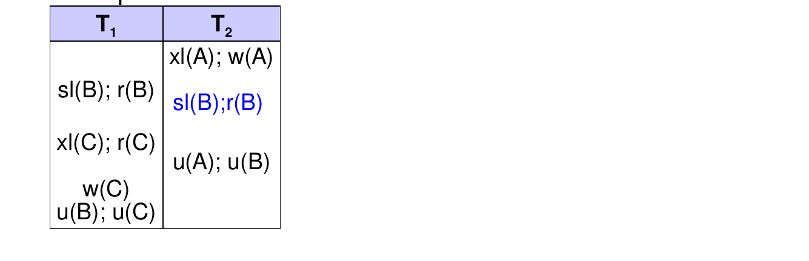{.fragment width="85%"}

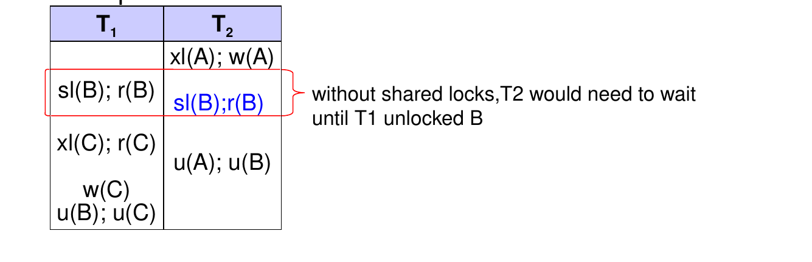{.fragment width="85%"}

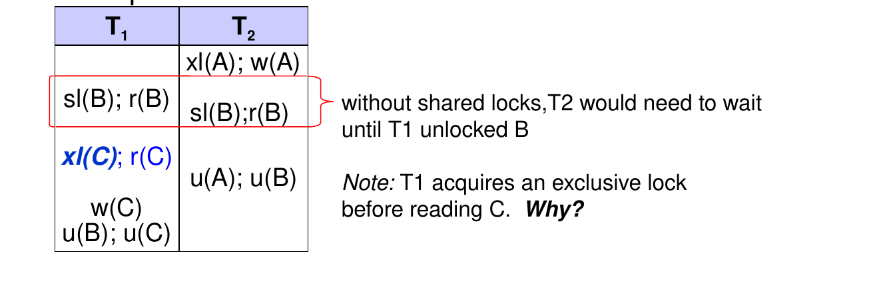{.fragment width="85%"}

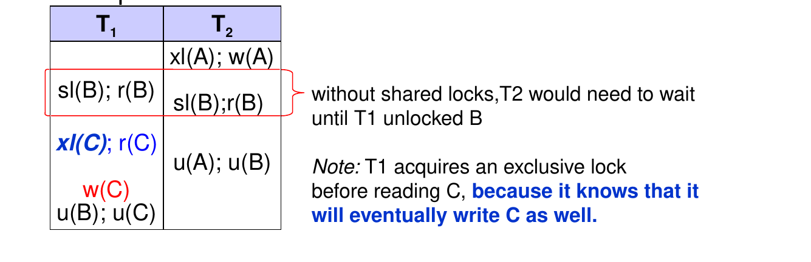{.fragment width="85%"}

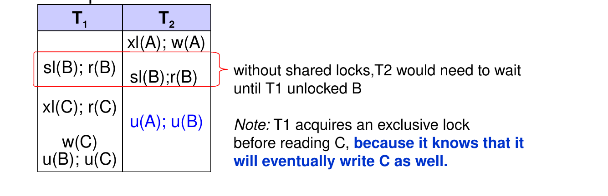{.fragment width="85%"}

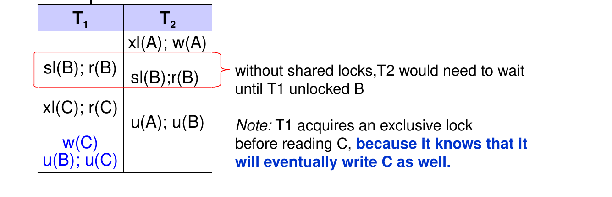{.fragment width="85%"}
:::

## Which requests are granted?

{width="70%" fig-align="center"}

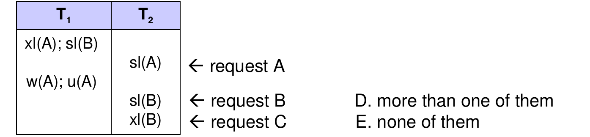{width="92%" fig-align="center"}

## Shared vs. Exclusive Locks (cont.)

{width="70%" fig-align="center"}

::: {.r-stack}
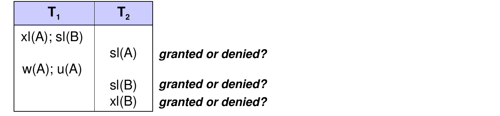{width="92%"}

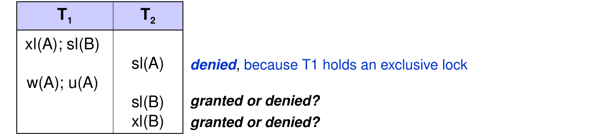{.fragment width="92%"}

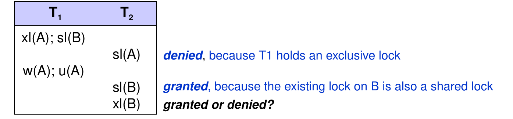{.fragment width="92%"}

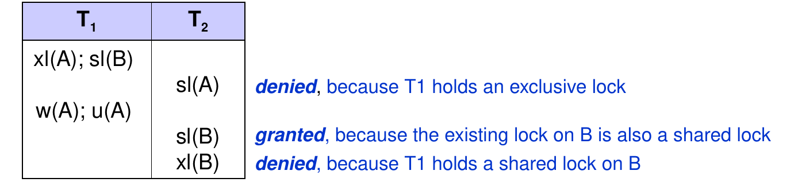{.fragment width="92%"}
:::

## Which requests are granted?

{width="70%" fig-align="center"}

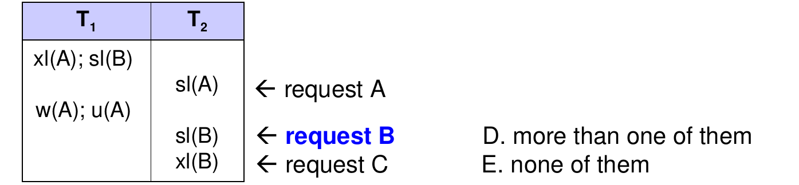{width="92%" fig-align="center"}

## What About Recoverability / Cascadelessness?

- 2PL alone does *not* guarantee either of them.

::: {.r-stack}
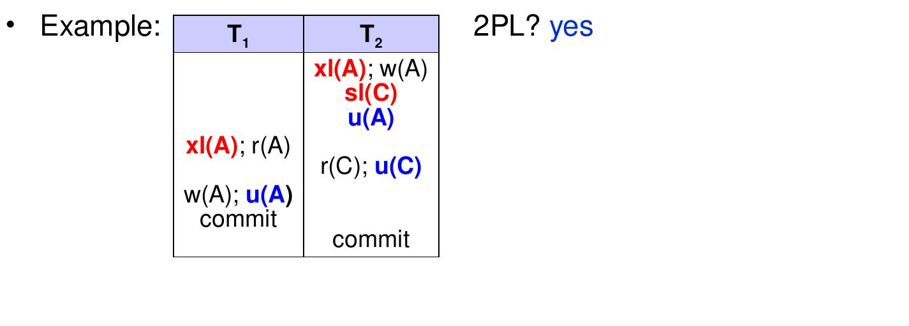{width="82%"}

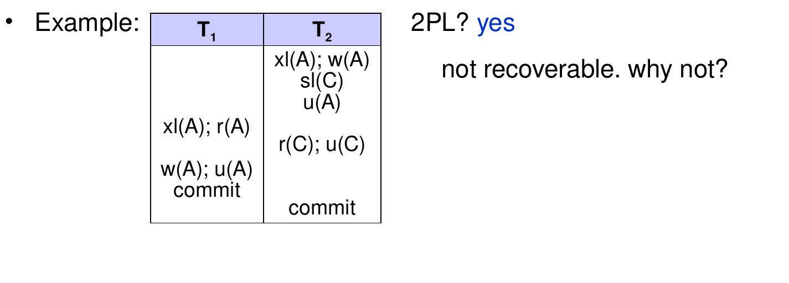{.fragment width="82%"}

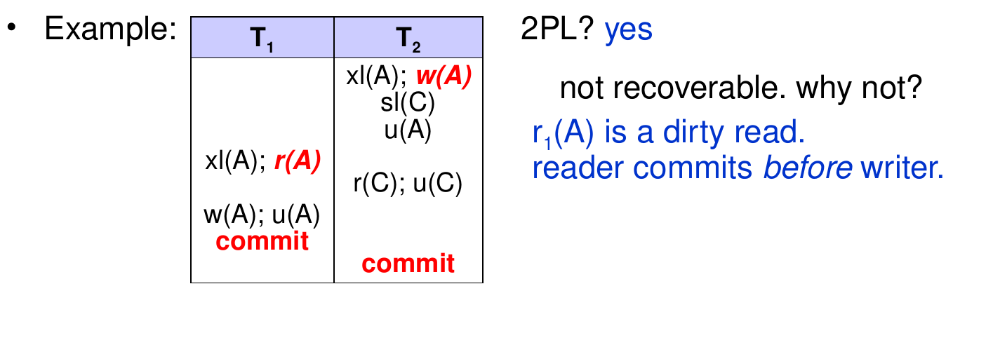{.fragment width="82%"}

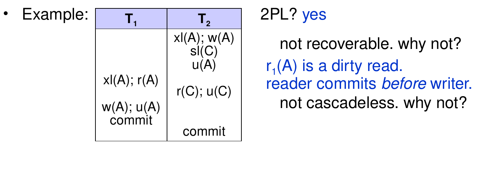{.fragment width="82%"}

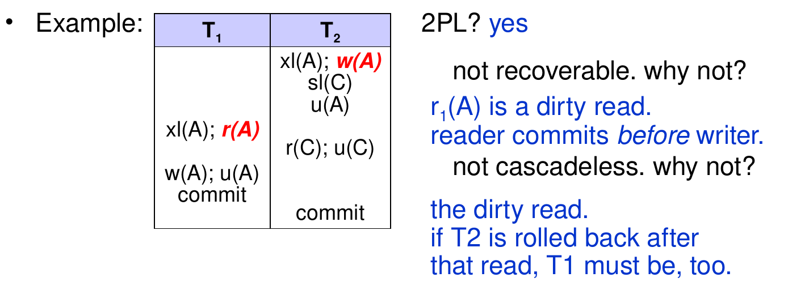{.fragment width="82%"}
:::

## Takeaways

- To build high-performance databases we are concerned with ACID properties:
    - Atomicity: transactions should be all-or-nothing
        - We must be able to "roll back" a transaction
    - Consistency: transactions should leave the database consistent
        - Eg, must be able to transfer a bank balance correctly
    - Isolation: transactions should not interfere
        - They must be serializable
    - Durability: transactions that are committed must survive a crash
        - And, for consistency, they must be recoverable

## Techniques for achieving ACID

- We can check serializability using conflicting operations
    - But to ensure serializability in general, we may use locking
- To avoid inconsistencies, we must follow a discipline when using locking: acquire all locks before releasing any
    - Called 2 Phase Locking
- And to avoid inconsistencies, commit order must be recoverable
- Observations:
    - Using locking modes (shared, exclusive) allows for overlapping reads
    - Dirty reads can be problematic
        - They can lead to cascading rollbacks
        - And a txn performing a dirty read must commit after the writer for recoverability
