## Data Warehousing and OLAP Technology

Outline

- [What is a data warehouse? What is OLAP?]{style="color:#990000;"}
- The Multidimensional Data Model
- Implementation of Data Cubes
- Designing a Data Warehouse

## What is a Data Warehouse?

- A *data warehouse* is a decision support database that is maintained [*separately*]{style="color:#990000;"} from the organization's operational database
    - Operational database: personnel / payroll, accounts payable, accounts receivable, orders, inventory, &hellip;
    - Data warehouse: none of the above

::: {.fragment}
- Supports [information processing]{style="color:#990000;"} by providing a solid platform of consolidated, historical data for analysis
:::

::: {.fragment}
- "A data warehouse is a [subject-oriented]{.underline style="color:#990000;"}, [integrated]{.underline style="color:#990000;"}, [time-variant]{.underline style="color:#990000;"}, and [nonvolatile]{.underline style="color:#990000;"} collection of data in support of management's decision-making process." -- W.H. Inmon
:::

## Example of a Data Warehouse

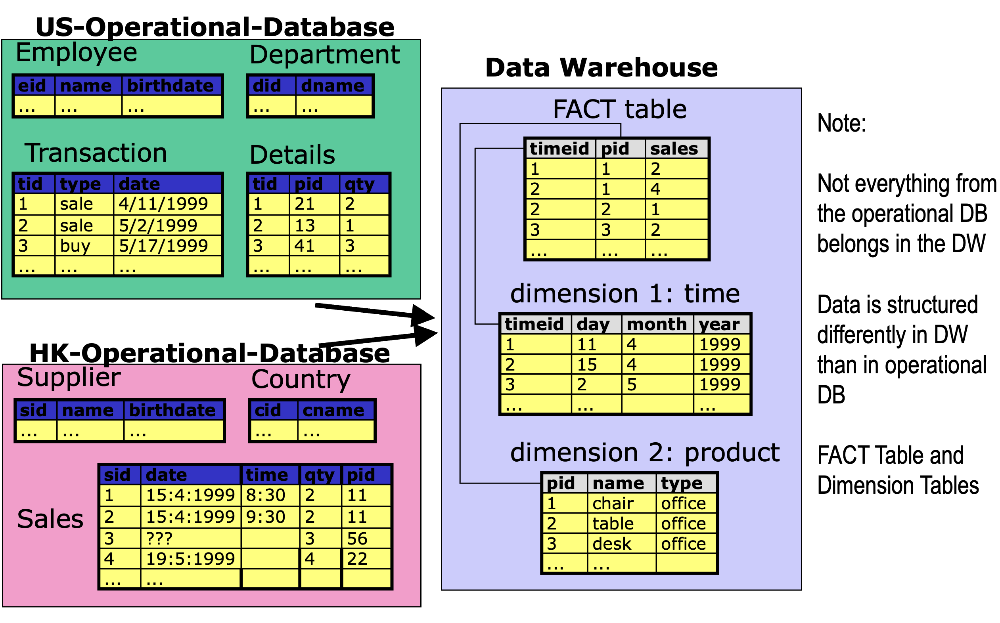{width="90%" fig-align="center"}

## A Data Warehouse is Subject-Oriented

- Organized around major subjects, such as [customer, product, sales]{style="color:#990000;"}

::: {.fragment}
- Focuses on the modeling and analysis of data for decision makers, not on daily operations or transaction processing
:::

::: {.fragment}
- Provides a [simple and concise]{style="color:#990000;"} view around particular subject issues by [excluding data that are not useful]{style="color:#990000;"} in the decision support process
:::

## A Data Warehouse is Integrated

- Constructed by integrating heterogeneous data sources
    - relational databases, flat files, on-line transaction records

::: {.fragment}
- Data cleaning and data integration techniques are applied.
    - Ensures consistency in naming conventions, encoding structures, attribute measures, etc. among different data sources
    - E.g., Hotel price: currency, tax, breakfast covered, etc.
:::

::: {.fragment}
- When data is moved to the warehouse, it is converted.
:::

## A Data Warehouse is Time-Variant

- The time horizon for the data warehouse is significantly longer than that of operational systems.
    - Operational database: holds current value data.
    - Data warehouse: provides information from a historical perspective (e.g., past 5-10 years)

::: {.fragment}
- Every key structure in the data warehouse contains an element of time, explicitly or implicitly
    - Note however that the keys used in operational data may or may not include a time element.
:::

## A Data Warehouse is Non-Volatile

- The DW provides a physically [separate store]{style="color:#990000;"} of data transformed from the operational environment

::: {.fragment}
- Operational [update of data does not occur]{style="color:#990000;"} in the data warehouse environment
    - Does not require transaction processing, recovery, and concurrency control mechanisms
    - Requires only two basic classes of operations:
        - [*initial data loading*]{style="color:#990000;"} and [*data access*]{style="color:#990000;"}.
:::

## How is Data Loaded into a Data Warehouse?

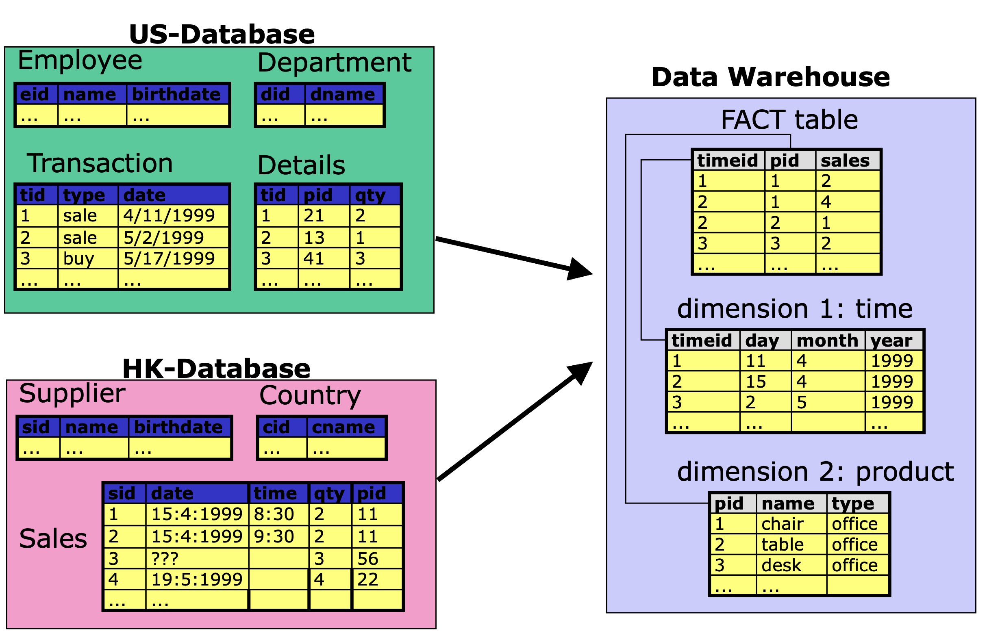{width="92%" fig-align="center"}

## Populating a Data Warehouse

- Data Selection
    - Only data which are important for analysis are selected
        - e.g., information about employees, departments, etc. are not stored in the warehouse
    - Therefore the data warehouse is [subject-oriented]{style="color:#990000;"}

::: {.fragment}
- Data Integration
    - Consistency of attribute names
    - Consistency of attribute data types
        - e.g., dates are converted to a consistent format
    - Consistency of values
        - e.g., product-ids are converted to correspond to the same products from both sources
    - Integration of data
        - e.g, data from both sources are integrated into the warehouse
:::

## Populating a Data Warehouse (2)

- Data Cleaning
    - Tuples which are incomplete or logically inconsistent are cleaned

::: {.fragment}
- Data Summarization
    - Values are summarized according to the desired level of analysis
    - For example, HK database records the time that a sales transaction takes place, but the most detailed time unit we are interested in for analysis is the day.
:::

## Data Warehouses Support OLAP

- OLAP: On-Line Analytical Processing
    - Support for decision making
    - Typically involves aggregate operations

::: {.fragment}
- Example of an OLAP query (collects counts)
    - [Summarize]{style="color:#990000;"} all company sales according to product and year, and further aggregate on each of these [dimensions]{style="color:#990000;"}.

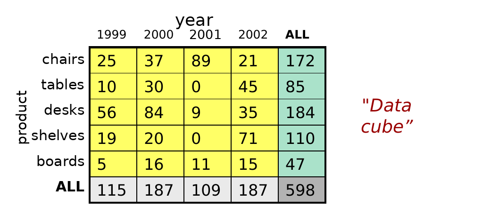{width="58%" fig-align="center"}
:::

## Data Warehouse vs. Operational DBMS

- OLTP (on-line transaction processing)
    - Major task of traditional relational DBMS
    - Day-to-day operations: purchasing, inventory, banking, manufacturing, payroll, registration, accounting, etc.
- OLAP (on-line analytical processing)
    - Major task of data warehouse system
    - Data analysis and decision making

::: {.fragment}
- Distinct features (OLTP vs. OLAP):
    - User and system orientation: customer vs. market
    - Data contents: current, detailed vs. historical, consolidated
    - Database design: ER + application vs. star + subject
    - View: current, local vs. evolutionary, integrated
    - Access patterns: update vs. read-only but complex queries
:::

## OLTP vs. OLAP

|                    | OLTP                              | OLAP                                          |
|--------------------|-----------------------------------|-----------------------------------------------|
| **users**          | clerk, IT professional            | knowledge worker                              |
| **function**       | day to day operations             | decision support                              |
| **DB design**      | application-oriented              | subject-oriented                              |
| **data**           | current, up-to-date; detailed, flat relational; isolated | historical; summarized, multidimensional; integrated, consolidated |
| **usage**          | repetitive                        | ad-hoc                                        |
| **access**         | read/write; index/hash on prim. key | lots of scans                               |
| **unit of work**   | short, simple transaction         | complex query                                 |
| **# records accessed** | tens                          | millions                                      |
| **#users**         | thousands                         | hundreds                                      |
| **DB size**        | 100MB-GB                          | 100GB-TB                                      |
| **metric**         | transaction throughput            | query throughput, response                    |

## Data Warehouse Usage

- Three kinds of data warehouse applications

::: {.fragment}
- [Information processing]{style="color:#990000;"}
    - supports querying, basic statistical analysis, and reporting using crosstabs, tables, charts and graphs
:::

::: {.fragment}
- [Analytical processing]{style="color:#990000;"}
    - multidimensional analysis of data warehouse data
    - supports basic OLAP operations, slice-dice, drilling, pivoting
:::

::: {.fragment}
- [Data mining]{style="color:#990000;"}
    - knowledge discovery from hidden patterns
    - supports associations, constructing analytical models, performing classification and prediction, and presenting the mining results using visualization tools.
:::

## Why Create a Separate Data Warehouse?

- High performance for both systems
    - DBMS&mdash; tuned for OLTP: access methods, indexing, concurrency control, recovery
    - Warehouse&mdash;tuned for OLAP: complex OLAP queries, multidimensional view, consolidation.

::: {.fragment}
- Different functions and different data:
    - [missing data]{.underline style="color:#990000;"}: Decision support requires historical data which operational DBs do not typically maintain
    - [data consolidation]{.underline style="color:#990000;"}: Decision support requires consolidation (aggregation, summarization) of data from heterogeneous sources
    - [data quality]{.underline style="color:#990000;"}: different sources typically use inconsistent data representations, codes and formats which have to be reconciled
:::

## Data Warehousing and OLAP Technology

Outline

- What is a data warehouse? What is OLAP?
- [The Multidimensional Data Model]{style="color:#990000;"}
- Implementation of Data Cubes
- Designing a Data Warehouse

## From Tables to Data Cubes

- A [dimension]{style="color:#990000;"} is a perspective with respect to which we analyze the data

::: {.fragment}
- A multidimensional data model is usually organized around a [central theme]{style="color:#990000;"} (e.g., sales). Numerical measures on this theme are called [facts]{style="color:#990000;"}, and they are used to analyze the relationships between the dimensions
:::

::: {.fragment}
- Example:
    - [Central theme]{style="color:#990000;"}: sales
    - [Dimensions]{style="color:#990000;"}: item, customer, time, location, supplier, etc.
:::

## From Tables to Data Cubes (cont.)

- A data warehouse is based on a multidimensional data model which views data in the form of a [data cube]{style="color:#990000;"}

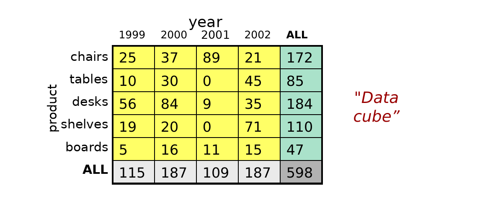{width="62%" fig-align="center"}

::: {.fragment}
- The data cube
    - summarizes the measure with respect to a set of dimensions
    - provides summarizations [for all subsets]{style="color:#990000;"} of dimensions
:::

## From Tables to Data Cubes (cont.)

- Summarizations along different dimensions are called [cuboids]{style="color:#990000;"}

::: {.fragment fragment-index=1}
- The most detailed part of the cube is called the [base cuboid]{style="color:#990000;"}
:::

::: {.fragment fragment-index=2}
- The highest level of summarization is called the [apex cuboid]{style="color:#990000;"}
:::

::: {.fragment fragment-index=3}
- The collection of cuboids forms a [lattice]{style="color:#990000;"} (explained later)
:::

::: {.r-stack}
{width="62%"}

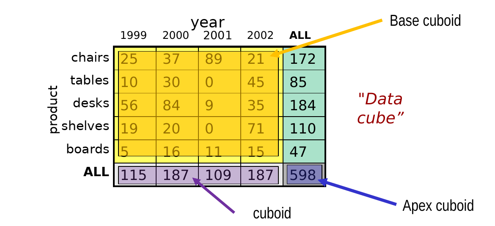{.fragment fragment-index=1 width="62%"}
:::

## A 3D Data Cube

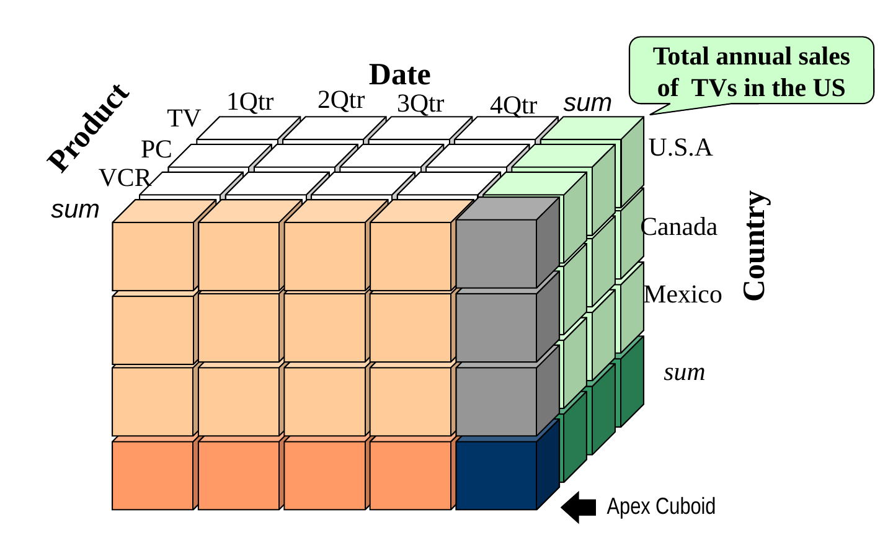{width="82%" fig-align="center"}

## Data Cube is the Model, not the Implementation!

- The implementation of this data model [*does not use a "cube" like data structure*]{style="color:#990000;"}
- A data cube, such as [sales]{style="color:#990000;"}, is instead implemented using two types of tables:

::: {.fragment}
- [Dimension]{style="color:#00B050;"} tables
    - such as [item (item_name, brand, type),]{style="color:#FF0000;"}
    - or [time (day, week, month, quarter, year)]{style="color:#FF0000;"}
:::

::: {.fragment}
- [Fact]{style="color:#00B050;"} tables, which contain:
    - measures such as [dollars_sold]{style="color:#FF0000;"}, and
    - foreign keys to each of the related dimension tables
:::

## Implementing Cubes Using Tables

- The most basic kind of data warehouse uses a [star schema]{.underline style="color:#990000;"}

::: {.fragment}
- A star schema has a fact table "in the middle" connected to a set of dimension tables
:::

## Example of a Star Schema

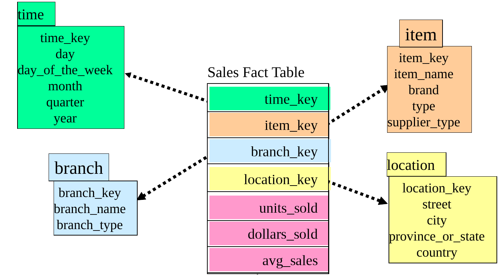{width="64%" fig-align="center"}

- In this [data cube]{style="color:#990000;"}, there is one [fact]{style="color:#990000;"} table and four [dimension]{style="color:#990000;"} tables
    - This is a four-dimensional data cube
- The [theme]{style="color:#990000;"} in this cube is [sales]{style="color:#990000;"}
- The [measures]{style="color:#990000;"} in this cube are: units_sold, dollars_sold, avg_sales

## Normalization leads to Snowflakes

::: {.columns}
::: {.column width=60%}
- Notice that in this example, some dimension tables are not normalized
    - e.g., "province/state" is a function of city
    - "country" is a function of city
    - "supplier type" is a function of supplier
    - We should normalize these!
:::

::: {.column width=40%}
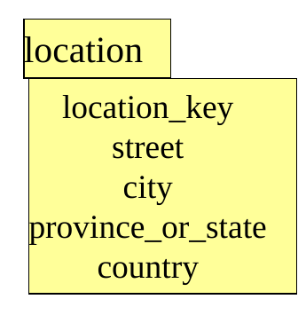{style="float: right; margin: 0 0 12px 24px;" width="255"}
:::
:::

::: {.fragment}
- [Snowflake schema]{.underline style="color:#990000;"}: A refinement of star schema where some dimensional hierarchy is [normalized]{style="color:#C00000;"} into a set of smaller dimension tables, forming a shape similar to a snowflake
:::

## Example of a Snowflake Schema

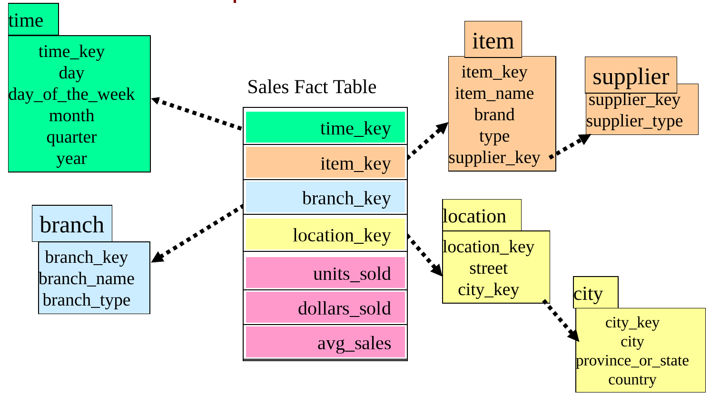{width="76%" fig-align="center"}

- Normalizing the Star creates a Snowflake
    - Here: 'item' and 'location' have been normalized

## Multiple Fact Types Leads to Constellations

- Next, we might consider how the data warehouse would be extended to include multiple fact types
    - eg, could add a theme around "shipments"

::: {.fragment}
- Shipments might share some dimension with sales
    - eg, location, time, item
:::

::: {.fragment}
- So we would add a new fact table for shipments, but reuse as much as possible the existing dimension tables
:::

::: {.fragment}
- Leads to a "collection of stars" &hellip; a [constellation schema]{style="color:#990000;"}
:::

## Example of a Fact Constellation

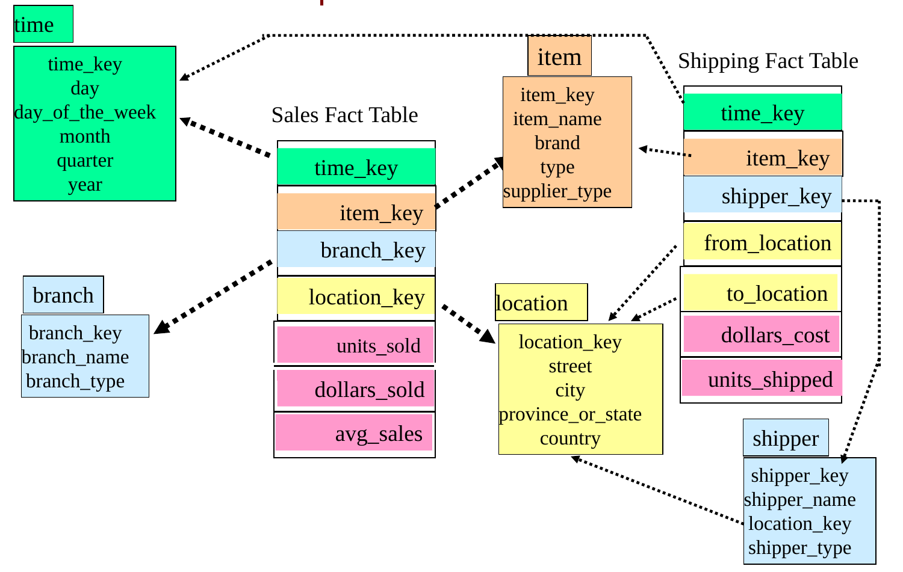{width="72%" fig-align="center"}

- New fact table with measures [dollars_cost, units_shipped]{style="color:#990000;"}
- Sharing some dimensions with Sales, but also has a new dimension ([shipper]{style="color:#990000;"})

## Measures: Three Categories

- [distributive]{.underline style="color:#990000;"}: if the result derived by applying the function to *n* aggregate values is the same as that derived by applying the function on all the data without partitioning.
    - E.g., count(), sum(), min(), max()
    - Sum(aggregate) = sum (sum(subaggregate1), sum(subaggregate2)&hellip;)

::: {.fragment}
- [algebraic]{.underline style="color:#990000;"}: if it can be computed by an algebraic function with *M* arguments (where *M* is a bounded integer), each of which is obtained by applying a distributive aggregate function.
    - E.g., avg(), standard_deviation().
    - E.g. avg() = sum() / count()
:::

::: {.fragment}
- [holistic]{.underline style="color:#990000;"}: if there is no constant bound on the storage size needed to describe a subaggregate.
    - E.g., median(), mode(), rank()
    - E.g, median of aggregate cannot be computed from medians of subaggregates
:::

## Aggregate Functions on Measures: Three Categories

- Given a table: [Sales(itemid, timeid, quantity)]{style="color:#990000;"}
- Target: compute an aggregate on [quantity]{style="color:#990000;"}

::: {.fragment}
- [distributive]{.underline style="color:#990000;"}:
    - To compute sum(quantity) we can first compute sum(quantity) for each item and then add these numbers.
:::

::: {.fragment}
- [algebraic]{.underline style="color:#990000;"}:
    - To compute avg(quantity) we can first compute sum(quantity) and count(quantity) and then divide these numbers.
:::

::: {.fragment}
- [holistic]{.underline style="color:#990000;"}:
    - To compute median(quantity) we can use neither median(quantity) for each item nor any combination of distributive functions.
    - Has to be computed separately for each aggregation
:::

## A 3D Data Cube and its Cuboids

- The set of cuboids forms a *lattice*
- The lattice is a graph showing relationships between cuboids
- Moving on the lattice corresponds to aggregation or disaggregation

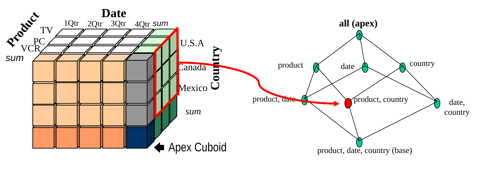{width="92%" fig-align="center"}
