## Data Warehousing and OLAP Technology

Outline

- [What is a data warehouse? What is OLAP?]{style="color:#a00;"}
- The Multidimensional Data Model
- Implementation of Data Cubes
- Designing a Data Warehouse

## Recall: What is a Data Warehouse?

- A *data warehouse* is a decision support database that is maintained [*separately*]{style="color:#a00;"} from the organization's operational database
    - Operational database: personnel / payroll, accounts payable, accounts receivable, orders, inventory, &hellip;
    - Data warehouse: none of the above
- Supports [information processing]{style="color:#a00;"} by providing a solid platform of consolidated, historical data for analysis
- "A data warehouse is a [subject-oriented]{.underline style="color:#a00;"}, [integrated]{.underline style="color:#a00;"}, [time-variant]{.underline style="color:#a00;"}, and [nonvolatile]{.underline style="color:#a00;"} collection of data in support of management's decision-making process." -- W.H. Inmon

## Recall: Data Warehouses Support OLAP

- OLAP: On-Line Analytical Processing
    - Support for decisionmaking
    - Typically involves aggregate operations
- Example of an OLAP query (collects counts)
    - [Summarize]{style="color:#a00;"} all company sales according to product and year, and further aggregate on each of these [dimensions]{style="color:#a00;"}.

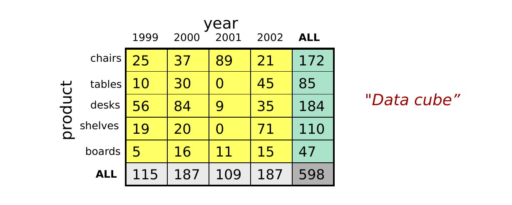{width="62%" fig-align="center"}

## Data Warehousing and OLAP Technology

Outline

- What is a data warehouse? What is OLAP?
- [The Multidimensional Data Model]{style="color:#a00;"}
- Implementation of Data Cubes
- Designing a Data Warehouse

## A 3D Data Cube and its Cuboids

- The set of cuboids forms a *lattice*
- The lattice is a graph showing relationships between cuboids
- Moving on the lattice corresponds to aggregation or disaggregation

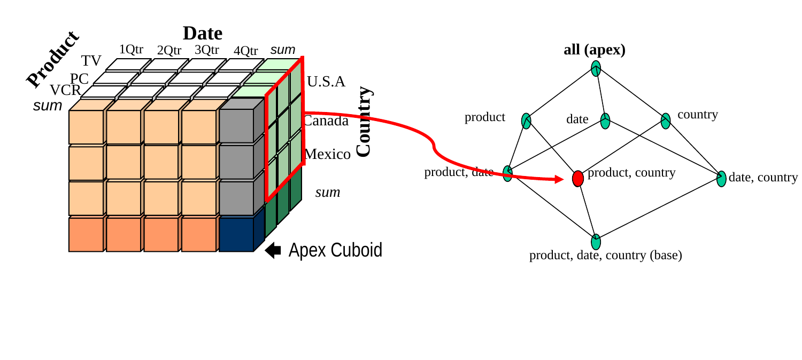{width="90%" fig-align="center"}

## Cuboids Corresponding to the Cube

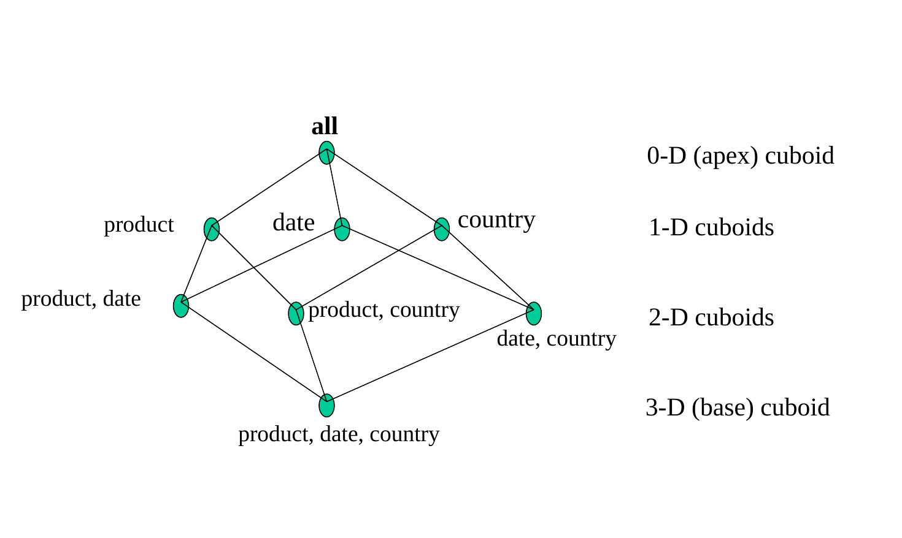{width="80%" fig-align="center"}

## Data Cube Example

- 'color', 'size': DIMENSIONS
- 'count': MEASURE

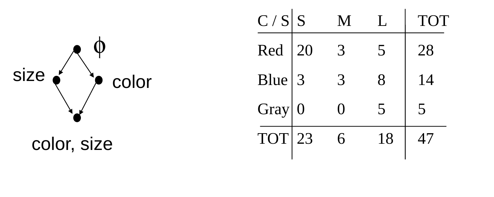{width="80%" fig-align="center"}

## The Apex Cuboid is the Grand Total

- 'color', 'size': DIMENSIONS
- 'count': MEASURE

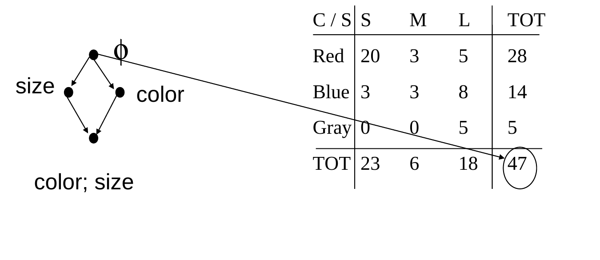{width="80%" fig-align="center"}

## Each 1D Cuboid is a Partial Sum

- 'color', 'size': DIMENSIONS
- 'count': MEASURE

::: {.r-stack}
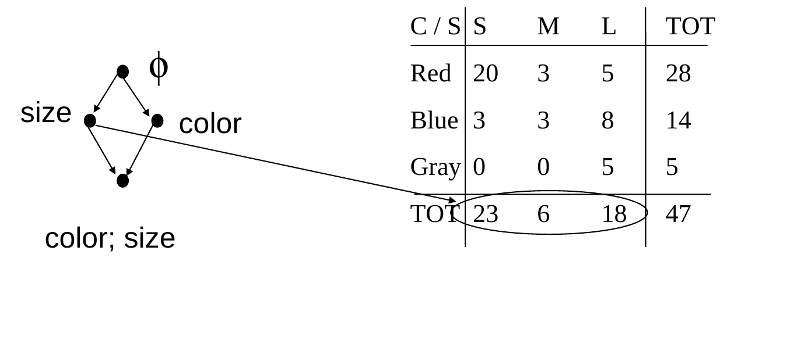{width="80%"}

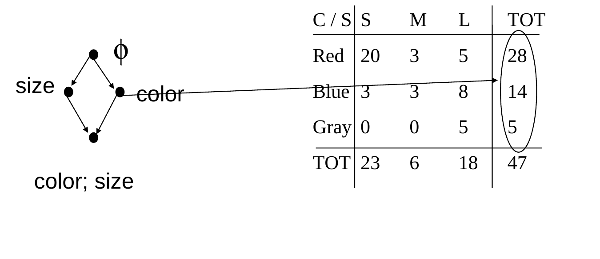{.fragment width="80%"}
:::

## The Detail Data is the Base Cuboid

- 'color', 'size': DIMENSIONS
- 'count': MEASURE

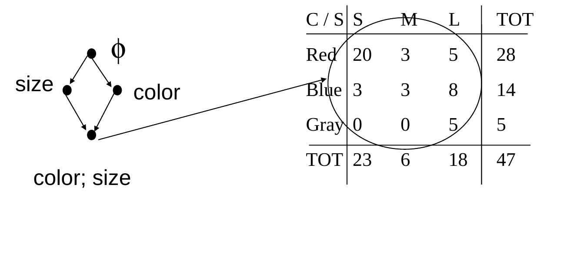{width="80%" fig-align="center"}

## A Data Cube is the Entire Set of Cuboids

- 'color', 'size': DIMENSIONS
- 'count': MEASURE

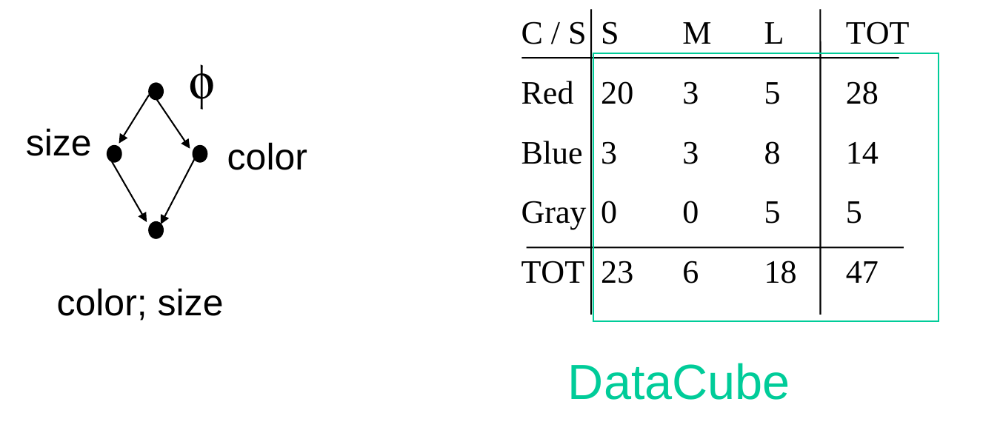{width="80%" fig-align="center"}

## The Lattice of Cuboids of a 4D Cube

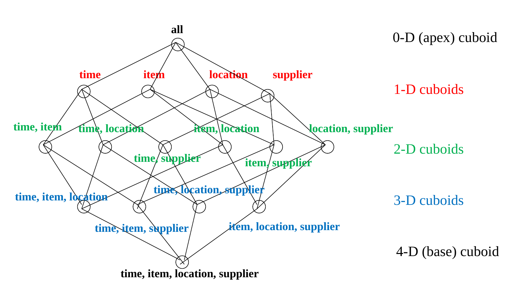{width="82%" fig-align="center"}

## Concept Hierarchies

- A given dimension may have an associated *concept hierarchy*
- A concept hierarchy provides another way to aggregate or disaggregate measures
- This concept hierarchy applies to the *location* dimension

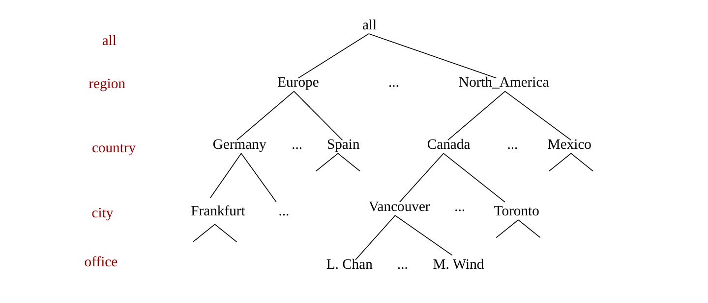{width="82%" fig-align="center"}

## Summarizing Data

- A cube may be summarized by removing a dimension
- Or by climbing in a concept hierarchy

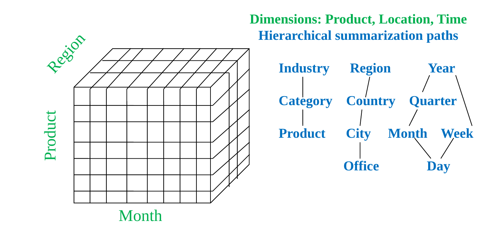{width="85%" fig-align="center"}

## Typical OLAP Operations

- [Browsing between cuboids]{style="color:#a00;"}
    - [**Roll up (drill-up):**]{style="color:#a00;"} summarize data
        - *by* [***climbing up the hierarchy***]{style="color:#00b;"} *or by* [***reducing a dimension***]{style="color:#00b;"}
    - [**Drill down (roll down):**]{style="color:#a00;"} reverse of roll-up
        - *from higher level summary* [***to lower level summary***]{style="color:#00b;"} *or detailed data*
- [Slice and dice:]{style="color:#a00;"}
    - *project and select*
- [Pivot (rotate):]{style="color:#a00;"}
    - *reorient the cube, visualization, 3D to series of 2D planes.*

## Example For OLAP Operations

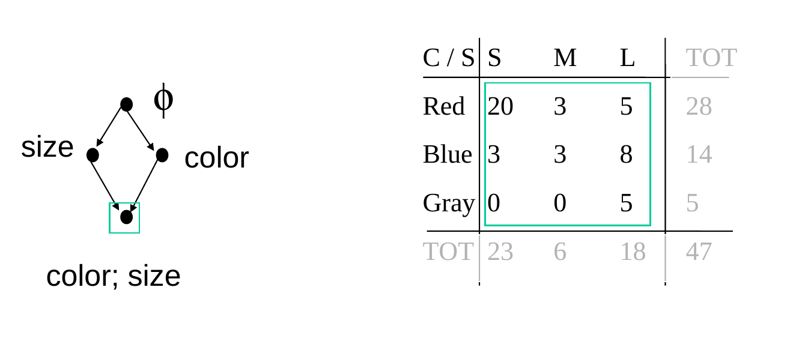{width="78%" fig-align="center"}

## Roll-Up

- In this example we reduce one dimension
- It is also possible to climb up in a measure hierarchy
    - Example (product, [city]{style="color:#a00;"}) &rarr; (product, [country]{style="color:#a00;"})

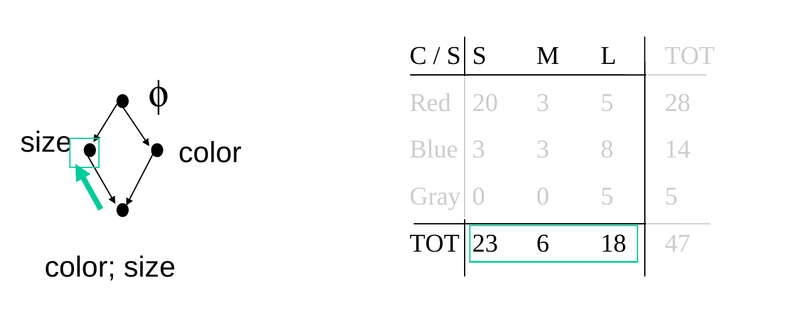{width="78%" fig-align="center"}

## Drill Down

- In this example we add one dimension
- It is possible to move down in a measure hierarchy
    - Example (product, [year]{style="color:#a00;"}) &rarr; (product, [month]{style="color:#a00;"})

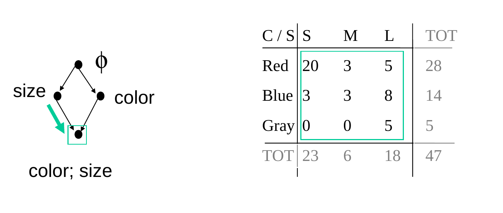{width="78%" fig-align="center"}

## Slice

- Perform a selection on [one]{style="color:#a00;"} dimension

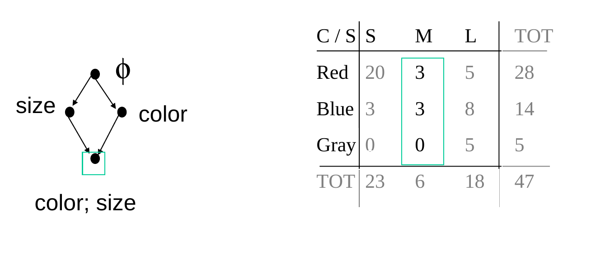{width="78%" fig-align="center"}

## Dice

- Perform a selection on [two or more]{style="color:#a00;"} dimensions

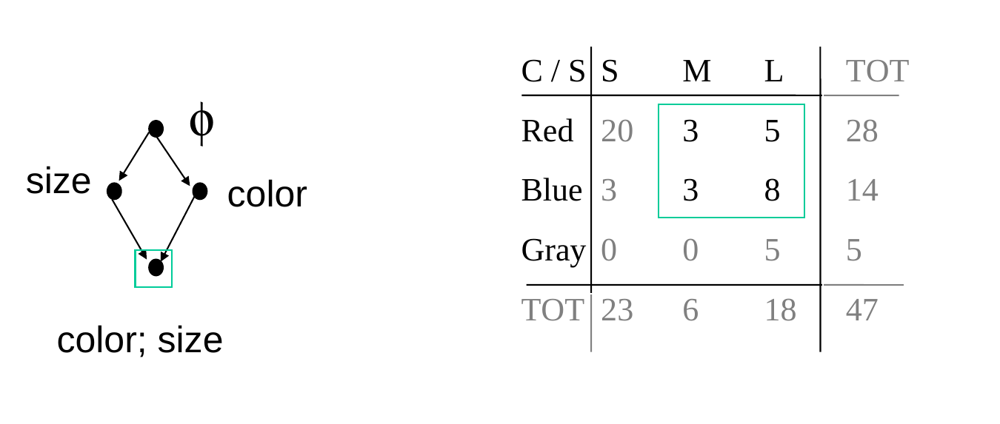{width="78%" fig-align="center"}

## Data Warehousing and OLAP Technology

Outline

- What is a data warehouse? What is OLAP?
- The Multidimensional Data Model
- [Implementation of Data Cubes]{style="color:#a00;"}
- Designing a Data Warehouse

## Efficient Data Cube Computation

- As discussed, a data cube may be thought of as a lattice of cuboids
    - Queries will often consist of drill-down or roll-up, ie, moving between cuboids
- By "materialize" a cuboid we mean to compute it in advance of a query, and maintain it if data changes
    - Materializing a cuboid will speed up queries
- How many cuboids are in an *n*-dimensional data cube?
    - If there are no concept hierarchies, there are $T = 2^{n}$ cuboids
        - Every *n*-digit binary number represents a cuboid
    - If each dimension has $L_{i}$ levels, there are $T = \prod_{i=1}^{n}(L_{i}+1)$ cuboids
- It may not be feasible or desirable to actually materialize every cuboid

## Counting Cuboids

- In any cuboid, a dimension may be present or absent, and if present, may be aggregated at any level
- If the dimension is absent, we have summed over all values in that dimension
- Example:
    - Three dimensions: Product, Location, Time
    - Three levels to Product, four levels to Location, five levels to Time
    - \# Cuboids = (4 x 5 x 6) = 120

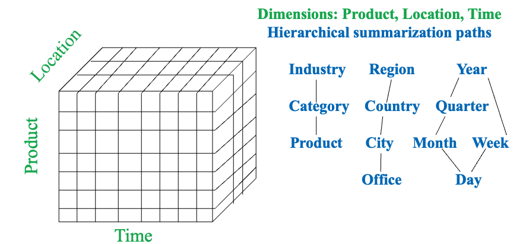{width="72%" fig-align="center"}

## Materialization Strategies

- Materialize every cuboid (full materialization)
- Don't materialize any cuboids (other than the base)
- Partial materialization of some cuboids
    - Selection based on size, sharing, access frequency, etc
- Cuboids are equivalent to the results of GROUP BY operations

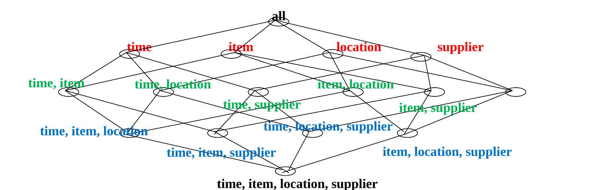{width="88%" fig-align="center"}

## Materializing Cuboids

:::: {.columns}
::: {.column width="55%"}
- Some SQL implementations allow full materialization using CUBE BY

```sql
SELECT item, city, year, SUM (amount)
FROM SALES
CUBE BY item, city, year
```

- Need compute the following GROUP-Bys:
    - [*(city, item, year),*]{style="color:#a00;"}
    - [*(city, item), (city, year), (item, year),*]{style="color:#a00;"}
    - [*(city), (item), (year)*]{style="color:#a00;"}
    - [*( )*]{style="color:#a00;"}
- Example:

```sql
SELECT city, item, SUM(amount)
FROM SALES
GROUP BY city, item
```
:::

::: {.column width="45%"}
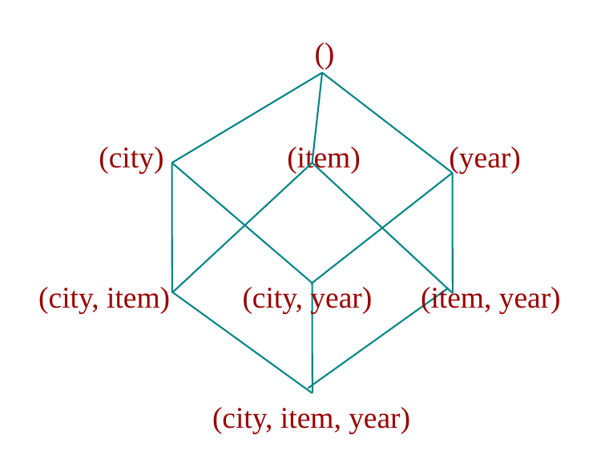{width="100%"}
:::
::::

## Storing Materialized Cuboids

- Materialized cuboids may be stored in a standard relation by introducing a special value "ALL"
- Assume our fact table looks like this:

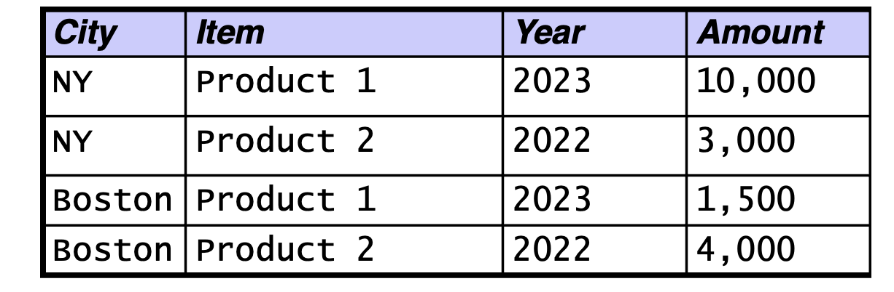{width="52%" fig-align="center"}

::: {.fragment}
- Then we can store materialized cuboids as follows:

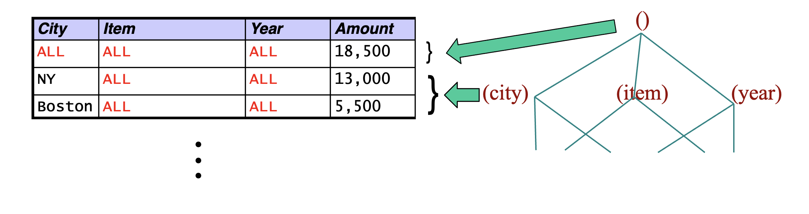{width="75%" fig-align="center"}
:::

## Retrieving a Cuboid

- Retrieving a cuboid makes use of the special value 'ALL'

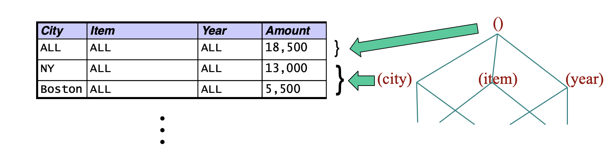{width="80%" fig-align="center"}

- To retrieve the (city) cuboid:

```sql
SELECT city, item, year, amount
From SALES
WHERE item = 'ALL' and year = 'ALL'
```

## Which Cuboids Should We Materialize?

- In real-life examples it may not be possible to materialize the whole data cube
- We have to select the most beneficial cuboids to materialize
- This depends mainly on the size of the cuboids and their usage by queries
- Thus to select we need information about
    - the size of cuboids, and
    - the queries and their frequency
- The base cuboid corresponds to the fact table, which is already materialized.

## Retrieving a Non-Materialized Cuboid

- Retrieving a cuboid that has not been materialized requires a GROUP-BY on a more detailed cuboid

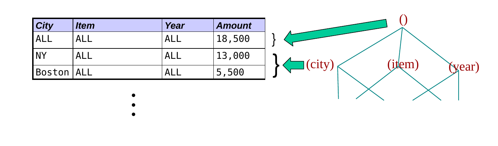{width="80%" fig-align="center"}

- To retrieve the (city, item) cuboid:

```sql
SELECT  city, item, sum(amount)
From SALES
where city != "ALL" and item != "ALL"
GROUP BY city, item
```

::: {.fragment}
[Why do we need these predicates?]{style="color:#c00;"}
:::

::: {.fragment}
[Because other cubes may be materialized!]{style="color:#c00;"}
:::

## Example: Which Cuboids Should We Materialize?

:::: {.columns}
::: {.column width="55%"}
- Example
    - candidate cuboids:
        - [(city, item, year)]{style="color:#a00;"} -- 100GB (already materialized)
        - (city, item) -- 60GB
        - (city, year) -- 20GB
        - (item, year) -- 1GB
        - (city) -- 10GB
        - (item) -- 200MB
        - (year) -- 30MB
        - (ALL) -- 8 bytes
    - queries (with equal probability)
        - Q1: total sales per (item, year)
        - Q2: total sales per (item)
        - Q3: total sales per (year)
:::

::: {.column width="45%"}
[Which views should we materialize if the available space is:]{style="color:#a00;"}

1. [10GB]{style="color:#a00;"}
2. [1GB]{style="color:#a00;"}
3. [100MB]{style="color:#a00;"}
:::
::::

## Case 1

- Case 1: Available space = 10GB
    - We can materialize all three views (item, year), (item), and (year)
    - The cost of Q1 is reading 1GB
    - The cost of Q2 is reading 200MB
    - The cost of Q3 is reading 30MB
    - Average query cost = (1230 MB) / 3 = 410 MB /query

## Case 2

- Case 2: Available space = 1GB
- We have two choices:
    - materialize (item, year) using 1GB
        - Q1 costs 1GB, Q2 costs 1GB, Q3 costs 1GB
        - Average query cost = 1GB
    - materialize (item) and (year) using 230 MB
        - Q1 costs 100 GB, Q2 costs 200 MB, Q3 costs 30 MB
            - Why does Q1 cost 100 GB?
        - Average query cost = (100.230 GB) / 3 = 34 GB
- First choice is better than the second!

## Case 3

- Case 3: Available space = 100MB
- We can only materialize (year)
    - Q1 costs 100 GB
    - Q2 costs 100 GB
    - Q3 costs 30 MB
    - Average query cost = (200.030 MB) / 3 = 67 GB

## Practice: Retrieving Cuboids

:::: {.columns}
::: {.column width="52%"}
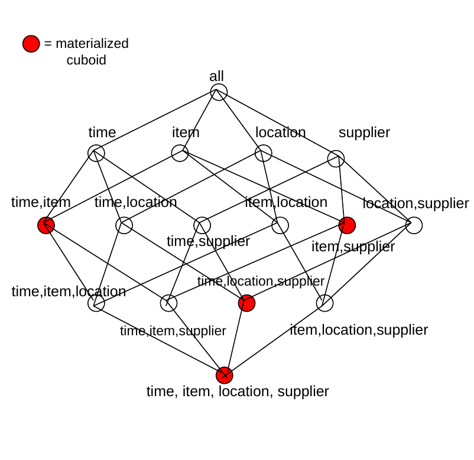{width="100%"}
:::

::: {.column width="48%"}
Given the cuboids that are materialized, how would you retrieve the following cuboids?

- Q1: (time, item)
- Q2: (supplier)
- Q3: (location)
:::
::::

## Q1: (time, item)

:::: {.columns}
::: {.column width="52%"}
{width="100%"}
:::

::: {.column width="48%"}
This cuboid is materialized.

So we can simply query it:

```sql
SELECT time, item, location, supplier, amount
FROM table
WHERE location = 'ALL' and supplier = 'ALL'
```
:::
::::

::: {.aside}
*Note: assume other attributes specify "!= ALL"*
:::

## Q2: supplier

:::: {.columns}
::: {.column width="52%"}
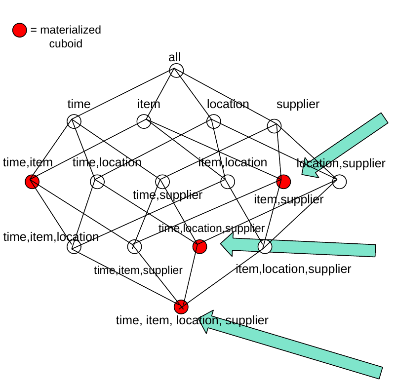{width="100%"}
:::

::: {.column width="48%"}
We have a number of options:

```sql
SELECT supplier, sum(amount)
WHERE location = 'ALL' and time = 'ALL'
GROUP BY supplier
```

or:

```sql
SELECT supplier, sum(amount)
WHERE item = 'ALL'
GROUP BY supplier
```

or:

```sql
SELECT supplier, sum(amount)
GROUP BY supplier
```

Which is most efficient?
:::
::::

::: {.aside}
*Note: assume other attributes specify "!= ALL"*
:::

## Q3: (location)

:::: {.columns}
::: {.column width="52%"}
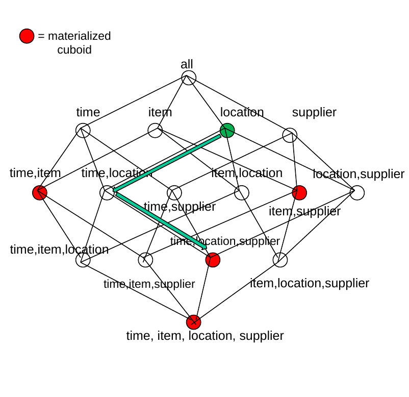{width="100%"}
:::

::: {.column width="48%"}
Strategy to find most efficient query:

- Find the closest materialized predecessor in the cuboid lattice
- Base your query on that cuboid

```sql
SELECT location, sum(amount)
FROM table
WHERE item = 'ALL'
GROUP BY location
```
:::
::::

::: {.aside}
*Note: assume other attributes specify "!= ALL"*
:::

## More Practice: Retrieving Cuboids

:::: {.columns}
::: {.column width="52%"}
{width="100%"}
:::

::: {.column width="48%"}
Given the cuboids that are materialized, how would you retrieve the following cuboids?

- Q4: (time, supplier)
- Q5: (item)
:::
::::

## Data Warehousing and OLAP Technology

Outline

- What is a data warehouse? What is OLAP?
- The Multidimensional Data Model
- Implementation of Data Cubes
- [Designing a Data Warehouse]{style="color:#a00;"}

## Reminder: Goal of a Data Warehouse

- "A data warehouse is a [subject-oriented]{.underline style="color:#a00;"}, [integrated]{.underline style="color:#a00;"}, [time-variant]{.underline style="color:#a00;"}, and [nonvolatile]{.underline style="color:#a00;"} collection of data in support of management's decision-making process."
- A *data warehouse* is a decision support database that is maintained [*separately*]{style="color:#a00;"} from the organization's operational database

## The DW Design Process

- Use requirements specifications and consult with analysts to select
    - The central theme of the analysis
        - For example, [sales]{style="color:#a00;"}
    - The measures on the central theme
        - For example, [sum(dollars)]{style="color:#a00;"}
    - The [dimensions]{style="color:#a00;"} used by analytical processing
    - The [attributes]{style="color:#a00;"} and hierarchies of the dimensions
- Design the [schema]{style="color:#a00;"}
- Clean, transform, and integrate information
    - Drawing from operational databases

## Example: Large Company Selling Engine Parts {.smaller}

- Operational Database 1 (Los Angeles)
    - employee(id, [name]{style="border-bottom:3px solid #c00;"}, [dept]{style="border-bottom:3px solid #33c;"}, lot, salary, age)
    - department(id name, type, manager_id)
    - part(id, name, type, brand, manufacturer, color)
    - customer(id, name, type, age, city, state, zip, tel)
    - sales(id, part_id, customer_id, quantity, price)
- Operational Database 2 (New York)
    - [employee]{style="border-bottom:3px solid #0a5;"}(id, [ename]{style="border-bottom:3px solid #c00;"}, [dept_id]{style="border-bottom:3px solid #33c;"}, salary, age)
    - department(id, name, type, manager)
    - part(id, title, type, brand, manufacturer, color)
    - customer(id, name, type, zip, tel)
    - location(zip, city_id)
    - city(city_id, state, country)
    - [sales]{style="border-bottom:3px solid #0a5;"}(id, part_id, customer_id, quantity, price)
- [Notice variation in attribute names, table structure, normalization!]{style="color:#a00;"}
- [Notice that some tables are of interest for analyzing company's business, some not]{style="color:#a00;"}

## Determining the Basic Features

- After consultation with analysts, we observe that a theme for the DW should be [sales]{style="color:#a00;"}
- Specifically, we want to analyze total sales in dollars, and average prices of sold units with respect to [time, part,]{style="color:#a00;"} and [customer.]{style="color:#a00;"}
- We select the basic features of the DW:
    - Central theme(s): [sales]{style="color:#a00;"}
    - Measures: [sum(sales_in_dollars), avg(price_sold_units)]{style="color:#a00;"}
    - Dimensions: [time, part, customer]{style="color:#a00;"}

## Selecting Hierarchies

- Next we determine dimension hierarchies
- This too is done in consultation with analysts
- We determine that hierarchies should be:
    - Time: day, week, month, quarter, year
    - Part: name, type, color, brand, manufacturer
    - Customer: name, type, city, state, country

:::: {.columns}
::: {.column width="60%"}
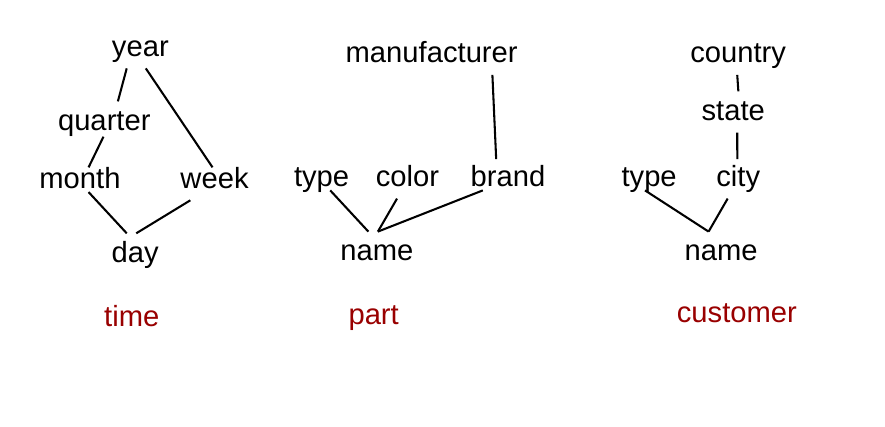{width="95%"}
:::

::: {.column width="40%"}
Q: how many cuboids will there be in this data cube?

::: {.fragment}
A: 6 x 6 x 6 = 216
:::
:::
::::

## Data Sufficiency

- Does all the needed information exist in the operational databases?
- In this example, we determine that all requested attributes exist, except for [time]{style="color:#a00;"}
- We determine that we will obtain time information by accessing the transaction logs of the operational databases.

## Design the DW schema

- In this example, we decide to use a star schema

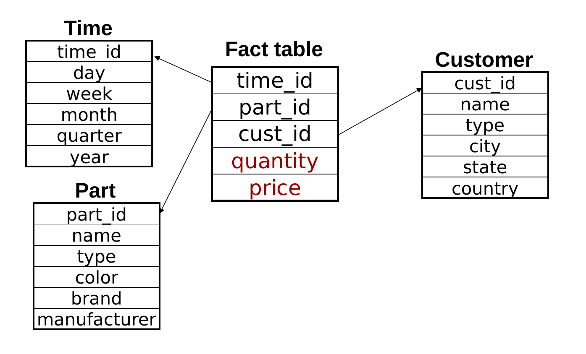{width="62%" fig-align="center"}

- We determine that we only need [quantity]{style="color:#a00;"} and (unit) [price]{style="color:#a00;"} to derive
    - [sum(sales_in_dollars)]{style="color:#a00;"} = quantity\*price
    - [avg(price_sold_units)]{style="color:#a00;"} = &Sigma;(quantity\*price)/ &Sigma;(quantity)

## Data Integration {.smaller}

:::: {.columns}
::: {.column width="42%"}
- Operational Database 1 (Los Angeles)
    - employee(id, name, dept, lot, salary, age)
    - department(id name, type, manager_id)
    - part(id, name, type, brand, manufacturer, color)
    - customer(id, name, type, age, city, state, zip, tel)
    - sales(id, part_id, customer_id, quantity, price)
- Operational Database 2 (New York)
    - employee(id, ename, dept_id, salary, age)
    - department(id, name, type, manager)
    - part(id, title, type, brand, manufacturer, color)
    - customer(id, name, type, zip, tel)
    - location(zip, city_id)
    - city(city_id, state, country)
    - sales(id, part_id, customer_id, quantity, price)
:::

::: {.column width="58%"}
- Convert attribute names and types
    - eg, since part.name = part.title
- Join tables if necessary
    - Join customer, location, city from New York DB
- Derive time if not present
    - Transaction logs from sales table
- Complete missing values
    - Los Angeles DB does not record customer country because all customers are from US. In the data taken from LA DB, set country value to "US"
- Ignore irrelevant tables and attributes
    - Tables [employee, department]{style="color:#a00;"} are ignored
    - Attributes [zip, tel, id]{style="color:#a00;"} are ignored
:::
::::

## Materialization

- Finally, decide which cuboids to materialize
- Base this on space available and expected mix of queries
