## What Is a Distributed Database?

- One in which data is:
    - *partitioned / fragmented* among multiple machines

::: {.fragment .sub}
&emsp;&emsp;&emsp;&emsp;&emsp;and/or

- *replicated* – copies of the same data are made available on multiple machines
:::

::: {.fragment}
- It is managed by a *distributed DBMS (DDBMS)* – processes on two or more machines that jointly provide access to a single logical database.
:::

::: {.fragment}
- The machines in question may be:
    - at different locations (e.g., different branches of a bank)
    - at the same location (e.g., a cluster of machines)
:::

::: {.fragment}
- In the remaining slides, we will use the term *site* to mean one of the machines involved in a DDBMS.
    - may or may not be at the same location
:::

## What Is a Distributed Database? (cont.)

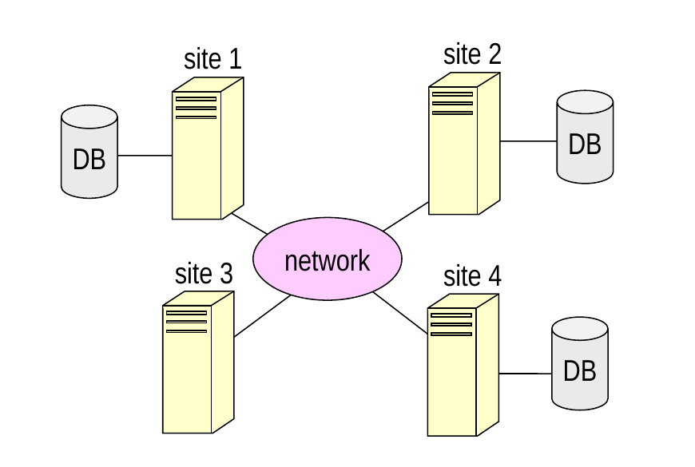{width="52%" fig-align="center"}

- A given site may have a local copy of all, part, or none of a particular database.

::: {.fragment .sub}
- makes requests of other sites as needed
:::

## Fragmentation / Sharding

:::: {.columns}

::: {.column width="58%"}
- Divides up a database's records among several sites
    - the resulting "pieces" are known as *fragments/shards*

::: {.fragment fragment-index=1}
- Let R be a collection of records of the same type (e.g., a relation).
:::

::: {.fragment fragment-index=2}
- *Horizontal fragmentation* divides up the "rows" of R.
    - R(a, b, c)[ → R1(a, b, c), R2(a, b, c), …]{.fragment fragment-index=3}
:::

::: {.fragment .sub fragment-index=5}
- R = R1 ∪ R2 ∪ …
:::

::: {.fragment fragment-index=6}
- *Vertical fragmentation* divides up the "columns" of R.
    - R(a, b, c) → R1(a, b), R2(a, c), …&emsp;(a is the primary key)
:::

::: {.fragment .sub fragment-index=9}
- R = R1 ⋈ R2 ⋈ …
:::
:::

::: {.column width="42%"}
::: {.r-stack}
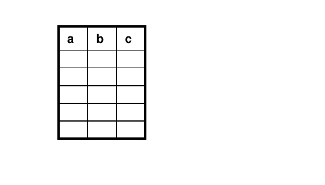{.fragment fragment-index=1 width="95%"}

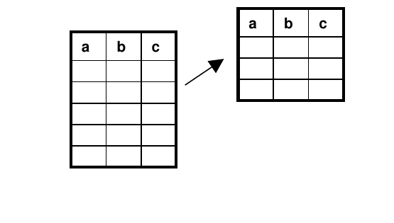{.fragment fragment-index=3 width="95%"}

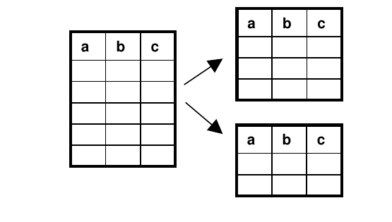{.fragment fragment-index=4 width="95%"}
:::

::: {.r-stack}
::: {.fragment fragment-index=6}
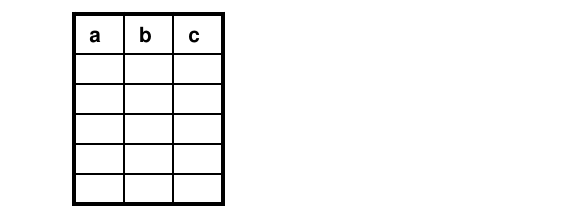{width="95%"}
:::

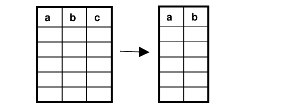{.fragment fragment-index=7 width="95%"}

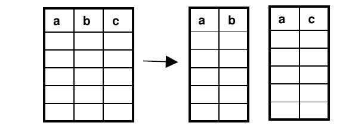{.fragment fragment-index=8 width="95%"}
:::
:::

::::

## Fragmentation / Sharding (cont.)

- Another version of vertical fragmentation: divide up the tables (or other collections of records).

::: {.fragment .sub}
- e.g., site 1 gets tables A and B &emsp;&emsp;&nbsp;site 2 gets tables C and D
:::

## Example of Fragmentation

- Here's a relation from a centralized bank database:

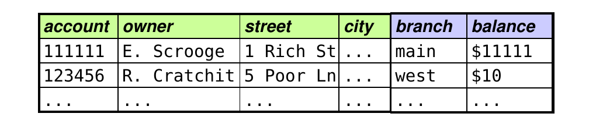{width="62%" fig-align="center"}

::: {.fragment fragment-index=1}
- Here's one way of fragmenting it:
:::

::: {.r-stack}
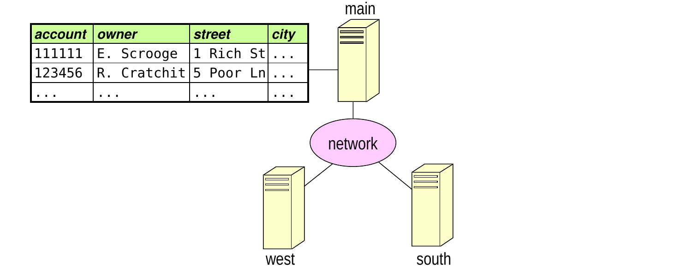{.fragment fragment-index=1 width="86%"}

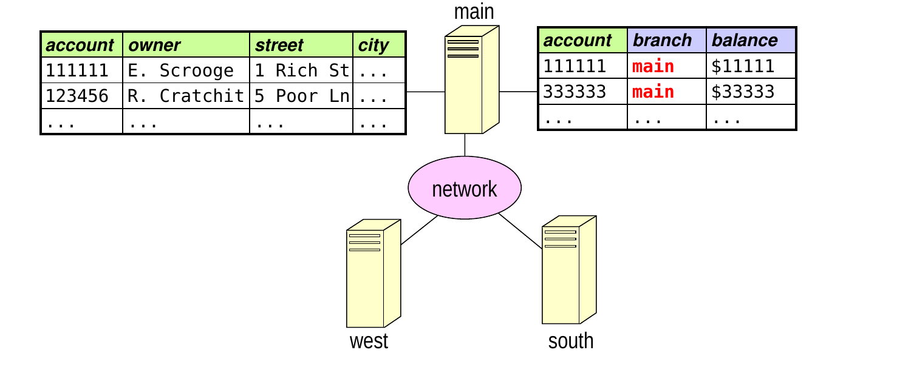{.fragment fragment-index=2 width="86%"}

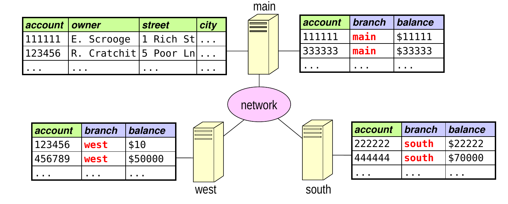{.fragment fragment-index=3 width="86%"}
:::

## Replication

- Replication involves putting copies of the same collection of records at different sites.

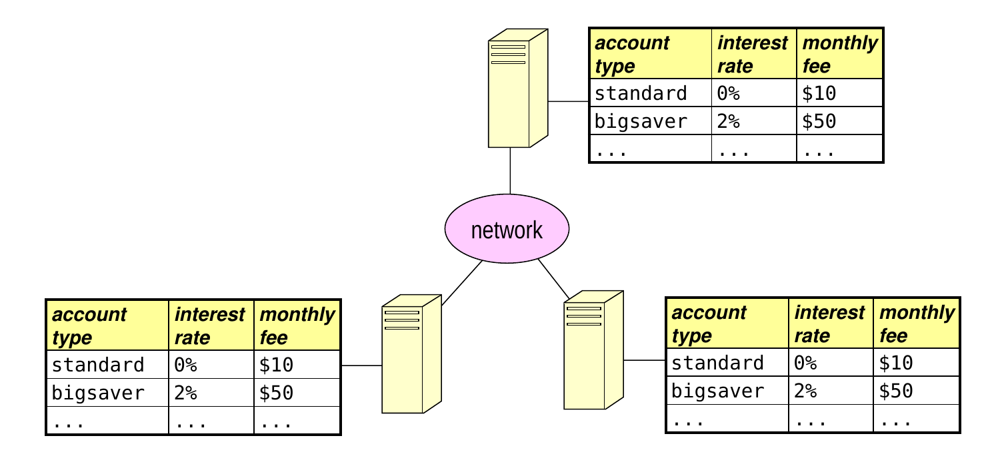{width="76%" fig-align="center"}

## Reasons for Using a DDBMS

- to improve performance
    - how does distribution do this?

::: {.fragment}
- to provide *high availability*
    - replication allows a database to remain available in the event of a failure at one site
:::

::: {.fragment}
- to allow for modular growth
    - add sites as demand increases
    - adapt to changes in organizational structure
:::

::: {.fragment}
- to integrate data from two or more existing systems
    - without needing to combine them
:::

::: {.fragment .sub}
- allows for the continued use of legacy systems
:::

::: {.fragment .sub}
- gives users a unified view of data maintained by different organizations
:::

## Challenges of Using a DDBMS (partial list)

- determining the best way to distribute the data
    - when should we use vertical/horizontal fragmentation?
    - what should be replicated, and how many copies do we need?

::: {.fragment}
- determining the best way to execute a query
    - need to factor in communication costs
:::

::: {.fragment}
- maintaining integrity constraints (primary key, foreign key, etc.)
:::

::: {.fragment}
- ensuring that copies of replicated data remain consistent
:::

::: {.fragment}
- managing *distributed txns*: ones that involve data at multiple sites
    - atomicity and isolation can be harder to guarantee
:::

## Failures in a DDBMS

- In addition to the failures that can occur in a centralized system, there are additional types of failures for a DDBMS.

::: {.fragment}
- These include:
    - the loss or corruption of messages
        - TCP/IP handles this type of error
:::

::: {.fragment .sub}
- the failure of a site
:::

::: {.fragment .sub}
- the failure of a communication link
    - can often be dealt with by rerouting the messages
:::

::: {.fragment .sub}
- *network partition:* failures prevent communication between two subgroups of the sites
:::

## Distributed Transactions

- A *distributed transaction* involves data stored at multiple sites.

::: {.fragment}
- One of the sites serves as the *coordinator* of the transaction.
    - one option: the site on which the txn originated
:::

::: {.fragment}
- The coordinator divides a distributed transaction into *subtransactions*, each of which executes on one of the sites.

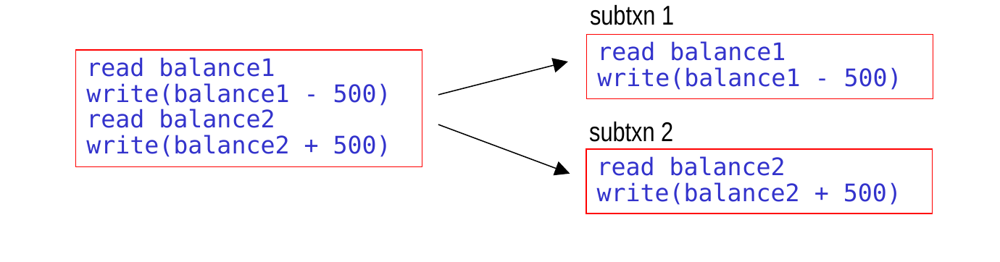{width="75%" fig-align="center"}
:::

## Types of Replication

- In *synchronous replication*, transactions are guaranteed to see the most up-to-date value of an item.
- In *asynchronous replication*, transactions are *not* guaranteed to see the most up-to-date value.

## Synchronous Replication I: Read-Any, Write-All

- *Read-Any:* when reading an item, access *any* of the replicas.

::: {.fragment}
- *Write-All:* when writing an item, must update *all* of the replicas.
:::

::: {.fragment}
- Works well when reads are much more frequent than writes.
- Drawback: writes are very expensive.
:::

## Synchronous Replication II: Voting

- When writing, update some fraction of the replicas.
    - each value has a version number that is increased when the value is updated

::: {.fragment}
- When reading, read enough copies to ensure you get at least one copy of the most recent value (see next slide).
:::

::: {.fragment .sub}
- the copies "vote" on the value of the item
:::

::: {.fragment .sub}
- the copy with the highest version number is the most recent
:::

::: {.fragment}
- Drawback: reads are now more expensive
:::

## Synchronous Replication II: Voting (cont.)

- How many copies must be read?
    - let:&emsp;n = the number of copies &emsp;&emsp;&emsp;&nbsp;w = the number of copies that are written &emsp;&emsp;&emsp;&nbsp;r = the number of copies that are read

::: {.fragment .sub fragment-index=1}
- need: r > n – w&ensp;(i.e., at least n – w + 1)
:::

::: {.fragment .sub fragment-index=2}
- example:&emsp;n = 6 copies &emsp;&emsp;&emsp;&emsp;&emsp;&emsp;update w = 3 copies [&emsp;&emsp;&emsp;&emsp;&emsp;&emsp;must read at least 4 copies]{.fragment fragment-index=3}
:::

:::: {.columns}

::: {.column width="60%"}
::: {.fragment fragment-index=4}
- Example: 6 copies of data item A, each with value = 4, version = 1.
:::

::: {.fragment .sub fragment-index=5}
- txn 2 updates A1, A2, and A4 to be 6 (and their version number becomes 2)
:::

::: {.fragment .sub fragment-index=6}
- txn 1 reads A2, A3, A5, and A6
:::

::: {.fragment .sub fragment-index=7}
- A2 has the highest version number (2), so its value (6) is the most recent.
:::
:::

::: {.column width="40%"}
::: {.r-stack}
::: {.fragment fragment-index=4}
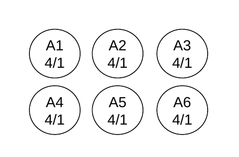{width="92%"}
:::

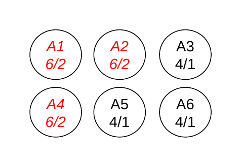{.fragment fragment-index=5 width="92%"}

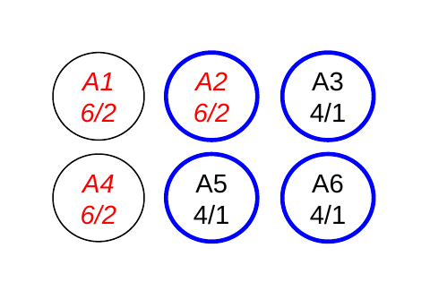{.fragment fragment-index=6 width="92%"}

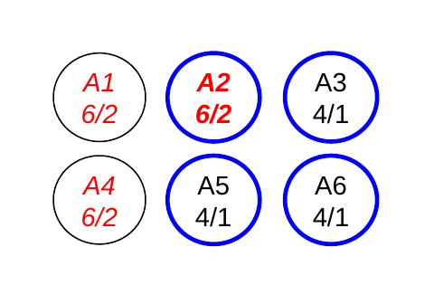{.fragment fragment-index=7 width="92%"}
:::
:::

::::

## Which of these allow us to ensure that clients always get the most up-to-date value?

- 10 replicas – i.e., 10 copies of each item
- voting-based approach with the following requirements:

|        | number of copies accessed when reading | number of copies accessed when writing |
|:------:|:------------------------------------------:|:------------------------------------------:|
| A.     | 7 | 3 |
| B.     | 5 | 5 |
| C.     | [9]{.fragment .highlight-blue fragment-index=1} | [2]{.fragment .highlight-blue fragment-index=1} |
| D.     | [4]{.fragment .highlight-blue fragment-index=1} | [8]{.fragment .highlight-blue fragment-index=1} |

E\.&ensp;both A and B &emsp;&emsp;&emsp;&emsp; [F.&ensp;both C and D]{.fragment .highlight-blue fragment-index=1}

## Distributed Concurrency Control

- To ensure the isolation of distributed transactions, need some form of distributed concurrency control.

::: {.fragment}
- Extend the concurrency control schemes that we studied earlier.
    - we'll focus on extending strict 2PL
:::

::: {.fragment}
- If we just used strict 2PL at each site, we would ensure that the schedule of subtxns *at each site* is serializable.
    - why isn't this sufficient?
:::

::: {.fragment}
&emsp;&emsp;&emsp;[because the equivalent serial orderings could be different at different sites]{style="color:#0000cc;"}
:::

## Distributed Concurrency Control (cont.)

- Example of why special steps are needed:
    - voting-based synchronous replication with 6 replicas

::: {.fragment .sub fragment-index=1}
- let's say that we configure the voting as before:
    - each write updates 3 copies
    - each read accesses 4 copies
:::

::: {.fragment .sub fragment-index=2}
- can end up with schedules that are not conflict serializable
:::

::: {.fragment .sub fragment-index=3}
- example:
:::

::: {.r-stack}
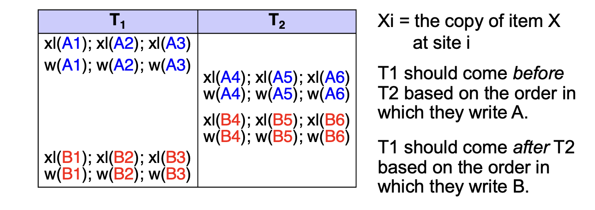{.fragment fragment-index=3 width="84%"}
:::
