## MapReduce

A framework for computation on large data sets that are fragmented and replicated across a cluster of machines.

::: {.fragment .sub}
- spreads the computation across the machines, letting them work in parallel
:::

::: {.fragment .sub}
- tries to minimize the amount of data that is transferred between machines
:::

::: {.fragment}
The original version was Google's MapReduce system.
:::

::: {.fragment .sub}
- An open-source version is part of the Hadoop project (used in HW).
:::

## Sample Problem: Totalling Customer Orders

- Acme Widgets is a company that sells only one type of product.

::: {.fragment fragment-index=1}
- *Data set:* a large collection of records about customer orders
    - fragmented and replicated across a cluster of machines
:::

::: {.fragment .sub fragment-index=2}
- sample record:
:::

::: {.r-stack}
{.fragment fragment-index=2 width="88%"}

{.fragment fragment-index=3 width="88%"}

{.fragment fragment-index=4 width="88%"}

{.fragment fragment-index=5 width="88%"}
:::

::: {.fragment fragment-index=6}
- *Desired computation:* For each customer, compute the total amount in that customer's active orders.
:::

::: {.fragment fragment-index=7}
- Inefficient approach: Ship all of the data to one machine and compute the totals there.
:::

## Sample Problem: Totalling Customer Orders (cont.)

- MapReduce does better using "divide-and-conquer" approach.
    - splits the collection of records into subcollections that are processed in parallel

::: {.fragment fragment-index=1}
- For each subcollection, a *mapper task* maps the records to smaller key-value pairs &ndash; in this case, (cust_id, amount active).
:::

::: {.r-stack}
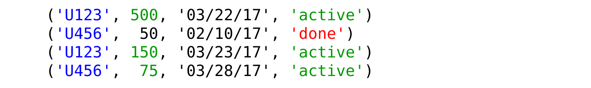{.fragment fragment-index=1 width="92%"}

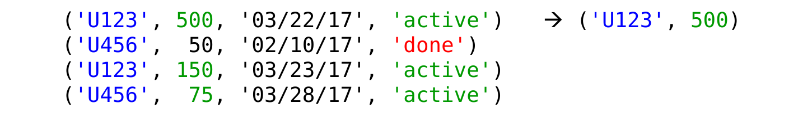{.fragment fragment-index=2 width="92%"}

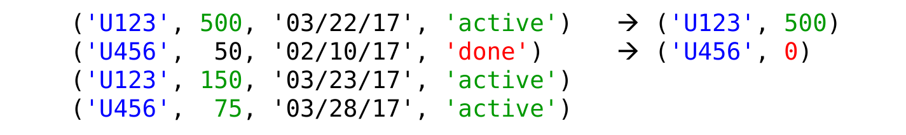{.fragment fragment-index=3 width="92%"}

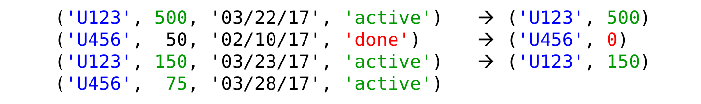{.fragment fragment-index=4 width="92%"}

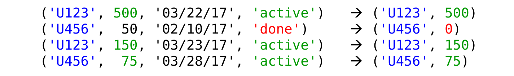{.fragment fragment-index=5 width="92%"}
:::

::: {.fragment fragment-index=6}
- These smaller pairs are distributed by cust_id to other tasks that again work in parallel.
:::

::: {.fragment fragment-index=7}
- These *reducer tasks* combine the pairs for a given cust_id to compute the per-customer totals:
:::

::: {.r-stack}
{.fragment fragment-index=6 width="92%"}

{.fragment fragment-index=8 width="92%"}

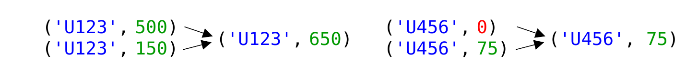{.fragment fragment-index=9 width="92%"}
:::

## Benefits of MapReduce

- Parallel processing reduces overall computation time.

::: {.fragment}
- Less data is sent between machines.

:::

:::: {.fragment .sub}
- the mappers often operate on local data
::::

::: {.fragment .sub}
- the key-value pairs sent to the reducers are smaller than the original records
:::

::: {.fragment .sub}
- an initial reduction can sometimes be done locally
    - example: compute local subtotals for each customer, then send those subtotals to the reducers
:::

::: {.fragment}
- It provides fault tolerance.
    - if a given task fails or is too slow, re-execute it
:::

::: {.fragment}
- The framework handles all of the hard/messy parts.
- The user can just focus on the problem being solved!
:::

## MapReduce In General: Mapping

- The system divides up the collection of input records, and assigns each subcollection S<sub>i</sub> to a mapper task M<sub>j</sub>.

::: {.r-stack}
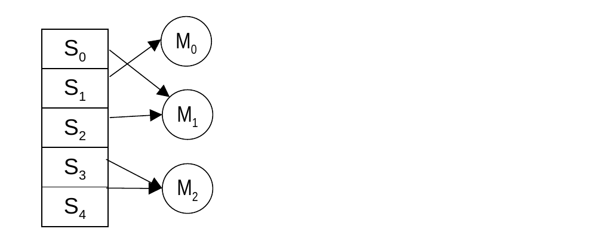{width="72%"}

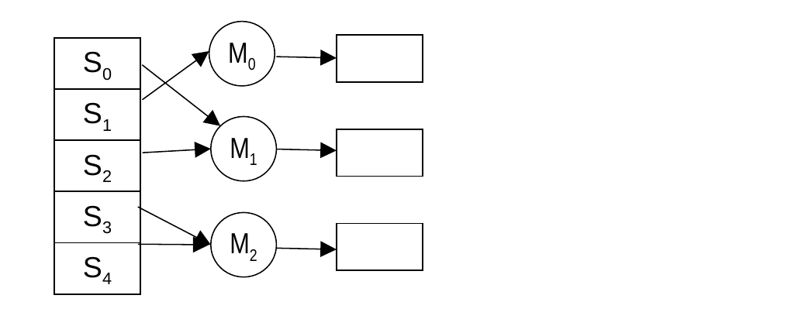{.fragment fragment-index=2 width="72%"}
:::

::: {.fragment fragment-index=1}
- The mappers apply a map function to each record:

```text
map(k, v):   # treat record as a key-value pair
    emit 0 or more new key-value pairs (k', v')
```
:::

::: {.fragment .sub fragment-index=3}
- the resulting keys and values (the *intermediate results*) can have different types than the original ones
:::

::: {.fragment .sub fragment-index=4}
- the input and intermediate keys do *not* have to be unique
:::

## MapReduce In General: Reducing

- The system partitions the intermediate results by key, and assigns each range of keys to a reducer task R<sub>k</sub>.

::: {.r-stack}
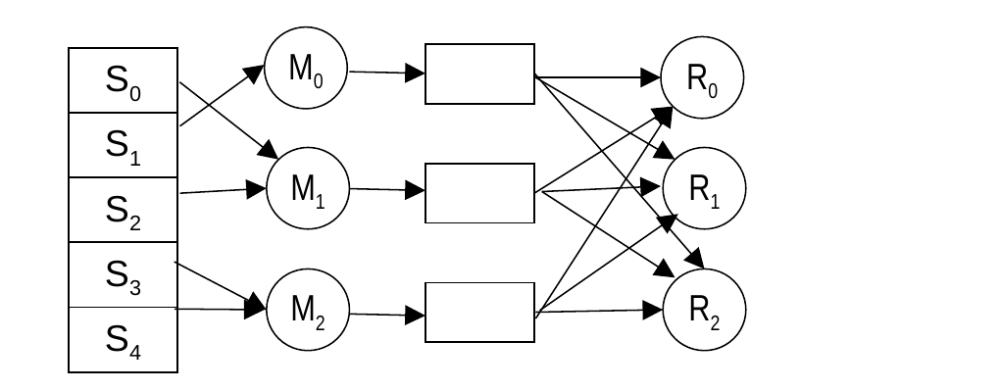{width="72%"}

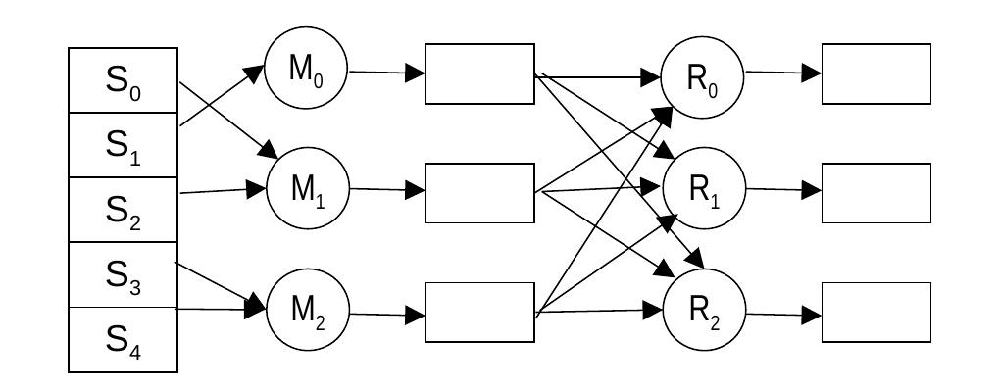{.fragment fragment-index=2 width="72%"}
:::

:::: {.fragment fragment-index=1}
- Key-value pairs with the same key are grouped together:

```text
(k', v'0),  (k', v'1), (k', v'2)   →   (k', [v'0, v'1, v'2, ...])
```

::: {.sub}
- so that *all* values for a given key are processed together
:::
::::

::: {.fragment fragment-index=2}
- The reducers apply a reduce function to each (key, value-list):

```text
reduce(k', [v'0, v'1, v'2, ...]):
    emit 0 or more key-value pairs (k", v")
```
:::

::: {.fragment .sub fragment-index=3}
- the types of the (k", v") can be different from the (k', v')
:::

## MapReduce In General: Combining (Optional)

- In some cases, the intermediate results can be aggregated locally using *combiner* tasks C<sub>n</sub>.

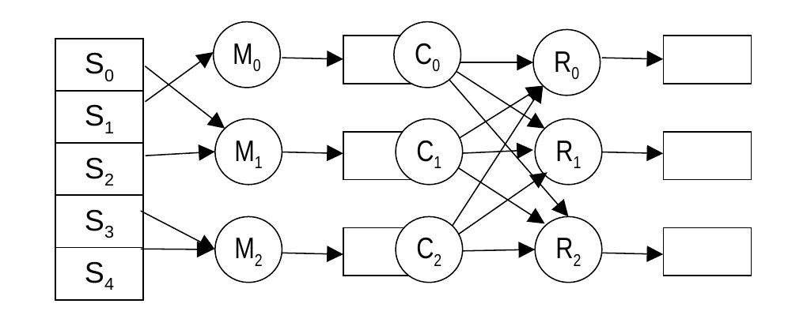{width="72%" fig-align="center"}

::: {.fragment}
- Often, the combiners use the same reduce function as the reducers.
    - produces partial results that can then be combined
:::

::: {.fragment}
- This cuts down on the data transferred to the reducers.
:::

## Hadoop MapReduce Framework

- Implemented in Java
- It also includes other, non-Java options for writing MapReduce applications.
- We will write applications in python using the **`MRJob`** library

## MRJob Framework

```python
from mrjob.job import MRJob

class Example1(MRJob):

    def mapper(self, input_key, input_value):
        // your code goes here
        yield (output_key, output_value)

    def reducer(self, input_key, input_value):
        // your code goes here
        yield (output_key, output_value)

if __name__ == '__main__':
    Example1.run()
```

## Example 1: Birth-Month Counter

- *The data:* text file(s) containing person records that look like this
    - `id,name,dob,email`
    - where `dob` is in the form `yyyy-mm-dd`

::: {.fragment}
- *The problem:* Find the number of people born in each month.
:::

## Example 1: Birth-Month Counter (cont.)

- `map` should:
    - extract the month from the person's dob
    - emit a single key-value pair of the form (month string, 1)

::: {.r-stack}
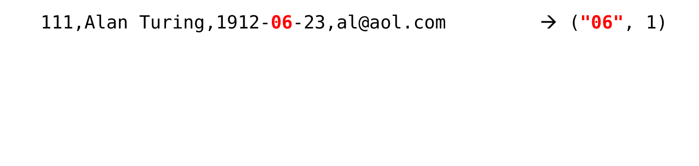{width="88%"}

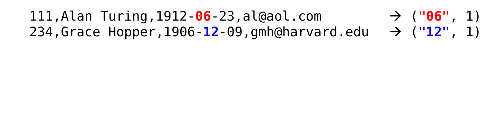{.fragment fragment-index=1 width="88%"}

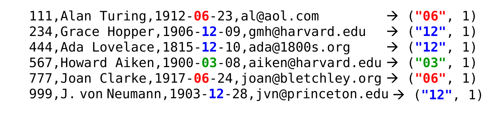{.fragment fragment-index=2 width="88%"}
:::

::: {.fragment fragment-index=3}
- The intermediate results are distributed by key to the reducers.
:::

::: {.fragment fragment-index=4}
- `reduce` should:
    - add up the 1s for a given month
    - emit a single key-value pair of the form (month string, total)
:::

::: {.r-stack}
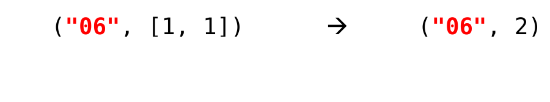{.fragment fragment-index=5 width="52%"}

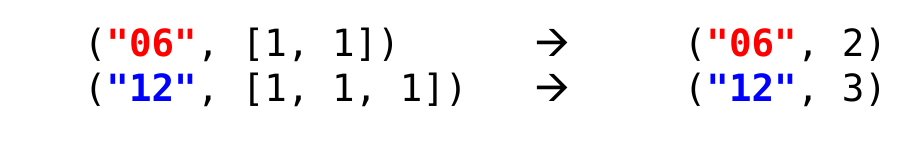{.fragment fragment-index=6 width="52%"}

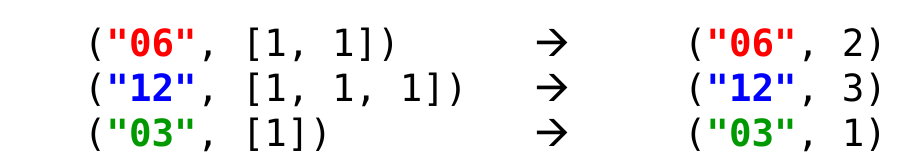{.fragment fragment-index=7 width="52%"}
:::

## Mapper for Example 1

::: {.r-stack}
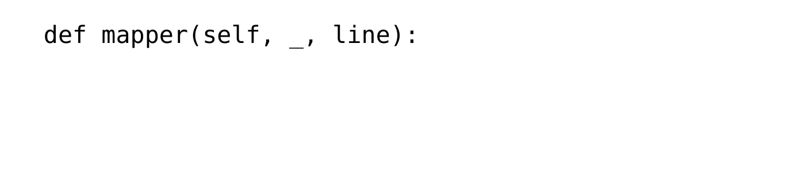{width="93%"}

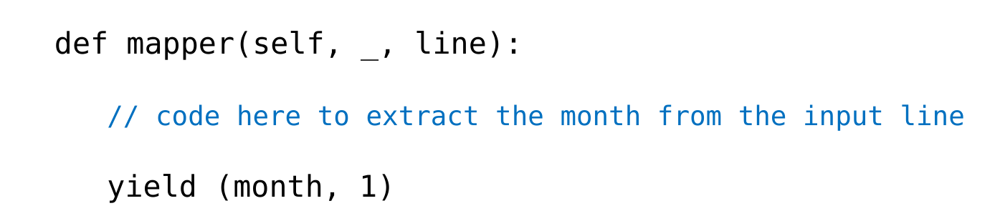{.fragment fragment-index=3 width="93%"}
:::

- For data obtained from text files, the Mapper's inputs will be key-value pairs in which:
    - value = a single line from one of the files
    - key = None

::: {.fragment fragment-index=1}
- Hence we use `_` to "throw away" the key
:::

::: {.fragment fragment-index=2}
- The `map` method will output pairs in which
    - key = a month string
    - value = 1
:::

::: {.fragment fragment-index=3}
- We use `yield` to return the value (like "return")
:::

## Splitting a String

- The `str` class includes a method named `split()`.
    - breaks a string into component strings

::: {.fragment .sub}
- takes a parameter indicating what delimiter should be used when performing the split
:::

::: {.fragment .sub}
- returns a `str` list containing the components
:::

::: {.fragment}
- Example:

```python
sentence = "How now brown cow?"
words = sentence.split(" ")
print(words[0])
print(words[3])
print(len(words))
```

would output:
:::

::: {.fragment}
```text
How
cow?
4
```
:::

## Processing an Input Record in `map`

```python
def mapper(self, _, line):
```

- Recall: `line` represents one record.
    - for Example 1, it looks like: `111,Alan Turing,1912-06-23,al@aol.com`

::: {.fragment}
- To extract the month string:
    - split `line` on the commas to get the fields:

```python
fields = line.split(",")
```
:::

::: {.fragment .sub}
- similarly, split the date field on the hyphens to get its components
:::

::: {.fragment .sub}
- could we just split `line` on the hyphens?
:::

::: {.fragment .sub}
- [no, because a person's name could have hyphens in it]{style="color:#3a5fcd;"}
:::

## Processing the List of Values in `reduce`

::: {.r-stack}
{width="93%"}

{.fragment fragment-index=3 width="93%"}
:::

::: {.fragment fragment-index=1}
- `counts` is a list of "1"s
:::

::: {.fragment fragment-index=2}
- `sum()` adds up a list
:::

::: {.fragment fragment-index=3}
- Use `yield` rather than `return`
:::

::: {.fragment fragment-index=4}
```text
python lecture-ex-1.py lecture-data-1.txt
"12"    3
"06"    2
"03"    1
```
:::

## Example 2: Month with the Most Birthdays

- *The data:* same as Example 1. Records of the form
    - `id,name,dob,email`
    - where `dob` is in the form `yyyy-mm-dd`
- *The problem:* Find the month with the most birthdays.

## Example 2: Month with the Most Birthdays (cont.)

- `map` should behave as before:

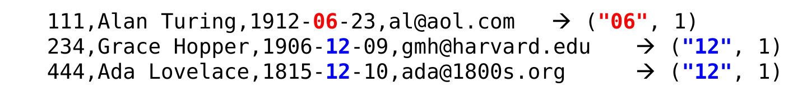{width="92%"}

::: {.fragment fragment-index=1}
- `reduce` needs to:
:::

::: {.fragment fragment-index=1}
{width="52%" fig-align="center"}
:::

::: {.fragment .sub fragment-index=2}
- add up the 1s for a given month
- determine which month has the largest total
:::

::: {.fragment .sub fragment-index=3}
- *but...* there can be multiple reducer tasks, each of which handles one subset of the months
:::

::: {.fragment .sub fragment-index=4}
- each reducer can only determine the largest month in its subset
:::

::: {.fragment .sub fragment-index=5}
- *the solution:* a chain of two MapReduce jobs
:::

## Example 2: Chaining Jobs

- First job = count birth months as we did in Example 1
    - map1: person record &rarr; (birth month, 1)
    - reduce1: (birth month, [1, 1, ...]) &rarr; (birth month, total)

::: {.fragment fragment-index=1}
- The second job processes the results of the first job!
:::

::: {.fragment .sub fragment-index=2}
- map2: (birth month, total) &rarr; (**c**, **(birth month, total)**)
    - output key **c** = an arbitrary *constant*, used for *all* k-v pairs (we will use "None")
:::

::: {.fragment .sub fragment-index=3}
- output **value** = a pairing of a birth month and its total
:::

::: {.fragment .sub fragment-index=4}
- `("06", 2)  →  (None, (2, 06))`
:::

::: {.fragment .sub fragment-index=5}
- `("12", 3)  →  (None, (3, 12))`
:::

::: {.fragment .sub fragment-index=6}
- `("03", 1)  →  (None, (1, 03))`
:::

::: {.fragment .sub fragment-index=7}
- because there is only one output key, there is only one reducer task!
:::

::: {.fragment .sub fragment-index=8}
- reduce2: find the month with the most birthdays
    - `(None, [(2, 06), (3, 12), (1, 03)])  →  (3, 12)`
:::

## Example 2: Chaining Jobs (cont.)

::: {.big-code}
```{.python code-line-numbers="1,23-24|2-7|9-12|14-15|17-18|20-21"}
class Lecture_Ex_2(MRJob):
    def steps(self):
        return [
            MRStep(mapper = self.mapper_get_months,
                   reducer = self.reducer_count_months),
            MRStep(mapper = self.mapper_single_key,
                   reducer = self.reducer_max)]

    def mapper_get_months(self, _, line):
        words = line.split(',')
        year, month, day = words[2].split('-')
        yield (month, 1)

    def reducer_count_months(self, month, counts):
        yield (month, sum(counts))

    def mapper_single_key(self, month, counts):
        yield (None, (counts, month))

    def reducer_max(self, _, month_count_pairs):
        yield max(month_count_pairs)

if __name__ == '__main__':
    Lecture_Ex_2.run()
```
:::
