## The Rise of NoSQL

- Beginning in the early 2000s, web-based applications increasingly needed to deal with massive amounts of:
    - data
    - traffic / queries
- Scalability is crucial.
    - load can increase rapidly and unpredictably
- Large servers are expensive and can only grow so large.
- Solution: use clusters of small commodity machines
    - use both fragmentation/sharding and replication
    - cheaper
    - greater overall reliability
    - can take advantage of cloud-based storage

## The Rise of NoSQL (cont.)

- Problem: Relational DBMSs do not scale well to large clusters.
- Google and Amazon each developed their own alternative approaches to data management on clusters.
    - Google: BigTable
    - Amazon: DynamoDB
- The papers that Google and Amazon published about their efforts got others interested in developing similar DBMSs.

::: {style="margin-left: 4em;"}
&#10132; noSQL
:::

## What Does NoSQL Mean?

- Not well defined.
- Typical characteristics of NoSQL DBMSs:
    - don't use SQL / the relational model
    - open-source
    - designed for use on clusters
        - support for sharding/fragmentation and replication
    - schema-less or flexible schema
- One good overview:

::: {style="margin-left: 3em;"}
Sadalage and Fowler, *NoSQL Distilled*\
(Addison-Wesley, 2013).
:::

## Flavors of NoSQL

- Various taxonomies have been proposed
- Three of the main classes of NoSQL databases are:
    - key-value stores
    - document databases
    - column-family (aka big-table) stores
- Some people also include graph databases.
    - very different than the others
    - they are *not* designed for clusters

## Key-Value Stores

- Simple data model: key/value pairs
    - the DBMS does *not* attempt to interpret the value
- Queries are limited to query by key.
    - get/put/update/delete a key/value pair
    - iterate over key/value pairs

## Document Databases

- Also store key/value pairs
- Unlike key-value stores, the value is *not* opaque.
    - it is a *document* containing semistructured data
    - it *can* be examined and used by the DBMS
- Queries:
    - can be based on the key (as in key/value stores)
    - more often, are based on the contents of the document
- Here again, there is support for sharding and replication.
    - the sharding can be based on values within the document

## Column-Family Databases

- Google's BigTable and systems based on it
- To understand the motivation behind their design, consider one type of problem BigTable was designed to solve:
    - You want to store info about web pages!
    - For each URL, you want to store:
        - its contents
        - its language
        - for each other page that links to it, the *anchor text* associated with the link (i.e., the text that you click on)

## Storing Web-Page Data in a Traditional Table

::: {.r-stack}
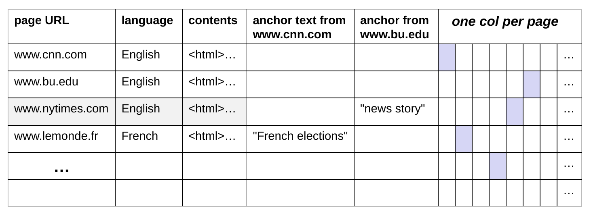{width="95%"}

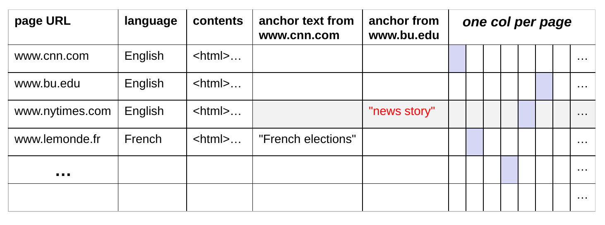{.fragment fragment-index=1 width="95%"}
:::

- One row per web page
- Single columns for its language and contents

::: {.fragment .sub fragment-index=1}
- *One column for the anchor text from each possible page, since in theory any page could link to any other page!*
- Leads to a huge *sparse* table &ndash; most cells are empty/unused.
:::

## Storing Web-Page Data in BigTable

- Rather than defining all possible columns, define a set of *column families* that each row should have.

::: {.fragment .sub fragment-index=1}
- example: a column family called *anchor* that replaces all of the separate anchor columns on the last slide
:::

::: {.fragment .sub fragment-index=2}
- can also have column families that are like typical columns
:::

::: {.fragment fragment-index=3}
- In a given row, only store columns with an actual value, representing them as (column key, value) pairs
    - column key = column family:qualifier
:::

::: {.r-stack}
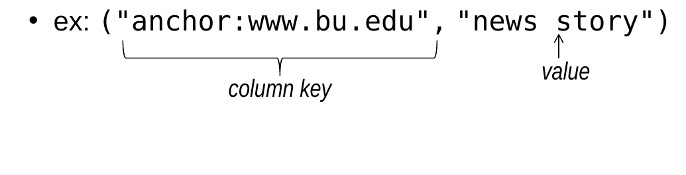{.fragment fragment-index=3 width="72%"}

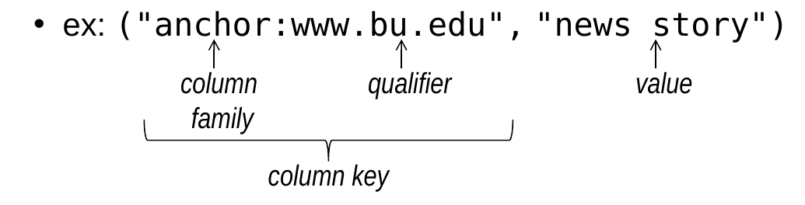{.fragment fragment-index=4 width="72%"}
:::

## Data Model for Column-Family Databases

- Different rows can have different schema.
    - i.e., different sets of column *keys*
    - (column key, value) pairs can be added or removed from a given row over time
- The set of column *families* in a given table rarely change.

## Aggregate Orientation

- Key-value, document, and column-family stores all lend themselves to an *aggregate-oriented* approach.
    - group together data that "belongs" together
        - i.e., that will tend to be accessed together

::: {.r-stack}
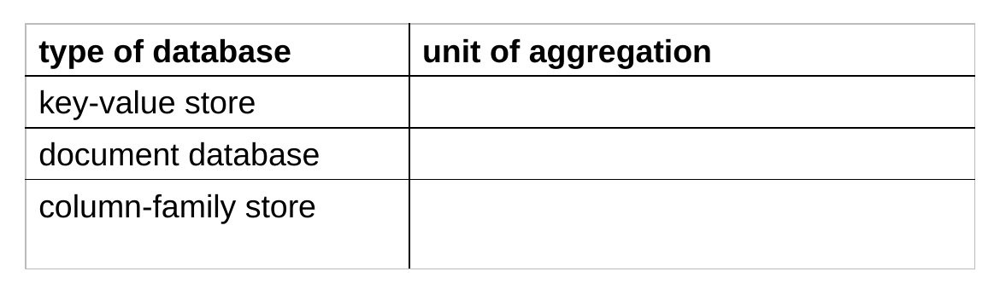{width="80%"}

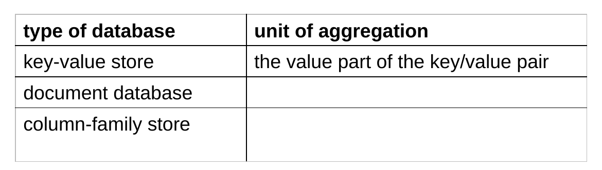{.fragment width="80%"}

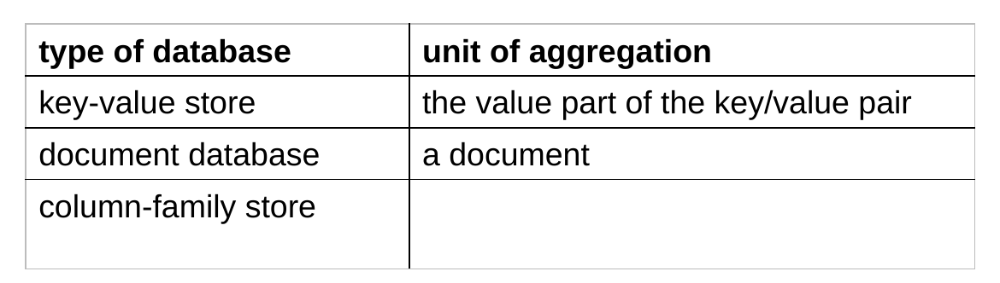{.fragment width="80%"}

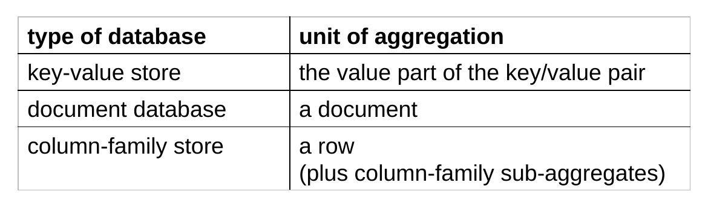{.fragment width="80%"}
:::

::: {.fragment}
- Relational databases can't fully support aggregation.
    - no multi-valued attributes; focus on avoiding duplicated data
    - give each type of entity its own table, rather than grouping together entities/attributes that are accessed together
:::

## Aggregate Orientation (cont.)

- Example: data about customers
    - RDBMS: store a customer's address in only one table
        - use foreign keys in other tables that refer to the address
    - aggregate-oriented system: store the full customer address in several places:
        - customer aggregates
        - order aggregates
        - etc.
- Benefits of an aggregate-based approach in a NoSQL store:
    - provides a unit for sharding across the cluster
    - allows us to get related data without needing to access many different nodes

## Schemalessness

- NoSQL systems are completely or mostly schemaless.
- Key-value stores: put whatever you like in the value
- Document databases: no restrictions on the schema used by the semistructured data inside each document.
    - although some do allow a schema
- Column-family databases:
    - we do specify the column families in a given table
    - but no restrictions on the columns in a given column family and different rows can have different columns

## Schemalessness (cont.)

- Advantages:
    - allows the types of data that are stored to evolve over time
    - makes it easier to handle nonuniform data
        - e.g., sparse tables
- Despite the fact that a schema is not required, programs that use the data need at least an *implicit* schema.
- Disadvantages of an implicit schema:
    - the DBMS can't enforce it
    - the DBMS can't use it to try to make accesses more efficient
    - different programs that access the same database can have conflicting notions of the schema

## Example Document Database: MongoDB

- Mongo (from hu*mongo*us)
- Key features include:
    - replication for high availability
    - auto-sharding for scalability
    - documents are expressed using JSON/BSON
    - queries can be based on the contents of the documents
- Related documents are grouped together into *collections*.
- [MongoDB](https://www.mongodb.com/) is open-source and free to use.

## JSON

- JSON is an alternative data model for semistructured data.
    - JavaScript Object Notation
- Built on two key structures:
    - an *object*, which is a sequence of *fields* (name:value pairs)

```text
{ id: "1000",
  name: "Sanders Theatre",
  capacity: 1000 }
```

- an *array* of values

```text
[ "123-456-7890", "222-222-2222", "333-333-3333" ]
```

- A value can be:
    - an atomic value: string, number, true, false, null
    - an object
    - an array

## Example: JSON Object for a Person

```json
{   firstName: "John",
    lastName: "Smith",
    age: 25,
    address: {
        streetAddress: "21 2nd Street",
        city: "New York",
        state: "NY",
        postalCode: "10021"
    },
    phoneNumbers: [
        {   type: "home",
            number: "212-555-1234"
        },
        {   type: "mobile",
            number: "646-555-4567"
        }
    ]
}
```

::: {.fragment .sub}
- fields with atomic values: `firstName`, `lastName`, `age`
:::

::: {.fragment .sub}
- a field whose value is an embedded object: `address`
:::

::: {.fragment .sub}
- a field whose value is an array of embedded objects: `phoneNumbers`
:::

## BSON

- MongoDB actually uses BSON.
    - a binary representation of JSON
    - BSON = marshalled JSON!
- BSON includes some additional types that are not part of JSON.
    - in particular, a type called ObjectID for unique id values.
- Each MongoDB document is a BSON object.

## The `_id` Field

- Every MongoDB document must have an `_id` field.
    - its value must be unique within the collection
    - acts as the primary key of the collection
    - it is the key in the key/value pair
- If you create a document without an `_id` field:
    - MongoDB adds the field for you
    - assigns it a unique BSON ObjectID

## MongoDB Terminology

::: {.r-stack}
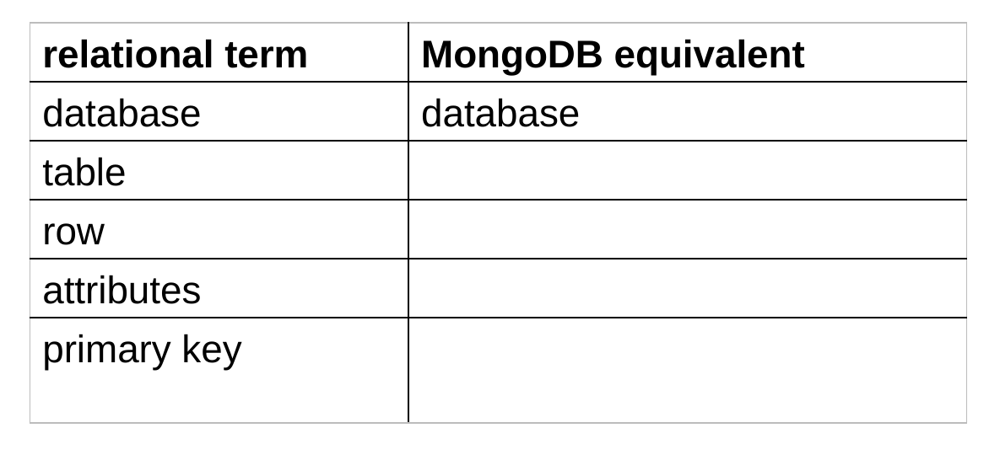{width="80%"}

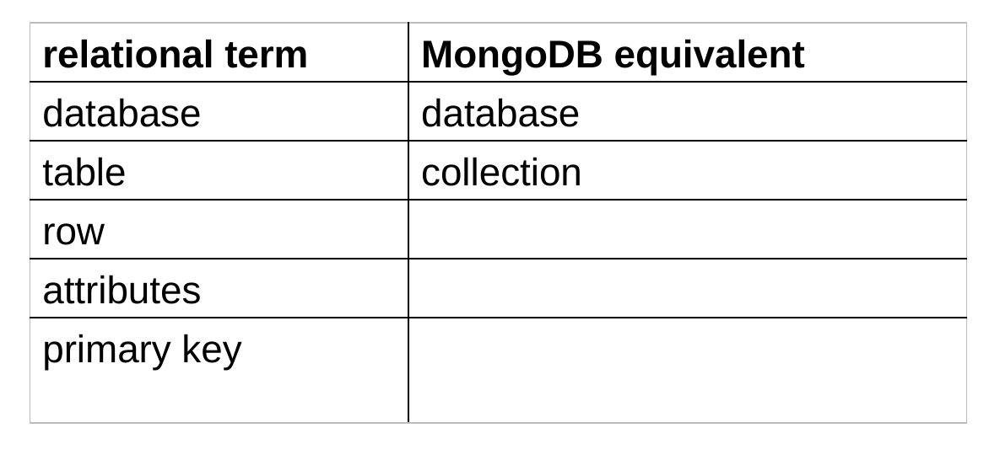{.fragment width="80%"}

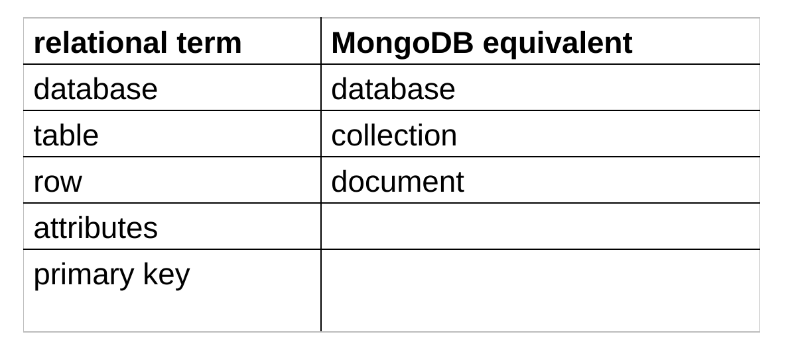{.fragment width="80%"}

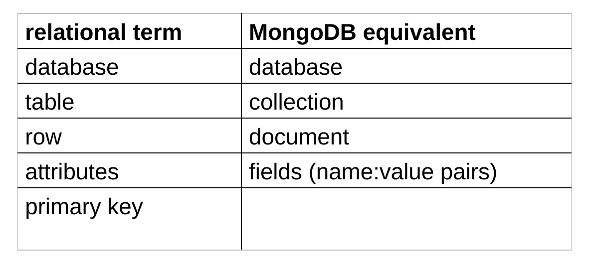{.fragment width="80%"}

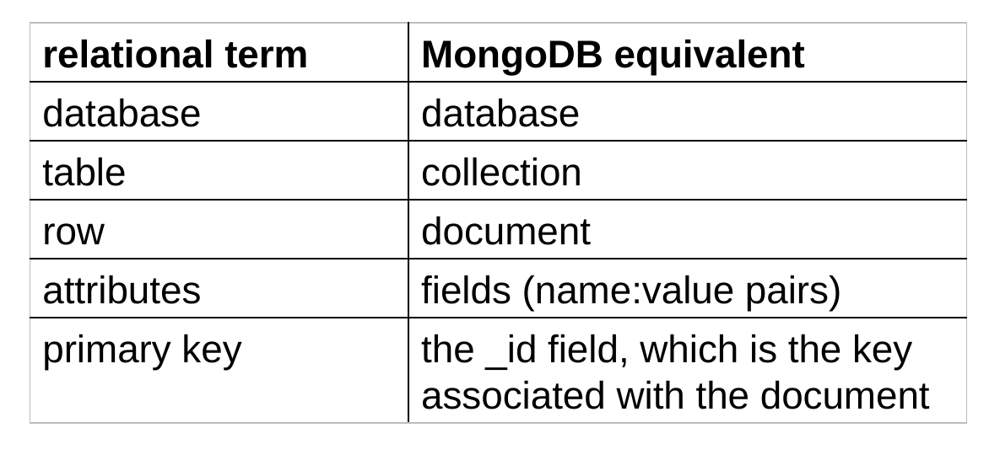{.fragment width="80%"}
:::

::: {.fragment}
- Documents in a given collection typically have a similar purpose.
- However, no schema is enforced.
    - different documents in the same collection can have different fields
:::

## Data Modeling in MongoDB

- Need to determine how to map<br>
  &emsp;entities and relationships &#10132; collections of documents
- Could in theory give each type of entity:
    - its own (flexibly formatted) type of document
    - those documents would be stored in the same collection
- However, recall that NoSQL models allow for *aggregates* in which different types of entities are grouped together.
- Determining what the aggregates should look like involves deciding how we want to represent relationships.

## Capturing Relationships in MongoDB

- Two options:

1. store references to other documents using their `_id` values

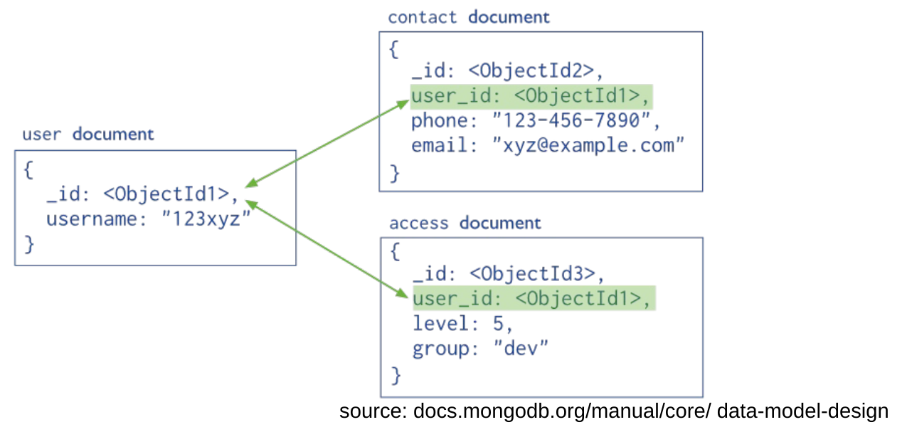{width="62%" fig-align="center"}

::: {.fragment}
*where have we seen this before?*
:::

::: {.fragment}
foreign keys
:::

## Capturing Relationships in MongoDB (cont.)

- Two options (cont.):

2. embed documents within other documents

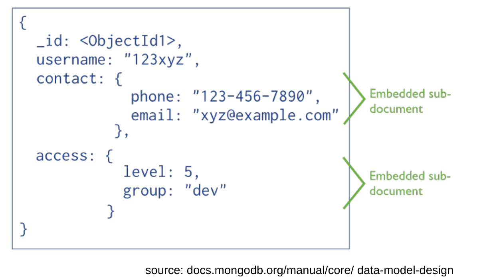{width="60%" fig-align="center"}


## Factors Relevant to Data Modeling

- A given MongoDB query can only access a single collection.
    - joins of documents are *not* supported
    - need to issue multiple requests

::: {.fragment .sub fragment-index=1}
&nbsp; &#10132; group together data that would otherwise need to be joined
:::

::: {.fragment fragment-index=2}
- Atomicity is only provided for operations on a single document (and its embedded subdocuments). <br>
    &nbsp; &#10132; group together data that needs to be updated as part of a single logical operation (e.g., a balance transfer!) <br>
    &nbsp; &#10132; group together data items A and B if A's current value affects whether/how you update B
:::

## Factors Relevant to Data Modeling (cont.)

- If an update makes a document bigger than the space allocated for it on disk, it may need to be relocated.
    - slows down the update, and can cause disk fragmentation
    - MongoDB adds padding to documents to reduce the need for relocation <br>
    
&#10132; use references if embedded documents could lead to significant growth in the size of the document over time

## Factors Relevant to Data Modeling

::: {.plus-minus}
- Pluses and minuses of embedding (a partial list):
    - \+ need to make fewer requests for a given logical operation
    - \+ less network/disk I/O
    - \+ enables atomic updates
    - &ndash; duplication of data
    - &ndash; possibility for inconsistencies between different copies of duplicated data
    - &ndash; can lead documents to become very large, and to document relocation
- Pluses and minuses of using references:
    - take the opposite of the pluses and minuses of the above!
    - \+ allow you to capture more complicated relationships
        - ones that would be modelled using *graphs*
:::

## Data Model for the Movie Database

- Recall our movie database.

::: {style="margin-left: 3em; font-style: italic;"}
Person(id, name, dob, pob)\
Movie(id, name, year, rating, runtime, genre, earnings_rank)\
Oscar(movie_id, person_id, type, year)\
Actor(actor_id, movie_id) &emsp; Director(director_id, movie_id)
:::

- Three types of entities: movies, people, oscars

::: {.fragment}
- Need to decide how we should capture the relationships
    - between movies and actors
    - between movies and directors
    - between Oscars and the associated people and movies
:::

## Data Model for the Movie Database (cont.)

- Assumptions about the relationships:
    - there are only one or two directors per movie
    - there are approx. five actors associated with each movie
    - the number of people associated with a given movie is fixed
    - each Oscar has exactly one associated movie and at most one associated person

::: {.fragment}
- Assumptions about the queries:
    - Queries that involve both movies and people usually involve only the *names* of the people, not their other info.
:::

::: {.fragment style="margin-left: 4.5em;"}
**common:** *Who directed Avatar?*\
**common:** *Which movies did Tom Hanks act in?*
:::

::: {.fragment style="margin-left: 4.5em;"}
**less common:** *Which movies have actors from Boston?*
:::

::: {.fragment}
- Queries that involve both Oscars and other entities usually involve only the name(s) of the person/movie.
:::

## Data Model for the Movie Database (cont.)

- Given our assumptions, we can take a hybrid approach that includes both references and embedding.
- Use three collections: movies, people, oscars
- Use references as follows:
    - in movie documents, include ids of the actors and directors
    - in oscar documents, include ids of the person and movie
- Whenever we refer to a person or movie, we also embed the associated entity's name.
    - allows us to satisfy common queries like *Who acted in&hellip;?*
- For less common queries that involve info. from multiple entities, use the references.

## Data Model for the Movie Database (cont.)

- In addition, add two boolean fields to person documents:
    - hasActed, hasDirected
    - only include when true
    - allows us to find all actors/directors that meet criteria involving their pob/dob
- Note that most per-entity state appears only once, in the main document for that entity.
- The only duplication is of people/movie names and ids.

## Sample Movie Document

```json
{ _id: "0499549",
  name: "Avatar",
  year: 2009,
  rating: "PG-13",
  runtime: 162,
  genre: "AVYS",
  earnings_rank: 1,
  actors: [ { id: "0000244",
              name: "Sigourney Weaver" },
            { id: "0002332",
              name: "Stephen Lang" },
            { id: "0735442",
              name: "Michelle Rodriguez" },
            { id: "0757855",
              name: "Zoe Saldana" },
            { id: "0941777",
              name: "Sam Worthington" } ],
  directors: [ { id: "0000116",
                 name: "James Cameron" } ] }
```

## Sample Person and Oscar Documents

```json
{ _id: "0000059",
  name: "Laurence Olivier",
  dob: "1907-5-22",
  pob: "Dorking, Surrey, England, UK",
  hasActed: true,
  hasDirected: true
}
```

::: {.fragment}
```json
{ _id: ObjectId("528bf38ce6d3df97b49a0569"),
  year: 2013,
  type: "BEST-ACTOR",
  person: { id: "0000358",
            name: "Daniel Day-Lewis" },
  movie: { id: "0443272",
           name: "Lincoln" }
}
```
:::
