## Sample Movie Document

::: {.r-stack}
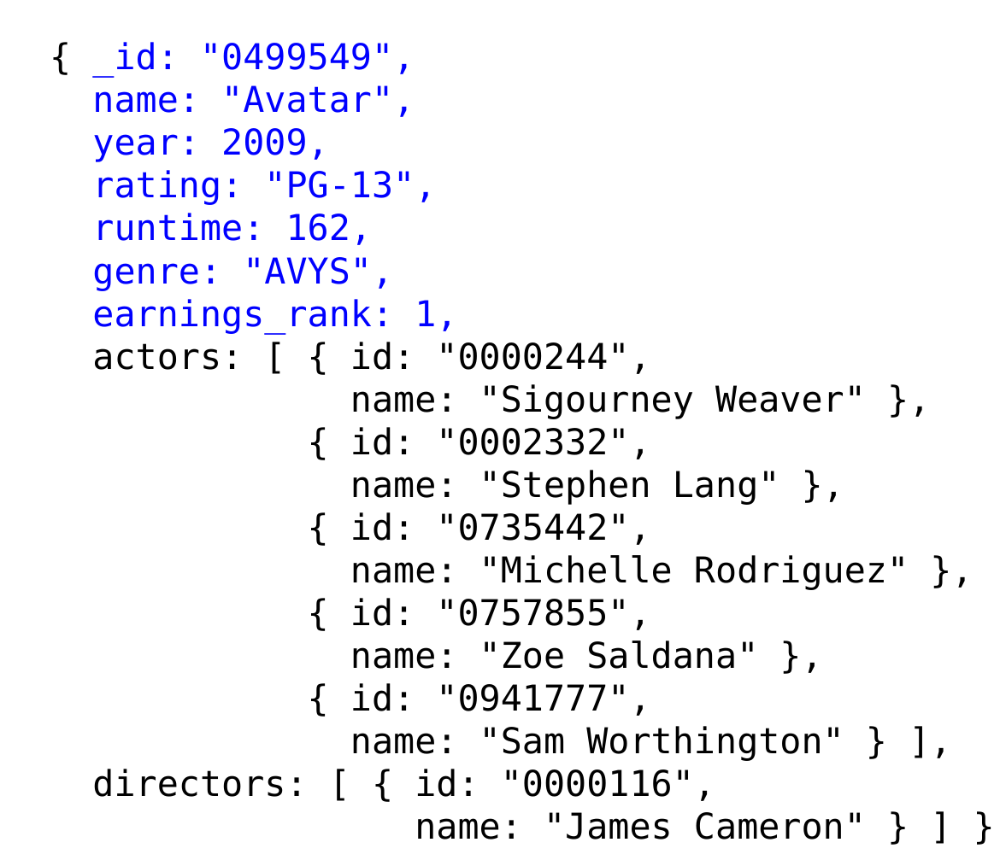{width="70%"}

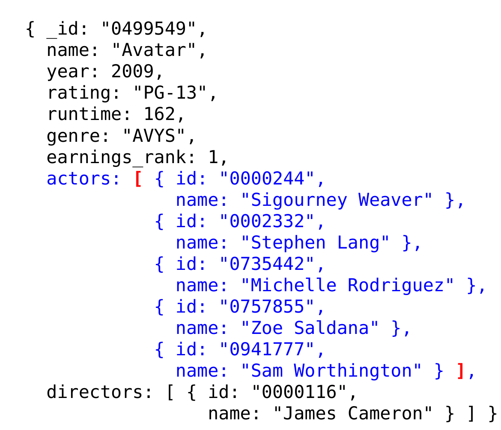{.fragment width="70%"}

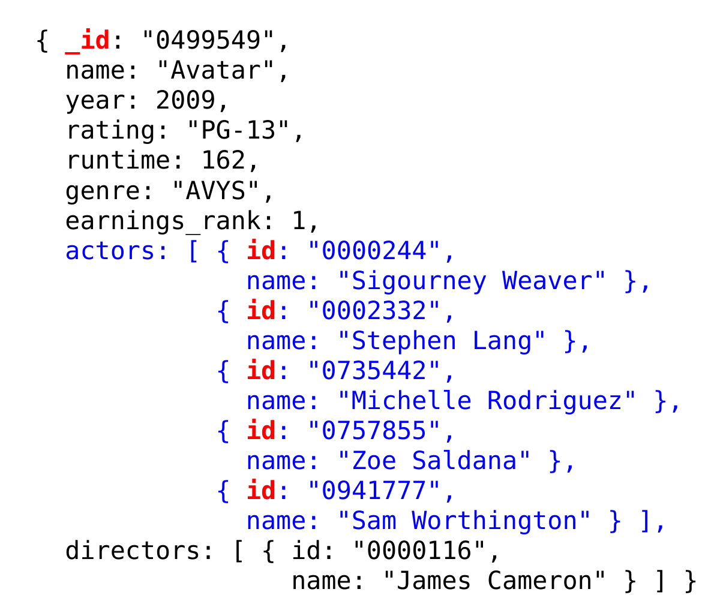{.fragment width="70%"}

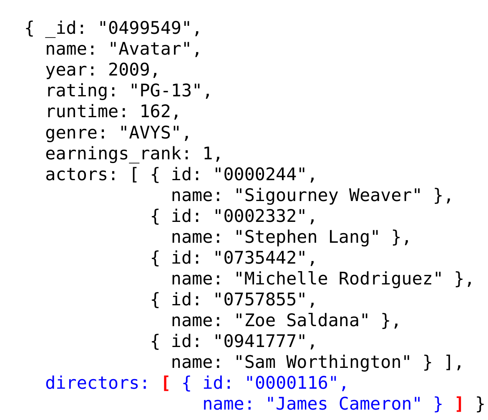{.fragment width="70%"}
:::

## Sample Person and Oscar Documents

::: {.r-stack}
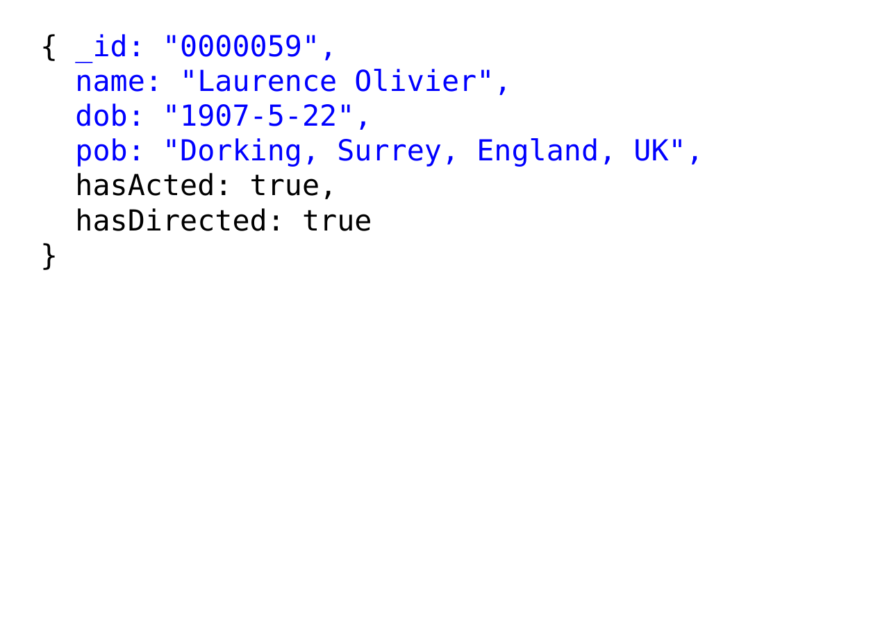{width="80%"}

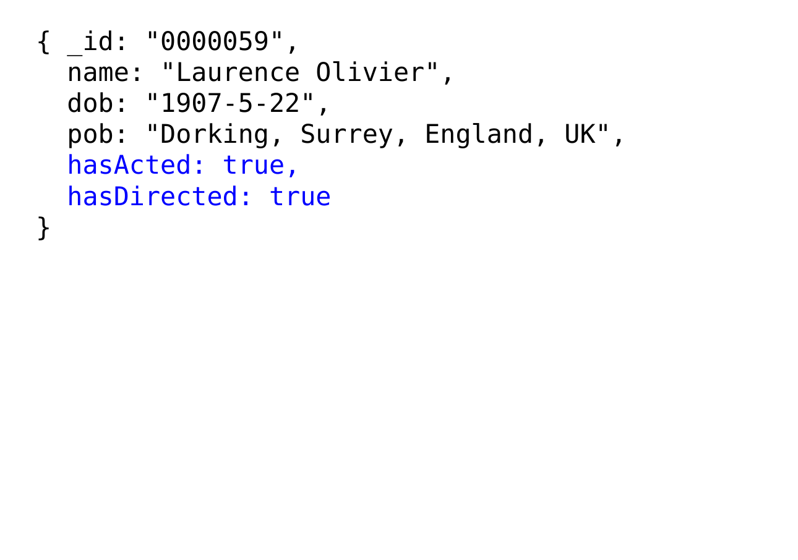{.fragment width="80%"}

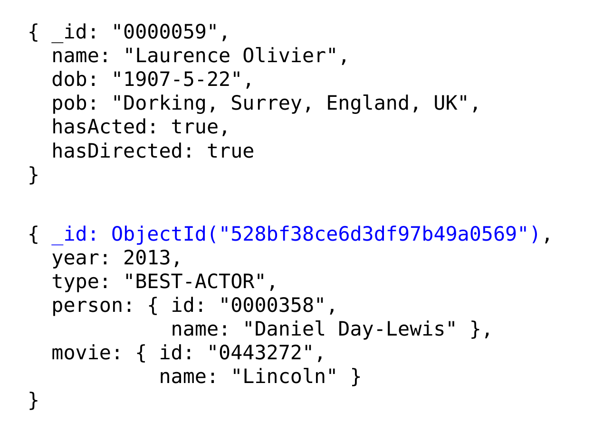{.fragment width="80%"}

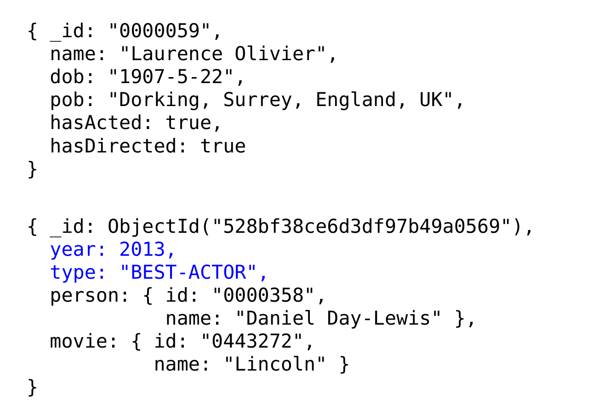{.fragment width="80%"}

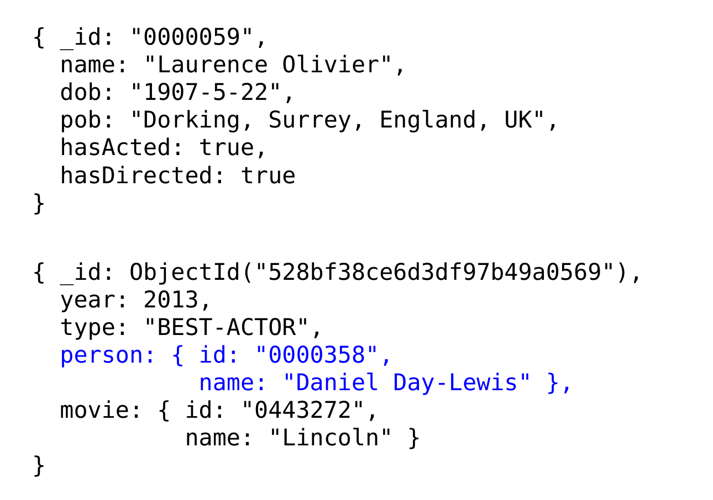{.fragment width="80%"}

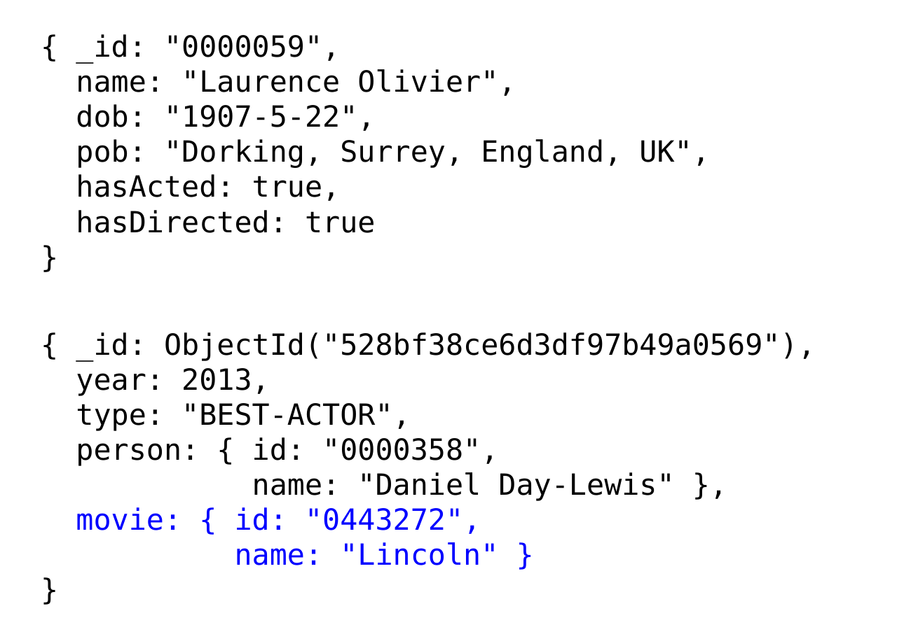{.fragment width="80%"}
:::

## Queries in MongoDB

- Each query can only access a single collection of documents.
- Use a method called db.*collection*.find()

```text
db.collection.find(<selection>, <projection>)
```

::: {.fragment .sub}
- *collection* is the name of the collection
:::

::: {.fragment .sub}
- `<selection>` is an optional document that specifies one or more selection criteria
:::

::: {.fragment .sub}
- omitting it (i.e., using an empty document {}) selects all documents in the collection
:::

::: {.fragment .sub}
- `<projection>` is an optional document that specifies which fields should be returned
:::

::: {.fragment .sub}
- omitting it gets all fields in the document
:::

::: {.fragment}
- Example: find the names of all R-rated movies:

```text
db.movies.find({ rating: "R" }, { name: 1 })
```
:::

## Comparison with SQL

- Example: find the names and runtimes of all R-rated movies that were released in 2000.

::: {.r-stack}
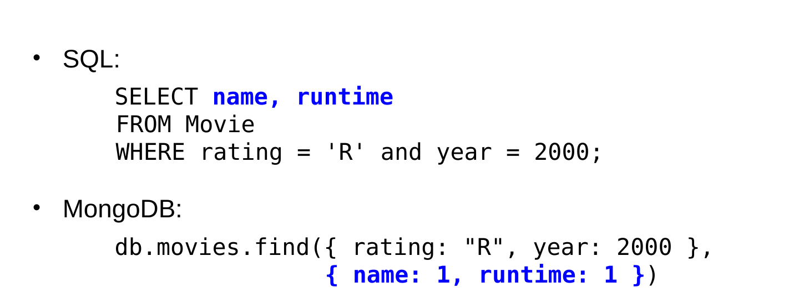{width="95%"}

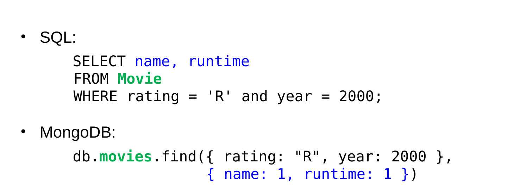{.fragment width="95%"}

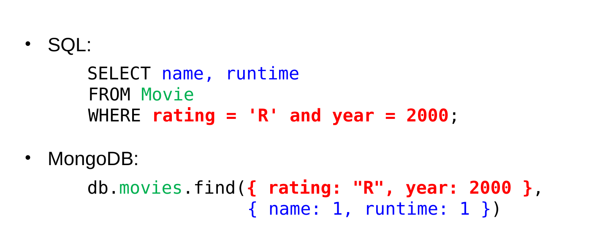{.fragment width="95%"}
:::

## Query Selection Criteria

```text
db.collection.find(<selection>, <projection>)
```

- To find documents that match a set of field values, use a selection document consisting of those name/value pairs (see previous example).

```text
db.movies.find({ rating: "R", year: 2000 },
               { name: 1, runtime: 1 })
```

::: {.fragment}
- Operators for other types of comparisons:

| MongoDB | SQL equivalent |
|---------------|----------------|
| `$gt`, `$gte` | `>`, `>=`      |
| `$lt`, `$lte` | `<`, `<=`      |
| `$ne`         | `!=`           |

- Example: find all movies with an earnings rank <= 200

```text
db.movies.find({ earnings_rank: { $lte: 200 }})
```

- Note that the operator is the field name of a subdocument.
:::

## Query Selection Criteria (cont.)

- Logical operators: `$and`, `$or`, `$not`, `$nor`
    - take an *array* of selection subdocuments
    - example: find all movies rated R or PG-13:

```text
db.movies.find({ $or: [ { rating: "R" },
                        { rating: "PG-13" }
                      ]
               })
```

::: {.fragment .sub}
- example: find all movies *except* those rated R or PG-13:

```text
db.movies.find({ $nor: [ { rating: "R" },
                         { rating: "PG-13" }
                       ]
               })
```
:::

## Query Selection Criteria (cont.)

- To test for set-membership or lack thereof: `$in`, `$nin`
    - example: find all movies rated R or PG-13:

```text
db.movies.find({ rating: { $in: ["R", "PG-13"] }
              })
```

::: {.sub}
- example: find all movies *except* those rated R or PG-13:
:::

```text
db.movies.find({ rating: { $nin: ["R", "PG-13"] }
              })
```

::: {.sub}
- ***note:*** `$in`/`$nin` is generally more efficient than `$or`/`$nor`
:::

::: {.fragment}
- To test for the presence/absence of a field: `$exists`
    - example: find all movies with an earnings rank:

```text
db.movies.find({ earnings_rank: { $exists: true }})
```
:::

::: {.fragment .sub}
- example: find all movies *without* an earnings rank:

```text
db.movies.find({ earnings_rank: { $exists: false }})
```
:::

## Logical AND

- You get an implicit logical AND by simply specifying a list of fields.
    - recall our previous example:

```text
db.movies.find({ rating: "R", year: 2000 })
```

::: {.sub}
- example: find all R-rated movies shorter than 90 minutes:
:::

```text
db.movies.find({ rating: "R",
                 runtime: { $lt: 90 }
               })
```

## Logical AND (cont.)

- `$and` is needed if the subconditions involve the same field
    - can't have duplicate field names in a given document
- Example: find all Oscars given in the 1990s.
    - the following would *not* work:

```text
db.oscars.find({ year: { $gte: 1990 },
                 year: { $lte: 1999 }
               })
```

::: {.sub}
- one option that would work:
:::

```text
db.oscars.find({ $and: [ { year: { $gte: 1990 } },
                         { year: { $lte: 1999 } } ]
               })
```

::: {.sub}
- another option: use an implicit AND on the operator subdocs:
:::

```text
db.oscars.find({ year: { $gte: 1990, $lte: 1999 }
               })
```

## Pattern Matching

- Use a pattern surrounded with //
    - example: find all people born in Boston

```text
db.people.find({ pob: /Boston,/ })
```

- Can use a `*` wildcard character to indicate 0 or more characters.
    - equivalent to % in SQL
- You get a `*` wildcard by default on either end of the pattern.
    - example: `/Boston,/` is the same as `/*Boston,*/`
    - use: `^` to match the beginning of the value, `$` to match the end of the value
        - `/Boston,/` would match "South Boston, Mass"
        - `/^Boston,/` would not, because the `^` indicates "Boston" must be at the start of the value

## Queries on Arrays/Subdocuments

- If a field has an array type

```text
db.collection.find( { arrayField: val } )
```

finds all documents in which `val` is at least one of the elements in the array associated with `arrayField`

- Example: suppose that we stored a movie's genres as an array:

```text
{ _id: "0317219", name: "Cars", year: 2006,
  rating: "G", runtime: 124, earnings_rank: 80,
  genre: ["N", "C", "F"], ...}
```

::: {.sub}
- to find all animated movies &ndash; ones with a genre of "N":
:::

```text
db.movies.find( { genre: "N"} )
```

- Given that we actually store the genres as a single string (e.g., "NCF"), how would we find animated movies?

```text
db.movies.find( { genre: /N/ } )
```

## Queries on Arrays/Subdocuments (cont.)

- Use dot notation to access fields within a subdocument, or within an array of subdocuments:
    - example: find all Oscars won by the movie *Gladiator*:

```text
> db.oscars.find( { "movie.name": "Gladiator" } )
{ _id: <ObjectID1>, year: 2001,
  type: "BEST-PICTURE",
  movie: { id: "0172495",
           name: "Gladiator" }}
{ _id: <ObjectID2>, year: 2001,
  type: "BEST-ACTOR",
  movie: { id: "0172495",
           name: "Gladiator" },
  person: { id: "0000128",
            name: "Russell Crowe" }}
```

- ***Note**:* When using dot notation, the field name must be surrounded by quotes.

## Queries on Arrays/Subdocuments (cont.)

- example: find all movies in which Tom Hanks has acted:

```text
> db.movies.find( { "actors.name": "Tom Hanks"} )
{ _id: "0107818", name: "Philadelphia", year: 1993,
  rating: "PG-13", runtime: 125, genre: "D"
  actors: [ { id: "0000158",
              name: "Tom Hanks" },
            { id: "0000243",
              name: "Denzel Washington" },
            ...
          ],
  directors: [ { id: "0001129",
                 name: "Jonathan Demme" } ]
}
{ _id: "0109830", name: "Forrest Gump", year: 1994,
  rating: "PG-13", runtime: 142, genre: "CD"
  actors: [ { id: "0000158",
              name: "Tom Hanks" },
            ...
```

## Projections

```text
db.collection.find(<selection>, <projection>)
```

- The projection document is a list of `fieldname:value` pairs:
    - a value of 1 indicates the field should be included
    - a value of 0 indicates the field should be excluded
- Recall our previous example:

```text
db.movies.find({ rating: "R", year: 2000 },
               { name: 1, runtime: 1 })
```

- Example: find all info. about R-rated movies except their genres:

```text
db.movies.find({ rating: "R" }, { genre: 0 })
```

## Projections (cont.)

- The `_id` field is returned unless you explicitly exclude it.

```text
> db.movies.find({ rating: "R", year: 2011 },
                 { name: 1 })
{ "_id" : "1411697", "name" : "The Hangover Part II" }
{ "_id" : "1478338", "name" : "Bridesmaids" }
{ "_id" : "1532503", "name" : "Beginners" }

> db.movies.find({ rating: "R", year: 2011 },
                 { name: 1, _id: 0 })
{ "name" : "The Hangover Part II" }
{ "name" : "Bridesmaids" }
{ "name" : "Beginners" }
```

- A given projection should either have:
    - all values of 1: specifying the fields to include
    - all values of 0: specifying the fields to exclude
    - one exception: specify fields to include, and exclude `_id`

## Iterating Over the Results of a Query

- db.*collection*.find() returns a cursor that can be used to iterate over the results of a query
- In the MongoDB shell, if you don't assign the cursor to a variable, it will automatically be used to print up to 20 results.
    - if more than 20, use the command `it` to continue the iteration
- Another way to view all of the result documents:
    - assign the cursor to a variable:

```text
var cursor = db.movies.find({ year: 2000 })
```

::: {.sub}
- use the following method call to print each result document in JSON:
:::

```text
cursor.forEach(printjson)
```

## Aggregation

- Recall the aggregate operators in SQL: AVG(), SUM(), etc.
- More generally, *aggregation* involves computing a result from a collection of data.
- MongoDB supports several approaches to aggregation:
    - single-purpose aggregation methods
    - an aggregation pipeline
    - map-reduce

## Single-Purpose Aggregation Methods

- db.*collection*.count(`<selection>`)
    - returns the number of documents in the collection that satisfy the specified selection document
    - ex: how many R-rated movies are shorter than 90 minutes?

```text
db.movies.count({ rating: "R",
                  runtime: { $lt: 90 }})
```

- db.*collection*.distinct(`<field>`, `<selection>`)
    - returns an array with the distinct values of the specified field in documents that satisfy the specified selection document
    - if omit the selection, get all distinct values of that field
    - ex: which actors have been in one or more of the top 10 grossing movies?

```text
db.movies.distinct("actors.name",
                   { earnings_rank: { $lte: 10 }}
                  )
```

## Aggregation Pipeline

- A more general-purpose and flexible approach to aggregation is to use a *pipeline* of aggregation operations.
- Each stage of the pipeline:
    - takes a set of documents as input
    - applies a *pipeline operator* to those documents, which transforms / filters / aggregates them in some way
    - produces a new set of documents as output

```text
db.collection.aggregate(
  { <pipeline-op1>: <pipeline-expression1> },
  { <pipeline-op2>: <pipeline-expression2> },
  ...,
  { <pipeline-opN>: <pipeline-expressionN> })
```

::: {.r-stack}
{.fragment width="100%"}

{.fragment width="100%"}

{.fragment width="100%"}

{.fragment width="100%"}

{.fragment width="100%"}
:::

## Aggregation Pipeline Example

```text
db.orders.aggregate(
 { $match: { status: "A" } },
 { $group: { _id: "$cust_id", total: { $sum: "$amount"} } }
)
```

::: {.r-stack}
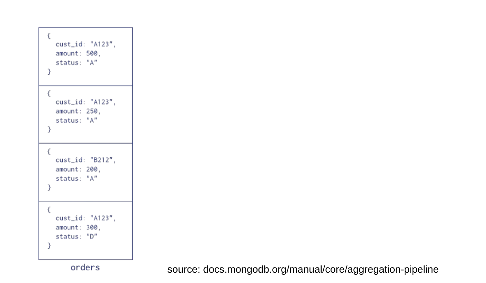{width="85%"}

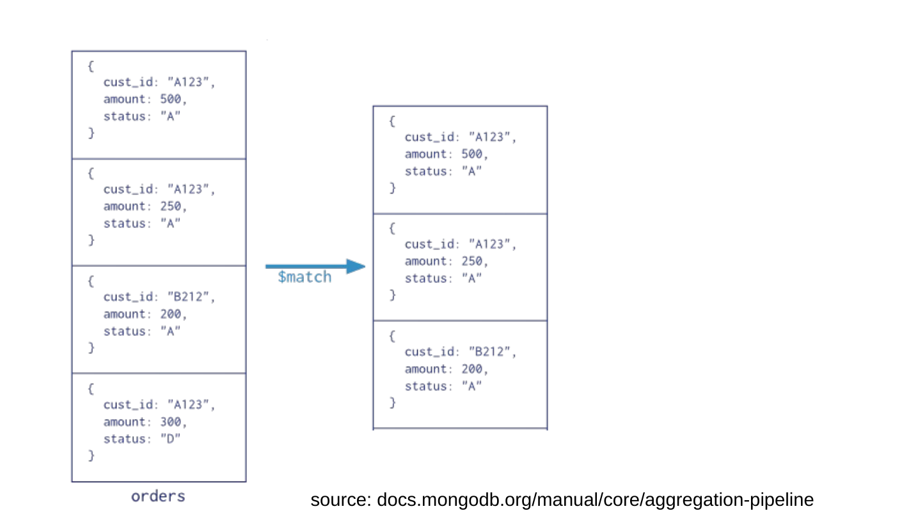{.fragment width="85%"}

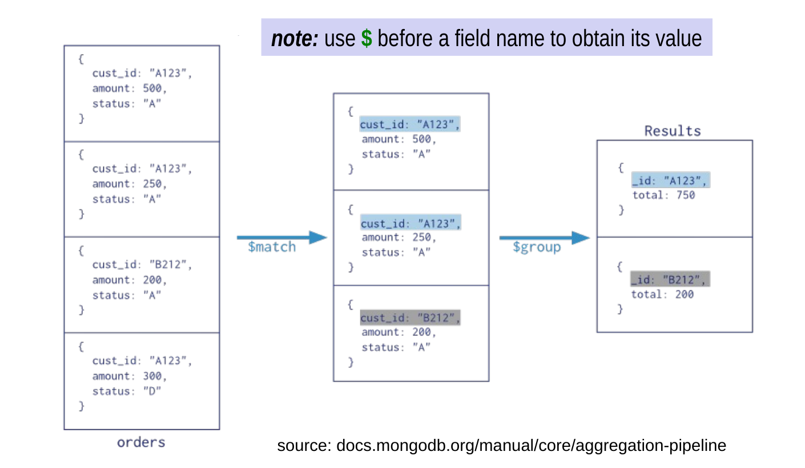{.fragment width="85%"}
:::

## Pipeline Operators

- `$project` &ndash; include, exclude, rename, or create fields
    - Example of a single-stage pipeline using $project:

```text
db.people.aggregate(
    { $project: {
          name: 1,
          whereBorn: "$pob",
          yearBorn: { $substr: ["$dob", 0, 4] }
      }
    })
```

::: {.fragment .sub fragment-index=1}
- for each document in the people collection, extracts:
:::

::: {.fragment .sub fragment-index=2}
- `name` (1 = include, as in earlier projection documents)
:::

::: {.fragment .sub fragment-index=3}
- `pob`, which is renamed `whereBorn`
:::

::: {.fragment .sub fragment-index=4}
- a new field called `yearBorn`, which is derived from the existing dob values (yyyy-m-d &rarr; yyyy)
:::

::: {.fragment .sub fragment-index=5}
- the `_id` field, because we didn't exclude it
:::

::: {.fragment .sub fragment-index=3}
- ***note:*** use $ before a field name to obtain its value
:::

## Pipeline Operators (cont.)

- `$group` &ndash; like GROUP BY in SQL

```text
$group: { _id: <field or fields to group by>,
          <computed-field-1>,
          ..., <computed-field-N> }
```

::: {.fragment .sub}
- example: compute the number of movies with each rating

```text
db.movies.aggregate(
    { $group: { _id: "$rating",
                numMovies: { $sum: 1 }
              } } )
```
:::

::: {.fragment .sub}
- `{ $sum: 1 }` is equivalent to COUNT(\*) in SQL
    - for each document in a given subgroup, adds 1 to that subgroup's value of the computed field
:::

::: {.fragment .sub}
- can also sum values of a specific field (see earlier slide)
:::

::: {.fragment .sub}
- `$sum` is one example of an *accumulator*
- others include: `$min`, `$max`, `$avg`, `$addToSet`
:::

## Pipeline Operators (cont.)

- `$match` &ndash; selects documents according to some criteria

```text
$match: <selection>
```

::: {.sub}
- where `<selection>` has identical syntax to the selection documents used by db.*collection*.find()
:::

::: {.fragment}
- others include:
    - `$unwind` (see next example)
    - `$limit`
    - `$sort`
    - `$geoNear`
- See the MongoDB manual for more detail:

```text
docs.mongodb.org/manual/reference/operator/aggregation
```
:::

## Example of a Three-Stage Pipeline

::: {.r-stack}
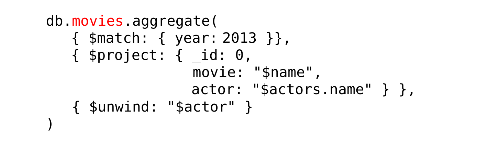{width="90%"}

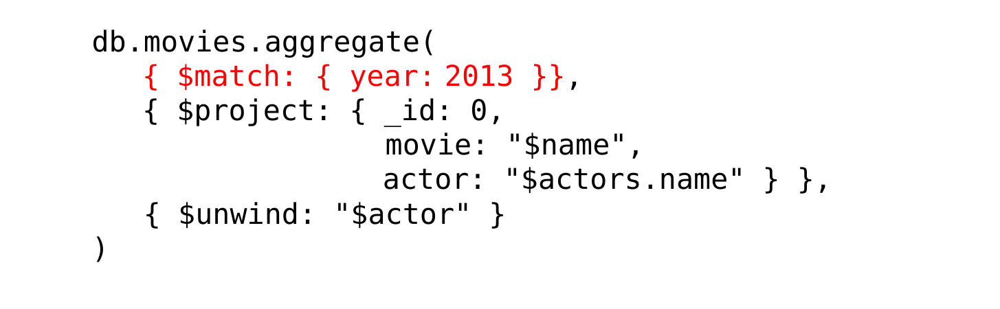{.fragment width="90%" fragment-index=1}

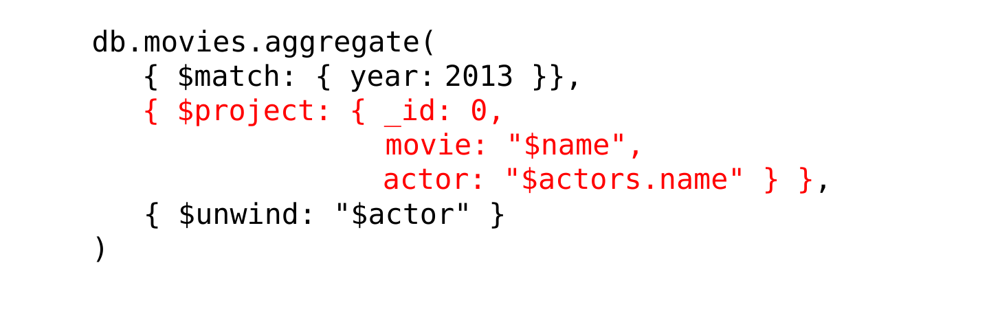{.fragment width="90%" fragment-index=2}

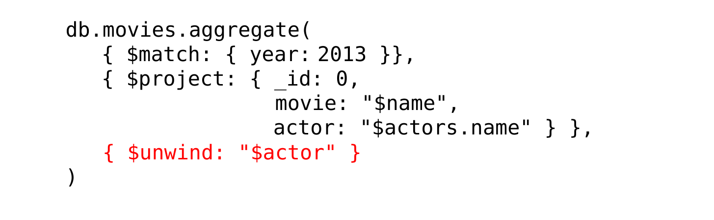{.fragment width="90%" fragment-index=3}
:::

- What does each stage do?

::: {.fragment .sub fragment-index=1}
- `$match`: select movies released in 2013
:::

::: {.fragment .sub fragment-index=2}
- `$project`: for each such movie, create a document with:
    - no `_id` field
    - the name field of the movie, but renamed movie
    - the names of the actors (an array), as a field named actor
:::

::: {.fragment .sub fragment-index=3}
- `$unwind`: turn each movie's document into a set of documents, one for each actor in the array of actors
:::

## Map-Reduce

- MongoDB includes support for map-reduce.
    - also defines a pipeline, but it's more flexible
        - example: allows for user-defined pipeline functions
    - in MongoDB, this can be less efficient than the pipeline operators for many types of aggregation
    - **deprecated in the latest version**
    - **instead, have added pipeline operators that allow for more flexibility**

## Recall: Types of Replication

- *Synchronous replication:* transactions are guaranteed to see the most up-to-date value of an item.
    - read-any, write-all
    - voting
    - can be too slow in some situations
- *Asynchronous replication:* transactions may not see the most up-to-date value.
    - primary-site
    - peer-to-peer

## Replication in MongoDB

- MongoDB uses primary-site replication.
    - one replica is designated the *primary* or *master* replica
    - all writes go to it
    - the other replicas (the *secondaries*) can only be read
    - changes to the primary are propagated asynchronously to the secondaries
- A *replica set* is a group of MongoDB server processes that host the same set of documents.

## Replication and Reads

- By default, reads in MongoDB also go to the primary.
    - guarantees that clients see the most recent version
    - eliminates the performance gains that replication can give

::: {.fragment}
- For performance reasons, clients can specify a different *read preference*.

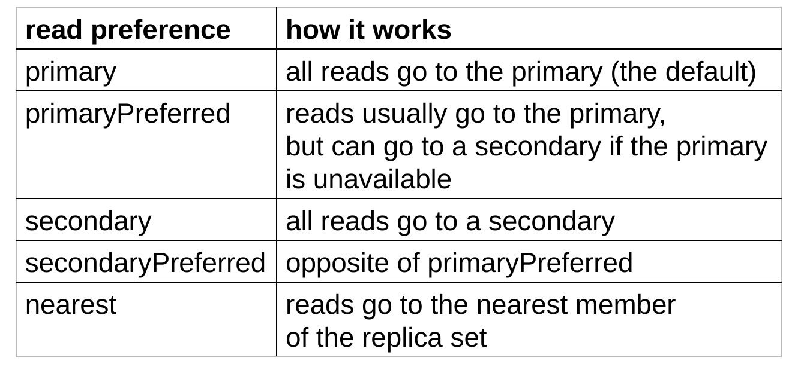{width="85%" fig-align="center"}
:::

## Reads and Consistency

- Earlier in the semester, we used the term *consistency* in the context of transactions (the C in ACID).
- In the context of a distributed database, consistency has a somewhat different meaning.
    - used to specify whether reads reflect prior writes
- *Strict consistency:*
    - reads always reflect prior writes
    - get the most up-to-date value
- *Eventual consistency:*
    - reads may not immediately reflect prior writes
        - may get *stale* data
    - given enough time, reads will eventually reflect prior writes

## Reads and Consistency (cont.)

- By default, MongoDB provides strict consistency.
    - reading from the primary gives you the latest value
- Reads with non-primary read preferences provide eventual consistency (unless you take special steps).
    - a secondary may not yet have the latest value, but it will eventually get it
    - in the meantime, a given read may get stale data

## More Detail About Writes

- All writes go to the primary.
- After applying a write, the primary also logs it.
- Copies of the log are periodically sent to the secondaries, which apply the writes to their replicas.
- To provide increased consistency for clients reading from secondaries, specify a special *write concern* value.
    - allows you to specify the number of replica-set members that must acknowledge the write before the write operation returns to the client

## High Availability

- Because writes (and, by default, reads) go to the primary, MongoDB needs to handle cases in which the primary becomes inaccessible.
- In such cases, the system performs automatic *failover*.
    - the secondaries hold an *election* to select a new primary
    - can give secondaries priorities that affect their likelihood of becoming the new primary

## Sharding in MongoDB

- Sharding == horizontal fragmentation
    - divides a collection of documents among multiple servers
    - each subset of the documents is referred to as a *shard*
    - if the database is also replicated, each shard corresponds to a replica set.

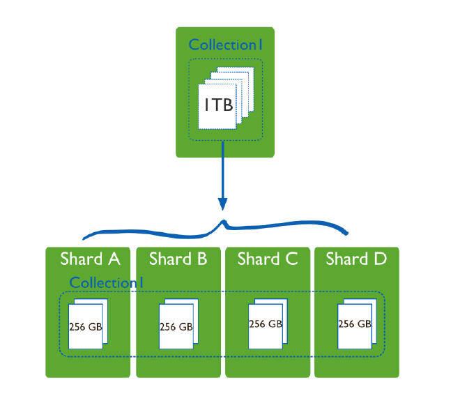{width="42%" fig-align="center"}

::: {.aside}
http://docs.mongodb.org/manual/core/sharding-introduction/
:::
