## Review: ACID Properties

- A transaction has the following “ACID” properties:
    - [A]{.underline}tomicity: either all of its changes take effect or none do
    - [C]{.underline}onsistency preservation: its operations take the database from one consistent state to another
    - [I]{.underline}solation: it is not affected by and does not affect other concurrent transactions
    - [D]{.underline}urability: once it completes, its changes survive failures

::: {.fragment}
- We’ll now look at how the DBMS guarantees atomicity and durability.
    - ensured by the subsystem responsible for *recovery*
:::

## Atomicity

- In a centralized database, logging and recovery are enough to ensure atomicity.

::: {.fragment .sub}
- if a txn's commit record makes it to the log, *all* of its changes will eventually take effect
:::

::: {.fragment .sub}
- if a txn's commit record isn't in the log when a crash occurs, *none* of its changes will remain after recovery
:::

::: {.fragment}
- What about atomicity in a distributed database?
:::

## Recall: Distributed Transactions

- A *distributed transaction* involves data stored at multiple sites.
- One of the sites serves as the *coordinator* of the transaction.

::: {.fragment}
- The coordinator divides a distributed transaction into *subtransactions*, each of which executes on one of the sites.

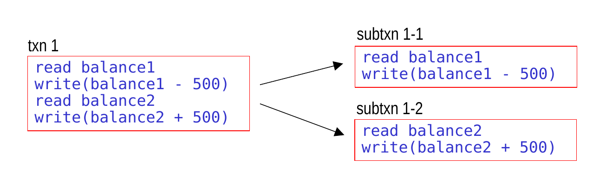{width="70%" fig-align="center"}
:::

## Distributed Atomicity

- In a distributed database:
    - each site performs local logging and recovery of its subtxns

::: {.fragment .sub}
- that alone is *not* enough to ensure atomicity
:::

::: {.fragment}
- The sites must coordinate to ensure that either:
    - *all* of the subtxns are committed, *or*
    - *none* of them are
:::

## Distributed Atomicity (cont.)

- Example of what could go wrong:
    - a subtxn at one of the sites deadlocks and is aborted

::: {.fragment .sub}
- before the coordinator of the txn finds out about this, it tells the other sites to commit, and they do so
:::

::: {.fragment}
- Another example:
    - the coordinator notifies the other sites that it's time to commit
    - most of the sites commit their subtxns
:::

::: {.fragment .sub}
- one of the sites crashes before committing
:::

## Two-Phase Commit (2PC)

- A protocol for deciding whether to commit a distributed txn.

::: {.fragment}
- Basic idea:
    - coordinator asks sites if they're ready to commit
:::

::: {.fragment .sub}
- if a site is ready, it:
    1. *prepares* its subtxn – putting it in the *ready state*
:::

::: {.fragment .sub}
::: {.sub}
2. tells the coordinator it's ready
:::
:::

::: {.fragment .sub}
- if all sites say they're ready, all subtxns are committed
:::

::: {.fragment .sub}
- otherwise, all subtxns are aborted (i.e., rolled back)
:::

::: {.fragment}
- Preparing a subtxn means ensuring it can be *either* committed or rolled back – even after a failure.
    - need to at least [force all dirty log records for subtxn to disk]{.fragment style="color:#3a5fcd;"}
:::

::: {.fragment .sub}
- some logging schemes need additional steps
:::

::: {.fragment}
- After saying it's ready, a site *must wait* to be told what to do next.
:::

## 2PC Phase I: Prepare

- When it's time to commit a distributed txn T, the coordinator:
    - force-writes a *prepare record* for T to its own log
    - sends a *prepare message* to each participating site

::: {.fragment fragment-index=2}
- If a site can commit its subtxn, it:
    - takes the steps needed to put its txn in the ready state
:::

::: {.fragment .sub fragment-index=3}
- force-writes a *ready record* for T to its log
- sends a *ready message* for T to the coordinator and *[waits]{style="color:#c00;"}*
:::

::: {.fragment fragment-index=4}
- If a site needs to abort its subtxn, it:
    - force-writes a *do-not-commit record* for T to its log
    - sends a *do-not-commit message* for T to the coordinator
:::

::: {.fragment .sub fragment-index=5}
- can it abort the subtxn now? [yes – in fact, it may do so before getting the prepare msg!]{.fragment fragment-index=6 style="color:#3a5fcd;"}
:::

::: {.fragment fragment-index=1}
- Note: we always log a message before sending it to others.
    - allows the decision to send the message to survive a crash
:::

## 2PC Phase II: Commit or Abort

- The coordinator reviews the messages from the sites.
    - if it doesn't hear from a site within some time interval, it assumes a do-not-commit message

::: {.fragment}
- If all sites sent ready messages for T, the coordinator:
    - force-writes a commit record for T to its log
        - T is now officially committed
    - sends *commit messages* for T to the participating sites
:::

::: {.fragment}
- Otherwise, the coordinator:
    - force-writes an abort record for T to its log
    - sends *abort messages* for T to the participating sites
:::

::: {.fragment}
- Each site:
    - force-writes the appropriate record (commit or abort) to its log
    - commits or aborts its subtxn as instructed
:::

## 2PC State Transitions

::: {.r-stack}
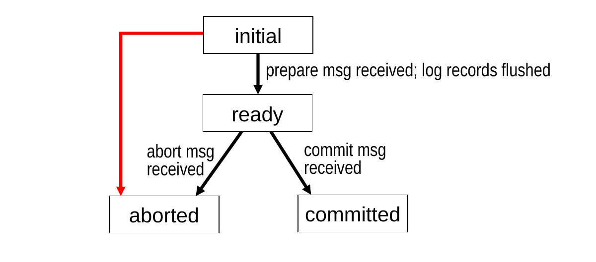{width="60%"}

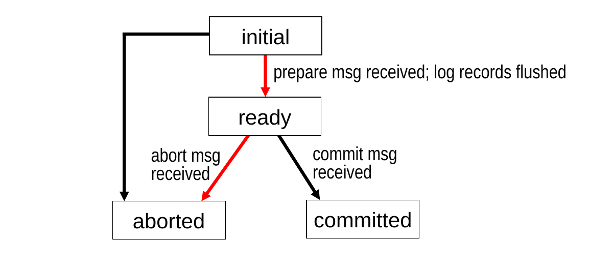{.fragment width="60%" fragment-index=1}

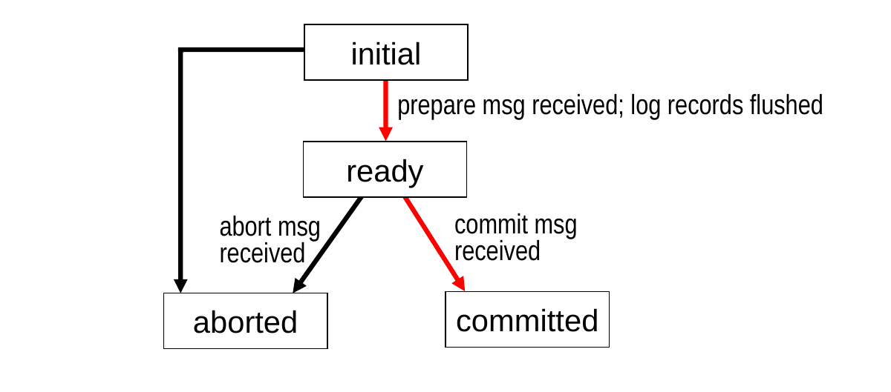{.fragment width="60%" fragment-index=2}
:::

- A subtxn can enter the aborted state from the initial state at any time.

::: {.fragment fragment-index=1}
- After entering the ready state, it can only enter the aborted state after receiving an abort message.
:::

::: {.fragment fragment-index=2}
- A subtxn can only enter the committed state from the ready state, and only after receiving a commit message.
:::

## Recovery When Using 2PC

- When a site recovers, it decides whether to undo or redo its subtxn for a txn T based on the last record for T in its log.

::: {.fragment}
- Case 1: the last log record for T is a [commit]{.underline} record.
    - redo the subtxn's updates as needed
:::

::: {.fragment}
- Case 2: the last log record for T is an [abort]{.underline} record.
    - undo the subtxn's updates as needed
:::

::: {.fragment}
- Case 3: the last log record for T is a [do-not-commit]{.underline} record.
    - undo the subtxn's updates as needed
    - why is this correct? [the site's do-not-commit vote means T has been or will be aborted]{.fragment style="color:#3a5fcd;"}
:::

## Recovery When Using 2PC (cont.)

- Case 4: the last log record for T is [from before 2PC began]{.underline} (e.g., an update record).
    - undo the subtxn's updates as needed

::: {.fragment .sub fragment-index=1}
- this works in both of the possible situations:
    - 2PC has already completed without hearing from this site [T would have been aborted without this site's ready msg]{.fragment fragment-index=2 style="color:#3a5fcd;"}
    - 2PC is still going on [the site must abort T now (since it didn't prepare it before the crash), and then vote do-not-commit if asked]{.fragment fragment-index=3 style="color:#3a5fcd;"}
:::

::: {.fragment fragment-index=4}
- Case 5: the last log record for T is a [ready]{.underline} record.
    - contact the coordinator (or another site) to determine T's fate
    - why can the site still commit or abort T as needed? [it prepared for either option *before* it sent the ready message!]{.fragment fragment-index=5 style="color:#3a5fcd;"}
:::

::: {.fragment .sub fragment-index=6}
- if it can't reach another site, it must block until it can reach one!
:::

## What if the Coordinator Fails?

- The other sites can either:
    - wait for the coordinator to recover
    - elect a new coordinator
- In the meantime, each site can determine the fate of any current distributed transactions.

::: {.fragment}
- Case 1: a site has *not* received a prepare message for txn T
    - can abort its subtxn for T
    - preferable to waiting for the coordinator to recover, because it allows the T's fate to be decided
:::

::: {.fragment}
- Case 2: a site *has* received a prepare message for T, but has *not* yet sent ready message
    - can also abort its subtxn for T now. why? [T couldn't have been committed without the site's ready msg.]{.fragment style="color:#3a5fcd;"}
:::

## What if the Coordinator Fails? (cont.)

- Case 3: a site sent a ready message for T but didn't hear back
    - poll the other sites to determine T's fate

::: {.r-stack}
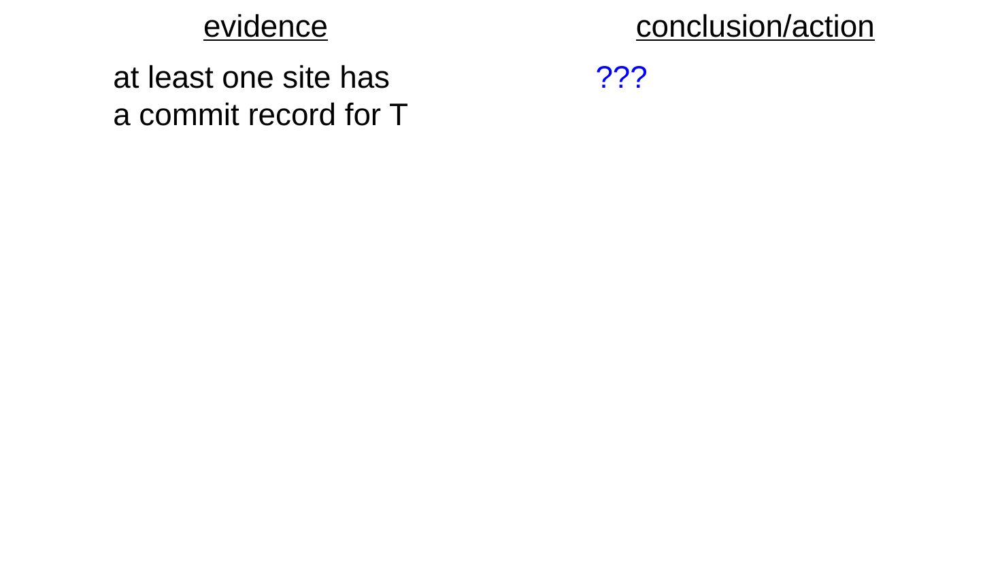{.fragment width="85%"}

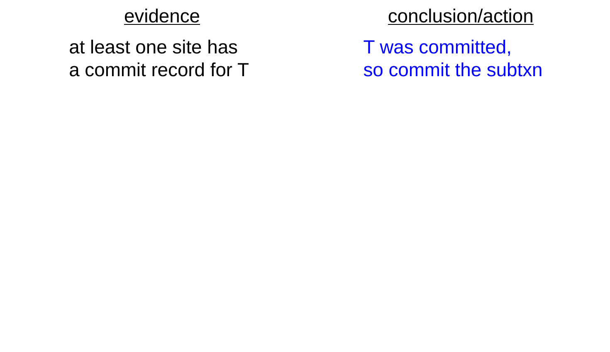{.fragment width="85%"}

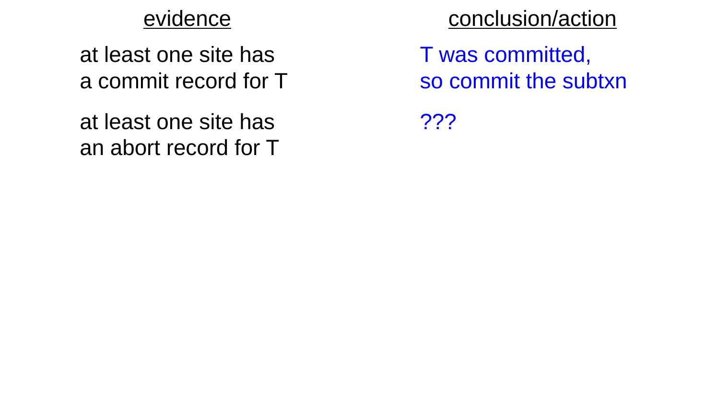{.fragment width="85%"}

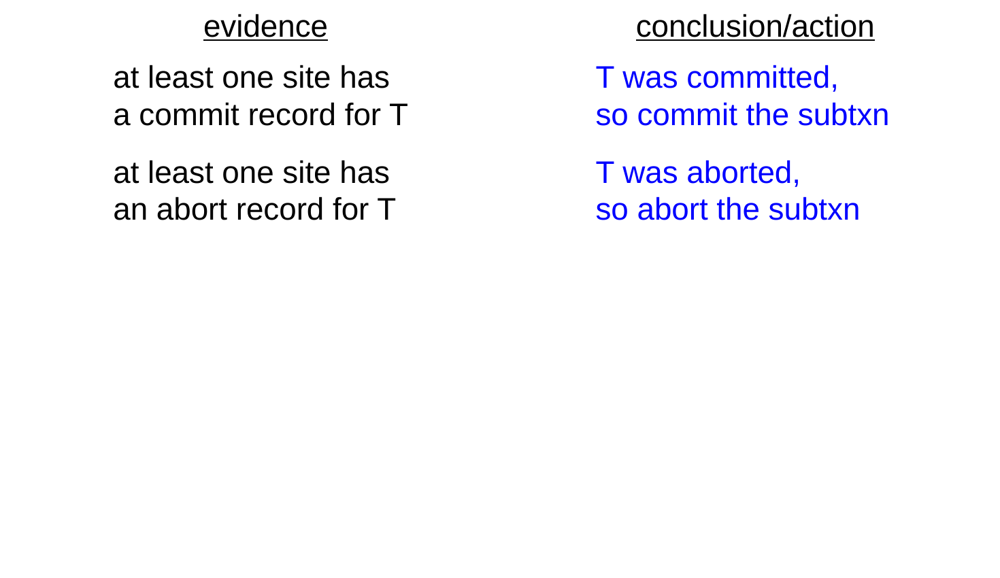{.fragment width="85%"}

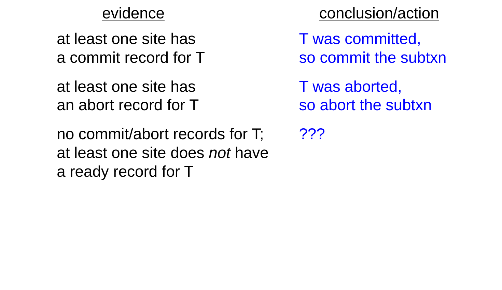{.fragment width="85%"}

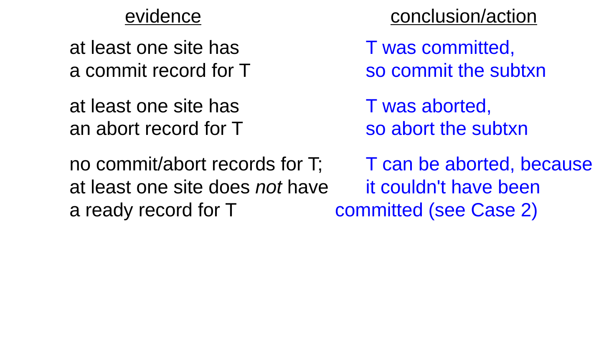{.fragment width="85%"}

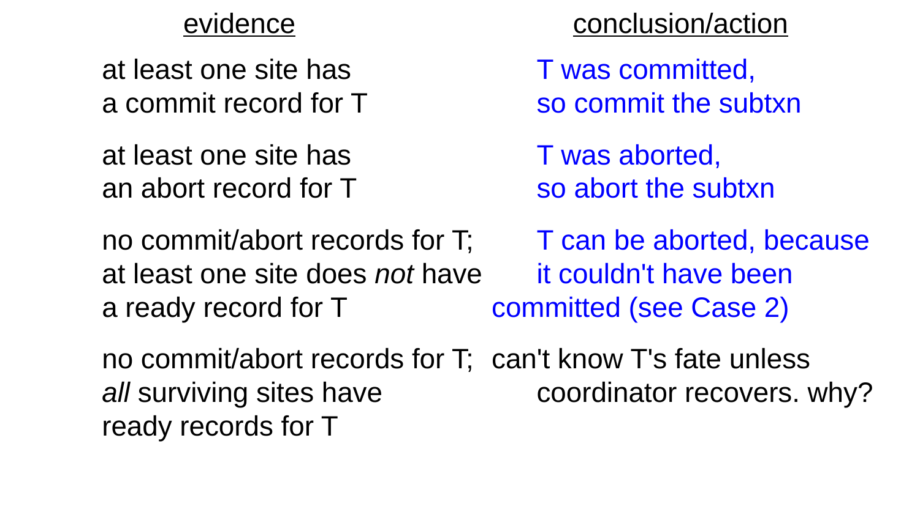{.fragment width="85%"}

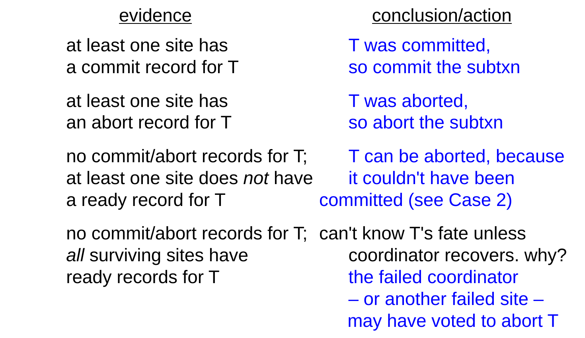{.fragment width="85%"}
:::

## 2PC Example

- T requires subtxns at sites A, B, C. Site A is the coordinator.
- After the last operation in T, site A:
    - sends prepare messages to B and C
    - puts its own subtxn in the ready state.

::: {.fragment}
- Sites B and C:
    - put their subtxns in the ready state
    - send ready messages to A
- Site A:
    - writes its commit record (T is now officially committed)
    - sends commit messages to B and C
:::

::: {.fragment}
- B writes its commit record.
- C crashes before writing its commit record. What happens?
:::

::: {.fragment style="margin-left:2.4em; color:#3a5fcd;"}
during recovery, C encounters T's ready record, so it contacts A and finds out T was committed. C writes a commit record for T, and redoes T as needed.
:::

## 2PC Phase II: Commit or Abort (cont.)

- Many implementations of 2PC include the following additions:
    - a site acknowledges its receipt of the commit/abort message by sending the coordinator an *ack message*
    - once the coordinator receives acks from all sites, it writes an end log record for the transaction

::: {.fragment}
- The acks allow the coordinator to know when it can remove info. about a txn from its in-memory transaction table.
- These additions also allow the coordinator to know whether it should resend the commit/abort messages after recovering from a crash.
:::

## Review: Concurrency Control

- Goals: a schedule of actions by concurrent txns should be:
    - *serializable*
    - *recoverable*
        - ensure one txn doesn't commit before another txn whose write it has read
        - preventing dirty reads would also guarantee this
    - *cascadeless*:
        - prevent dirty reads

::: {.fragment}
- How do the mechanisms that we studied prevent dirty reads?
    - locking: [use strict locking, holding write locks until commit]{.fragment style="color:#3a5fcd;"}
    - timestamps: [set commit bits to false until a writer commits]{.fragment style="color:#3a5fcd;"}
:::

## Logging and Concurrency Control

- To implement either of the concurrency-control mechanisms, we need to answer this question:
    - When is a txn *really* committed?
- Strictly speaking, a transaction T is not committed until its commit log record makes it to disk.
    - why? [if there’s a crash before that point, T’s changes will be undone]{.fragment style="color:#3a5fcd;"}

::: {.fragment}
- However, for performance reasons, it can be undesirable to force log records to disk (“flush the log”) every time a commit command is received.
:::

## Group Commit

- In *group commit*, the system doesn't immediately flush the log every time that a commit command is received.
- Instead, the system:
    1. writes the commit record to the in-memory log buffer
    2. releases the locks held by the txn or sets the appropriate commit bits to true
    3. waits to flush the log until some later point in time

::: {.fragment .sub}
::: {.sub}
- the transaction's thread/process is put to sleep until the log is flushed
- in the meantime, other transactions may also commit
:::
:::

::: {.fragment}
- Multiple txns may end up having their commit records written to disk at the same time.
    - hence the name “*group* commit”
:::

## Impact of Group Commit

- In group commit, it's still the case that a commit operation is not fully complete until the commit record makes it to disk.
- However, we [do]{.underline} release locks/reset commit bits before the commit record makes it to disk.

::: {.fragment}
- As a result, there can be dirty reads while a yet-to-be committed txn is waiting for the log to be flushed.
:::

::: {.fragment}
- Can group commit violate atomicity or durability?
    - no, because a txn's log records are still on disk before its commit operation completes
:::

## Impact of Group Commit (cont.)

- Can group commit violate recoverability?
    - no, provided that the log records are forced to disk in the order in which they were written

::: {.fragment}
::: {.columns}
::: {.column width="55%"}
::: {.sub}
- example: let's say that we have the in-memory log buffer shown at right
:::
:::

::: {.column width="45%"}
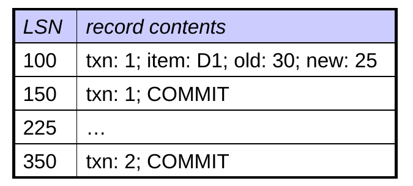{width="95%"}
:::
:::

::: {.sub}
::: {.sub}
- assume T2 reads D1 after T1 writes it
- the database will be in an unrecoverable state if the system crashes with only T2's commit record on disk
    - why? [T1 must be rolled back, but T2 can't be]{.fragment style="color:#3a5fcd;"}
:::
:::
:::

::: {.fragment .sub}
::: {.sub}
- but if the log records are forced to disk in order, this can never happen!
    - if T2's commit record is on disk, T1's must be, too
:::
:::

## Impact of Group Commit (cont.)

- Can group commit lead to a cascading rollback?
    - no.
    - if a dirty read occurs, the writer of the dirty data has already chosen to commit and will not subsequently choose to abort
    - if a crash occurs, the reader of the dirty data would already have been rolled back as part of recovery – whether or not it performed the dirty read
